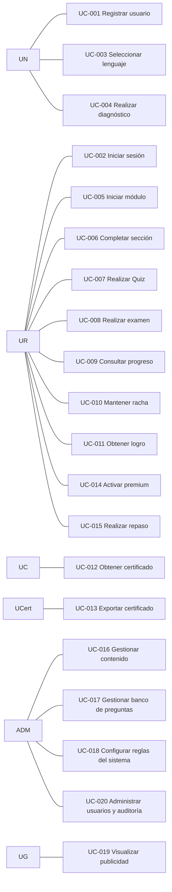

# 08 — Casos de Uso

> **Estado:** En planificación · **Versión del documento:** 1.0.0 · **Fecha:** 2026-08-29
> Complementa a `01_PROJECT_OVERVIEW.md`, `02_PROBLEM_STATEMENT.md`, `03_OBJECTIVES.md`, `04_SCOPE.md`, `05_FUNCTIONAL_REQUIREMENTS.md`, `06_NON_FUNCTIONAL_REQUIREMENTS.md` y `07_USER_STORIES.md`. No duplica su contenido; lo formaliza en contratos verificables. Cada caso de uso mapea a ≥1 `RF-*` (`05`) y a ≥1 `US-*` (`07`). Los flujos navegables se visualizan en `09_USER_FLOWS.md`.

---

## 1. Propósito y alcance

Este documento especifica **cómo interactúan los actores con el sistema** para alcanzar objetivos de negocio. Es la línea base para diseño de API (`13`), modelo de datos (`12`), pruebas (`20`) y criterios de aceptación del MVP.

**Fuera de alcance:** especificación técnica concreta (`11`), contratos OpenAPI (`13`) y diseño de UI (`27`). Las reglas de negocio transversales se resumen en `05` §6 y no se repiten aquí salvo cuando condicionan un flujo.

---

## 2. Convenciones

### 2.1 Formato de ID

`UC-NNN` correlativo global con ceros (ej. `UC-001`). Se mantiene un alias de dominio (`UC-AUTH-01`, `UC-QUIZ-01`, etc.) en la ficha cuando coincide con `05` §4 para facilitar trazabilidad, pero el ID canónico es `UC-NNN`.

### 2.2 Atributos por caso de uso

| Campo | Contenido |
|---|---|
| **ID** | `UC-NNN` |
| **Nombre** | Verbo en infinitivo + objeto |
| **Actor principal** | Quien inicia el caso (ver §3) |
| **Actores secundarios** | Sistema, servicios externos (email, ads, pagos, almacenamiento) |
| **Objetivo** | Valor de negocio para el actor |
| **Precondiciones** | Estado que debe cumplirse antes de iniciar (verificable) |
| **Flujo principal** | Pasos numerados actor ↔ sistema, camino feliz |
| **Flujos alternativos** | Variantes válidas (A1, A2...) con referencia al paso del flujo principal |
| **Excepciones** | Condiciones de error con manejo (E1, E2...) |
| **Resultado / Postcondición** | Estado observable al terminar con éxito |
| **Prioridad / Entrega** | `Must/MVP`, `Should/MVP`, `Post-MVP` (coherente con `04` y `07`) |
| **RF trazados** | IDs de `05` cubiertos |
| **US trazadas** | IDs de `07` cubiertas |
| **Reglas de negocio** | Referencias a `05` §6, `01` §15/§17, `06` |

### 2.3 Notación de pasos

- `1. Actor hace X` → `2. Sistema valida Y` → `3. Sistema responde Z`
- Flujos alternativos: `A1. En el paso 3, si ...`
- Excepciones: `E1. Si ... entonces ...`
- Todo paso que persiste o califica debe indicar **validación en servidor** (`05` RF-EVAL-006, RF-XP-005, RNF-033).

---

## 3. Actores

| Código | Actor | Descripción | UC donde es principal |
|---|---|---|---|
| UN | Usuario nuevo | Sin cuenta o recién registrado, sin diagnóstico ni progreso | UC-001, UC-003, UC-004 |
| UR | Usuario recurrente | Con cuenta y progreso parcial, uso continuado | UC-002, UC-005 – UC-011, UC-015 |
| UA | Usuario avanzado | UR con `MEDIUM/SEMI_PROFESSIONAL/PROFESSIONAL`; busca entrada adaptativa | UC-004 (variante) |
| UG | Usuario gratuito | UR en plan gratuito con publicidad entre secciones | UC-006, UC-019 |
| UP | Usuario premium | Suscriptor USD $1/mes sin anuncios | UC-014 |
| UC | Usuario que completa curso | UR que aprueba todos los módulos de un lenguaje | UC-012 |
| UCert | Usuario certificado | UC que genera/exporta certificado | UC-012, UC-013 |
| ADM | Administrador | Gestiona contenido, configuración y auditoría (RBAC) | UC-016 – UC-018, UC-020 |
| SIS | Sistema | Motor Learning/Question/Evaluation/Progress/Gamification/Certification | Secundario en todos |
| EXT | Servicio externo | Email, almacenamiento S3-compatible, red de anuncios, pasarela de pagos | Secundario |

> Roles `UG/UP` son estados de `UR`, no personas distintas. Un mismo usuario puede ser `UG` y luego `UP` (UC-014) conservando progreso (`05` RF-PREM-003).

---

## 4. Mapa de casos de uso

### 4.1 Diagrama general (Mermaid)

### 4.2 Resumen por entrega

| Entrega | Casos de uso |
|---|---|
| **MVP — Must** | UC-001 – UC-014, UC-015 (base), UC-016 – UC-017, UC-019 – UC-020 (RBAC mínimo) |
| **MVP — Should** | UC-015 (repaso manual), UC-018 (config sin código), UC-009 (historial filtrable) |
| **Post-MVP (diseñado, no implementado)** | UC-016/UC-020 variante flujo autor→revisor→publicador (`05` RF-ADM-009), UC-013 verificación pública |

---

## 5. Especificación de casos de uso

### UC-001 — Registrar usuario

| Campo | Valor |
|---|---|
| **ID** | UC-001 |
| **Nombre** | Registrar usuario |
| **Actor principal** | UN (Usuario nuevo) |
| **Actores secundarios** | SIS, EXT (servicio de email) |
| **Objetivo** | Crear cuenta con datos mínimos y verificación posterior para habilitar certificación |
| **Precondiciones** | No existe cuenta con el email ingresado; el usuario está en pantalla de registro |
| **Prioridad / Entrega** | Must / MVP |
| **RF trazados** | RF-AUTH-001, RF-AUTH-005, RF-AUTH-008, RF-USR-001, RF-USR-005 |
| **US trazadas** | US-001, US-005 |
| **Reglas** | Contraseña hasheada con función adaptativa (`06` RNF-008); verificación no bloquea aprendizaje (`05` RF-AUTH-005); auditoría sin plaintext |

**Flujo principal:**

1. UN ingresa nombre visible, email y contraseña y solicita registrarse.
2. SIS valida formato de email, unicidad (respuesta genérica si existe, sin revelar), fortaleza mínima de contraseña y nombre no vacío.
3. SIS crea la cuenta en estado `activo` (pendiente de verificación), persiste contraseña hasheada y aísla datos por usuario.
4. SIS genera token de verificación, envía email de verificación vía EXT (cola con reintentos) y registra evento de auditoría con marca temporal `America/Bogota`.
5. SIS responde éxito y redirige a onboarding (selección de lenguaje); indica que la verificación llegará por email y que puede comenzar a aprender.

**Flujos alternativos:**

- **A1. Email ya existe (paso 2):** SIS responde mensaje genérico ("Si el email es válido recibirás instrucciones") y no revela existencia; no crea duplicado; registra intento para auditoría.
- **A2. Usuario no verifica de inmediato (paso 5):** SIS permite continuar a UC-003/UC-004; bloquea solo UC-012/UC-013 hasta verificar (ver UC-012 E2).

**Excepciones:**

- **E1. Validación falla (email inválido / contraseña débil):** SIS devuelve errores accionables por campo (`06` RNF-022); no persiste.
- **E2. Servicio de email caído (paso 4):** SIS confirma registro, encola reintento y muestra aviso no bloqueante; el aprendizaje no se impide (`06` RNF-014).
- **E3. Carga maliciosa / inyección (paso 2):** SIS sanea en servidor, rechaza con 400 y registra intento (`06` RNF-009).

**Resultado / Postcondición:** Cuenta creada, autenticable, en estado activo + pendiente de verificación; evento auditado; email de verificación en cola/enviado.

---

### UC-002 — Iniciar sesión

| Campo | Valor |
|---|---|
| **ID** | UC-002 |
| **Nombre** | Iniciar sesión |
| **Actor principal** | UR (Usuario recurrente) |
| **Actores secundarios** | SIS |
| **Objetivo** | Autenticarse de forma segura y retomar la ruta exactamente donde la dejó |
| **Precondiciones** | Cuenta existente en estado `activo`; credenciales conocidas |
| **Prioridad / Entrega** | Must / MVP |
| **RF trazados** | RF-AUTH-002, RF-AUTH-003, RF-AUTH-004, RF-AUTH-006, RF-AUTH-007, RF-AUTH-008, RF-USR-002, RF-USR-003, RF-USR-004, RF-USR-006, RF-RUTA-005 |
| **US trazadas** | US-002, US-003, US-004, US-006, US-007 |
| **Reglas** | Token con expiración corta + refresh rotativo; rate limiting; mensaje genérico sin enumerar emails; refresh silencioso intra-lección |

**Flujo principal:**

1. UR ingresa email y contraseña y solicita iniciar sesión.
2. SIS valida credenciales en servidor, aplica rate limiting por IP/cuenta y verifica estado `activo` (rechaza si `bloqueado` con mensaje de bloqueo).
3. SIS emite token de sesión con expiración configurable y refresh token; registra evento de login con marca temporal.
4. SIS resuelve progreso (módulo/sección/lección/ejercicio donde quedó) y redirige a esa posición (reanudación UC-005/UC-006).
5. UR queda autenticado y puede operar.

**Flujos alternativos:**

- **A1. Cierre de sesión (variante):** UR solicita cerrar sesión → SIS invalida token vigente en servidor, registra evento y redirige a login; token anterior devuelve 401.
- **A2. Recuperación de contraseña (variante):** UR solicita recuperación → SIS responde mensaje genérico (exista o no el email), si existe envía token de un solo uso con expiración corta; con token válido permite definir nueva contraseña hasheada e invalida el token.
- **A3. Actualizar datos/contraseña (variante):** UR autenticado actualiza nombre visible o contraseña (exige contraseña actual); SIS persiste y refleja en perfil y certificados futuros.
- **A4. Sesión expira durante lección:** SIS renueva silenciosamente vía refresh sin obligar a re-login ni perder avance (`06` RNF-023); si refresh falla, solicita re-autenticación conservando intento en servidor.

**Excepciones:**

- **E1. Credenciales inválidas:** SIS responde mensaje genérico sin revelar si el email existe; incrementa contador de rate limiting; tras umbral aplica bloqueo temporal.
- **E2. Cuenta bloqueada (RF-USR-004):** SIS responde 403 con mensaje de bloqueo; no emite token.
- **E3. Recuperación con token expirado/usado:** SIS rechaza con error accionable y ofrece solicitar nuevo token.
- **E4. Eliminación/anonimización (RF-USR-003):** UR solicita eliminación → SIS anonimiza datos personales, progreso y certificados, no reutiliza email sin confirmación; exportación (RF-USR-006) entrega datos portátiles.

**Resultado:** Sesión autenticada vigente, trazada y reanudable; tokens invalidables; eventos auditados.

---

### UC-003 — Seleccionar lenguaje

| Campo | Valor |
|---|---|
| **ID** | UC-003 |
| **Nombre** | Seleccionar lenguaje |
| **Actor principal** | UN / UR |
| **Actores secundarios** | SIS |
| **Objetivo** | Elegir el lenguaje activo que determina ruta, módulos y progreso visible |
| **Precondiciones** | Usuario autenticado; al menos un lenguaje con estado `disponible` (MVP: Python) |
| **Prioridad / Entrega** | Must / MVP |
| **RF trazados** | RF-LANG-001, RF-LANG-002, RF-LANG-003, RF-LANG-005, RF-LVL-001, RF-LVL-002, RF-LVL-003, RF-LVL-004, RF-PROF-001 |
| **US trazadas** | US-013, US-014, US-015, US-022 |
| **Reglas** | Progreso por lenguaje aislado; arquitectura multi-lenguaje desde MVP (`05` RF-LANG-004) |

**Flujo principal:**

1. UR accede a selección de lenguaje.
2. SIS lista lenguajes con nombre, descripción, estado (`disponible`/`próximamente`) y orden; en MVP solo Python es seleccionable.
3. UR selecciona Python y declara nivel inicial entre `BEGINNER / MEDIUM / SEMI_PROFESSIONAL / PROFESSIONAL` (con descripciones `01` §8).
4. SIS registra lenguaje activo y nivel declarado; permite corregir nivel antes de completar diagnóstico (RF-LVL-002).
5. SIS habilita UC-004 (diagnóstico) y muestra CTA hacia diagnóstico o inicio directo.

**Flujos alternativos:**

- **A1. Cambiar de lenguaje (UR con progreso):** UR cambia de lenguaje activo → SIS conserva progreso de cada lenguaje por separado y muestra ruta del nuevo lenguaje; al volver retoma posición exacta.
- **A2. Corregir nivel antes de diagnóstico:** UR modifica nivel declarado → SIS actualiza registro sin afectar historial.
- **A3. Cambiar nivel tras iniciar aprendizaje:** SIS bloquea cambio directo y dirige a re-diagnóstico explícito (UC-004 A1).

**Excepciones:**

- **E1. Lenguaje no disponible:** SIS muestra "próximamente" sin acción de selección; no persiste.
- **E2. Cambio de lenguaje con contenido no publicado:** SIS mantiene último estado válido y avisa.

**Resultado:** Lenguaje activo y nivel declarado registrados; ruta personalizable habilitada.

---

### UC-004 — Realizar diagnóstico

| Campo | Valor |
|---|---|
| **ID** | UC-004 |
| **Nombre** | Realizar diagnóstico |
| **Actor principal** | UN / UA |
| **Actores secundarios** | SIS (Evaluation Engine, Learning Engine) |
| **Objetivo** | Validar nivel real y recomendar punto de entrada sin otorgar aprobaciones de módulo |
| **Precondiciones** | UC-003 completado (lenguaje activo + nivel declarado) |
| **Prioridad / Entrega** | Must / MVP |
| **RF trazados** | RF-DIAG-001, RF-DIAG-002, RF-DIAG-003, RF-DIAG-004, RF-DIAG-005, RF-DIAG-006, RF-RUTA-001, RF-EVAL-001, RF-EVAL-003, RF-LVL-003 |
| **US trazadas** | US-016, US-017, US-021 |
| **Reglas** | Diagnóstico ≠ examen; nunca otorga aprobación de módulos (`05` RF-DIAG-006); calificación determinista en servidor |

**Flujo principal:**

1. UN solicita iniciar diagnóstico para el lenguaje activo.
2. SIS genera prueba con preguntas representativas de distintos módulos, ancladas a tipos soportados, sin asumir ejecución de código en MVP.
3. UN responde preguntas con navegación y envío único con confirmación.
4. SIS califica automáticamente en servidor, produce puntaje por área temática y registra resultado con versión de contenido en perfil/historial.
5. SIS recomienda módulo/sección de inicio combinando nivel declarado + puntaje por área, con justificación; la recomendación es sugerida y ajustable dentro de límites pedagógicos.
6. SIS genera ruta personalizada (UC-005) a partir de la recomendación aceptada.

**Flujos alternativos:**

- **A1. Re-tomar diagnóstico (UR/UA):** UR solicita nuevo diagnóstico → SIS genera nueva prueba; el nuevo resultado no borra exámenes ya aprobados; reajusta solo contenido no validado.
- **A2. Usuario ajusta sugerencia:** UN desplaza punto de entrada dentro de rango permitido por prerrequisitos → SIS valida y persiste ajuste.

**Excepciones:**

- **E1. Diagnóstico incompleto/abandonado:** SIS guarda avance atómico por pregunta; reanudable (ver UC-006 RNF-023).
- **E2. Manipulación en cliente:** SIS recalcula en servidor y prevalece su calificación (`05` RF-EVAL-006).
- **E3. Contenido versionado cambió entre intentos:** SIS conserva versión histórica por intento y aplica umbrales vigentes al momento de calificar.

**Resultado:** Diagnóstico calificado, registrado y trazable; recomendación de punto de entrada aceptada; ruta generada.

---

### UC-005 — Iniciar módulo

| Campo | Valor |
|---|---|
| **ID** | UC-005 |
| **Nombre** | Iniciar módulo |
| **Actor principal** | UR |
| **Actores secundarios** | SIS |
| **Objetivo** | Visualizar ruta y comenzar el módulo correspondiente según estado y prerrequisitos |
| **Precondiciones** | Ruta generada (UC-004); módulos del lenguaje publicados y versionados |
| **Prioridad / Entrega** | Must / MVP |
| **RF trazados** | RF-RUTA-001, RF-RUTA-002, RF-RUTA-004, RF-RUTA-005, RF-MOD-001, RF-MOD-002, RF-MOD-003, RF-MOD-005, RF-LEC-002, RF-LEC-004, RF-PREG-003 |
| **US trazadas** | US-018, US-019, US-020, US-023 |
| **Reglas** | Prerrequisito: examen del módulo anterior aprobado, salvo salto validado por diagnóstico (`05` RF-RUTA-004); navegación jerárquica siempre visible |

**Flujo principal:**

1. UR accede a su ruta.
2. SIS visualiza módulos en orden canónico (MVP: 12 de Python `01` §34) con estado `bloqueado/disponible/en progreso/aprobado`, avance % y módulo/sección actual.
3. UR selecciona un módulo disponible y consulta su detalle (objetivo, secciones, requisitos, evaluaciones).
4. SIS valida prerrequisitos y habilita "Iniciar/Continuar" si corresponde; registra fecha de inicio/última actividad.
5. SIS lleva a UR a la primera lección pendiente del módulo (flujo `01` §6) y mantiene breadcrumb `Lenguaje → Módulo → Sección → Lección`.

**Flujos alternativos:**

- **A1. Módulo en progreso:** SIS reanuda exactamente en lección/ejercicio donde quedó (RF-RUTA-005, RF-LEC-002).
- **A2. Salto adaptativo validado:** módulos previos quedan `omitidos por diagnóstico` sin exigir examen; la ruta lo indica explícitamente.

**Excepciones:**

- **E1. Módulo bloqueado por examen reprobado:** SIS mantiene bloqueado, muestra CTA de revisión/repaso (ver UC-008).
- **E2. Contenido no publicado/oculto por ADM:** SIS oculta módulo y recalcula ruta sin romper progreso existente.

**Resultado:** Módulo iniciado o reanudado con trazabilidad de actividad y prerrequisitos respetados.

---

### UC-006 — Completar sección

| Campo | Valor |
|---|---|
| **ID** | UC-006 |
| **Nombre** | Completar sección |
| **Actor principal** | UR (UG/UP) |
| **Actores secundarios** | SIS, EXT (ads si UG) |
| **Objetivo** | Avanzar de forma medible lección por lección hasta completar la sección y obtener recompensa |
| **Precondiciones** | Módulo en progreso (UC-005); lecciones de la sección publicadas |
| **Prioridad / Entrega** | Must / MVP |
| **RF trazados** | RF-SEC-001, RF-SEC-002, RF-SEC-003, RF-SEC-004, RF-SEC-005, RF-LEC-001, RF-LEC-002, RF-LEC-003, RF-LEC-005, RF-PREG-003, RF-PREG-004, RF-PREG-005, RF-PROG-001, RF-PROG-004, RF-XP-001, RF-XP-005, RF-ADS-001, RF-ADS-002, RNF-010, RNF-023, RNF-033 |
| **US trazadas** | US-024, US-025, US-026, US-027, US-028, US-030, US-032 |
| **Reglas** | Flujo `concepto → explicación → ejemplo → ejercicio → feedback → recompensa` (`01` §6); feedback <1 s p95; publicidad nunca intra-ejercicio |

**Flujo principal:**

1. UR abre una sección; SIS lista secciones del módulo en orden con estado y presenta la lección con explicación breve, ejemplo y ejercicios anclados al contenido.
2. UR responde cada ejercicio; SIS valida en servidor, indica acierto/error con explicación, registra intento atómico con `Idempotency-Key`, otorga XP configurable si corresponde (`+10` sección, `+5` ejercicio correctos iniciales) y actualiza progreso.
3. UR completa todas las lecciones/ejercicios obligatorios de la sección.
4. SIS marca la sección como `completada`, registra tiempo dedicado (métrica interna `26`), otorga recompensa y dispara secuencia `Sección completada → Recompensa → (Publicidad si UG, ver UC-019) → Siguiente sección`.
5. SIS actualiza ruta, XP/nivel y habilita siguiente contenido; la sesión queda reanudable sin pérdida.

**Flujos alternativos:**

- **A1. Revisar lección ya completada:** UR revisita lección → SIS muestra contenido y respuestas previas sin penalizar ni duplicar XP.
- **A2. Abandonar y retomar (cierre de pestaña/cambio de dispositivo/pérdida de conexión):** SIS persiste progreso atómico en servidor; al reconectar sincroniza y restaura posición exacta en <2 s.
- **A3. Repaso sugerido entre secciones:** SIS ofrece repaso opcional (UC-015) sin bloquear avance; si se omite, continúa ruta.

**Excepciones:**

- **E1. Validación falla / respuesta incorrecta:** SIS muestra explicación pedagógica (no stack trace) y permite reintentar; no otorga XP de ejercicio si no corresponde.
- **E2. Doble envío / fallo a mitad de request:** SIS garantiza idempotencia; no duplica intento ni XP (RNF-033, RNF-042).
- **E3. Intento de avanzar sin completar obligatorios:** SIS mantiene `en progreso` e indica qué falta.
- **E4. Publicidad falla o es lenta (UG):** SIS carga anuncio asíncrono no bloqueante; fallo no impide continuar (ver UC-019).

**Resultado:** Sección completada y registrada; XP otorgada; progreso y métricas actualizadas; siguiente sección habilitada.

---

### UC-007 — Realizar Quiz

| Campo | Valor |
|---|---|
| **ID** | UC-007 |
| **Nombre** | Realizar Quiz |
| **Actor principal** | UR |
| **Actores secundarios** | SIS (Evaluation Engine) |
| **Objetivo** | Verificar comprensión del módulo antes del examen con evaluación formativa |
| **Precondiciones** | Secciones previas al quiz del módulo completadas; banco de preguntas publicado |
| **Prioridad / Entrega** | Must / MVP |
| **RF trazados** | RF-QUIZ-001, RF-QUIZ-002, RF-QUIZ-003, RF-QUIZ-004, RF-QUIZ-005, RF-QUIZ-006, RF-EVAL-001, RF-EVAL-002, RF-EVAL-003, RF-EVAL-005, RF-EVAL-006, RF-XP-001, RF-PREG-001, RF-PREG-005 |
| **US trazadas** | US-033, US-034, US-035, US-040 |
| **Reglas** | ≥1 quiz por módulo; umbral configurable inicial 70% (`01` §15); calificación en servidor <2 s p95; revisión sin revelar banco completo |

**Flujo principal:**

1. UR inicia el quiz del módulo; SIS genera quiz con preguntas del módulo actual según composición configurable, con navegación entre preguntas.
2. UR responde y envía con confirmación; SIS califica automáticamente en servidor (puntaje, %, detalle por pregunta, aprobación según umbral vigente al momento del intento) y registra intento con versión de contenido, umbral aplicado y fecha.
3. SIS muestra resultado (% , aprobado/reprobado), otorga XP por completar y bonificación por aprobación según configuración (`+25` inicial) y lista conceptos con bajo rendimiento para repaso.
4. SIS habilita revisión de errores (pregunta, respuesta dada, correcta, explicación) sin exponer banco no evaluado.

**Flujos alternativos:**

- **A1. Quiz reprobado → repaso:** SIS sugiere repaso priorizado (UC-015) y permite reintentar.
- **A2. Reintentar quiz:** UR reintenta → SIS registra nuevo intento; la mejor nota no oculta historial; umbral histórico se conserva por intento.

**Excepciones:**

- **E1. Envío duplicado / manipulación cliente:** SIS recalcula y prevalece; idempotencia evita duplicar XP.
- **E2. Contenido versionado cambió:** SIS conserva versión original en intentos previos; nuevo intento usa versión vigente.
- **E3. Abandono a mitad de quiz:** SIS guarda respuestas enviadas atómicamente; reanudable.

**Resultado:** Quiz calificado, registrado y revisable; XP otorgada según regla; trazabilidad completa.

---

### UC-008 — Realizar examen

| Campo | Valor |
|---|---|
| **ID** | UC-008 |
| **Nombre** | Realizar examen |
| **Actor principal** | UR |
| **Actores secundarios** | SIS (Evaluation Engine, Progress, Gamification, Certification) |
| **Objetivo** | Demostrar dominio del módulo y desbloquear el siguiente (evaluación sumativa) |
| **Precondiciones** | Todas las secciones del módulo completadas; quiz previo disponible (no bloqueante si reprobado, pero recomendado) |
| **Prioridad / Entrega** | Must / MVP |
| **RF trazados** | RF-EXAM-001, RF-EXAM-002, RF-EXAM-003, RF-EXAM-004, RF-EXAM-005, RF-EXAM-006, RF-EXAM-007, RF-EVAL-001, RF-EVAL-002, RF-EVAL-003, RF-EVAL-004, RF-EVAL-005, RF-EVAL-006, RF-RUTA-004, RF-MOD-003, RF-PROF-006 |
| **US trazadas** | US-036, US-037, US-038, US-039, US-040 |
| **Reglas** | Examen por módulo que evalúa todo el módulo; distribución configurable (ej. 5 múltiple, 5 predicción, 3 completar, 2 detectar errores, 5 V/F `01` §14); umbral 80%; desbloqueo exige intento aprobado (no promedio) |

**Flujo principal:**

1. UR inicia examen final del módulo; SIS compone examen con distribución configurable por tipo de pregunta y versión vigente.
2. UR responde con navegación y envío único con confirmación.
3. SIS califica automáticamente (<2 s p95), determina aprobación con umbral vigente, registra intento (usuario, módulo, puntaje, % , umbral, fecha, versión) y marca módulo `aprobado` o `reprobado`.
4. Si aprobado: SIS otorga XP (`+100` inicial examen, `+150` módulo), actualiza progreso, desbloquea siguiente módulo y ofrece siguiente contenido; si reprobado: bloquea siguiente módulo y ofrece revisión + repaso.
5. SIS muestra revisión detallada con desglose por tipo de pregunta y conceptos con bajo rendimiento expuestos para UC-015.

**Flujos alternativos:**

- **A1. Reintentos ilimitados:** UR reintenta tras revisar → SIS registra cada intento; el desbloqueo exige un intento aprobado.
- **A2. Aprobado con bajo margen:** SIS igualmente desbloquea pero sugiere repaso de conceptos débiles.

**Excepciones:**

- **E1. Examen reprobado e intento de avanzar:** SIS mantiene siguiente módulo `bloqueado` y muestra CTA de revisión/repaso.
- **E2. Doble envío / manipulación:** SIS recalcula en servidor; idempotencia.
- **E3. Umbral reconfigurado por ADM entre intentos:** SIS aplica umbral vigente por intento y conserva histórico por intento.

**Resultado:** Examen calificado y registrado; módulo aprobado o reprobado con trazabilidad; siguiente módulo desbloqueado solo si aprobado.

---

### UC-009 — Consultar progreso

| Campo | Valor |
|---|---|
| **ID** | UC-009 |
| **Nombre** | Consultar progreso |
| **Actor principal** | UR |
| **Actores secundarios** | SIS |
| **Objetivo** | Visualizar avance, estadísticas, rachas y acreditaciones para planificar el aprendizaje |
| **Precondiciones** | Usuario autenticado con al menos selección de lenguaje (progreso puede ser 0%) |
| **Prioridad / Entrega** | Must / MVP (Should: historial filtrable) |
| **RF trazados** | RF-PROF-001, RF-PROF-002, RF-PROF-003, RF-PROF-004, RF-PROF-005, RF-PROF-006, RF-PROF-007, RF-PROG-002, RF-PROG-003, RF-PROG-005, RF-PROG-006, RF-RACHA-003, RF-LOGRO-003, RF-CERT-001, RF-XP-002, RF-XP-003, RF-DIAG-005, RF-MOD-005, RF-SEC-004 |
| **US trazadas** | US-008, US-009, US-010, US-011, US-012 |
| **Reglas** | Visualización comprensible sin tutorial (`06` RNF-021/RNF-023); avatar por defecto; progreso por lenguaje independiente |

**Flujo principal:**

1. UR accede a perfil/progreso.
2. SIS muestra nombre, avatar (o por defecto), nivel derivado de XP con curva configurable, XP total, racha actual/máxima, lenguajes estudiados con % y módulo/sección actual, y navegación jerárquica `Lenguaje → Módulo → Sección → Lección`.
3. SIS muestra estadísticas (lecciones completadas, preguntas correctas/incorrectas, quizzes/exámenes realizados con puntajes), historial de logros con fecha y certificados con ID/lenguaje/fecha/estado + acceso a PDF.
4. UR puede filtrar historial por lenguaje/módulo y cambiar avatar (validación de formato/tamaño).

**Flujos alternativos:**

- **A1. Múltiples lenguajes:** SIS muestra % independiente y agregado de cuenta.
- **A2. Sin actividad:** SIS muestra ceros coherentes sin errores.
- **A3. Cambio de avatar válido/inválido:** SIS persiste si válido; si inválido rechaza con error accionable.

**Excepciones:**

- **E1. Datos inconsistentes por contenido versionado:** SIS muestra versión cursada por intento; no reescribe historial.
- **E2. Acceso a progreso de otro usuario:** SIS responde 403 (aislamiento RF-USR-005).

**Resultado:** Perfil y progreso consultados con trazabilidad y visualización clara.

---

### UC-010 — Mantener racha

| Campo | Valor |
|---|---|
| **ID** | UC-010 |
| **Nombre** | Mantener racha |
| **Actor principal** | UR |
| **Actores secundarios** | SIS (Gamification Engine) |
| **Objetivo** | Sostener constancia mediante días consecutivos con actividad válida |
| **Precondiciones** | Cuenta activa; zona horaria del usuario registrada |
| **Prioridad / Entrega** | Must / MVP |
| **RF trazados** | RF-RACHA-001, RF-RACHA-002, RF-RACHA-003, RF-RACHA-004, RF-RACHA-005, RF-PROG-001, RF-LOGRO-001, RF-PROF-007 |
| **US trazadas** | US-044, US-045 |
| **Reglas** | Actividad válida: lección/ejercicio, quiz, examen o repaso (`05` glosario); corte diario por zona horaria explícita; ventana de gracia configurable |

**Flujo principal:**

1. UR completa al menos una actividad válida en el día calendario (según zona horaria documentada).
2. SIS incrementa racha en 1 al cierre del día, actualiza racha actual y máxima histórica y registra historial diario para auditoría.
3. SIS refleja racha en perfil y habilita evaluación de logros dependientes (UC-011, ej. ON FIRE 7 días).
4. UR consulta racha actual/máxima en perfil.

**Flujos alternativos:**

- **A1. Múltiples actividades el mismo día:** SIS incrementa solo 1 por día; registra todas para historial pero no acumula extra.
- **A2. Cambio de zona horaria:** SIS aplica regla documentada y no recalcula retroactivamente rachas cerradas.

**Excepciones:**

- **E1. Día sin actividad:** al corte diario SIS reinicia racha a 0 (con ventana de gracia si está configurada).
- **E2. Actividad registrada cerca del corte:** SIS asigna al día según zona horaria del usuario, no del servidor.

**Resultado:** Racha actualizada y trazable; historial diario disponible para auditoría.

---

### UC-011 — Obtener logro

| Campo | Valor |
|---|---|
| **ID** | UC-011 |
| **Nombre** | Obtener logro |
| **Actor principal** | UR |
| **Actores secundarios** | SIS (Gamification Engine) |
| **Objetivo** | Reconocer hitos de aprendizaje de forma automática y no duplicable |
| **Precondiciones** | Catálogo de logros publicado (`05` RF-LOGRO-001); progreso/XP/rachas registrados |
| **Prioridad / Entrega** | Must / MVP (Should: configurar logros sin motor) |
| **RF trazados** | RF-LOGRO-001, RF-LOGRO-002, RF-LOGRO-003, RF-LOGRO-004, RF-LOGRO-005, RF-XP-001, RF-XP-002, RF-RACHA-001, RF-PROF-004 |
| **US trazadas** | US-041, US-042, US-046, US-047, US-048, US-049 |
| **Reglas** | Desbloqueo automático sin acción manual; un logro por usuario y condición; no se duplica por reintentos |

**Flujo principal:**

1. UR cumple condición de un logro (ej. `FIRST CODE` al escribir primer código, `FIRST MODULE` al completar primer módulo, `ON FIRE` al alcanzar 7 días, `PERFECT SCORE` al 100% en evaluación, `PYTHON BEGINNER`, `CODE MASTER`, `MULTI LANGUAGE` — `01` §19).
2. SIS evalúa condición de forma determinista tras evento (XP, racha, módulo aprobado, examen 100%) y desbloquea automáticamente registrando fecha.
3. SIS notifica desbloqueo, otorga XP asociada si aplica y muestra logro en perfil con fecha.
4. UR consulta logros obtenidos y pendientes (descriptivos, sin spoilers sensibles).

**Flujos alternativos:**

- **A1. Múltiples logros en el mismo evento:** SIS desbloquea todos los que correspondan en la misma transacción.
- **A2. ADM agrega nuevo logro:** SIS publica nuevo logro sin modificar motor (RF-LOGRO-004); queda disponible para futuros desbloqueos.

**Excepciones:**

- **E1. Reintento que vuelve a cumplir condición:** SIS no duplica logro ya otorgado.
- **E2. Condición con datos versionados:** SIS evalúa contra datos vigentes sin reescribir historial.

**Resultado:** Logro desbloqueado una sola vez, registrado y visible en perfil.

---

### UC-012 — Obtener certificado

| Campo | Valor |
|---|---|
| **ID** | UC-012 |
| **Nombre** | Obtener certificado |
| **Actor principal** | UC / UCert |
| **Actores secundarios** | SIS (Certification Engine), EXT (almacenamiento) |
| **Objetivo** | Acreditar finalización de un lenguaje con identificación única verificable |
| **Precondiciones** | Todos los módulos y exámenes del lenguaje aprobados con umbral vigente; email verificado (RF-AUTH-005); un certificado por lenguaje vigente (`04` §7) |
| **Prioridad / Entrega** | Must / MVP |
| **RF trazados** | RF-CERT-001, RF-CERT-002, RF-CERT-003, RF-CERT-004, RF-CERT-005, RF-CERT-006, RF-PDF-001, RF-AUTH-005, RF-PROF-005, RF-MOD-003 |
| **US trazadas** | US-054, US-055, US-057, US-058, US-059, US-060 |
| **Reglas** | Datos mínimos `01` §21; ID `CQ-{LANG}-{SEQ}` (`01` §22); QR interno; re-emisión invalida anterior; verificación sin exponer PII de terceros |

**Flujo principal:**

1. SIS verifica que todos los exámenes del lenguaje están aprobados y que el email está verificado; si falta verificación, solicita verificar antes de emitir.
2. SIS genera certificado con: nombre del usuario, número de documento, lenguaje completado, fecha de finalización, ID único correlativo por lenguaje (`CQ-PY-000001`), nombre de la plataforma y estado de finalización.
3. SIS genera QR de verificación interna, asigna estado `vigente`, persiste con versión de contenido y expone verificación por ID/QR (validez, lenguaje, fecha, titular sin PII de terceros).
4. SIS habilita exportación a PDF (UC-013) y muestra certificado en perfil.

**Flujos alternativos:**

- **A1. Verificación interna:** tercero/usuario ingresa ID o escanea QR → SIS confirma validez y datos no sensibles.
- **A2. Contenido del lenguaje cambia significativamente:** SIS marca certificado previo como `obsoleto`, indica revalidación y al revalidar emite nuevo sin coexistencia de dos vigentes.

**Excepciones:**

- **E1. Faltan módulos por aprobar:** SIS no genera certificado y lista módulos pendientes.
- **E2. Email no verificado:** SIS bloquea emisión con CTA de verificación; no bloquea aprendizaje.
- **E3. Duplicación:** SIS no crea segundo vigente para el mismo lenguaje; mantiene el existente salvo invalidación.

**Resultado:** Certificado vigente generado con ID único y QR, verificable y listado en perfil.

---

### UC-013 — Exportar certificado

| Campo | Valor |
|---|---|
| **ID** | UC-013 |
| **Nombre** | Exportar certificado |
| **Actor principal** | UCert |
| **Actores secundarios** | SIS, EXT (almacenamiento S3-compatible) |
| **Objetivo** | Obtener PDF del certificado con plantilla versionada y descarga autenticada |
| **Precondiciones** | Certificado vigente existente (UC-012) |
| **Prioridad / Entrega** | Must / MVP |
| **RF trazados** | RF-PDF-001, RF-PDF-002, RF-PDF-003, RF-PDF-004, RF-CERT-002, RF-CERT-004, RF-PROF-005 |
| **US trazadas** | US-056, US-060 |
| **Reglas** | PDF corresponde bit-a-bit al certificado vigente; almacenamiento abstraído; solo titular autenticado descarga |

**Flujo principal:**

1. UCert solicita exportar/descargar certificado.
2. SIS genera PDF con plantilla versionada incluyendo todos los datos de RF-CERT-002 más QR y marca temporal `America/Bogota`.
3. SIS almacena PDF en almacenamiento abstraído (S3-compatible) de forma recuperable y registra versión de plantilla.
4. SIS entrega descarga autenticada; UCert descarga y puede compartir.

**Flujos alternativos:**

- **A1. PDF ya generado:** SIS reutiliza artefacto vigente sin regenerar si no cambió el certificado.
- **A2. Consulta desde perfil:** UCert lista certificados en perfil y descarga desde allí.

**Excepciones:**

- **E1. Certificado obsoleto/inválido:** SIS no exporta vigente; indica revalidación (UC-012 A2).
- **E2. Fallo de almacenamiento:** SIS responde degradado con mensaje no bloqueante y reintenta; el certificado lógico sigue válido.
- **E3. Intento de descarga por no titular:** SIS responde 403.

**Resultado:** PDF versionado, almacenado y descargable por el titular, idéntico al certificado lógico vigente.

---

### UC-014 — Activar premium

| Campo | Valor |
|---|---|
| **ID** | UC-014 |
| **Nombre** | Activar premium |
| **Actor principal** | UR (UG → UP) |
| **Actores secundarios** | SIS, EXT (pasarela de pagos abstraída, red de anuncios) |
| **Objetivo** | Eliminar publicidad y mantener experiencia sin interrupciones por suscripción |
| **Precondiciones** | Usuario autenticado; plan actual `gratuito` o `premium` según flujo; pasarela abstraída disponible (no hardcodeada) |
| **Prioridad / Entrega** | Must / MVP |
| **RF trazados** | RF-PREM-001, RF-PREM-002, RF-PREM-003, RF-PREM-004, RF-PREM-005, RF-PREM-006, RF-ADS-001, RF-ADS-005 |
| **US trazadas** | US-063, US-064, US-065, US-066 |
| **Reglas** | USD $1/mes precio inicial configurable; no desbloquea contenido adicional en MVP (`04` §8); cambio de plan no borra progreso |

**Flujo principal:**

1. UR solicita activar premium (USD $1/mes) y elige método de pago.
2. SIS delega cobro a pasarela vía interfaz abstracta (sin acoplar Stripe/PayPal en núcleo), sin almacenar datos de tarjeta.
3. SIS activa suscripción en estado `activa` con fechas de vigencia, registra evento de facturación para auditoría y refleja estado premium inmediatamente en toda la experiencia (sin anuncios, sin interrupciones).
4. SIS mantiene progreso, XP, rachas y logros intactos al cambiar de plan.

**Flujos alternativos:**

- **A1. Consultar estado de suscripción:** UR consulta → SIS muestra `activa`/`expirada`/`cancelada` con fechas.
- **A2. Renovación automática:** SIS renueva al vencimiento si la pasarela confirma; mantiene `activa`.
- **A3. Cancelación/expiración:** UR cancela o vence → SIS pasa a `cancelada`/`expirada`, vuelve a plan gratuito sin perder progreso y reactiva publicidad entre secciones (UC-019).
- **A4. Usuario gratuito sin premium:** SIS garantiza acceso completo al mismo contenido que premium; la única diferencia es la publicidad (RF-PREM-001, `04` §8).

**Excepciones:**

- **E1. Pago rechazado por pasarela:** SIS mantiene plan gratuito, muestra error accionable y no activa premium.
- **E2. Webhook duplicado de pasarela:** SIS es idempotente; no duplica activación ni auditoría.
- **E3. Fallo de pasarela no crítica:** SIS no bloquea aprendizaje; el contenido sigue disponible en plan gratuito.

**Resultado:** Suscripción en estado trazable, experiencia sin anuncios mientras esté `activa`, progreso conservado en cualquier transición.

---

### UC-015 — Realizar repaso

| Campo | Valor |
|---|---|
| **ID** | UC-015 |
| **Nombre** | Realizar repaso |
| **Actor principal** | UR |
| **Actores secundarios** | SIS (Learning Engine, Evaluation Engine) |
| **Objetivo** | Reforzar memoria a largo plazo con priorización inteligente sin penalizar progreso |
| **Precondiciones** | Al menos una sección completada con historial de errores/rendimiento |
| **Prioridad / Entrega** | Must (repaso priorizado) / Should (repaso manual) / MVP |
| **RF trazados** | RF-REP-001, RF-REP-002, RF-REP-003, RF-REP-004, RF-REP-005, RF-EVAL-004, RF-RUTA-003, RF-PROG-001, RF-RACHA-001 |
| **US trazadas** | US-050, US-051, US-052, US-053 |
| **Reglas** | Priorización `01` §12; repaso no bloquea ruta principal; no penaliza % de módulo pero retroalimenta priorización futura |

**Flujo principal:**

1. SIS genera sesión de repaso con preguntas de contenido ya estudiado, priorizadas por: respuestas incorrectas previas, conceptos con bajo rendimiento, conceptos no repasados hace días y prerrequisitos de contenidos próximos.
2. SIS ofrece repaso entre sesiones como opcional y recomendado, sin bloquear avance de la ruta.
3. UR acepta repaso, responde preguntas; SIS valida, muestra feedback y registra resultados.
4. SIS retroalimenta al motor de evaluación para ajustar priorización futura, sin penalizar progreso del módulo; la actividad cuenta como válida para racha.

**Flujos alternativos:**

- **A1. Usuario omite repaso:** SIS permite continuar ruta principal sin bloqueo y reprograma priorización.
- **A2. Repaso manual por módulo/tema:** UR elige módulo/tema → SIS genera repaso acotado a ese ámbito.
- **A3. Repaso desde revisión de quiz/examen:** UR inicia repaso focalizado en conceptos con bajo rendimiento detectados en UC-007/UC-008.

**Excepciones:**

- **E1. Sin contenido para repasar (usuario nuevo):** SIS indica que aún no hay historial y guía a UC-006.
- **E2. Fallo en repaso no penaliza:** SIS no baja % de módulo ni bloquea avance aunque falle preguntas de repaso.

**Resultado:** Repaso completado, registrado y con priorización futura ajustada; progreso de ruta intacto.

---

### UC-016 — Gestionar contenido (estructura educativa)

| Campo | Valor |
|---|---|
| **ID** | UC-016 |
| **Nombre** | Gestionar contenido |
| **Actor principal** | ADM |
| **Actores secundarios** | SIS |
| **Objetivo** | Mantener la oferta educativa (lenguaje→módulo→sección→lección) sin tocar el motor |
| **Precondiciones** | ADM autenticado y autorizado (RBAC mínimo); estructura jerárquica definida en `23` |
| **Prioridad / Entrega** | Must / MVP |
| **RF trazados** | RF-ADM-001, RF-ADM-003, RF-ADM-005, RF-ADM-006, RF-ADM-007, RF-ADM-008, RF-LANG-004, RF-MOD-004, RNF-017, RNF-031 |
| **US trazadas** | US-029, US-067, US-069, US-071 |
| **Reglas** | Contenido desacoplado (`06` RNF-031); publicar/ocultar sin despliegue; versionado con trazabilidad por intento |

**Flujo principal:**

1. ADM crea/edita/elimina lenguajes, módulos, secciones y lecciones validando jerarquía `Lenguaje → Módulo → Sección → Lección`.
2. SIS valida coherencia: IDs únicos, prerrequisitos sin ciclos, referencias íntegras, tipos válidos; rechaza con errores accionables si falla.
3. ADM publica o programa publicación (efecto inmediato o futuro) u oculta contenido; SIS versiona y traza qué versión cursó cada intento.
4. SIS refleja cambio en <5 min sin rebuild y registra auditoría (quién, qué, cuándo, versión anterior/nueva).

**Flujos alternativos:**

- **A1. Agregar nuevo lenguaje:** ADM agrega solo contenido + config + migración de datos de contenido; 0 cambios en motor (RNF-006).
- **A2. Reordenar módulos:** ADM reordena → SIS refleja nuevo orden en rutas sin tocar motor.

**Excepciones:**

- **E1. Validación de coherencia falla (IDs duplicados, ciclo, huérfanos):** SIS bloquea publicación y detalla errores.
- **E2. Intento de ADM sin rol:** SIS responde 403.
- **E3. Publicación programada con conflicto temporal:** SIS notifica conflicto y no programa.

**Resultado:** Contenido versionado, validado, publicado/oculto con auditoría y sin despliegue de código.

---

### UC-017 — Gestionar banco de preguntas

| Campo | Valor |
|---|---|
| **ID** | UC-017 |
| **Nombre** | Gestionar banco de preguntas |
| **Actor principal** | ADM |
| **Actores secundarios** | SIS |
| **Objetivo** | Mantener banco tipificado con versionado sin reescribir historial de intentos |
| **Precondiciones** | ADM autenticado y autorizado; estructura educativa publicada (UC-016) |
| **Prioridad / Entrega** | Must / MVP |
| **RF trazados** | RF-ADM-002, RF-PREG-001, RF-PREG-002, RF-PREG-006, RF-PREG-007, RF-EVAL-003, RF-EVAL-005, RF-ADM-005, RF-ADM-006 |
| **US trazadas** | US-068, US-031 |
| **Reglas** | Tipos soportados `05` RF-PREG-001; metadatos completos; editar crea nueva versión |

**Flujo principal:**

1. ADM crea/edita pregunta: define lenguaje, módulo, sección, lección, tipo, dificultad, categoría, respuestas válidas, explicación y puntaje.
2. SIS valida completitud y coherencia referencial; si edita pregunta publicada, crea nueva versión sin alterar intentos históricos.
3. ADM publica pregunta; SIS la hace disponible para lecciones/quizzes/exámenes según anclaje y aleatoriza orden de opciones donde aplica manteniendo trazabilidad de la correcta.
4. SIS registra auditoría y versión.

**Flujos alternativos:**

- **A1. Corrección menor sin impacto pedagógico:** ADM versiona igualmente; intentos previos conservan versión original.
- **A2. Despublicar pregunta defectuosa:** ADM oculta sin despliegue; SIS excluye de futuros intentos.

**Excepciones:**

- **E1. Metadatos incompletos/tipo inválido:** SIS rechaza con detalle.
- **E2. Referencia huérfana (módulo/sección inexistente):** SIS bloquea publicación (RF-ADM-006).

**Resultado:** Banco versionado, validado y trazable por intento.

---

### UC-018 — Configurar reglas del sistema

| Campo | Valor |
|---|---|
| **ID** | UC-018 |
| **Nombre** | Configurar reglas del sistema |
| **Actor principal** | ADM |
| **Actores secundarios** | SIS |
| **Objetivo** | Ajustar economía y evaluación sin depender de desarrollo |
| **Precondiciones** | ADM autenticado y autorizado; contenido publicado |
| **Prioridad / Entrega** | Must / MVP (config sin código) |
| **RF trazados** | RF-ADM-004, RF-EVAL-005, RF-XP-004, RF-QUIZ-001, RF-EXAM-002, RNF-017 |
| **US trazadas** | US-043, US-070 |
| **Reglas** | Umbrales 70/80 iniciales (`01` §15); XP `01` §17; composición de quizzes/exámenes configurable; cambios afectan solo intentos futuros |

**Flujo principal:**

1. ADM modifica umbrales (quiz 70%, examen 80%), valores de XP (ej. +10/+5/+25/+100/+150), orden de módulos o composición de quizzes/exámenes vía configuración versionada (sin código).
2. SIS valida rangos y coherencia, versiona configuración y programa efecto (<5 min sin rebuild).
3. SIS aplica nueva configuración solo a intentos futuros; intentos previos conservan umbral/XP histórico.
4. SIS registra auditoría de cambio.

**Flujos alternativos:**

- **A1. Simular impacto:** ADM previsualiza efecto sobre rutas existentes sin persistir.

**Excepciones:**

- **E1. Valor fuera de rango (ej. umbral >100%):** SIS rechaza con error accionable.
- **E2. Cambio durante examen en curso:** SIS no afecta intento ya iniciado; aplica al siguiente.

**Resultado:** Reglas reconfiguradas, versionadas y auditadas sin despliegue.

---

### UC-019 — Visualizar publicidad

| Campo | Valor |
|---|---|
| **ID** | UC-019 |
| **Nombre** | Visualizar publicidad |
| **Actor principal** | UG (Usuario gratuito) |
| **Actores secundarios** | SIS, EXT (red de anuncios abstraída) |
| **Objetivo** | Monetizar plan gratuito sin interrumpir el aprendizaje |
| **Precondiciones** | Usuario en plan gratuito con sección completada (UC-006 paso 4) |
| **Prioridad / Entrega** | Must / MVP |
| **RF trazados** | RF-ADS-001, RF-ADS-002, RF-ADS-003, RF-ADS-004, RF-ADS-005, RF-SEC-003, RNF-014 |
| **US trazadas** | US-061, US-062 |
| **Reglas** | Solo entre secciones (`Sección completada → Recompensa → Publicidad → Siguiente sección` `01` §23); nunca intra-ejercicio/quiz/examen; carga asíncrona no bloqueante; sin tracking invasivo |

**Flujo principal:**

1. UG completa una sección (UC-006); SIS otorga recompensa y solicita anuncio a red abstraída.
2. SIS muestra publicidad entre secciones de forma asíncrona sin bloquear navegación ni registro de progreso.
3. SIS registra impresión/clic con métricas esenciales sin fingerprinting ni cross-site tracking y habilita siguiente sección.
4. UG continúa aprendizaje.

**Flujos alternativos:**

- **A1. Usuario premium (UP):** SIS no solicita ni muestra publicidad en ningún punto (ver UC-014).
- **A2. Anuncio con cierre anticipado:** SIS igualmente habilita siguiente sección.

**Excepciones:**

- **E1. Proveedor lento/caído:** SIS degrada elegantemente; el aprendizaje no se bloquea y el progreso queda registrado (RNF-014, RF-ADS-003).
- **E2. Bloqueador de anuncios en cliente:** SIS no penaliza; el flujo continúa.

**Resultado:** Publicidad mostrada (o degradada) solo entre secciones, con métricas esenciales y sin bloquear progreso.

---

### UC-020 — Administrar usuarios y auditoría

| Campo | Valor |
|---|---|
| **ID** | UC-020 |
| **Nombre** | Administrar usuarios y auditoría |
| **Actor principal** | ADM |
| **Actores secundarios** | SIS |
| **Objetivo** | Gobernar acceso, privacidad y trazabilidad operativa |
| **Precondiciones** | ADM autenticado y autorizado (RBAC mínimo en MVP; flujo autor→revisor→publicador Post-MVP) |
| **Prioridad / Entrega** | Must (RBAC + auditoría) / Should (flujo revisión) / MVP |
| **RF trazados** | RF-ADM-007, RF-ADM-008, RF-ADM-009, RF-USR-003, RF-USR-004, RF-USR-006, RF-AUTH-008, RNF-037, RNF-038, RNF-039 |
| **US trazadas** | US-007, US-072 |
| **Reglas** | Aislamiento (RF-USR-005); minimización de PII; auditoría quién/qué/cuándo/versión |

**Flujo principal:**

1. ADM consulta y gestiona estados de usuario (`activo/bloqueado/pendiente de verificación`), bloquea/desbloquea cuentas y atiende solicitudes de eliminación/anonimización y exportación de datos.
2. SIS aplica bloqueo (acceso denegado con mensaje), anonimiza progreso/certificados al eliminar y entrega datos portátiles al exportar, con respuesta en ≤30 días (`06` RNF-038).
3. SIS registra toda operación administrativa con auditoría completa y protege PII en logs/URLs/respuestas.
4. ADM consulta auditoría filtrable por quién/qué/cuándo/versión.

**Flujos alternativos:**

- **A1. Flujo de revisión Post-MVP:** contenido pasa por `borrador → revisión → publicado` con roles `autor/revisor/publicador` (RF-ADM-009).
- **A2. Usuario solicita rectificación:** ADM corrige datos y SIS refleja en perfil y certificados futuros.

**Excepciones:**

- **E1. ADM sin privilegios:** SIS responde 403.
- **E2. Solicitud de eliminación con certificados vigentes:** SIS anonimiza titular pero conserva trazabilidad de emisión sin PII.
- **E3. Intento de acceso a datos de otro usuario:** SIS rechaza por aislamiento.

**Resultado:** Usuarios gobernados con RBAC, privacidad y auditoría completas.

---

## 6. Reglas de negocio transversales

1. **Umbrales configurables:** 70% quiz / 80% examen son iniciales (`01` §15); se leen por intento, no hardcodeados (`05` regla 1).
2. **XP configurable:** valores `01` §17 son iniciales; cambios sin despliegue (`05` regla 2).
3. **Idempotencia:** reenvíos no duplican registros ni XP (`05` regla 3, `06` RNF-033/RNF-042).
4. **No ejecución de código en MVP:** escritura/orden/selección evaluada por completado, no por runner (`05` regla 4).
5. **Publicidad no intrusiva:** invariante; cambio requiere ADR (`05` regla 5).
6. **Un certificado por lenguaje:** re-emisión invalida anterior (`05` regla 6, `04` §7).
7. **Contenido desacoplado:** agregar/modificar no exige reconstruir app (`05` regla 7, `06` RNF-031).

---

## 7. Trazabilidad

### 7.1 Matriz UC → RF

| UC | RF cubiertos |
|---|---|
| UC-001 | RF-AUTH-001, RF-AUTH-005, RF-AUTH-008, RF-USR-001, RF-USR-005 |
| UC-002 | RF-AUTH-002, RF-AUTH-003, RF-AUTH-004, RF-AUTH-006, RF-AUTH-007, RF-AUTH-008, RF-USR-002, RF-USR-003, RF-USR-004, RF-USR-006, RF-RUTA-005 |
| UC-003 | RF-LANG-001, RF-LANG-002, RF-LANG-003, RF-LANG-005, RF-LVL-001, RF-LVL-002, RF-LVL-003, RF-LVL-004 |
| UC-004 | RF-DIAG-001, RF-DIAG-002, RF-DIAG-003, RF-DIAG-004, RF-DIAG-005, RF-DIAG-006, RF-RUTA-001, RF-EVAL-001, RF-LVL-003 |
| UC-005 | RF-RUTA-001, RF-RUTA-002, RF-RUTA-004, RF-RUTA-005, RF-MOD-001, RF-MOD-002, RF-MOD-003, RF-MOD-005, RF-LEC-002, RF-LEC-004 |
| UC-006 | RF-SEC-001, RF-SEC-002, RF-SEC-003, RF-SEC-004, RF-SEC-005, RF-LEC-001, RF-LEC-002, RF-LEC-003, RF-LEC-005, RF-PREG-003, RF-PREG-004, RF-PREG-005, RF-PROG-001, RF-PROG-004, RF-XP-001, RF-XP-005, RF-ADS-001, RF-ADS-002 |
| UC-007 | RF-QUIZ-001, RF-QUIZ-002, RF-QUIZ-003, RF-QUIZ-004, RF-QUIZ-005, RF-QUIZ-006, RF-EVAL-001, RF-EVAL-002, RF-EVAL-003, RF-EVAL-005, RF-EVAL-006, RF-PREG-001, RF-PREG-005 |
| UC-008 | RF-EXAM-001, RF-EXAM-002, RF-EXAM-003, RF-EXAM-004, RF-EXAM-005, RF-EXAM-006, RF-EXAM-007, RF-EVAL-001, RF-EVAL-002, RF-EVAL-003, RF-EVAL-004, RF-EVAL-005, RF-EVAL-006, RF-RUTA-004, RF-MOD-003 |
| UC-009 | RF-PROF-001, RF-PROF-002, RF-PROF-003, RF-PROF-004, RF-PROF-005, RF-PROF-006, RF-PROF-007, RF-PROG-002, RF-PROG-003, RF-PROG-005, RF-PROG-006, RF-RACHA-003, RF-LOGRO-003, RF-CERT-001, RF-XP-002, RF-XP-003, RF-DIAG-005, RF-MOD-005, RF-SEC-004 |
| UC-010 | RF-RACHA-001, RF-RACHA-002, RF-RACHA-003, RF-RACHA-004, RF-RACHA-005, RF-PROG-001 |
| UC-011 | RF-LOGRO-001, RF-LOGRO-002, RF-LOGRO-003, RF-LOGRO-004, RF-LOGRO-005, RF-XP-001, RF-XP-002, RF-RACHA-001 |
| UC-012 | RF-CERT-001, RF-CERT-002, RF-CERT-003, RF-CERT-004, RF-CERT-005, RF-CERT-006, RF-PDF-001, RF-AUTH-005, RF-PROF-005 |
| UC-013 | RF-PDF-001, RF-PDF-002, RF-PDF-003, RF-PDF-004, RF-CERT-002, RF-CERT-004 |
| UC-014 | RF-PREM-001, RF-PREM-002, RF-PREM-003, RF-PREM-004, RF-PREM-005, RF-PREM-006, RF-ADS-001, RF-ADS-005 |
| UC-015 | RF-REP-001, RF-REP-002, RF-REP-003, RF-REP-004, RF-REP-005, RF-EVAL-004, RF-RUTA-003, RF-RACHA-001 |
| UC-016 | RF-ADM-001, RF-ADM-003, RF-ADM-005, RF-ADM-006, RF-ADM-007, RF-ADM-008, RF-LANG-004, RF-MOD-004 |
| UC-017 | RF-ADM-002, RF-PREG-001, RF-PREG-002, RF-PREG-006, RF-PREG-007, RF-EVAL-003, RF-EVAL-005, RF-ADM-005, RF-ADM-006 |
| UC-018 | RF-ADM-004, RF-EVAL-005, RF-XP-004, RF-QUIZ-001, RF-EXAM-002 |
| UC-019 | RF-ADS-001, RF-ADS-002, RF-ADS-003, RF-ADS-004, RF-ADS-005, RF-SEC-003 |
| UC-020 | RF-ADM-007, RF-ADM-008, RF-ADM-009, RF-USR-003, RF-USR-004, RF-USR-006, RF-AUTH-008 |

> Cobertura: los 128 `RF-*` de `05` quedan cubiertos por al menos un UC. Validación: ningún `RF` sin `UC` y ningún `UC` sin `RF` (`04` §10.1).

### 7.2 Matriz UC → US

| UC | US cubiertas |
|---|---|
| UC-001 | US-001, US-005 |
| UC-002 | US-002, US-003, US-004, US-006, US-007 |
| UC-003 | US-013, US-014, US-015, US-022 |
| UC-004 | US-016, US-017, US-021 |
| UC-005 | US-018, US-019, US-020, US-023 |
| UC-006 | US-024, US-025, US-026, US-027, US-028, US-030, US-032 |
| UC-007 | US-033, US-034, US-035, US-040 |
| UC-008 | US-036, US-037, US-038, US-039, US-040 |
| UC-009 | US-008, US-009, US-010, US-011, US-012 |
| UC-010 | US-044, US-045 |
| UC-011 | US-041, US-042, US-046, US-047, US-048, US-049 |
| UC-012 | US-054, US-055, US-057, US-058, US-059, US-060 |
| UC-013 | US-056, US-060 |
| UC-014 | US-063, US-064, US-065, US-066 |
| UC-015 | US-050, US-051, US-052, US-053 |
| UC-016 | US-029, US-067, US-069, US-071 |
| UC-017 | US-031, US-068 |
| UC-018 | US-043, US-070 |
| UC-019 | US-061, US-062 |
| UC-020 | US-007, US-072 |

> Cobertura: las 72 `US-*` de `07` quedan cubiertas. Verificación: cada `US` tiene ≥1 `UC` y cada `UC` ejercita ≥1 `US`.

### 7.3 Matriz UC → Objetivo / Problema

| UC | OE (`03` §2) | OED/OUX/OT (`03` §4-§6) | PS (`02` §2) |
|---|---|---|---|
| UC-001 – UC-002 | OE-01, OE-08 | OT-04, OT-05, OT-06, OUX-01 | — |
| UC-003 – UC-005 | OE-02, OE-03 | OED-03, OUX-02, OUX-04, OT-01, OT-02 | PS-04, PS-07, PS-09 |
| UC-006 | OE-01, OE-03 | OED-01, OED-02, OED-06, OUX-03 | PS-01, PS-02, PS-03, PS-10 |
| UC-007 – UC-008 | OE-04 | OED-05, OUX-03, OT-08 | PS-05, PS-10 |
| UC-009 – UC-011 | OE-05 | OED-04, OUX-05, OUX-02 | PS-06, PS-08 |
| UC-012 – UC-013 | OE-06 | — | PS-06 (demostrabilidad) |
| UC-014, UC-019 | OE-07 | OUX-07 | — |
| UC-015 | OE-05 | OED-04 | PS-06, PS-08 |
| UC-016 – UC-018, UC-020 | OE-03, OE-08 | OT-01, OT-02, OT-03 | Causa estructural `02` §3 |

---

## 8. Criterios de aceptación por caso de uso

Un `UC` se considera **aceptado** solo si:

1. El flujo principal y todos los alternativos/excepciones son ejecutables end-to-end en `staging` con datos de prueba.
2. Cada `RF` trazado tiene prueba en `20` (unitaria/integración/API/UI según pirámide) que pasa y está vinculada al `UC`.
3. La API que lo expone está documentada en `13` (OpenAPI) y versionada; el dato persiste según `12` con migración versionada y auditoría en `21`/`26`.
4. Los RNF aplicables están medidos: feedback <1 s (RNF-010), calificación <2 s (RNF-012), reanudación <2 s (RNF-023), WCAG 2.1 AA (RNF-024), aislamiento y validación en servidor.

---

## 9. Referencias

- `01_PROJECT_OVERVIEW.md` — flujo principal §5, filosofía §6, estructura §7, diagnóstico §8, progresión §9, preguntas §11, quiz §13, examen §14, progreso §16, gamificación §17-§19, perfil §20, certificación §21-§22, modelo §23
- `02_PROBLEM_STATEMENT.md` — PS-01 a PS-10 y usuarios §5
- `03_OBJECTIVES.md` — OE, OED, OUX, OT y criterios §7
- `04_SCOPE.md` — MVP §2, Post-MVP §3, límites §5-§8, anti-scope-creep §10
- `05_FUNCTIONAL_REQUIREMENTS.md` — 128 RF por dominio
- `06_NON_FUNCTIONAL_REQUIREMENTS.md` — RNF de rendimiento, seguridad, usabilidad y disponibilidad
- `07_USER_STORIES.md` — 72 US por épica
- `09_USER_FLOWS.md` — flujos navegables con Mermaid
- `11_SYSTEM_ARCHITECTURE.md` — motores desacoplados
- `12_DATABASE_DESIGN.md` — persistencia y FKs
- `13_API_SPECIFICATION.md` — contratos OpenAPI
- `15_QUIZ_EXAM_SYSTEM.md` — evaluación y umbrales
- `16_GAMIFICATION.md` — XP, rachas, logros
- `17_CERTIFICATION.md` — certificados y PDF
- `18_MONETIZATION.md` — ads y premium
- `23_CONTENT_SPECIFICATION.md` — contenido desacoplado
- `25_ADMIN_SYSTEM.md` — administración y publicación

---

*Fin de `08_USE_CASES.md` — cualquier adición, cambio de flujo o nuevo caso de uso requiere actualizar `05`, `07`, `12`, `13` y `CHANGELOG.md` con fecha `America/Bogota`.*
