# 09 — Flujos de Usuario (User Flows)

> **Estado:** En planificación · **Versión del documento:** 1.0.0 · **Fecha:** 2026-08-29
> **Zona horaria:** America/Bogota (UTC-5)
> Complementa a `01_PROJECT_OVERVIEW.md`, `02_PROBLEM_STATEMENT.md`, `03_OBJECTIVES.md`, `04_SCOPE.md`, `05_FUNCTIONAL_REQUIREMENTS.md`, `06_NON_FUNCTIONAL_REQUIREMENTS.md` y `07_USER_STORIES.md`. No duplica su contenido; lo materializa en flujos navegables. Cada flujo traza a ≥1 `RF-*` (`05`), ≥1 `UC-*` (`08` previsto) y ≥1 `US-*` (`07`). Los contratos de API se detallan en `13_API_SPECIFICATION.md` y el modelo de datos en `12_DATABASE_DESIGN.md`.

---

## 1. Propósito y alcance

Este documento define **cómo navega el usuario** por la plataforma, paso a paso, con decisiones, estados y diagramas verificables. Es la referencia para diseño de UI (`10_INFORMATION_ARCHITECTURE.md`, `27_UI_UX_SPECIFICATION.md`), implementación de motores (`11_SYSTEM_ARCHITECTURE.md`, `14_LEARNING_SYSTEM.md`) y pruebas E2E (`20_TESTING.md`).

**Fuera de alcance:** especificación de endpoints (`13`), esquema de BD (`12`), lógica interna de calificación (`15_QUIZ_EXAM_SYSTEM.md`) y analítica (`26_ANALYTICS.md`) — aquí solo se referencian.

**Nota de consistencia:** `08_USE_CASES.md` aún no existe en el repositorio al momento de redactar este documento (2026-08-29). Los IDs `UC-*` citados corresponden a los **UC previstos** declarados en `05_FUNCTIONAL_REQUIREMENTS.md` §4 y trazados en `07_USER_STORIES.md` §5. Cuando `08` se publique, debe validarse que cada `UC-*` aquí citado coincida exactamente con su definición formal.

---

## 2. Convenciones

### 2.1 Formato de ID

`F-XX` correlativo con ceros (ej. `F-01`). Cada flujo cubre un recorrido end-to-end con valor observable para el usuario.

### 2.2 Atributos por flujo

| Campo | Descripción |
|---|---|
| **Objetivo** | Qué logra el usuario al completar el flujo. |
| **Actores** | UN (nuevo), UR (recurrente), UA (avanzado), UG (gratuito), UP (premium), UC (completa curso), UCert (obtiene certificado), ADM. Ver `07` §2.4. |
| **Precondiciones** | Estado requerido antes de iniciar. |
| **Postcondiciones** | Estado garantizado al terminar con éxito. |
| **Disparador** | Evento que inicia el flujo. |
| **Pasos** | Secuencia numerada, una acción por paso, con actor y sistema. |
| **Decisiones** | Puntos de bifurcación con condición y rama. |
| **Estados** | Estados de entidades relevantes (`RF-MOD-003`, `RF-RACHA-001`, etc.). |
| **Referencias** | `UC-*` (`05`/`07`), `RF-*` (`05`), `US-*` (`07`), `RNF-*` (`06`). |
| **Diagrama** | Mermaid `flowchart TD` o `sequenceDiagram` — uno por flujo principal. |

### 2.3 Estados reutilizables

| Entidad | Estados |
|---|---|
| Usuario | `no_registrado` → `pendiente_verificacion` → `activo` → `bloqueado` (`RF-USR-004`) |
| Sesión | `sin_sesion` → `autenticada` → `expirada` → `invalidada` (`RF-AUTH-002/003/007`) |
| Módulo | `bloqueado` → `disponible` → `en_progreso` → `aprobado` / `reprobado` (`RF-MOD-003`) |
| Sección | `pendiente` → `en_progreso` → `completada` (`RF-SEC-003`) |
| Intento (Quiz/Examen) | `no_iniciado` → `en_curso` → `enviado` → `calificado` → `aprobado` / `reprobado` (`RF-EVAL-002`) |
| Racha | `0` → `incrementada` → `reiniciada` (`RF-RACHA-001/002`) |
| Certificado | `no_aplicable` → `generable` → `emitido` → `obsoleto` (`RF-CERT-001/005`) |
| Suscripción | `gratuita` → `activa` → `cancelada` → `expirada` (`RF-PREM-002`) |

### 2.4 Notación de decisiones

`{Condición?}` → `Sí / No` — toda decisión tiene criterio verificable y salida definida, sin callejones sin salida (ver `06` RNF-022: mensaje accionable).

---

## 3. Mapa general de flujos

Vista integrada del recorrido MVP (Python) desde primer inicio hasta certificado. Los flujos `F-01` a `F-15` son recortes de este mapa.

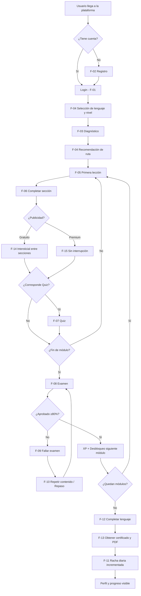

**Trazabilidad del mapa:** `01` §37 (resumen del flujo principal), `03` OUX-01 (<3 min a primera lección), `04` §2 (alcance MVP), `05` RF-AUTH/LANG/LVL/DIAG/RUTA/LEC/QUIZ/EXAM/CERT.

---

## 4. Flujos detallados

### F-01 — Primer inicio (onboarding hasta primera lección)

- **Objetivo:** Que un usuario nuevo o recurrente llegue a su primera lección en < 3 minutos con contexto claro de dónde está (`03` OUX-01/02, `06` RNF-020/021).
- **Actores:** UN, UR
- **Precondiciones:** Plataforma disponible (`06` RNF-013). Sin sesión activa.
- **Postcondiciones:** Sesión autenticada, lenguaje activo seleccionado, primera lección cargada en < 1,5 s (4G) y < 500 ms entre lecciones cacheadas (`06` RNF-011).
- **Disparador:** Usuario abre la URL de la plataforma.
- **Referencias:** UC-001, UC-002, UC-003, UC-004, UC-005, UC-006 · RF-AUTH-002, RF-LANG-001/002, RF-LVL-001, RF-DIAG-001, RF-RUTA-001/005, RF-PROG-004 · US-001, US-002, US-013, US-015, US-016, US-020, US-024 · RNF-020, RNF-021, RNF-023

**Pasos:**

1. Sistema muestra landing con CTA "Comenzar" y acceso a login/registro.
2. Usuario elige **Registrarse** (si UN → `F-02`) o **Iniciar sesión** (si UR → paso 3).
3. Usuario ingresa email + contraseña → sistema valida, emite token con expiración + refresh (`RF-AUTH-002`, `RF-AUTH-007`) y audita evento (`RF-AUTH-008`).
4. Sistema verifica si el usuario tiene lenguaje activo:
   - Sí → recupera `módulo/sección/lección` donde quedó (`RF-RUTA-005`, `RF-PROG-004`) y salta a paso 8.
   - No → continúa a selección de lenguaje (`F-04`).
5. Usuario selecciona lenguaje (MVP: Python disponible, resto "próximamente" — `RF-LANG-001`) y declara nivel `BEGINNER|MEDIUM|SEMI_PROFESSIONAL|PROFESSIONAL` (`RF-LVL-001`, `01` §8).
6. Usuario realiza diagnóstico (`F-03`) → sistema califica y recomienda punto de entrada (`RF-DIAG-002/003`).
7. Sistema genera ruta personalizada y muestra vista de ruta con 12 módulos Python en orden (`RF-RUTA-001/002`, `01` §34).
8. Sistema carga primera lección recomendada siguiendo `concepto → explicación → ejemplo → ejercicio → feedback → recompensa` (`RF-LEC-001`, `01` §6) y muestra breadcrumb `Lenguaje → Módulo → Sección → Lección` (`RF-SEC-004`, `RNF-021`).

**Decisiones:**

| # | Condición | Sí | No |
|---|---|---|---|
| D1 | ¿Tiene cuenta? | Login → paso 3 | Registro (`F-02`) |
| D2 | ¿Tiene lenguaje activo? | Reanudar (`RF-RUTA-005`) | Seleccionar lenguaje + nivel |
| D3 | ¿Diagnóstico completado? | Usar recomendación existente | Ejecutar `F-03` |
| D4 | ¿Sesión expira durante lección? | Refresh silencioso (`RF-AUTH-007`, `RNF-023`) sin pérdida de avance | Continuar normal |

**Estados:**

- Usuario: `no_registrado` → `activo` tras registro/login.
- Sesión: `sin_sesion` → `autenticada`.
- Módulo: `bloqueado`/`disponible` según recomendación adaptativa (`RF-RUTA-004`).

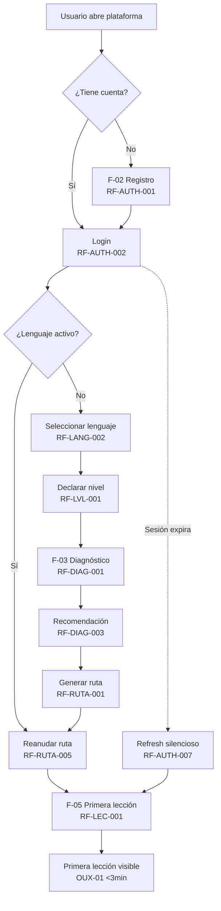

**Variantes y excepciones:**

- Credenciales inválidas ≥ N intentos → rate limiting + mensaje genérico sin revelar existencia de email (`RF-AUTH-006`, `06` RNF-009).
- Email no verificado → no bloquea aprendizaje; sí bloquea emisión de certificado (`RF-AUTH-005`, `US-005`).
- Pérdida de conexión durante carga → degradado: reintento con sincronización al reconectar (`06` RNF-044, `RNF-014`).

---

### F-02 — Registro

- **Objetivo:** Crear cuenta con datos mínimos y verificación por email sin bloquear el aprendizaje inicial.
- **Actores:** UN
- **Precondiciones:** Sin cuenta previa con ese email.
- **Postcondiciones:** Cuenta en `pendiente_verificacion` o `activo`, contraseña hasheada, email de verificación enviado, evento auditado.
- **Disparador:** Usuario elige "Crear cuenta".
- **Referencias:** UC-001 (UC-AUTH-01 previsto) · RF-AUTH-001, RF-AUTH-005, RF-AUTH-008, RF-USR-001, RF-USR-005 · US-001, US-005 · RNF-008, RNF-009, RNF-022

**Pasos:**

1. Sistema muestra formulario: nombre visible, email, contraseña, confirmación de contraseña.
2. Usuario completa y envía → sistema valida en servidor: formato email, fortaleza mínima de contraseña, unicidad de email (`RF-AUTH-001`).
3. Sistema hashea contraseña con función adaptativa (Argon2/bcrypt), crea usuario en `pendiente_verificacion`, envía email con token de verificación (`RF-AUTH-005`).
4. Sistema emite sesión autenticada (o redirige a login según política) y permite continuar a `F-04` sin exigir verificación inmediata.
5. Usuario abre email → clic en enlace → sistema marca `activo`/`verificado`.
6. Sistema registra eventos `registro`, `envío verificación`, `verificación exitosa` (`RF-AUTH-008`).

**Decisiones:**

| # | Condición | Sí | No |
|---|---|---|---|
| D1 | ¿Email ya existe? | Mensaje genérico, no revela existencia, no crea duplicado | Crear cuenta |
| D2 | ¿Contraseña débil o email inválido? | Mensaje accionable por campo (`RNF-022`), no envía formulario | Acepta |
| D3 | ¿Usuario verifica email? | Habilita emisión de certificado (`RF-CERT-001`) | Sigue aprendiendo, certificado bloqueado con CTA |

**Estados:**

- Usuario: `no_registrado` → `pendiente_verificacion` → `activo` (tras verificación).

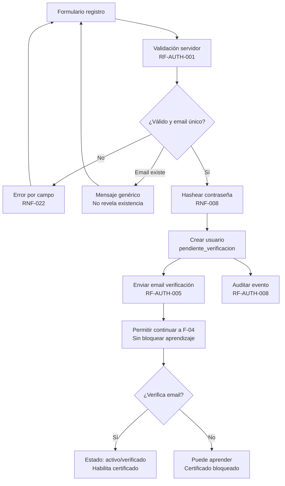

**Excepciones:**

- Servicio de email caído → registro exitoso igual, reintento en cola, no bloquea aprendizaje (`06` RNF-014).
- Intento de enumeración de emails → respuesta genérica idéntica exista o no (`RF-AUTH-006`).

---

### F-03 — Diagnóstico inicial

- **Objetivo:** Ubicar al usuario en el punto correcto de la ruta combinando nivel declarado + prueba diagnóstica, sin otorgar aprobación de módulos.
- **Actores:** UN, UA, UR (re-diagnóstico)
- **Precondiciones:** Lenguaje activo seleccionado y nivel declarado (`RF-LANG-002`, `RF-LVL-001`).
- **Postcondiciones:** Puntaje por área, recomendación de `módulo/sección` de inicio, resultado registrado en perfil/historial.
- **Disparador:** Usuario completa declaración de nivel o solicita "Re-tomar diagnóstico".
- **Referencias:** UC-004 (UC-DIAG-01/02/03) · RF-DIAG-001 a RF-DIAG-006, RF-LVL-003, RF-RUTA-001, RF-PREG-001 · US-016, US-017, US-021 · RNF-022, RNF-041

**Pasos:**

1. Sistema presenta prueba diagnóstica por lenguaje con preguntas representativas de distintos módulos (sin ejecución de código en MVP — `RF-DIAG-001`, `RF-PREG-001`).
2. Usuario responde preguntas (tipos: múltiple, V/F, completar, predecir output, etc. — `01` §11).
3. Sistema califica automáticamente y produce puntaje por área temática (`RF-DIAG-002`, `RF-EVAL-001`).
4. Sistema recomienda `módulo/sección` de inicio combinando nivel declarado + diagnóstico (`RF-DIAG-003`, `01` §9). La recomendación es sugerida, no impuesta.
5. Sistema muestra justificación (puntaje por área) y permite al usuario ajustar dentro de límites pedagógicos sin romper prerrequisitos críticos.
6. Sistema registra resultado en perfil e historial (`RF-DIAG-005`) y distingue diagnóstico de exámenes (no otorga aprobación — `RF-DIAG-006`).
7. Si es re-diagnóstico (`RF-DIAG-004`), el nuevo resultado no borra exámenes ya aprobados.

**Decisiones:**

| # | Condición | Sí | No |
|---|---|---|---|
| D1 | ¿Usuario acepta recomendación? | Genera ruta desde punto sugerido | Ajusta manualmente dentro de límites (`RF-DIAG-003`) |
| D2 | ¿Es re-diagnóstico con módulos aprobados? | Recalcula solo contenido no validado | Aplica recomendación completa |
| D3 | ¿Puntaje inconsistente con nivel declarado? | Sugiere revisar nivel (ej. Beginner con puntaje alto → sugerir Medium) pero respeta decisión final | Mantiene nivel |

**Estados:**

- Diagnóstico: `no_iniciado` → `en_curso` → `calificado` → `recomendado`.

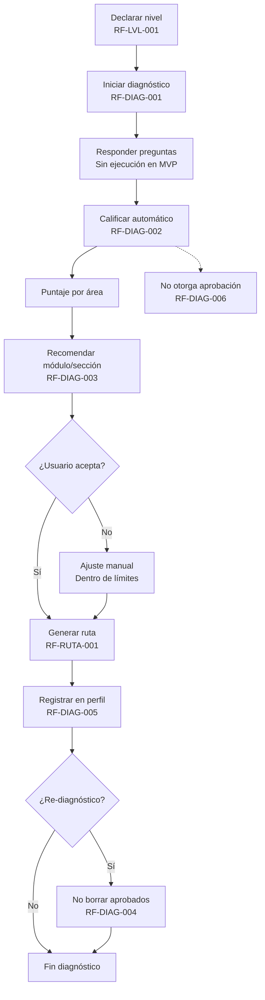

**Excepciones:**

- Abandono a mitad de diagnóstico → progreso guardado, reanudable (`RF-PROG-001`, `RNF-023`).
- Diagnóstico no completado → no bloquea, pero ruta usa solo nivel declarado con advertencia.

---

### F-04 — Selección de ruta (ruta personalizada y reanudación)

- **Objetivo:** Generar, visualizar y reanudar la ruta personalizada con prerrequisitos y estado por módulo.
- **Actores:** UN, UR, UA
- **Precondiciones:** Diagnóstico completado o nivel declarado disponible.
- **Postcondiciones:** Ruta visible con 12 módulos Python en orden canónico, estado y % por módulo; reanudación exacta al volver.
- **Disparador:** Diagnóstico finalizado o usuario entra con sesión válida.
- **Referencias:** UC-005 (UC-RUTA-01/02/03) · RF-RUTA-001 a RF-RUTA-005, RF-MOD-001/003, RF-EXAM-003, RF-LEC-002 · US-017, US-018, US-019, US-020, US-023 · RNF-021, RNF-023

**Pasos:**

1. Sistema genera ruta personalizada: `nivel + diagnóstico + historial` (`RF-RUTA-001`).
2. Sistema visualiza ruta: módulos en orden pedagógico, estado (`bloqueado/disponible/en_progreso/aprobado`), % de avance y requisitos (`RF-RUTA-002`, `RF-MOD-001/003`).
3. Usuario selecciona módulo disponible → sistema valida prerrequisitos: no aprobado el anterior → bloqueado, salvo punto de entrada adaptativo validado por diagnóstico (`RF-RUTA-004`).
4. Usuario entra a módulo → ve detalle: objetivo, secciones, evaluaciones (`RF-MOD-002`).
5. Sistema persiste posición `lenguaje/módulo/sección/lección` tras cada interacción (`RF-RUTA-005`, `RF-PROG-001`).
6. Al cerrar sesión/dispositivo y volver, sistema reanuda exactamente donde quedó (`RF-LEC-002`, `RNF-023`) y sincroniza si hubo pérdida de conexión (`RNF-044`).

**Decisiones:**

| # | Condición | Sí | No |
|---|---|---|---|
| D1 | ¿Módulo tiene prerrequisito no aprobado? | Bloquear + CTA repaso (`F-10`) | Permitir acceso |
| D2 | ¿Punto de entrada adaptativo validó salto? | Marcar previos como `omitidos por diagnóstico` sin exigir examen | Exigir aprobación secuencial |
| D3 | ¿Usuario reanuda sesión? | Restaurar posición exacta en < 2 s | Mostrar ruta desde inicio |

**Estados:**

- Módulo: `bloqueado` → `disponible` → `en_progreso` → `aprobado`.

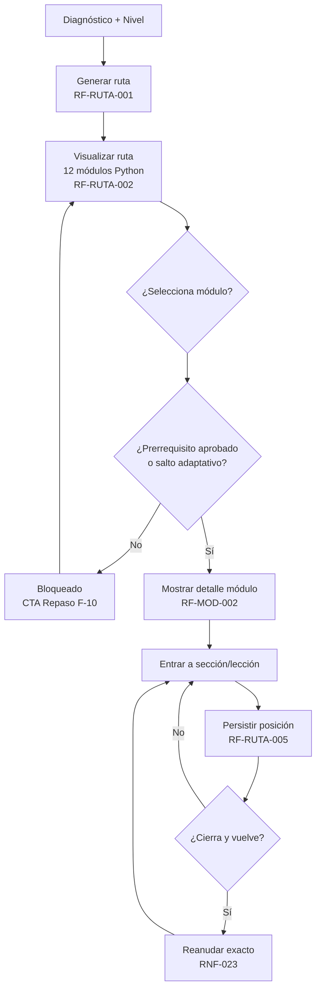

**Variantes:**

- Cambio de lenguaje (`RF-LANG-003`) → ruta y progreso del lenguaje anterior se conservan intactos (`US-014`).
- Re-diagnóstico → recalcular recomendaciones sin borrar aprobados (`RF-DIAG-004`).

---

### F-05 — Primera lección

- **Objetivo:** Consumir la primera lección con el flujo pedagógico completo y feedback inmediato.
- **Actores:** UN, UR
- **Precondiciones:** Ruta generada, lección disponible y prerrequisitos validados (`RF-LEC-004`).
- **Postcondiciones:** Lección completada o en progreso con intentos registrados atómicamente, XP otorgada si corresponde.
- **Disparador:** Usuario inicia la lección recomendada.
- **Referencias:** UC-006 (UC-LEC-01) · RF-LEC-001, RF-LEC-003, RF-LEC-004, RF-SEC-002, RF-PREG-003/004/005, RF-PROG-001 · US-024, US-026 · RNF-010, RNF-022, RNF-033, RNF-042

**Pasos:**

1. Sistema entrega lección: `concepto → explicación breve → ejemplo → ejercicio` (`RF-LEC-001`, `01` §6, `01` §38).
2. Sistema muestra pregunta anclada al contenido actual (no aleatoria global — `RF-PREG-003`) con metadatos completos (`RF-PREG-002`).
3. Usuario responde → sistema valida en servidor (< 1 s p95 — `RNF-010`), indica `acierto/error`, muestra explicación en lenguaje del usuario y otorga XP si aplica (`RF-PREG-004`, `RF-XP-001`, `RNF-022`).
4. Sistema registra intento atómicamente (`usuario, pregunta, respuesta, resultado, timestamp` — `RF-PREG-005`, `RF-PROG-001`, `RNF-033`) con idempotencia (`RNF-042`).
5. Sistema muestra recompensa y CTA "Siguiente concepto" (`01` §6).
6. Usuario avanza al siguiente concepto o abandona → sesión reanudable sin pérdida (`RF-LEC-002`).

**Decisiones:**

| # | Condición | Sí | No |
|---|---|---|---|
| D1 | ¿Respuesta correcta? | XP + feedback positivo + avance | Explicación de error + CTA repaso |
| D2 | ¿Fallo de red a mitad de envío? | Reintento idempotente, no duplica intento/XP | Registro normal |
| D3 | ¿Prerrequisito no cumplido? | Bloquear lección con mensaje guía | Permitir lección |

**Estados:**

- Lección: `no_iniciada` → `en_curso` → `completada`.
- Intento: `enviado` → `calificado`.

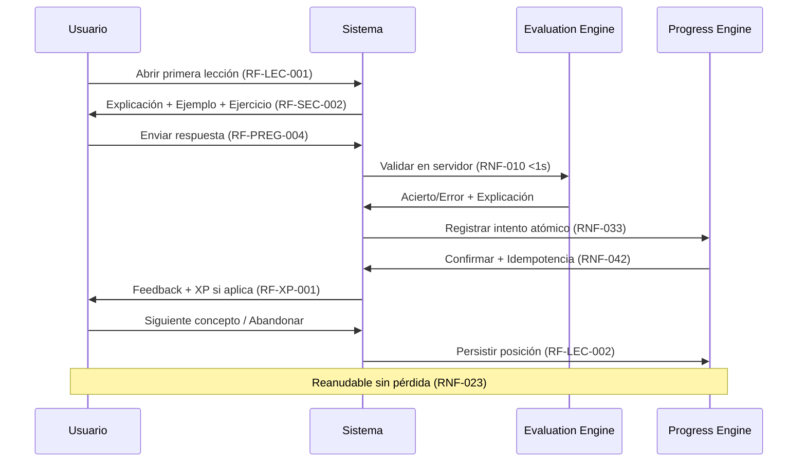

**Variantes:**

- Pregunta con opciones aleatorizadas (`RF-PREG-007`) mantiene trazabilidad de la correcta.
- Revisión de lección ya completada (`RF-LEC-005`, `US-027`) sin penalización.

---

### F-06 — Completar una sección

- **Objetivo:** Marcar sección como completada al finalizar lecciones/ejercicios obligatorios y disparar recompensa + publicidad (si gratuito).
- **Actores:** UR, UG, UP
- **Precondiciones:** Lecciones obligatorias de la sección disponibles.
- **Postcondiciones:** Sección `completada`, XP otorgada (+10 inicial — `01` §17), progreso visible actualizado, intersticial de publicidad (solo UG) entre secciones.
- **Disparador:** Usuario finaliza último ejercicio obligatorio de la sección.
- **Referencias:** UC-006 (UC-SEC-02) · RF-SEC-001/003, RF-LEC-003, RF-PROG-001, RF-XP-001, RF-ADS-001/002/003 · US-025, US-061 · RNF-014, `03` OUX-07

**Pasos:**

1. Sistema lista secciones del módulo con estado y tipo (`RF-SEC-001`).
2. Usuario completa lecciones/ejercicios obligatorios → sistema valida completitud (`RF-SEC-003`).
3. Sistema marca sección `completada`, registra tiempo dedicado (métrica interna — `RF-SEC-005`), otorga XP y muestra recompensa (`RF-XP-001`).
4. Sistema ejecuta `Sección completada → Recompensa → (Publicidad si UG) → Siguiente sección` (`01` §23):
   - Si UG → carga anuncio asíncrono entre secciones, nunca intra-ejercicio (`RF-ADS-001/002/003`).
   - Si UP → sin publicidad, transición inmediata (`RF-PREM-005`).
5. Sistema actualiza progreso agregado y breadcrumb (`RF-PROG-002`, `RF-SEC-004`).

**Decisiones:**

| # | Condición | Sí | No |
|---|---|---|---|
| D1 | ¿Todos los ejercicios obligatorios finalizados? | Marcar `completada` | Mantener `en_progreso` + mostrar qué falta |
| D2 | ¿Usuario gratuito? | Mostrar publicidad entre secciones (`F-14`) | Sin publicidad (`F-15`) |
| D3 | ¿Fallo del proveedor de anuncios? | Degradado: continuar sin bloquear (`RF-ADS-003`, `RNF-014`) | Mostrar anuncio y continuar |

**Estados:**

- Sección: `pendiente` → `en_progreso` → `completada`.

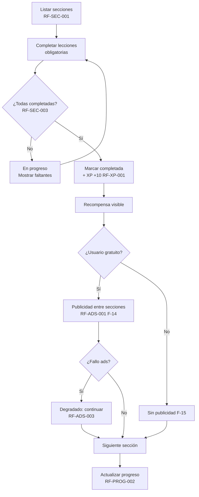

**Excepciones:**

- Publicidad nunca interrumpe ejercicio/quiz/examen (`RF-ADS-002`, `04` §8) — invariante con ADR si se propone cambiar.
- Reenvío del evento de completado → idempotencia, no duplica XP (`05` regla 3, `RNF-042`).

---

### F-07 — Quiz (evaluación intermedia)

- **Objetivo:** Verificar comprensión del módulo antes del examen con umbral 70% y revisión de errores.
- **Actores:** UR
- **Precondiciones:** Secciones previas al quiz completadas; quiz generado con preguntas del módulo actual (`RF-QUIZ-001`).
- **Postcondiciones:** Intento calificado, aprobación determinada, XP otorgada, revisión disponible, historial registrado.
- **Disparador:** Usuario alcanza punto de quiz en la ruta (`01` §13).
- **Referencias:** UC-007 (UC-QUIZ-01/02/03/04) · RF-QUIZ-001 a RF-QUIZ-006, RF-EVAL-001/002/003/005/006 · US-033, US-034, US-035, US-040 · RNF-012, RNF-022

**Pasos:**

1. Sistema genera quiz con composición configurable (`RF-QUIZ-001`, `RF-ADM-004`) y lo presenta con navegación entre preguntas, envío único y confirmación (`RF-QUIZ-002`).
2. Usuario responde y confirma envío → sistema califica automáticamente en < 2 s p95 (`RF-QUIZ-003`, `RNF-012`) calculando puntaje, % y detalle por pregunta en servidor (`RF-EVAL-001/002/006`).
3. Sistema determina `aprobado` si `≥70%` (umbral configurable versionado — `RF-EVAL-005`, `01` §15) y registra intento con umbral y versión de contenido (`RF-EVAL-003`).
4. Sistema otorga XP por completar + bonificación por aprobación (`RF-QUIZ-006`, `01` §17) y muestra resultado.
5. Sistema muestra revisión de errores: pregunta, respuesta dada, correcta y explicación, sin revelar banco completo (`RF-QUIZ-004`).
6. Si reprobado, sistema ofrece repaso y permite reintento registrando nuevo intento sin ocultar historial (`RF-QUIZ-005`).

**Decisiones:**

| # | Condición | Sí | No |
|---|---|---|---|
| D1 | ¿% ≥ 70%? | Aprobado → continuar ruta | Reprobado → CTA revisión + repaso |
| D2 | ¿Reintentar? | Nuevo intento, conserva historial y umbral por intento | Permanecer en revisión |
| D3 | ¿Manipulación del cliente? | Servidor prevalece (`RF-EVAL-006`) | — |

**Estados:**

- Intento quiz: `no_iniciado` → `en_curso` → `enviado` → `calificado` → `aprobado/reprobado`.

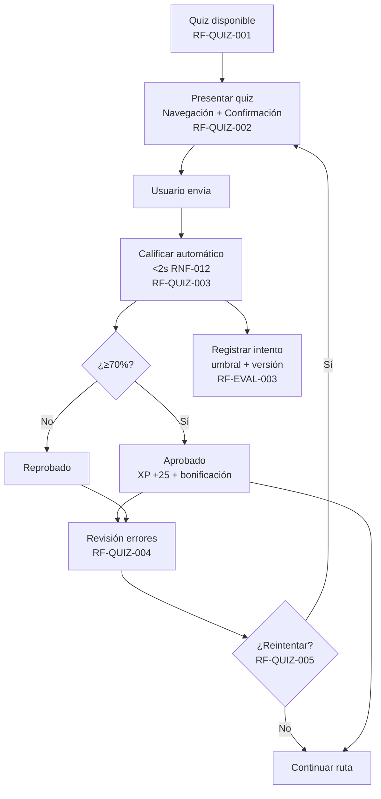

**Variantes:**

- Quiz no es bloqueante para repaso (`RF-REP-003`): puede omitirse y continuar, pero se recomienda completarlo antes del examen.
- Umbral configurado por admin sin despliegue (`RF-ADM-004`, `RNF-017`): aplica solo a intentos futuros.

---

### F-08 — Examen (evaluación final de módulo)

- **Objetivo:** Evaluar dominio de todo el módulo y decidir desbloqueo del siguiente.
- **Actores:** UR
- **Precondiciones:** Secciones del módulo completadas, quiz previo (si aplica) disponible.
- **Postcondiciones:** Módulo `aprobado` si `≥80%` y siguiente módulo `disponible`; si no, `reprobado` y bloqueado con CTA.
- **Disparador:** Usuario completa última sección del módulo y selecciona "Realizar examen".
- **Referencias:** UC-008 (UC-EXAM-01/02/03/04) · RF-EXAM-001 a RF-EXAM-007, RF-EVAL-001/002/003/005/006, RF-RUTA-004, RF-MOD-003 · US-036, US-037, US-038, US-039, US-040 · RNF-012

**Pasos:**

1. Sistema genera examen final del módulo con distribución configurable (ej. inicial `01` §14: 5 múltiple, 5 predicción, 3 completar, 2 detectar errores, 5 V/F — `RF-EXAM-002`).
2. Sistema presenta examen como intento evaluable único (`RF-EXAM-001`).
3. Usuario envía → sistema califica automáticamente (< 2 s p95 — `RNF-012`) y determina `aprobado` si `≥80%` (`RF-EXAM-003`, `01` §15) con cálculo determinista en servidor (`RF-EVAL-001/006`).
4. Sistema registra intento con puntaje, %, umbral y versión (`RF-EVAL-003`), identifica conceptos con bajo rendimiento (`RF-EVAL-004`) y otorga XP (`RF-EXAM-007`: +100 por aprobación).
5. Si `aprobado` → marca módulo `aprobado` (`RF-MOD-003`), desbloquea siguiente (`RF-RUTA-004`), incrementa racha si aplica (`RF-RACHA-001`) y evalúa logros (`RF-LOGRO-002`).
6. Sistema muestra revisión detallada por tipo y conceptos débiles (`RF-EXAM-006`).

**Decisiones:**

| # | Condición | Sí | No |
|---|---|---|---|
| D1 | ¿% ≥ 80%? | Módulo `aprobado` → desbloquear siguiente | Módulo `reprobado` → bloquear siguiente (`F-09`) |
| D2 | ¿Examen reprobado y usuario quiere reintentar? | Reintento ilimitado, desbloqueo exige un aprobado (`RF-EXAM-005`) | Permanecer bloqueado |

**Estados:**

- Módulo: `en_progreso` → `aprobado` / `reprobado`.

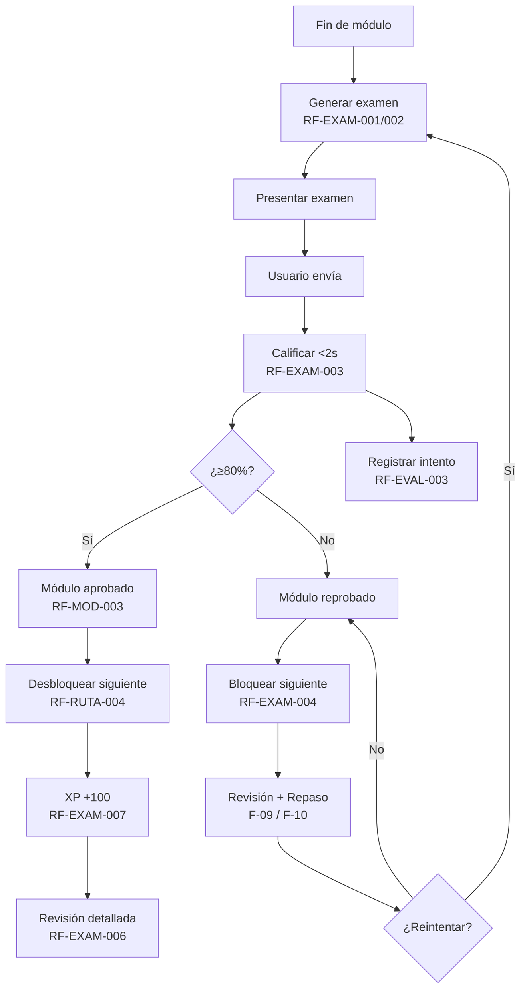

**Excepciones:**

- Envío duplicado → idempotencia, no duplica intento ni XP (`RNF-042`).
- Cambio de umbral entre intentos → se aplica el vigente al calificar, se conserva histórico por intento (`RF-EVAL-005`).

---

### F-09 — Fallar examen

- **Objetivo:** Gestionar el fallo de forma pedagógica: revisión, diagnóstico de errores y ruta de recuperación sin callejón sin salida.
- **Actores:** UR
- **Precondiciones:** Intento de examen calificado como `reprobado` (<80%).
- **Postcondiciones:** Usuario entiende qué falló, qué conceptos reforzar y cómo reintentar; siguiente módulo permanece `bloqueado`.
- **Disparador:** Sistema califica examen como no aprobado.
- **Referencias:** UC-008 (UC-EXAM-03) · RF-EXAM-004, RF-EXAM-006, RF-EVAL-004, RF-RUTA-004 · US-037, US-039 · RNF-022

**Pasos:**

1. Sistema muestra resultado `reprobado` con % , puntaje y umbral aplicado, sin tecnicismos (`RNF-022`).
2. Sistema presenta revisión detallada: por cada pregunta fallida, muestra pregunta, respuesta dada, correcta y explicación; además desglose por tipo y lista de conceptos con bajo rendimiento (`RF-EXAM-006`, `RF-EVAL-004`).
3. Sistema mantiene siguiente módulo `bloqueado` y muestra CTA claros: **Repasar** (`F-10`), **Reintentar examen** (`F-08`), **Revisar lecciones** (`RF-LEC-005`).
4. Sistema prioriza repaso sugerido según historial: respuestas incorrectas, bajo rendimiento, antigüedad y prerrequisitos futuros (`RF-REP-002`).
5. Usuario elige acción → sistema lo guía sin pérdida de progreso previo.

**Decisiones:**

| # | Condición | Sí | No |
|---|---|---|---|
| D1 | ¿Usuario elige repasar? | Sesión de repaso priorizada (`F-10`, `RF-REP-001`) | Va directo a reintento (posible, pero no recomendado) |
| D2 | ¿Usuario revisa lecciones? | Navegación a lecciones sin penalización (`RF-LEC-005`) | Permanece en revisión |
| D3 | ¿Reintento? | Nuevo intento (`RF-EXAM-005`) | Mantiene estado `reprobado` y puede volver luego |

**Estados:**

- Módulo: `reprobado` (persiste hasta aprobar).
- Intento: `reprobado` (inmutable, auditable).

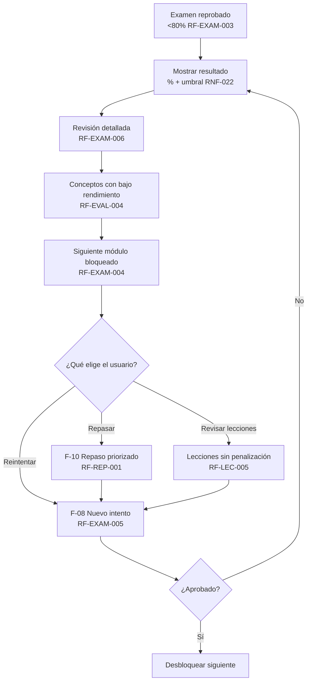

**Notas:**

- Mensaje de fallo es pedagógico, no punitivo, con siguiente paso explícito (`06` RNF-022).
- El sistema nunca promedia intentos: basta un aprobado para desbloquear (`RF-EXAM-005`, `05` §8 definición "Módulo aprobado").

---

### F-10 — Repetir contenido (repaso y revisión)

- **Objetivo:** Reforzar memoria a largo plazo mediante repaso priorizado y revisión manual sin penalizar el progreso.
- **Actores:** UR
- **Precondiciones:** Historial con intentos previos (`RF-PREG-005`, `RF-EVAL-003`).
- **Postcondiciones:** Resultados de repaso registrados, priorización futura ajustada, progreso de módulo no penalizado.
- **Disparador:** Usuario acepta sugerencia de repaso, elige "Repasar" tras fallo, o inicia repaso manual.
- **Referencias:** UC transversal (UC-REP-01/02) · RF-REP-001 a RF-REP-005, RF-EVAL-004, RF-PREG-005 · US-050, US-051, US-052, US-053 · `01` §12

**Pasos:**

1. Sistema genera sesión de repaso con preguntas de contenido ya estudiado, priorizadas por: incorrectas previas, bajo rendimiento, antigüedad sin repaso y prerrequisitos próximos (`RF-REP-001/002`, `01` §12).
2. Sistema ofrece repaso **opcional** entre sesiones sin bloquear ruta principal (`RF-REP-003`); usuario puede aceptarlo u omitirlo.
3. Si el usuario elige repaso manual, selecciona `módulo/tema` y recibe preguntas de ese ámbito ya estudiado (`RF-REP-005`, `US-052`).
4. Usuario responde → sistema valida, muestra feedback y registra resultados retroalimentando al motor de evaluación para ajustar próxima priorización, **sin penalizar % del módulo** (`RF-REP-004`).
5. Al finalizar, sistema vuelve a la ruta sin pérdida de posición (`RF-REP-003`).
6. Revisión de lecciones ya completadas (`RF-LEC-005`) es siempre posible como alternativa al repaso.

**Decisiones:**

| # | Condición | Sí | No |
|---|---|---|---|
| D1 | ¿Acepta repaso sugerido? | Sesión priorizada | Continúa ruta principal |
| D2 | ¿Prefiere repaso manual? | Filtro por módulo/tema | Repaso automático |
| D3 | ¿Falla en repaso? | Ajusta priorización futura, no bloquea avance (`RF-REP-004`) | Refuerza priorización positiva |

**Estados:**

- Repaso: `sugerido` → `en_curso` → `completado` (no afecta `aprobado/reprobado` del módulo).

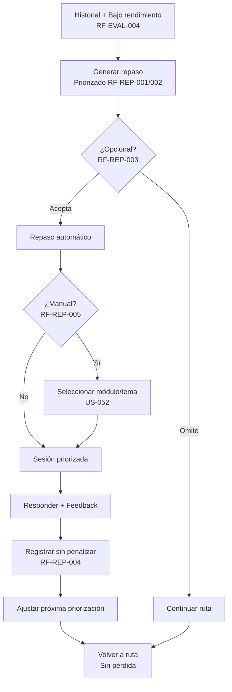

**Variantes:**

- Repaso entre sesiones (`US-051`) y repaso tras examen fallido (`F-09`) comparten el mismo motor; la única diferencia es el CTA que lo dispara.
- Tiempo dedicado en repaso no se usa para ranking en MVP (`RF-SEC-005`, `04` §2.4).

---

### F-11 — Mantener racha

- **Objetivo:** Sostener hábito diario mediante incremento de racha con actividad válida y visualización de racha actual/máxima.
- **Actores:** UR
- **Precondiciones:** Usuario autenticado, zona horaria resuelta (`RF-RACHA-004`).
- **Postcondiciones:** Racha incrementada o reiniciada, historial diario registrado, logros evaluados.
- **Disparador:** Usuario completa actividad válida (lección/ejercicio, quiz, examen o repaso — `05` §8) en un día calendario.
- **Referencias:** UC-010 (UC-GAM-03) · RF-RACHA-001 a RF-RACHA-005, RF-PROG-001, RF-LOGRO-002 · US-044, US-045, US-046 · RNF-045, `01` §18

**Pasos:**

1. Usuario completa actividad válida → sistema registra evento con `timestamp` `America/Bogota` y zona horaria del usuario (`RF-RACHA-004`, `RF-PROG-001`).
2. Sistema evalúa ventana diaria:
   - Si es primer día o día consecutivo con actividad → `racha += 1` (`RF-RACHA-001`).
   - Si faltó un día calendario sin actividad → `racha = 0` (o 1 si es nueva actividad tras corte), con ventana de gracia configurable si aplica (`RF-RACHA-002`).
3. Sistema expone `racha_actual` y `racha_máxima` en perfil (`RF-RACHA-003`, `US-008`).
4. Sistema registra historial diario para auditoría (`RF-RACHA-005`, `RNF-045`).
5. Sistema evalúa logros dependientes (ej. `ON FIRE` a 7 días — `RF-LOGRO-002`, `US-046`).
6. Sistema muestra feedback de racha (animación, contador) al completar la actividad.

**Decisiones:**

| # | Condición | Sí | No |
|---|---|---|---|
| D1 | ¿Hubo actividad hoy ya registrada? | No incrementa de nuevo (1/día) | Incrementa |
| D2 | ¿Día consecutivo? | `racha += 1` | `racha = 0` → `1` con nueva actividad |
| D3 | ¿Alcanza 7 días? | Desbloquear `ON FIRE` (`US-046`) | Continuar |

**Estados:**

- Racha: `0` → `1..n` → `reiniciada`.

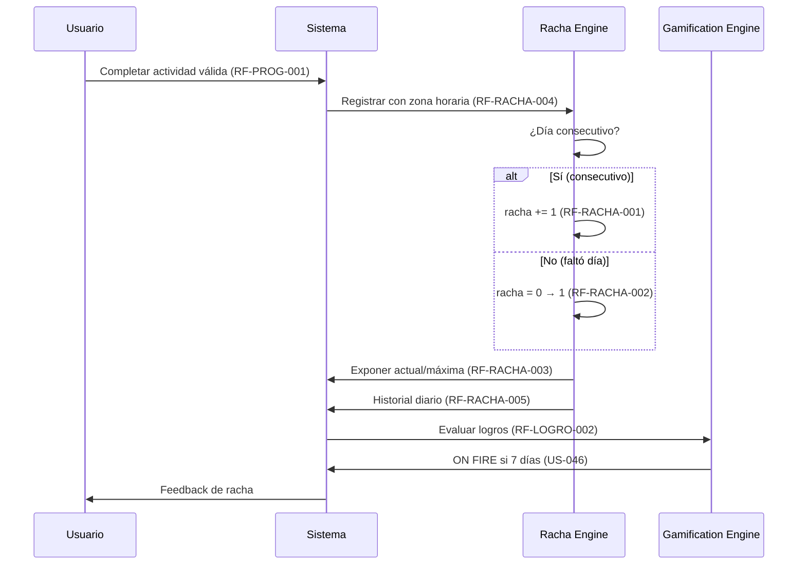

**Excepciones:**

- Cambio de zona horaria → el sistema documenta regla de corte diario y aplica la del usuario (`RF-RACHA-004`).
- Actividad a las 23:59 → se asigna al día calendario correcto según zona horaria, no UTC del servidor.

---

### F-12 — Completar lenguaje

- **Objetivo:** Cerrar el ciclo de un lenguaje al aprobar todos sus módulos y habilitar la certificación.
- **Actores:** UC (usuario que completa curso)
- **Precondiciones:** Todos los módulos del lenguaje en `aprobado` (cada examen ≥80% vigente — `RF-CERT-001`, `04` §7, `05` §8 definición "Lenguaje completado").
- **Postcondiciones:** Lenguaje marcado `completado`, certificado generable, XP de módulo final otorgada, logros evaluados.
- **Disparador:** Usuario aprueba el examen del último módulo.
- **Referencias:** UC-012 (UC-CERT-01) · RF-CERT-001, RF-MOD-003, RF-EXAM-003/007, RF-LOGRO-002 · US-054, US-058 · `01` §21

**Pasos:**

1. Usuario aprueba examen del último módulo (12.º en Python — `01` §34) → sistema califica y marca módulo `aprobado` (`RF-MOD-003`).
2. Sistema verifica invariante `lenguaje completado ↔ todos los exámenes aprobados` (`06` RNF-034) en versión vigente.
3. Si se cumple → sistema marca lenguaje `completado`, registra fecha de finalización y otorga XP de módulo (+150 inicial — `01` §17, `RF-XP-001`).
4. Sistema evalúa logros: `CODE MASTER`, `PYTHON BEGINNER`, etc. (`RF-LOGRO-002`, `01` §19).
5. Sistema habilita CTA "Obtener certificado" (`F-13`) y actualiza perfil con `100%` por lenguaje (`RF-PROF-003`).
6. Si no se cumple (faltan módulos) → mantiene lista de pendientes y no genera certificado.

**Decisiones:**

| # | Condición | Sí | No |
|---|---|---|---|
| D1 | ¿Todos los módulos aprobados en versión vigente? | Lenguaje `completado` → habilitar `F-13` | Mostrar módulos faltantes (`US-054`) |
| D2 | ¿Contenido cambió tras completar? | Certificado `obsoleto` hasta revalidación (`RF-CERT-005`) | Certificado `generable` |

**Estados:**

- Lenguaje: `en_progreso` → `completado`.
- Certificado: `no_aplicable` → `generable`.

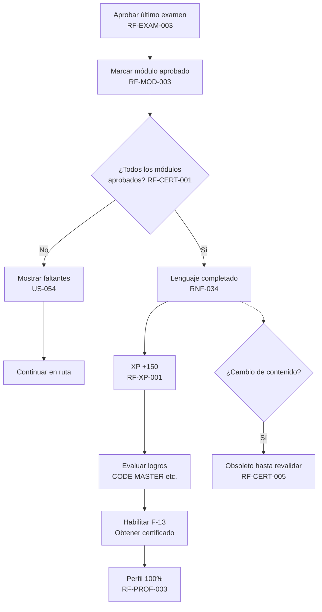

---

### F-13 — Obtener certificado

- **Objetivo:** Generar, verificar y exportar el certificado de finalización con ID único, QR y PDF.
- **Actores:** UCert, UC
- **Precondiciones:** Lenguaje `completado`, email verificado (`RF-AUTH-005`, `US-059`), datos mínimos de certificado disponibles (`RF-CERT-002`).
- **Postcondiciones:** Certificado `emitido` con `CQ-{LANG}-{SEQ}` (`RF-CERT-003`), QR interno, PDF almacenado y verificación habilitada.
- **Disparador:** Usuario selecciona "Obtener/Descargar certificado".
- **Referencias:** UC-012, UC-013 (UC-CERT-01/02/03/04) · RF-CERT-001 a RF-CERT-006, RF-PDF-001 a RF-PDF-004, RF-AUTH-005, RF-PROF-005 · US-054, US-055, US-056, US-057, US-060 · RNF-014

**Pasos:**

1. Usuario solicita certificado → sistema verifica: lenguaje `completado`, email `verificado`, datos (nombre, documento, lenguaje, fecha, plataforma, estado — `RF-CERT-002`). Si falta verificación → CTA verificar email (`US-059`).
2. Sistema verifica que no exista certificado `vigente` duplicado para el mismo lenguaje (`RF-CERT-005`, `US-058`).
3. Sistema genera certificado con ID `CQ-{LANG}-{SEQ}` correlativo por lenguaje (`RF-CERT-003`, ej. `CQ-PY-000001`, `01` §22).
4. Sistema genera QR para verificación interna (`RF-CERT-004`) y plantilla PDF versionada (`RF-PDF-001`).
5. Sistema almacena PDF de forma recuperable vía interfaz S3-compatible (`RF-PDF-002/004`) y garantiza correspondencia bit-a-bit con datos del certificado vigente (`RF-PDF-003`).
6. Sistema permite descarga autenticada solo al titular (`RF-PDF-002`) y exposición en perfil (`RF-PROF-005`, `US-060`).
7. Sistema expone verificación interna por `ID/QR` que confirma validez, lenguaje, fecha y titular sin exponer PII de terceros (`RF-CERT-006`, `US-055`).
8. Si el contenido cambia significativamente → certificado pasa a `obsoleto` y exige revalidación; no coexisten dos vigentes (`RF-CERT-005`, `US-057`).

**Decisiones:**

| # | Condición | Sí | No |
|---|---|---|---|
| D1 | ¿Email verificado? | Continuar | Bloquear emisión + CTA verificar |
| D2 | ¿Ya existe vigente para ese lenguaje? | No duplica; mantiene existente | Generar nuevo |
| D3 | ¿Contenido cambió? | Marcar `obsoleto` → revalidar | Mantener `emitido` |
| D4 | ¿PDF solicitado? | Generar con QR + almacenar (`RF-PDF-001`) | Solo registro de certificado |

**Estados:**

- Certificado: `generable` → `emitido` → `obsoleto` (si cambia contenido).

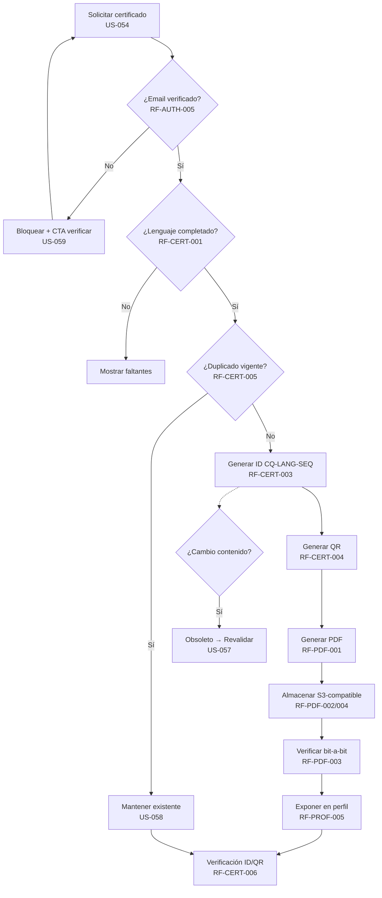

**Excepciones:**

- Fallo de generación de PDF → no impide aprendizaje ni invalida certificado; reintento asíncrono, degradado (`06` RNF-014).
- Intento de descarga por no titular → 403, sin exposición de PII (`RF-CERT-006`).

---

### F-14 — Usuario gratuito (experiencia con publicidad)

- **Objetivo:** Monetizar sin degradar el aprendizaje: publicidad solo entre secciones, nunca intra-ejercicio, con carga asíncrona y sin tracking invasivo.
- **Actores:** UG
- **Precondiciones:** Usuario en plan `gratuita` (por defecto, sin suscripción activa — `RF-PREM-002`).
- **Postcondiciones:** Anuncio mostrado entre secciones, métricas esenciales registradas, aprendizaje no bloqueado ante fallo de ads.
- **Disparador:** Usuario completa una sección (`F-06`).
- **Referencias:** UC-014 (variante gratuito) · RF-ADS-001 a RF-ADS-005, RF-SEC-003, RF-PREM-001/003 · US-061, US-062, US-066 · RNF-014, RNF-039, RNF-040, `03` OUX-07

**Pasos:**

1. Usuario completa sección → sistema muestra recompensa (`F-06`).
2. Sistema inyecta intersticial/bloque de anuncio **solo entre secciones** (`Sección completada → Recompensa → Publicidad → Siguiente sección` — `01` §23, `RF-ADS-001`).
3. Sistema garantiza que nunca aparece durante ejercicio, quiz o examen (`RF-ADS-002`, `04` §8, `03` OUX-07).
4. Sistema carga anuncio de forma asíncrona sin bloquear registro de progreso ni navegación; fallo/lentitud del proveedor no impide continuar (`RF-ADS-003`, `06` RNF-014).
5. Sistema registra impresiones/clics solo con métricas esenciales, sin fingerprinting ni cross-site tracking (`RF-ADS-004`, `RNF-039/040`).
6. Red de anuncios abstraída tras interfaz, sin hardcodeo de proveedor en el núcleo (`RF-ADS-005`).

**Decisiones:**

| # | Condición | Sí | No |
|---|---|---|---|
| D1 | ¿Usuario es gratuito? | Mostrar publicidad | No mostrar (`F-15`) |
| D2 | ¿Proveedor falla/lento? | Degradado: continuar sin anuncio | Mostrar anuncio |
| D3 | ¿Intenta mostrar intra-ejercicio? | Prohibido (invariante, requiere ADR) | Permitido solo entre secciones |

**Estados:**

- Suscripción: `gratuita`.

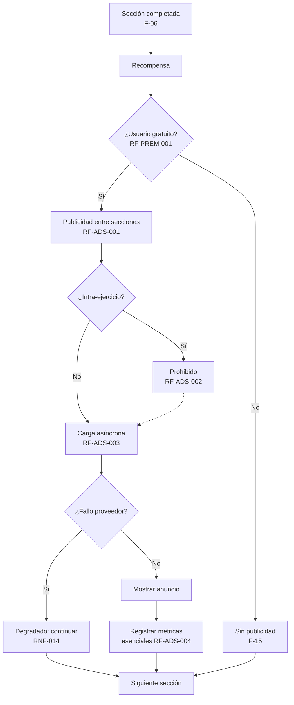

**Notas:**

- En MVP, gratuito y premium acceden al **mismo contenido**; la única diferencia es la publicidad (`US-066`, `04` §8).
- Contenido de anuncio no se comparte con datos de progreso (`RNF-040`).

---

### F-15 — Usuario premium (experiencia sin anuncios)

- **Objetivo:** Ofrecer experiencia continua sin interrupciones por USD $1/mes (configurable), conservando progreso al cambiar de plan.
- **Actores:** UP, UR (que activa premium)
- **Precondiciones:** Usuario autenticado, pasarela de pagos abstraída disponible (`RF-PREM-004`).
- **Postcondiciones:** Suscripción `activa`, experiencia sin anuncios en toda la plataforma, eventos auditados, progreso intacto.
- **Disparador:** Usuario selecciona "Activar premium".
- **Referencias:** UC-014 (variante premium) · RF-PREM-001 a RF-PREM-006, RF-ADS-001, RF-PROG-001 · US-063, US-064, US-065 · `04` §8

**Pasos:**

1. Usuario inicia activación → sistema muestra precio inicial `USD $1/mes` (configurable — `RF-PREM-001`, `04` §8) y términos.
2. Sistema delega cobro a pasarela abstraída (sin hardcodear Stripe/PayPal — `RF-PREM-004`) y recibe confirmación.
3. Sistema gestiona ciclo: `activación → renovación → expiración/cancelación` con estados `activa`/`expirada`/`cancelada` y fechas (`RF-PREM-002`).
4. Sistema refleja estado premium **inmediatamente**: elimina toda publicidad (`RF-PREM-005`, `RF-ADS-001`) en web y futuras sesiones hasta expiración.
5. Sistema conserva progreso, XP, rachas y logros al cambiar entre gratuito ↔ premium (`RF-PREM-003`, `US-065`).
6. Sistema registra eventos de facturación/suscripción para soporte sin almacenar datos de tarjeta en el núcleo (`RF-PREM-006`).
7. Al expirar/cancelar → usuario vuelve a `gratuita` con `F-14` y sin pérdida de avance (`US-064`).

**Decisiones:**

| # | Condición | Sí | No |
|---|---|---|---|
| D1 | ¿Pago confirmado? | Activar `activa` + sin anuncios | Mantener `gratuita` + error accionable |
| D2 | ¿Suscripción expira/cancela? | Volver a `gratuita` con publicidad | Mantener `activa` |
| D3 | ¿Cambio de plan? | Conservar progreso (`RF-PREM-003`) | — |

**Estados:**

- Suscripción: `gratuita` → `activa` → `cancelada`/`expirada` → `gratuita`.

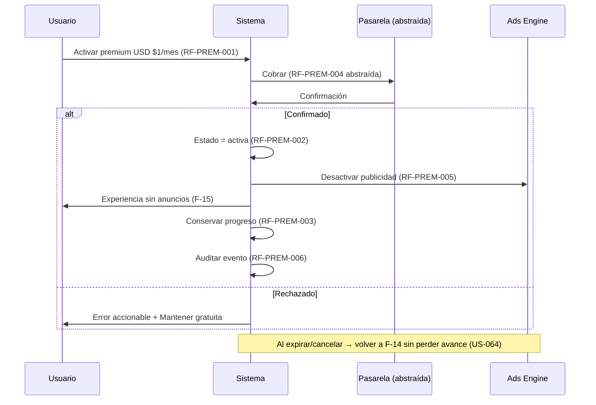

**Variantes:**

- Premium en MVP **no desbloquea contenido adicional** (`US-066`, `04` §8); solo elimina anuncios. Beneficios adicionales son Post-MVP (`22_ROADMAP.md`).
- Renovación automática y facturación detallada se especifican en `18_MONETIZATION.md` (fuera de este flujo).

---

## 5. Resumen de trazabilidad

### 5.1 Flujo → UC / RF / US / RNF

| Flujo | UC previstos (`05`/`07`) | RF principales (`05`) | US (`07`) | RNF (`06`) |
|---|---|---|---|---|
| F-01 Primer inicio | UC-001, UC-002, UC-003, UC-004, UC-005, UC-006 | RF-AUTH-002/007, RF-LANG-001/002, RF-LVL-001, RF-DIAG-001, RF-RUTA-001/005 | US-001, US-002, US-013, US-015, US-020, US-024 | RNF-020, RNF-021, RNF-023 |
| F-02 Registro | UC-001 | RF-AUTH-001/005/008, RF-USR-001/005 | US-001, US-005 | RNF-008, RNF-009, RNF-022 |
| F-03 Diagnóstico | UC-004 | RF-DIAG-001..006, RF-LVL-003, RF-RUTA-001 | US-016, US-017, US-021 | RNF-022, RNF-041 |
| F-04 Selección de ruta | UC-005 | RF-RUTA-001..005, RF-MOD-001/003, RF-EXAM-003 | US-017, US-018, US-019, US-023 | RNF-021, RNF-023 |
| F-05 Primera lección | UC-006 | RF-LEC-001/003/004, RF-SEC-002, RF-PREG-003/004/005 | US-024, US-026 | RNF-010, RNF-022, RNF-033, RNF-042 |
| F-06 Completar sección | UC-006 | RF-SEC-001/003, RF-LEC-003, RF-XP-001, RF-ADS-001/002/003 | US-025, US-061 | RNF-014, OUX-07 |
| F-07 Quiz | UC-007 | RF-QUIZ-001..006, RF-EVAL-001/002/003/005/006 | US-033, US-034, US-035, US-040 | RNF-012, RNF-022 |
| F-08 Examen | UC-008 | RF-EXAM-001..007, RF-EVAL-001/002/003/005/006, RF-RUTA-004 | US-036, US-037, US-038, US-039, US-040 | RNF-012 |
| F-09 Fallar examen | UC-008 | RF-EXAM-004/006, RF-EVAL-004, RF-RUTA-004 | US-037, US-039 | RNF-022 |
| F-10 Repetir contenido | UC-REP-01/02 | RF-REP-001..005, RF-EVAL-004, RF-LEC-005 | US-050, US-051, US-052, US-053 | — |
| F-11 Mantener racha | UC-010 | RF-RACHA-001..005, RF-PROG-001, RF-LOGRO-002 | US-044, US-045, US-046 | RNF-045 |
| F-12 Completar lenguaje | UC-012 | RF-CERT-001, RF-MOD-003, RF-EXAM-003/007 | US-054, US-058 | RNF-034 |
| F-13 Obtener certificado | UC-012, UC-013 | RF-CERT-001..006, RF-PDF-001..004, RF-AUTH-005 | US-054, US-055, US-056, US-057, US-060 | RNF-014 |
| F-14 Usuario gratuito | UC-014 | RF-ADS-001..005 | US-061, US-062, US-066 | RNF-014, RNF-039, RNF-040 |
| F-15 Usuario premium | UC-014 | RF-PREM-001..006, RF-ADS-001 | US-063, US-064, US-065 | — |

### 5.2 Cobertura de flujos obligatorios solicitados

| Flujo solicitado | Cubierto en | Flujos F-XX |
|---|---|---|
| Primer inicio | §4 | F-01 |
| Registro | §4 | F-02 |
| Diagnóstico | §4 | F-03 |
| Selección de ruta | §4 | F-04 |
| Primera lección | §4 | F-05 |
| Completar una sección | §4 | F-06 |
| Quiz | §4 | F-07 |
| Examen | §4 | F-08 |
| Fallar examen | §4 | F-09 |
| Repetir contenido | §4 | F-10 |
| Mantener racha | §4 | F-11 |
| Completar lenguaje | §4 | F-12 |
| Obtener certificado | §4 | F-13 |
| Usuario gratuito | §4 | F-14 |
| Usuario premium | §4 | F-15 |

### 5.3 Invariantes que ningún flujo puede violar

1. Publicidad nunca intra-ejercicio/quiz/examen (`RF-ADS-002`, `04` §8) — requiere ADR para cambiar.
2. Calificación siempre en servidor (`RF-EVAL-006`, `06` RNF-033).
3. Idempotencia de intentos/XP (`05` regla 3, `06` RNF-042).
4. Umbrales y XP configurables sin despliegue (`RNF-017`).
5. Un certificado vigente por lenguaje (`RF-CERT-005`, `04` §7).
6. Contenido desacoplado del motor (`RNF-031`, `01` §31).

---

## 6. Estados y transiciones — referencia rápida

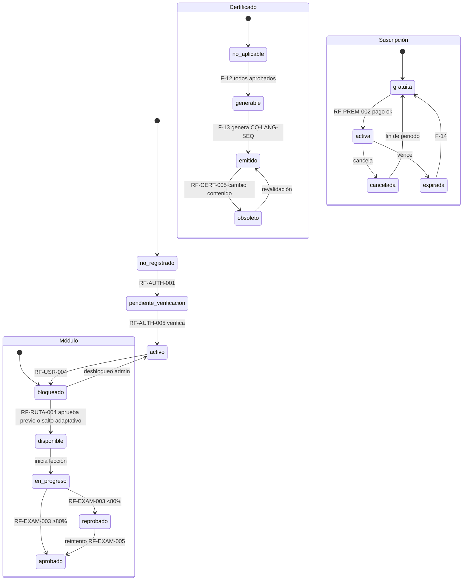

---

## 7. Consideraciones de diseño y RNF transversales

- **Rendimiento:** feedback < 1 s (`RNF-010`), calificación < 2 s (`RNF-012`), navegación < 500 ms (`RNF-011`) — cada flujo con interacción evaluable debe medir p95 en `staging` con APM.
- **Disponibilidad y degradado:** email/ads/PDF no bloquean aprendizaje (`RNF-014`); backup diario con RPO ≤24 h (`RNF-043`).
- **Seguridad:** hash adaptativo, rate limiting, validación server-side, sin secretos en logs (`RNF-008/009`, `19_SECURITY.md`).
- **Usabilidad y accesibilidad:** onboarding <3 min (`RNF-020`), breadcrumb siempre visible (`RNF-021`), WCAG 2.1 AA en flujos críticos (`RNF-024`), navegación por teclado (`RNF-025`).
- **Integridad:** progreso atómico (`RNF-033`), consistencia de certificabilidad (`RNF-034`), versionado con trazabilidad (`RNF-035`).

---

## 8. Referencias

- `01_PROJECT_OVERVIEW.md` — flujo principal §37, filosofía §6, estructura §7, diagnóstico §8, gamificación §17–§19, certificación §21–§22, modelo §23
- `02_PROBLEM_STATEMENT.md` — PS-01 a PS-10, causas §3, usuarios §5
- `03_OBJECTIVES.md` — OE, OED, OUX-01/02/03/06/07, OT
- `04_SCOPE.md` — MVP §2, Post-MVP §3, límites §5–§8, anti-scope-creep §10
- `05_FUNCTIONAL_REQUIREMENTS.md` — 128 RF por dominio (§4), reglas §6
- `06_NON_FUNCTIONAL_REQUIREMENTS.md` — RNF-001..045, verificación §5
- `07_USER_STORIES.md` — 72 US, épicas E01–E10, trazabilidad §5
- `08_USE_CASES.md` — pendiente (UC previstos en `05`/`07`)
- `10_INFORMATION_ARCHITECTURE.md`, `11_SYSTEM_ARCHITECTURE.md`, `12_DATABASE_DESIGN.md`, `13_API_SPECIFICATION.md`, `14_LEARNING_SYSTEM.md`, `15_QUIZ_EXAM_SYSTEM.md`, `16_GAMIFICATION.md`, `17_CERTIFICATION.md`, `18_MONETIZATION.md` — detalle de implementación de cada flujo

---

*Fin de `09_USER_FLOWS.md` — cualquier adición, cambio de flujo o nuevo diagrama Mermaid requiere actualizar `05`, `07`, `08`, `10`, `12`, `13` y `CHANGELOG.md` con fecha `America/Bogota`.*
