# 10 — Arquitectura de Información (Information Architecture)

> **Estado:** En planificación · **Versión del documento:** 1.0.0 · **Fecha:** 2026-08-29
> **Complementa a:** `01_PROJECT_OVERVIEW.md`, `02_PROBLEM_STATEMENT.md`, `03_OBJECTIVES.md`, `04_SCOPE.md`, `05_FUNCTIONAL_REQUIREMENTS.md` (`RF-*`), `06_NON_FUNCTIONAL_REQUIREMENTS.md` (`RNF-*`), `07_USER_STORIES.md` (`US-*`), `08_USE_CASES.md`, `09_USER_FLOWS.md`.
> **Responde a:** ¿Dónde está cada cosa dentro de la aplicación?
> No duplica requisitos funcionales ni casos de uso; los referencia y los ubica en la interfaz. El diseño visual se detalla en `27_UI_UX_SPECIFICATION.md`; la navegación técnica (rutas/URL) en `11_SYSTEM_ARCHITECTURE.md` y `13_API_SPECIFICATION.md`.

---

## 1. Propósito y alcance

Este documento define la **organización, rotulado, jerarquía y navegación** de la plataforma web responsive (MVP). Especifica qué pantallas existen, cómo se agrupan, cómo se llega a cada una y qué contiene cada nivel de la jerarquía `Lenguaje → Módulo → Sección → Lección → Ejercicio` (`01` §7, `03` OT-02, `05` RF-SEC-004, `06` RNF-021).

**Fuera de alcance:** especificación de componentes visuales (`27`), modelo de datos (`12`), contratos de API (`13`) y decisiones de stack (`09-decisions/`). Aquí se define *qué va dónde*, no *con qué tecnología se construye*.

**Principio rector:** `03` OUX-02 / `06` RNF-021 — la jerarquía `Lenguaje → Módulo → Sección → Lección` debe ser visible en **toda** vista de aprendizaje.

---

## 2. Principios de Arquitectura de Información

| # | Principio | Origen | Implicación en IA |
|---|---|---|---|
| P-01 | **Progresión visible** | `01` §6, `03` OED-01 | Cada pantalla revela posición exacta y siguiente paso; nunca callejón sin salida. |
| P-02 | **Práctica anclada** | `01` §38, `03` OED-02 | Lección y ejercicio coexisten en la misma vista; no hay teoría sin práctica. |
| P-03 | **Adaptación sin castigo** | `01` §9, `05` RF-DIAG-003 | Diagnóstico y ruta se ubican en onboarding, separadas de la evapythonción certificante. |
| P-04 | **Evapythonción distinguible** | `01` §13–§15, `05` RF-DIAG-006 | Quiz/Examen tienen cromática y layout propios, distintos de lección y diagnóstico. |
| P-05 | **Gamificación ambiental** | `01` §17–§19 | XP, racha y nivel visibles siempre (header), sin competir con el contenido. |
| P-06 | **Publicidad no intrusiva** | `01` §23, `05` RF-ADS-002, `06` RNF-014 | Intersticial solo entre secciones (`Sección → Recompensa → Ad → Siguiente`); nunca intra-ejercicio. |
| P-07 | **Contenido desacoplado** | `01` §31, `05` RF-ADM-001 | La IA no hardcodea nombres de módulos; los renderiza desde contenido versionado (`23`). |
| P-08 | **Mobile-first y accesible** | `03` OUX-06, `06` RNF-024–027 | Navegación por teclado, landmarks ARIA y bottom-nav en móvil sin perder jerarquía. |

---

## 3. Mapa de sitio (Sitemap)

> Lee este diagrama como inventario completo del MVP. Cada nodo es una pantalla o agrupación navegable; las flechas indican jerarquía, no flujo temporal (los flujos se detallan en `09_USER_FLOWS.md`).

```mermaid
graph TD
    A["/ (Landing)"] --> AUTH["/auth"]
    AUTH --> LOGIN["/auth/login"]
    AUTH --> REGISTRO["/auth/registro"]
    AUTH --> RECUPERAR["/auth/recuperar"]
    AUTH --> VERIFICAR["/auth/verificar-email"]

    A --> APP["/app (Shell autenticado)"]

    APP --> BIBLIOTECA["/app/biblioteca<br/>Biblioteca de Lenguajes<br/>RF-LANG-001"]
    BIBLIOTECA --> DETALLE_LANG["/app/lenguajes/:lang<br/>Detalle del lenguaje"]

    APP --> ONBOARDING["/app/onboarding"]
    ONBOARDING --> NIVEL["/app/onboarding/nivel<br/>Declarar nivel<br/>RF-LVL-001"]
    ONBOARDING --> DIAG["/app/onboarding/diagnostico<br/>Diagnóstico<br/>RF-DIAG-001"]
    ONBOARDING --> RECOMENDACION["/app/onboarding/recomendacion<br/>Punto de entrada<br/>RF-DIAG-003"]

    APP --> RUTA["/app/ruta/:lang<br/>Ruta de aprendizaje<br/>RF-RUTA-002"]
    RUTA --> MODULO["/app/lenguajes/:lang/modulos/:modulo<br/>Detalle de módulo<br/>RF-MOD-002"]
    MODULO --> SECCION["/app/.../secciones/:seccion<br/>Vista de sección<br/>RF-SEC-002"]
    SECCION --> LECCION["/app/.../lecciones/:leccion<br/>Lección<br/>RF-LEC-001"]
    LECCION --> EJERCICIO["Bloque Ejercicio<br/>dentro de Lección<br/>RF-PREG-003/004"]

    MODULO --> QUIZ["/app/.../modulos/:modulo/quiz/:intento<br/>Quiz<br/>RF-QUIZ-001"]
    QUIZ --> QUIZ_REV["/app/.../quiz/:intento/revision<br/>Revisión Quiz<br/>RF-QUIZ-004"]
    MODULO --> EXAMEN["/app/.../modulos/:modulo/examen/:intento<br/>Examen<br/>RF-EXAM-001"]
    EXAMEN --> EXAM_REV["/app/.../examen/:intento/revision<br/>Revisión Examen<br/>RF-EXAM-006"]

    APP --> REPASO["/app/repaso<br/>Repaso<br/>RF-REP-001"]
    REPASO --> REPASO_SESION["/app/repaso/sesion/:id<br/>Sesión de repaso"]

    APP --> PERFIL["/app/perfil<br/>Perfil<br/>RF-PROF-001"]
    PERFIL --> PERFIL_PROGRESO["/app/perfil/progreso<br/>Progreso por lenguaje"]
    PERFIL --> PERFIL_HISTORIAL["/app/perfil/historial<br/>Historial filtrable<br/>RF-PROG-005"]
    PERFIL --> PERFIL_LOGROS["/app/perfil/logros<br/>Logros<br/>RF-LOGRO-003"]
    PERFIL --> PERFIL_CERTS["/app/perfil/certificados<br/>Certificados<br/>RF-PROF-005"]
    PERFIL --> PERFIL_CONFIG["/app/perfil/configuracion<br/>Cuenta y preferencias<br/>RF-USR-002"]

    APP --> CERT_DETALLE["/app/certificados/:id<br/>Detalle certificado"]
    CERT_DETALLE --> CERT_PDF["/app/certificados/:id/pdf<br/>PDF<br/>RF-PDF-002"]

    APP --> VERIFICAR_CERT["/app/verificar/:codigo<br/>Verificación QR/ID<br/>RF-CERT-006"]
    VERIFICAR_CERT -. público .-> VERIF_PUB["/verificar/:codigo<br/>(acceso sin login)"]

    APP --> PREMIUM["/app/premium<br/>Planes y suscripción<br/>RF-PREM-001"]

    APP --> ADMIN["/admin (RBAC)<br/>RF-ADM-007"]
    ADMIN --> ADMIN_LANG["/admin/lenguajes"]
    ADMIN --> ADMIN_MOD["/admin/modulos"]
    ADMIN --> ADMIN_PREG["/admin/preguntas"]
    ADMIN --> ADMIN_CONFIG["/admin/configuracion<br/>Umbrales/XP/composición"]

    APP --> AYUDA["/app/ayuda & /terminos /privacidad"]

    %% Transversales
    LECCION -.-> INTERSTICIAL["Intersticial<br/>Recompensa → Ad → Siguiente<br/>RF-ADS-001 (solo gratuito)"]

    classDef mvp fill:#e8f5e9,stroke:#2e7d32
    classDef onboarding fill:#fff3e0,stroke:#ef6c00
    classDef eval fill:#fce4ec,stroke:#c62828
    classDef perfil fill:#e3f2fd,stroke:#1565c0
    classDef admin fill:#f3e5f5,stroke:#6a1b9a
    class BIBLIOTECA,DETALLE_LANG,RUTA,MODULO,SECCION,LECCION,REPASO,PERFIL,CERT_DETALLE,PREMIUM mvp
    class NIVEL,DIAG,RECOMENDACION onboarding
    class QUIZ,QUIZ_REV,EXAMEN,EXAM_REV eval
    class PERFIL_PROGRESO,PERFIL_HISTORIAL,PERFIL_LOGROS,PERFIL_CERTS perfil
    class ADMIN,ADMIN_LANG,ADMIN_MOD,ADMIN_PREG,ADMIN_CONFIG admin
```



### 3.1 Notas del sitemap

- **MVP solo Python disponible** (`05` RF-LANG-001): tarjetas de otros lenguajes aparecen en `/app/biblioteca` en estado `Próximamente` (no navegables a ruta).
- **Diagnóstico ≠ Examen** (`05` RF-DIAG-006): el diagnóstico vive bajo `/app/onboarding`; nunca otorga aprobación de módulo ni aparece dentro de un módulo.
- **Intersticial publicitario** es un estado entre secciones, no una pantalla con URL propia indexable; solo para `UG` (`05` RF-ADS-001).
- **`/verificar/:codigo`** tiene variante pública (sin login) para validación por QR (`05` RF-CERT-006); el resto de `/app` exige autenticación.

---

## 4. Jerarquía de navegación

### 4.1 Jerarquía educativa (dominio)

```
Biblioteca de Lenguajes
 └─ Lenguaje (ej. Python)                          ← RF-LANG-002
     ├─ Ruta de aprendizaje (vista ordenada)       ← RF-RUTA-002
     │   ├─ Módulo 01 — Fundamentos               ← RF-MOD-001 (12 en MVP, 01 §34)
     │   │   ├─ Sección 01 — ¿Qué es programar?   ← RF-SEC-001
     │   │   │   ├─ Lección 01 — Concepto         ← RF-LEC-001
     │   │   │   │   └─ Ejercicio(s) anclado(s)   ← RF-PREG-003
     │   │   │   ├─ Lección 02 — Ejemplo
     │   │   │   └─ Lección 03 — Ejercicio
     │   │   ├─ Sección 02 — ...
     │   │   ├─ Quiz del módulo                   ← RF-QUIZ-001 (≥1 por módulo)
     │   │   └─ Examen del módulo                 ← RF-EXAM-001 (1 por módulo)
     │   ├─ Módulo 02 — Variables y tipos de datos
     │   └─ ... (Módulo 12 — Proyecto final)
     └─ Certificado del lenguaje                  ← RF-CERT-001 (al completar todos)
```

**Reglas:**

- Un **Módulo** no se desbloquea hasta aprobar el **Examen** del anterior, salvo salto validado por diagnóstico (`05` RF-RUTA-004).
- Una **Sección** se marca completada solo con todas sus lecciones/ejercicios obligatorios finalizados (`05` RF-SEC-003).
- **Quiz** (70%) y **Examen** (80%) son umbrales configurables versionados (`05` RF-EVAL-005).

### 4.2 Jerarquía de navegación global (shell)

```
Nivel 0 — Shell (siempre visible cuando autenticado)
 ├─ Header (desktop) / Top Bar (móvil)
 │   ├─ Logo → /app/ruta/:lang (ruta actual)
 │   ├─ Selector de lenguaje activo
 │   ├─ Indicadores gamificación: Nivel · XP · Racha (P-05)
 │   └─ Avatar → menú de cuenta (Perfil, Configuración, Cerrar sesión)
 │
 ├─ Navegación principal (sidebar desktop / bottom-nav móvil)
 │   ├─ Biblioteca        → /app/biblioteca
 │   ├─ Mi Ruta           → /app/ruta/:lang        (default post-login)
 │   ├─ Repaso            → /app/repaso
 │   ├─ Perfil            → /app/perfil
 │   └─ Premium / Estado  → /app/premium
 │
 ├─ Breadcrumb contextual (ver §8)
 │   └─ Lenguaje › Módulo › Sección › Lección    (RNF-021, RF-SEC-004)
 │
 └─ Área de contenido (cambia por ruta)
```

### 4.3 Profundidad máxima

| Ruta | Profundidad | Justificación |
|---|---|---|
| `/app/ruta/:lang` | 2 | Vista agregada; no requiere más. |
| `/app/.../modulos/:modulo` | 3 | Detalle de módulo. |
| `/app/.../secciones/:seccion` | 4 | Vista de sección. |
| `/app/.../lecciones/:leccion` | 5 | Nivel más profundo del MVP. No se añade un sexto nivel; el ejercicio vive **dentro** de la lección (P-02). |
| Quiz/Examen | 4 (hermano de sección) | No cuelgan de una sección concreta; pertenecen al módulo. |

> **Regla de oro:** ningún contenido educativo queda a más de **3 clics** desde `Mi Ruta` (ver `06` RNF-011).

---

## 5. Menús y sistemas de navegación

### 5.1 Menú principal (sidebar / bottom-nav)

| Ítem | Ruta | Icono sugerido | Visibilidad | Propósito |
|---|---|---|---|---|
| **Biblioteca** | `/app/biblioteca` | `library_books` | Siempre | Explorar lenguajes disponibles y próximos (`05` RF-LANG-001). |
| **Mi Ruta** | `/app/ruta/:lang` | `map` / `route` | Autenticado | Ruta personalizada del lenguaje activo; punto de retorno por defecto (`05` RF-RUTA-002). |
| **Repaso** | `/app/repaso` | `replay` | Autenticado con progreso | Sesiones de refuerzo priorizadas (`05` RF-REP-001). Badge con conteo si hay repaso recomendado. |
| **Perfil** | `/app/perfil` | `person` | Autenticado | Progreso, logros, certificados, historial (`05` RF-PROF-001). |
| **Premium** | `/app/premium` | `star` | Siempre (destacado si gratuito) | Estado de suscripción y CTA a premium (`05` RF-PREM-001). |

**Comportamiento responsive (`06` RNF-027):**

- **Desktop (≥1024 px):** sidebar fijo a la izquierda (240 px), colapsable a iconos (64 px). Header superior con indicadores de gamificación.
- **Tablet (768–1023 px):** sidebar colapsado por defecto; overlay al expandir.
- **Móvil (360–767 px):** bottom-nav de 5 ítems (touch target ≥44×44 px, `06` RNF-027); header compacto con breadcrumb truncado + selector de lenguaje.

### 5.2 Menú de cuenta (avatar dropdown)

| Ítem | Destino | RF |
|---|---|---|
| Ver perfil | `/app/perfil` | RF-PROF-001 |
| Configuración | `/app/perfil/configuracion` | RF-USR-002 |
| Cambiar lenguaje | Selector inline (no navega) | RF-LANG-003 |
| Cerrar sesión | `POST /auth/logout` → `/auth/login` | RF-AUTH-003 |
| Ayuda / Privacidad / Términos | `/app/ayuda` | `06` RNF-039 |

### 5.3 Menú contextual de módulo / sección

Dentro de `/app/ruta/:lang` y `/app/.../modulos/:modulo`:

- **Tabs del módulo:** `Secciones` | `Quiz` | `Examen` | `Repaso de este módulo` (filtra repaso por módulo, `05` RF-REP-005).
- **Lista de secciones:** cada fila muestra título, estado (`bloqueada`/`disponible`/`en progreso`/`completada`), % y acceso directo a primera lección pendiente.
- **Acciones por sección:** `Continuar` (reanuda en lección exacta, `05` RF-RUTA-005) · `Revisar` (si completada, `05` RF-LEC-005).

### 5.4 Navegación dentro de Lección

```
┌─────────────────────────────────────────────┐
│ Breadcrumb: Python › Módulo 02 › Sección 01  │  ← RNF-021
├─────────────────────────────────────────────┤
│  Lección 02 — Declaración y asignación      │
│  ┌─────────────┐  ┌───────────────────────┐ │
│  │ Explicación │  │ Ejemplo de código     │ │
│  │ breve       │  │ python                │ │
│  └─────────────┘  └───────────────────────┘ │
│  ┌───────────────────────────────────────┐  │
│  │ Ejercicio anclado (RF-PREG-003)       │  │
│  │ [Opciones / Input / Ordenar líneas]   │  │
│  │ [Validar] → Feedback inmediato <1s    │  │
│  │ XP +5 si acierta                      │  │
│  └───────────────────────────────────────┘  │
│  [← Anterior]  Progreso ●●○○  [Siguiente →] │
│  [Abandonar y retomar después]             │  ← RF-LEC-002
└─────────────────────────────────────────────┘
```

- **Persistencia atómica:** cada respuesta se guarda al enviar (`05` RF-LEC-003, `06` RNF-033); reintento con `Idempotency-Key` no duplica (`06` RNF-042).
- **Reanudación:** banner persistente `Retomaste donde lo dejaste` al volver (`05` RF-RUTA-005, `06` RNF-023).

### 5.5 Navegación en Evapythonción (Quiz / Examen)

Diferenciada visualmente de la lección (P-04):

- Cromática y header propios: `Quiz — Módulo 02` / `Examen — Módulo 02`.
- Navegación entre preguntas con índice numerado (1…N), estado por pregunta (sin responder/respondida/marcada).
- Confirmación de envío: modal `¿Enviar intento? No podrás modificar respuestas` (`05` RF-QUIZ-002).
- Tras envío: pantalla de resultado con % , aprobación, XP y CTA a `Revisión de errores` (`05` RF-QUIZ-004, RF-EXAM-006).

---

## 6. Inventario de pantallas — propósito y contenido

> Cada fila es una pantalla navegable. La columna **Contenido** lista componentes visibles; **RF/US** traza a requisitos e historias.

| # | Pantalla | Ruta | Propósito (qué resuelve) | Contenido principal | RF trazados | US |
|---|---|---|---|---|---|---|
| S-01 | **Landing** | `/` | Conversión: explicar propuesta y llevar a registro. | Hero, propuesta de valor, lenguajes, CTA Registro/Login, footer legal. | — | — |
| S-02 | **Registro** | `/auth/registro` | Crear cuenta. | Form email, contraseña, nombre visible, validación inline, link a login, aviso verificación. | RF-AUTH-001, RF-USR-001 | US-001 |
| S-03 | **Login** | `/auth/login` | Autenticar y retomar ruta. | Form email/contraseña, link recuperar, CTA registro, mensaje rate-limit genérico. | RF-AUTH-002, RF-AUTH-006, RF-AUTH-007 | US-002 |
| S-04 | **Recuperar contraseña** | `/auth/recuperar` | Recuperar acceso. | Form email, mensaje genérico, form nueva contraseña con token. | RF-AUTH-004 | US-004 |
| S-05 | **Verificar email** | `/auth/verificar-email` | Confirmar titularidad. | Estado de verificación, reenvío, aviso bloqueo certificado si no verificado. | RF-AUTH-005 | US-005 |
| S-06 | **Biblioteca de Lenguajes** | `/app/biblioteca` | Explorar oferta y elegir lenguaje. | Grid de tarjetas: nombre, descripción, estado (Disponible/Próximamente), orden, CTA Seleccionar. Solo Python activo en MVP. | RF-LANG-001, RF-LANG-002 | US-013 |
| S-07 | **Detalle de Lenguaje** | `/app/lenguajes/:lang` | Contexto del lenguaje antes de iniciar. | Descripción, módulos (resumen), CTA `Empezar` / `Continuar`, progreso si ya iniciado. | RF-LANG-002 | US-013 |
| S-08 | **Declarar nivel** | `/app/onboarding/nivel` | Capturar autoevapythonción. | 4 opciones (Beginner/Medium/Semi-Pro/Professional) con descripciones `01` §8, CTA Siguiente. | RF-LVL-001 | US-015 |
| S-09 | **Diagnóstico** | `/app/onboarding/diagnostico` | Ubicar punto de entrada real. | Preguntas representativas por área, progreso, sin ejecución de código. | RF-DIAG-001, RF-DIAG-002 | US-016 |
| S-10 | **Recomendación** | `/app/onboarding/recomendacion` | Mostrar y ajustar punto de entrada. | Módulo/sección sugerida, justificación por área, CTA `Empezar aquí` y `Ajustar` (límites pedagógicos). | RF-DIAG-003 | US-017 |
| S-11 | **Ruta de aprendizaje** | `/app/ruta/:lang` | Vista canónica de progreso y navegación. | Timeline vertical de 12 módulos con estado y %, CTA Continuar, banner de racha. | RF-RUTA-002, RF-MOD-001, RF-MOD-003 | US-018, US-012 |
| S-12 | **Detalle de Módulo** | `/app/lenguajes/:lang/modulos/:modulo` | Profundizar en un módulo. | Objetivo, lista de secciones, tabs Quiz/Examen, estado, fechas, requisitos. | RF-MOD-002, RF-MOD-005 | US-023 |
| S-13 | **Vista de Sección** | `/app/.../secciones/:seccion` | Consumir teoría y práctica de la sección. | Explicación breve + ejemplo + lista de lecciones; progreso de sección. | RF-SEC-002 | US-024 |
| S-14 | **Lección** | `/app/.../lecciones/:leccion` | Unidad mínima de aprendizaje (P-02). | Concepto → explicación → ejemplo → ejercicio anclado → feedback <1s → recompensa XP. Navegación anterior/siguiente, reanudar. | RF-LEC-001, RF-PREG-003, RF-PREG-004, RF-LEC-002 | US-024, US-026, US-028 |
| S-15 | **Intersticial Recompensa+Ad** | (estado entre S-13/S-14) | Recompensar y monetizar sin interrumpir. | Animación recompensa + XP, anuncio (solo UG, async, no bloqueante), CTA Siguiente sección. | RF-ADS-001, RF-ADS-002, RF-ADS-003, RF-XP-001 | US-025, US-061 |
| S-16 | **Quiz** | `/app/.../modulos/:modulo/quiz/:intento` | Verificar comprensión intermedia. | Preguntas del módulo, índice numerado, envío con confirmación, calificación <2s, resultado 70%. | RF-QUIZ-001–006 | US-033 |
| S-17 | **Revisión Quiz** | `/app/.../quiz/:intento/revision` | Aprender de errores. | Por fallo: pregunta, respuesta dada, correcta, explicación. Sin exponer banco. | RF-QUIZ-004 | US-034 |
| S-18 | **Examen** | `/app/.../modulos/:modulo/examen/:intento` | Certificar dominio del módulo. | Distribución configurable (5+5+3+2+5), calificación <2s, resultado 80%, bloqueo si reprueba. | RF-EXAM-001–007 | US-036 |
| S-19 | **Revisión Examen** | `/app/.../examen/:intento/revision` | Diagnosticar bajo rendimiento. | Desglose por tipo + conceptos débiles para repaso. | RF-EXAM-006, RF-EVAL-004 | US-039 |
| S-20 | **Repaso — Hub** | `/app/repaso` | Acceder a refuerzo. | Repaso recomendado (priorizado) + repaso manual por módulo/tema, sin bloquear ruta. | RF-REP-001, RF-REP-002, RF-REP-003, RF-REP-005 | US-050–052 |
| S-21 | **Sesión de Repaso** | `/app/repaso/sesion/:id` | Practicar sin penalización. | Preguntas de contenido ya visto, feedback, sin afectar % de módulo. | RF-REP-004 | US-053 |
| S-22 | **Perfil — Resumen** | `/app/perfil` | Identidad y snapshot de progreso. | Avatar, nombre, nivel/XP, racha actual/máxima, lenguajes con %, stats agregadas. | RF-PROF-001, RF-PROF-006, RF-PROF-007 | US-008 |
| S-23 | **Perfil — Progreso** | `/app/perfil/progreso` | Detalle por lenguaje/módulo. | Barras por módulo, completadas/total, %, estado, CTA Continuar. | RF-PROF-003, RF-PROG-002, RF-PROG-003 | US-008 |
| S-24 | **Perfil — Historial** | `/app/perfil/historial` | Trazabilidad filtrable. | Filtros lenguaje/módulo, tabla de intentos con puntaje/ % /umbral/fecha/versión. | RF-PROG-005, RF-EVAL-003 | US-011 |
| S-25 | **Perfil — Logros** | `/app/perfil/logros` | Gamificación: logros. | Obtenidos con fecha + pendientes descriptivos, sin spoilers sensibles. | RF-PROF-004, RF-LOGRO-003 | US-010, US-048 |
| S-26 | **Perfil — Certificados** | `/app/perfil/certificados` | Acreditaciones. | Lista con ID `KODA-{LANG}-{SEQ}`, lenguaje, fecha, estado, descarga PDF. | RF-PROF-005 | US-010, US-060 |
| S-27 | **Perfil — Configuración** | `/app/perfil/configuracion` | Gestión de cuenta. | Editar nombre/avatar, cambiar contraseña, exportar datos, solicitar eliminación, zona horaria (racha). | RF-USR-002, RF-USR-003, RF-USR-006, RF-PROF-002, RF-RACHA-004 | US-006, US-007, US-009 |
| S-28 | **Detalle Certificado** | `/app/certificados/:id` | Ver acreditación individual. | Datos `01` §21, ID, QR, estado (vigente/obsoleto), CTA PDF y Verificar. | RF-CERT-001–004 | US-054 |
| S-29 | **Verificación** | `/verificar/:codigo` y `/app/verificar/:codigo` | Validar autenticidad. | Validez, lenguaje, fecha, titular (sin PII de terceros). Variante pública sin login. | RF-CERT-006, RF-CERT-004 | US-055 |
| S-30 | **Premium / Planes** | `/app/premium` | Monetización. | Comparativa gratuito vs premium, estado suscripción (activa/expirada/cancelada), CTA activar/cancelar. | RF-PREM-001–006, RF-ADS-001 | US-063–066 |
| S-31 | **Administración** | `/admin/*` | Autoría sin código (RBAC). | CRUD lenguajes/módulos/secciones/lecciones/preguntas, publicar/ocultar, configurar umbrales/XP/composición, auditoría. | RF-ADM-001–008 | US-067–072 |
| S-32 | **Ayuda / Legal** | `/app/ayuda`, `/terminos`, `/privacidad` | Soporte y transparencia. | FAQ, contacto, términos, privacidad, consentimiento. | `06` RNF-039 | — |

> **Estados vacíos:** toda lista (historial, logros, certificados, repaso) define un empty-state con mensaje guía y CTA (ej. `Aún no tienes certificados — completa todos los módulos de Python para obtener el tuyo`).

---

## 7. Secciones en detalle

### 7.1 Biblioteca de Lenguajes (`/app/biblioteca`)

**Responde a:** ¿Qué puedo aprender y qué viene después?

- **Layout:** grid de tarjetas (1 col móvil, 2 tablet, 3 desktop). Orden configurable sin código (`05` RF-ADM-004).
- **Tarjeta Disponible (Python en MVP):** nombre, descripción, badge `Disponible`, progreso si ya iniciado, CTA `Continuar` / `Empezar`.
- **Tarjeta Próximamente:** badge `Próximamente`, CTA deshabilitado con tooltip `Disponible pronto`. No navegable a ruta (`05` RF-LANG-001).
- **Filtros (Post-MVP):** por dificultad, popularidad. En MVP solo orden canónico.
- **Entrada:** desde menú `Biblioteca` o CTA en landing. Salida: selección lleva a `S-07` o directo a `S-11` si ya tiene progreso.

### 7.2 Ruta de Aprendizaje (`/app/ruta/:lang`)

**Responde a:** ¿Dónde estoy, qué sigue y qué me falta para certificarme?

- **Timeline vertical** con los módulos de Python (`01` §34, `ADR-005`) en orden pedagógico. Cada nodo muestra:
  - Número y nombre (ej. `02 — Variables y tipos de datos`).
  - Estado: `Bloqueado` (candado) · `Disponible` · `En progreso` ( % ) · `Aprobado` (check) — `05` RF-MOD-003.
  - Barra de progreso del módulo.
  - CTA contextual: `Empezar` / `Continuar` / `Revisar` / `Repasar`.
- **Indicadores superiores:** % global del lenguaje, racha, siguiente hito (quiz/examen).
- **Regla de desbloqueo:** visible pero deshabilitado si prerrequisito no aprobado; tooltip explica requisito (`05` RF-RUTA-004). Salto adaptativo validado por diagnóstico muestra módulos previos como `Omitido por diagnóstico`.
- **Accesibilidad:** cada nodo es un `article` con `aria-label` que incluye estado; orden de tabulación sigue orden pedagógico (`06` RNF-025).

### 7.3 Módulo (`/app/.../modulos/:modulo`)

**Responde a:** ¿Qué aprenderé en este módulo y cómo se evalúa?

- **Header:** nombre, objetivo, estado, fechas (inicio/última actividad/aprobación, `05` RF-MOD-005).
- **Tabs:** `Secciones` (default) | `Quiz` | `Examen` | `Repaso`.
- **Tab Secciones:** lista ordenada de secciones con título, tipo (teoría/ejemplo/ejercicios/quiz), estado y tiempo estimado. CTA `Continuar donde lo dejé`.
- **Tab Quiz/Examen:** estado del intento, umbral vigente, CTA `Iniciar` / `Reintentar` / `Ver revisión`.
- **Publicación:** si el módulo está oculto por admin, no aparece en ruta; acceso directo devuelve 404 con mensaje accionable (`05` RF-ADM-003).

### 7.4 Lecciones (`/app/.../lecciones/:leccion`)

**Responde a:** ¿Qué concepto aprendo ahora y cómo lo practico?

- **Estructura fija por lección** (`01` §6, `05` RF-LEC-001):
  1. **Concepto** — título y objetivo en una frase.
  2. **Explicación** — párrafo breve, lenguaje accesible (no jerga sin andamiaje, `02` PS-01).
  3. **Ejemplo** — bloque de código con sintaxis resaltada y output esperado.
  4. **Ejercicio anclado** — pregunta tipificada (`05` RF-PREG-001) directamente sobre el concepto; nunca aleatoria global (`05` RF-PREG-003).
  5. **Retroalimentación** — acierto/error + explicación + XP si aplica, en <1 s (`06` RNF-010).
  6. **Recompensa** — micro-animación y progreso incremental.
- **Navegación:** `Anterior` / `Siguiente` + indicador de progreso de sección (`●●○○`). `Siguiente` deshabilitado hasta completar ejercicio obligatorio (si lo hay).
- **Reanudación:** si el usuario abandona, al volver ve `Retomaste en Lección 02 — Ejercicio 01` con respuestas previas restauradas (`05` RF-LEC-002).

### 7.5 Evapythonciones

| Evapythonción | Dónde vive | Cuándo aparece | Umbral | Qué pasa si reprueba | Qué pasa si aprueba |
|---|---|---|---|---|---|
| **Diagnóstico** | `/app/onboarding/diagnostico` | Tras declarar nivel, antes de iniciar ruta. Re-tomable sin borrar aprobados (`05` RF-DIAG-004). | No aplica (ubicación, no certificación, `05` RF-DIAG-006) | No bloquea; solo ajusta recomendación. | Recomienda punto de entrada avanzado. |
| **Quiz** | Dentro del módulo (tab) | Al menos 1 por módulo, entre secciones (`01` §13). | 70% configurable | Revisión + repaso + reintento; no bloquea avance dentro del módulo pero señala riesgo. | XP +25, continúa a siguientes secciones. |
| **Examen** | Dentro del módulo (tab) | Al finalizar todas las secciones del módulo (`01` §14). | 80% configurable | Bloquea siguiente módulo (`05` RF-EXAM-004); ofrece revisión detallada + repaso + reintentos ilimitados (`05` RF-EXAM-005). | XP +100, módulo `Aprobado`, desbloquea siguiente módulo. |
| **Repaso** | `/app/repaso` | Entre sesiones, opcional, priorizado (`01` §12). | No aplica | No penaliza % ni bloquea; ajusta priorización futura (`05` RF-REP-004). | Refuerza memoria; alimenta `RF-EVAL-004`. |

**Composición del Examen (ejemplo inicial `01` §14, configurable `05` RF-EXAM-002):** 5 múltiple + 5 predicción output + 3 completar código + 2 detectar errores + 5 V/F.

### 7.6 Perfil (`/app/perfil`)

**Responde a:** ¿Quién soy en la plataforma, cuánto avancé y qué acredito?

Pestañas internas (no rutas separadas en móvil — tabs con `aria-selected`):

| Pestaña | Contenido | RF |
|---|---|---|
| **Resumen** | Avatar, nombre, nivel/XP, racha actual/máxima, lenguajes con % y módulo actual, stats (lecciones, preguntas, quizzes/exámenes). | RF-PROF-001, RF-PROF-006, RF-PROF-007 |
| **Progreso** | Barras por lenguaje y por módulo, completadas/total, CTA Continuar. | RF-PROF-003, RF-PROG-002 |
| **Historial** | Tabla filtrable por lenguaje/módulo con intentos, puntaje, % , umbral, fecha, versión de contenido. | RF-PROG-005, RF-EVAL-003 |
| **Logros** | Grid de logros obtenidos (con fecha) y pendientes descriptivos. | RF-PROF-004, RF-LOGRO-003 |
| **Certificados** | Lista con ID, lenguaje, fecha, estado, descarga PDF. | RF-PROF-005 |
| **Configuración** | Editar nombre/avatar, cambiar contraseña, exportar datos, eliminar cuenta, zona horaria. | RF-USR-002, RF-USR-003, RF-USR-006, RF-RACHA-004 |

### 7.7 Certificados (`/app/certificados/:id` y `/verificar/:codigo`)

**Responde a:** ¿Cómo acredito lo aprendido y cómo se verifica?

- **Detalle:** datos mínimos `01` §21 (nombre, documento, lenguaje, fecha, ID `KODA-{LANG}-{SEQ}`, plataforma, estado), QR de verificación interna, CTA `Descargar PDF` (solo titular autenticado, `05` RF-PDF-002) y `Verificar`.
- **PDF:** plantilla versionada (`05` RF-PDF-001); el PDF corresponde bit-a-bit al certificado vigente (`05` RF-PDF-003); almacenamiento S3-compatible abstraído (`05` RF-PDF-004).
- **Verificación:** por ID o QR en `/verificar/:codigo` (variante pública sin login). Muestra validez sin exponer PII de terceros (`05` RF-CERT-006). Certificado obsoleto por cambio de contenido (`05` RF-CERT-005) muestra estado `Obsoleto — revalida para actualizar`.
- **Ubicación:** se accede desde `Perfil → Certificados`, desde notificación al completar lenguaje y desde QR externo.

---

## 8. Breadcrumbs y wayfinding

### 8.1 Patrón de breadcrumb

Siempre visible en vistas de aprendizaje (`06` RNF-021, `05` RF-SEC-004). Formato:

```
Biblioteca › Python › Módulo 02 — Variables › Sección 01 — ¿Qué es una variable? › Lección 02
   (/)      (/ruta)   (/modulos/:id)         (/secciones/:id)                  (/lecciones/:id)
```

**Reglas:**

- Cada segmento es navegable excepto el último (página actual, `aria-current="page"`).
- En móvil se trunca a `‹ Módulo 02` + `Sección 01` con menú `…` que expande la ruta completa (no se pierde jerarquía).
- En Quiz/Examen: `Python › Módulo 02 › Examen` (no cuelga de sección; pertenece al módulo).
- En Repaso: `Repaso › Sesión #123` (fuera de jerarquía de lenguaje; breadcrumb secundario muestra `Origen: Módulo 02 — Variables` si la sesión está filtrada por módulo).
- En Perfil: `Perfil › Certificados › KODA-PY-000001`.

### 8.2 Indicadores complementarios de ubicación

| Indicador | Dónde | Qué muestra |
|---|---|---|
| **Título de página** | `<title>` y `<h1>` | `Lección 02 — Declaración y asignación — Python` (para SEO y lector de pantalla). |
| **Progress bar global** | Header de lección/quiz/examen | % de sección o de intento. |
| **Timeline de ruta** | `/app/ruta/:lang` | Posición entre 12 módulos con estados. |
| **Selector de lenguaje** | Header global | Lenguaje activo con badge de % ; dropdown para cambiar (`05` RF-LANG-003). |
| **Estado de módulo** | Cards y tabs | `Bloqueado / Disponible / En progreso / Aprobado` con icono y color accesible (no solo color, `06` RNF-026). |

### 8.3 Ejemplos por pantalla

| Pantalla | Breadcrumb | Título `<h1>` | Indicador adicional |
|---|---|---|---|
| Ruta Python | `Biblioteca › Python` | `Mi ruta — Python` | Timeline módulos |
| Módulo 02 | `Biblioteca › Python › Módulo 02` | `Módulo 02 — Variables y tipos de datos` | Tabs Secciones/Quiz/Examen |
| Sección 01 | `… › Módulo 02 › Sección 01` | `Sección 01 — ¿Qué es una variable?` | Lista de lecciones con % |
| Lección 02 | `… › Sección 01 › Lección 02` | `Lección 02 — Declaración y asignación` | Progress ●●○○ + XP |
| Quiz M02 | `… › Módulo 02 › Quiz` | `Quiz — Módulo 02` | Índice 1…N + timer si aplica |
| Repaso | `Repaso` | `Repaso recomendado` | Origen por módulo |
| Certificado | `Perfil › Certificados › KODA-PY-000001` | `Certificado — Python` | Badge Vigente/Obsoleto + QR |

---

## 9. Matriz "¿Dónde está cada cosa?" — localización rápida

> Si un usuario o desarrollador pregunta "¿dónde encuentro X?", esta tabla responde en una fila.

| ¿Qué busco? | ¿Dónde está? | Ruta | ¿Requiere login? | Notas |
|---|---|---|---|---|
| Registrarme / Iniciar sesión | **Auth** | `/auth/registro`, `/auth/login` | No | Verificación no bloquea aprendizaje (`05` RF-AUTH-005). |
| Cambiar mi contraseña | **Perfil → Configuración** | `/app/perfil/configuracion` | Sí | Exige contraseña actual (`05` RF-USR-002). |
| Eliminar mi cuenta / Exportar datos | **Perfil → Configuración** | `/app/perfil/configuracion` | Sí | Anonimiza progreso/certificados (`05` RF-USR-003). |
| Ver lenguajes disponibles | **Biblioteca** | `/app/biblioteca` | Sí | Solo Python activo en MVP; resto `Próximamente`. |
| Cambiar de lenguaje | **Header (selector)** o **Biblioteca** | `selector` / `/app/biblioteca` | Sí | Conserva progreso por lenguaje (`05` RF-LANG-003). |
| Declarar / corregir mi nivel | **Onboarding → Nivel** | `/app/onboarding/nivel` | Sí | Solo antes de diagnóstico (`05` RF-LVL-002). |
| Hacer / re-tomar diagnóstico | **Onboarding → Diagnóstico** | `/app/onboarding/diagnostico` | Sí | No borra exámenes aprobados (`05` RF-DIAG-004). |
| Ver mi ruta y % global | **Mi Ruta** | `/app/ruta/:lang` | Sí | Vista canónica; default post-login. |
| Ver detalle de un módulo | **Mi Ruta → Módulo** | `/app/lenguajes/:lang/modulos/:modulo` | Sí | Tabs Secciones/Quiz/Examen. |
| Estudiar una lección | **Módulo → Sección → Lección** | `/app/.../lecciones/:leccion` | Sí | Ejercicio anclado dentro de la lección. |
| Retomar donde lo dejé | **Mi Ruta (CTA Continuar)** o **Módulo (CTA Continuar)** | `/app/ruta/:lang` | Sí | Reanuda en lección/ejercicio exacto (`05` RF-RUTA-005). |
| Hacer un Quiz | **Módulo → tab Quiz** | `/app/.../modulos/:modulo/quiz/:intento` | Sí | 70% para aprobar; revisión sin exponer banco. |
| Hacer un Examen | **Módulo → tab Examen** | `/app/.../modulos/:modulo/examen/:intento` | Sí | 80% para aprobar; bloquea siguiente módulo si reprueba. |
| Revisar errores de Quiz/Examen | **Quiz/Examen → Revisión** | `.../quiz/:intento/revision` | Sí | Desglose por tipo + conceptos débiles. |
| Practicar repaso | **Repaso** | `/app/repaso` | Sí | Priorizado automático o manual por módulo; no penaliza. |
| Ver mi XP, nivel, racha | **Header (siempre)** y **Perfil → Resumen** | `/app/perfil` | Sí | Nivel derivado de XP (`05` RF-XP-002). |
| Ver mis logros | **Perfil → Logros** | `/app/perfil/logros` | Sí | Obtenidos con fecha + pendientes descriptivos. |
| Ver mi progreso por módulo | **Perfil → Progreso** | `/app/perfil/progreso` | Sí | Barras por módulo con % . |
| Ver historial de intentos | **Perfil → Historial** | `/app/perfil/historial` | Sí | Filtrable por lenguaje/módulo. |
| Ver / descargar certificado | **Perfil → Certificados** | `/app/perfil/certificados` | Sí | Un certificado por lenguaje (`05` RF-CERT-001). |
| Verificar certificado por QR/ID | **Verificación** | `/verificar/:codigo` (público) | No | Sin exponer PII de terceros. |
| Gestionar premium | **Premium** | `/app/premium` | Sí | Activa/expirada/cancelada; sin perder progreso. |
| Administrar contenido | **Admin** | `/admin/*` | Sí (RBAC) | CRUD + publicar/ocultar + configurar umbrales/XP. |
| Ayuda / Privacidad / Términos | **Footer / Avatar → Ayuda** | `/app/ayuda`, `/privacidad` | No (ayuda) / Sí (app) | Consentimiento explícito (`06` RNF-039). |

---

## 10. Flujos transversales y su ubicación en la IA

### 10.1 Onboarding (primera vez)

```
Registro → Biblioteca → Seleccionar Python → Declarar nivel → Diagnóstico → Recomendación → Ruta
  S-02       S-06          S-07                S-08            S-09           S-10          S-11
```

- Si el usuario ya tiene progreso, `Login` redirige directo a `S-11` (`Mi Ruta`) en el lenguaje activo (`05` RF-RUTA-005, `07` US-002).
- **Tiempo objetivo:** <3 min hasta primera lección (`03` OUX-01, `06` RNF-020).

### 10.2 Flujo de sección con publicidad (gratuito)

```
Sección completada (S-13) → Recompensa (S-15) → Publicidad (S-15, solo UG, async) → Siguiente sección
                                ↑ XP +10                ↑ nunca intra-ejercicio (RF-ADS-002)
```

Premium omite el paso de publicidad (`05` RF-PREM-005).

### 10.3 Flujo de evapythonción y desbloqueo

```
Secciones → Quiz (70%) → más Secciones → Examen (80%) → ¿Aprobado?
                                                        ├─ Sí → XP+100 → Módulo Aprobado → desbloquea siguiente
                                                        └─ No → Revisión → Repaso → Reintento
```

### 10.4 Flujo de certificación

```
Todos los exámenes aprobados → Generar certificado (S-28) → PDF (S-28) → Verificación QR (S-29)
        ↑ exige email verificado (RF-AUTH-005)                     ↑ público
```

---

## 11. Reglas de navegación (invariantes)

| # | Regla | Origen | Verificación |
|---|---|---|---|
| RN-01 | Ninguna pantalla de aprendizaje se muestra sin breadcrumb de jerarquía. | `06` RNF-021 | Test UI que falla si falta `nav[aria-label="breadcrumb"]` en `S-11`–`S-19`. |
| RN-02 | Publicidad nunca interrumpe ejercicio/quiz/examen; solo entre secciones. | `05` RF-ADS-002 | Test que intenta disparar ad intra-ejercicio y debe fallar. |
| RN-03 | Diagnóstico nunca otorga aprobación de módulo. | `05` RF-DIAG-006 | Intento de avanzar módulo solo con diagnóstico debe permanecer bloqueado. |
| RN-04 | Reintento con `Idempotency-Key` no duplica intento ni XP. | `06` RNF-042, `05` RF-XP-005 | Test de doble POST con misma key. |
| RN-05 | Cambio de lenguaje conserva progreso del anterior. | `05` RF-LANG-003 | Test que cambia Python→(otro) y verifica persistencia. |
| RN-06 | Toda lista paginada; ninguna respuesta >100 ítems sin paginación. | `06` RNF-003 | Lint OpenAPI + test de integración. |
| RN-07 | Contenido oculto por admin no aparece en Biblioteca/Ruta ni por URL directa. | `05` RF-ADM-003 | Test de acceso a módulo oculto → 404 accionable. |
| RN-08 | Sesión reanudable restaura posición exacta en <2 s. | `06` RNF-023, `05` RF-LEC-002 | Test E2E cerrar pestaña → reabrir. |
| RN-09 | Navegación por teclado alcanza todos los controles sin trampa. | `06` RNF-025 | Test E2E solo teclado recorre quiz completo. |
| RN-10 | Verificación de certificado no expone PII de terceros. | `05` RF-CERT-006 | Test que verifica payload de `/verificar/:codigo`. |

---

## 12. Responsive — adaptación de la IA por viewport

| Viewport | Navegación principal | Breadcrumb | Lección | Evapythonción |
|---|---|---|---|---|
| **Móvil 360×640** | Bottom-nav 5 ítems, header compacto. | Truncado `‹ Módulo` + `…` expandible. | Stack vertical: explicación → ejemplo → ejercicio; CTA `Siguiente` sticky bottom. | Índice de preguntas colapsado en drawer; progreso sticky top. |
| **Tablet 768×1024** | Sidebar colapsado (64 px) + overlay. | Completo, wrap si excede. | Dos columnas si hay espacio; si no, stack. | Índice lateral permanente. |
| **Desktop 1280×800** | Sidebar fijo 240 px, header con XP/racha. | Completo en una línea. | Tres bloques: explicación | ejemplo arriba, ejercicio abajo a ancho completo. | Índice lateral + navegación rápida. |

Touch targets ≥44×44 px en todos los viewports (`06` RNF-027). Zoom 200% sin romper layout (`06` RNF-026).

---

## 13. Accesibilidad en la IA

- **Landmarks:** `header`, `nav[aria-label="principal"]`, `nav[aria-label="breadcrumb"]`, `main`, `aside` (índice de quiz), `footer`.
- **Orden de foco:** sigue jerarquía visual y orden pedagógico; sin `tabindex` positivo.
- **Estados:** `aria-current="page"` en breadcrumb, `aria-selected` en tabs de módulo/perfil, `aria-disabled` + explicación en módulos bloqueados (no solo color).
- **Contraste:** AA mínimo; estados no dependen solo de color (`06` RNF-026).
- **Lector de pantalla:** cada card de módulo anuncia `Módulo 02, Variables, En progreso, 40 por ciento, disponible`.

Ver detalle en `27_UI_UX_SPECIFICATION.md` y auditoría `06` RNF-024 (axe/Lighthouse ≥95).

---

## 14. Trazabilidad

### 14.1 IA → Requisitos funcionales

| Elemento IA | RF principales |
|---|---|
| Biblioteca | RF-LANG-001, RF-LANG-002 |
| Onboarding (nivel/diagnóstico/recomendación) | RF-LVL-001, RF-DIAG-001–006, RF-RUTA-001 |
| Ruta | RF-RUTA-002, RF-RUTA-004, RF-RUTA-005, RF-MOD-001, RF-MOD-003 |
| Módulo/Sección/Lección | RF-MOD-002, RF-SEC-001–004, RF-LEC-001–005 |
| Ejercicio en lección | RF-PREG-001–004, RF-PREG-007 |
| Quiz/Examen/Revisión | RF-QUIZ-001–006, RF-EXAM-001–007, RF-EVAL-001–006 |
| Repaso | RF-REP-001–005 |
| Perfil (resumen/progreso/historial/logros/certificados/config) | RF-PROF-001–007, RF-PROG-002–005, RF-LOGRO-003, RF-USR-002/003/006, RF-RACHA-003/004 |
| Certificados/Verificación/PDF | RF-CERT-001–006, RF-PDF-001–004 |
| Premium/Publicidad | RF-PREM-001–006, RF-ADS-001–005 |
| Administración | RF-ADM-001–008 |

### 14.2 IA → Objetivos y RNF

| Elemento IA | OUX/OT (`03`) | RNF (`06`) |
|---|---|---|
| Breadcrumb omnipresente | OUX-02 | RNF-021 |
| Lección con feedback <1 s | OUX-03 | RNF-010 |
| Reanudación <2 s | OUX-04 | RNF-023 |
| Onboarding <3 min | OUX-01 | RNF-020 |
| Responsive mobile-first | OUX-06 | RNF-027, RNF-028 |
| Accesibilidad AA | OUX-06 | RNF-024, RNF-025, RNF-026 |
| Contenido sin hardcodeo | OT-02 | RNF-031, RNF-006 |

### 14.3 IA → Historias de usuario

| Pantalla | US |
|---|---|
| S-02–S-05 | US-001–US-007 |
| S-06–S-07 | US-013–US-014 |
| S-08–S-10 | US-015–US-017, US-021–US-022 |
| S-11–S-15 | US-018–US-020, US-023–US-030, US-061 |
| S-16–S-19 | US-031–US-040 |
| S-20–S-21 | US-050–US-053 |
| S-22–S-27 | US-008–US-012, US-041–US-049 |
| S-28–S-29 | US-054–US-060 |
| S-30 | US-061–US-066 |
| S-31 | US-067–US-072 |

---

## 15. Referencias cruzadas

| Documento | Relación |
|---|---|
| `01_PROJECT_OVERVIEW.md` §7, §34 | Jerarquía educativa y ruta Python. |
| `02_PROBLEM_STATEMENT.md` §2 | Problemas PS-01–PS-10 que la IA alivia (sobrecarga, sin ruta, sin feedback). |
| `03_OBJECTIVES.md` §5 | OUX-01–06 que la IA debe hacer observables. |
| `04_SCOPE.md` §2–§4 | Qué está en MVP (Python) y qué es Post-MVP (otros lenguajes, offline). |
| `05_FUNCTIONAL_REQUIREMENTS.md` | 128 RF que esta IA ubica en pantallas. |
| `06_NON_FUNCTIONAL_REQUIREMENTS.md` | RNF-003, 010, 011, 020, 021, 023–028 que condicionan navegación y rendimiento. |
| `07_USER_STORIES.md` | 72 US materializadas en las 32 pantallas del inventario. |
| `08_USE_CASES.md` | Casos UC-* que ejercitan cada pantalla (cuando exista). |
| `09_USER_FLOWS.md` | Flujos navegables que complementan este mapa estático. |
| `11_SYSTEM_ARCHITECTURE.md` | Rutas/URL técnicas y desacoplo de motores. |
| `12_DATABASE_DESIGN.md` | Entidades que respaldan cada nivel de la jerarquía. |
| `13_API_SPECIFICATION.md` | Contratos OpenAPI por pantalla (paginación, idempotencia). |
| `23_CONTENT_SPECIFICATION.md` | Formato declarativo de lenguaje/módulo/sección/lección/pregunta. |
| `25_ADMIN_SYSTEM.md` | Flujos de publicación que afectan visibilidad en la IA. |
| `27_UI_UX_SPECIFICATION.md` | Sistema visual, landmarks y responsive detallado. |

---

## 16. Decisiones abiertas (requieren ADR si se resuelven)

| # | Decisión | Opciones | Impacto si cambia |
|---|---|---|---|
| D-01 | ¿Biblioteca y Ruta separadas o unificadas? | A: separadas (actual) — Biblioteca explora, Ruta ejecuta. B: unificadas — Biblioteca es la Ruta. | A preserva claridad entre explorar oferta y ejecutar progreso (recomendado). |
| D-02 | ¿Quiz/Examen como páginas propias o modales? | A: páginas propias (actual) — URL navegable, reanudable. B: modales — más liviano pero sin URL. | A permite reanudación y trazabilidad por URL (`05` RF-QUIZ-002). |
| D-03 | ¿Repaso como sección global o anclado a módulo? | A: hub global + filtro por módulo (actual). B: solo anclado a cada módulo. | A permite repaso espaciado cross-módulo (`01` §12). |

---

*Fin de `10_INFORMATION_ARCHITECTURE.md` — cualquier adición de pantalla, reubicación de contenido o cambio de jerarquía requiere actualizar este documento, `09_USER_FLOWS.md`, `11_SYSTEM_ARCHITECTURE.md` y `CHANGELOG.md` con fecha `America/Bogota`.*
