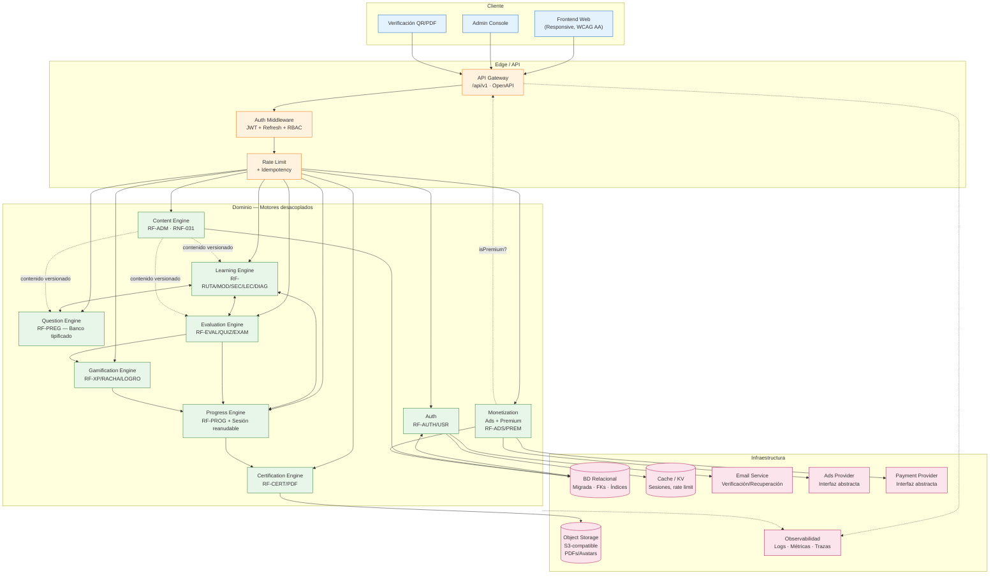
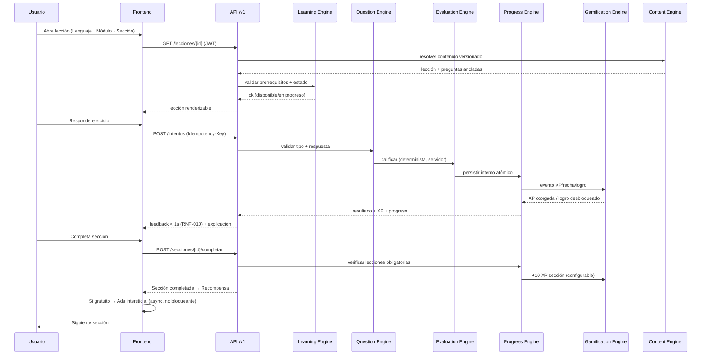
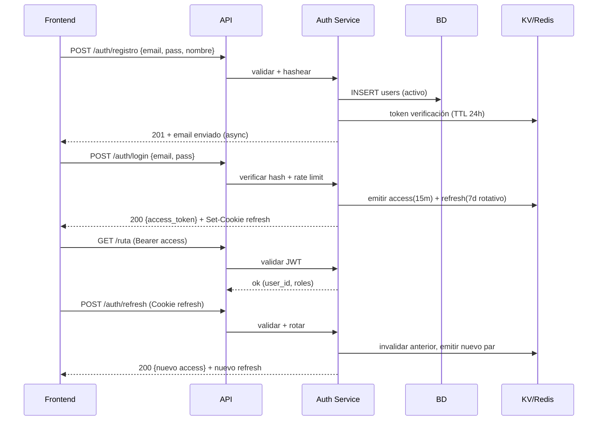
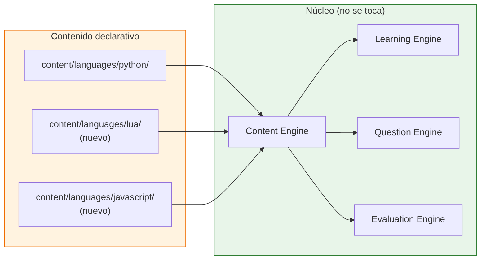

# 11 — Arquitectura del Sistema

> **Estado:** En planificación · **Versión del documento:** 1.0.0 · **Fecha:** 2026-08-29
> Complementa a `01_PROJECT_OVERVIEW.md` §24–§31, `03_OBJECTIVES.md` §6 (OT-01 a OT-04), `04_SCOPE.md` §5 y §9, `05_FUNCTIONAL_REQUIREMENTS.md` (128 RF) y `06_NON_FUNCTIONAL_REQUIREMENTS.md` (RNF-005/006/030–032). No duplica su contenido; lo materializa en decisiones, componentes y flujos verificables. El detalle de datos, API y cada motor se expande en `12_DATABASE_DESIGN.md`, `13_API_SPECIFICATION.md`, `14_LEARNING_SYSTEM.md`, `15_QUIZ_EXAM_SYSTEM.md`, `16_GAMIFICATION.md`, `17_CERTIFICATION.md`, `18_MONETIZATION.md`, `23_CONTENT_SPECIFICATION.md` y `25_ADMIN_SYSTEM.md`.

---

## 1. Propósito y alcance

Este documento define **cómo está estructurado el sistema**, no qué hace (ver `05`). Es la referencia para:

- Separar responsabilidades y evitar acoplamiento prohibido (`06` RNF-030/031).
- Garantizar que agregar un lenguaje es solo contenido + config (`06` RNF-006, `03` OT-03).
- Permitir escalado horizontal sin re-arquitectura (`06` RNF-005).
- Servir como base para `12` (datos), `13` (API), `14`–`18` (motores) y `21_DEPLOYMENT.md`.

**Fuera de alcance:** el esquema exacto de tablas (`12`), el contrato OpenAPI (`13`) y la especificación pedagógica del contenido (`23`). Aquí se definen los límites y contratos entre componentes.

**Principio rector:** arquitectura modular, desacoplada y escalable. Ningún texto de lección ni pregunta vive en el código del motor (`01` §31).

---

## 2. Visión general

### 2.1 Estilo arquitectónico

| Decisión | Elección recomendada | Justificación |
|---|---|---|
| Estilo | **Modular monolito con fronteras explícitas** en MVP; preparado para extraer servicios sin reescribir | Ver §13.1 — un monolito modular reduce complejidad operativa en MVP (un deploy, una BD) y cumple `RNF-005` (stateless + réplicas) sin el costo de microservicios prematuros. |
| Comunicación interna | Llamadas en proceso vía **interfaces/puertos** (ports & adapters) | Permite extraer un motor a servicio independiente cambiando el adaptador, no el núcleo. |
| Comunicación externa | **API REST versionada** (`/api/v1`) + JSON | Ver `03` OT-04 y `06` RNF-032; estándar, cacheable y documentable con OpenAPI. GraphQL queda como Post-MVP solo si `26_ANALYTICS.md` demuestra necesidad de agregaciones complejas. |
| Estado de sesión | **Stateless** (JWT corto + refresh rotativo) | Permite balanceo sin sticky sessions (`RNF-005`). Sesión en memoria local es un defecto bloqueante. |

> Alternativa descartada en MVP: microservicios por motor. Se adopta solo si métricas de `21`/`26` muestran que un motor (ej. Evaluation) es cuello de botella aislado y justifica el costo operativo. La frontera modular ya deja esa puerta abierta.

### 2.2 Capas

```
┌─────────────────────────────────────────────────────────────────┐
│                        CAPA DE PRESENTACIÓN                      │
│  Frontend (Web responsive) · Admin Console · Verificación QR     │
├─────────────────────────────────────────────────────────────────┤
│                          CAPA DE API                            │
│  API Gateway / REST v1 · Auth middleware · Rate limiting ·      │
│  Validación · Idempotency-Key · Versionado de contenido         │
├─────────────────────────────────────────────────────────────────┤
│                         CAPA DE DOMINIO                         │
│  Auth · Learning Engine · Question Engine · Evaluation Engine   │
│  Progress Engine · Gamification Engine · Certification Engine   │
│  Content Engine · Monetization (Ads + Premium)                  │
├─────────────────────────────────────────────────────────────────┤
│                      CAPA DE INFRAESTRUCTURA                     │
│  BD relacional · Almacenamiento de objetos (PDF/avatars)        │
│  Cola de email · Proveedor de anuncios (abstracto)              │
│  Pasarela de pagos (abstracta) · Cache/Rate-limit store         │
│  Observabilidad (logs, métricas, trazas)                        │
└─────────────────────────────────────────────────────────────────┘
```

### 2.3 Diagrama de arquitectura (Mermaid)



### 2.4 Diagrama de flujo de datos — sesión de aprendizaje



---

## 3. Frontend

### 3.1 Responsabilidad

Renderizar la experiencia de aprendizaje, catálogo, perfil, ruta, verificación pública y administración. **No contiene lógica de evaluación ni de certificación**; toda decisión de aprobación/XP se toma en servidor (`05` RF-EVAL-006, `06` RNF-033/034).

### 3.2 Decisiones justificadas (Stack Oficial)

| Aspecto | Tecnología Seleccionada | Justificación |
|---|---|---|
| **Framework** | **Next.js (App Router, TypeScript)** | Monorepo Turborepo con contratos `@codequest/types`. Ofrece SEO nativo con SSG/ISR para el catálogo y verificación de certificados (`/verificar/[code]`) con OpenGraph dinámico para compartir en LinkedIn/redes, y componentes interactivos (`"use client"`) para lecciones. |
| **Render** | **Híbrido (SSG/ISR en páginas públicas + SPA en `/app/*`)** | Carga inicial $< 1.5\text{ s}$ en 4G (`RNF-011`); renderizado SEO optimizado en landing, catálogo de lenguajes y verificación de certificados. |
| **Estado y Caché** | **Zustand (local UI) + TanStack Query (Server Cache)** | Gestión ligera de modales, racha y stepper con Zustand; sincronización, revalidación y caché de lecciones y progreso con TanStack Query. |
| **Estilos & UI** | **Tailwind CSS + Shadcn UI** | Sistema de diseño basado en *tokens* cromáticos y tipográficos (`27_UI_UX_SPECIFICATION.md`), foco accesible y cumplimiento WCAG 2.1 AA (`RNF-026`). |
| **Interactividad y Mascota** | **PixiJS (v7 WebGL)** | Mascota interactiva (**🦊 Koda**), reacciones emocionales en tiempo real y partículas de confeti aceleradas por hardware sin penalizar el hilo principal. |
| **Editor de Código Multi-Lenguaje** | **Monaco Editor / CodeMirror 6** | Soporte universal nativo de resaltado, auto-completado y sintaxis para **+50 lenguajes** (Lua, Python, Rust, C, C++, C#, Go, JS/TS, SQL, etc.). |
| **Ejecución de Código en Cliente** | **WebAssembly (wasmoon para Lua, Pyodide para Python, Workers)** | Ejecución de scripts en el navegador con latencia $< 15\text{ ms}$ y coste de cómputo en servidor $0. |

### 3.3 Módulos del frontend (Plantilla Universal Dinámica)

| Módulo | Ruta Next.js | RF principal | Notas |
|---|---|---|---|
| Auth | `/login`, `/registro`, `/recuperar`, `/verificar` | RF-AUTH-* | Mensajes accesibles `RNF-022`, rate limit visible |
| Onboarding | `/lenguajes`, `/nivel`, `/diagnostico` | RF-LANG/LVL/DIAG | Recomendación explicada (`RF-DIAG-003`) |
| Ruta (Roadmap) | `/ruta/[lang]` | RF-RUTA/MOD, RF-CANDADO-* | Plantilla universal `<RoadmapView />` que dibuja módulos, candados y estrellas dinámicamente |
| Aprendizaje | `/aprender/[mod]/[sec]/[lec]` | RF-SEC/LEC/PREG, RF-ESTRELLA-* | Espacio de trabajo dividido 50/50, selector stepper de 10 píldoras y feedback anti-spoilers |
| Cuaderno Errores | `/cuaderno` | RF-CUADERNO-* | Práctica deliberada de errores persistentes con remediación (+5 XP) |
| Evaluación | `/quiz/[id]`, `/examen/[id]` | RF-QUIZ/EXAM/EVAL | Calificación < 2 s (`RNF-012`), compuerta de maestría ($\ge 80\%$) |
| Perfil | `/perfil`, `/perfil/logros`, `/perfil/certificados` | RF-PROF/PROG/RACHA/LOGRO | Estadísticas, racha con Koda y listado de diplomas oficiales |
| Certificado | `/certificados/[id]`, `/verificar/[id]` | RF-CERT/PDF | Verificación pública SSG/ISR con metadatos OpenGraph y descarga autenticada |
| Admin | `/admin/*` | RF-ADM-* | RBAC, auditoría, validación `RF-ADM-006` |
| Monetización | Intersticial entre secciones | RF-ADS/PREM | Wrapper abstracto async; nunca intra-ejercicio (`RF-ADS-002`) |

---

## 4. Backend

### 4.1 Responsabilidad

Exponer la API REST `/api/v1`, orquestar los 9 motores desacoplados, aplicar reglas pedagógicas/gamificadas y persistir de forma atómica en Supabase PostgreSQL.

### 4.2 Decisiones justificadas (Stack Oficial)

| Aspecto | Tecnología Seleccionada | Justificación |
|---|---|---|
| **Lenguaje / Runtime** | **Node.js (NestJS con TypeScript)** | Arquitectura modular nativa con inyección de dependencias (`@Module()`), tipado 100% compartido con Next.js vía monorepo Turborepo (`@codequest/types`), y OpenAPI generado automáticamente. |
| **Arquitectura interna** | **Monolito modular desacoplado** | Los 9 motores funcionan como módulos independientes con límites estrictos de importación; escalable horizontalmente y extraíble a microservicios si se requiere. |
| **Validación y DTOs** | **Zod / class-validator + DTOs estrictos** | Validación estricta en servidor de entradas antes de llegar a los motores (`RNF-009`, `RNF-036`). |
| **Autenticación** | **JWT Stateless (15 min) + Refresh rotativo en HttpOnly Cookie** | Stateless para escalabilidad (`RNF-005`); refresh rotativo con detección de reuso mitiga robo de token (`19_SECURITY.md`). |
| **Motor de Ejecución Multi-Lenguaje** | **Interfaz `ICodeRunner` (Wasm + Sandbox Judge0/Piston)** | Ejecución cliente (Wasm) para Lua/Python/JS; delegación a sandbox seguro (Judge0 / Piston en Docker) para lenguajes compilados (Rust, C, C++, C#, Go). |
| **Concurrencia y Transacciones** | **Transacciones ACID en Supabase PostgreSQL + Colas Async** | Integridad absoluta en otorgamiento de XP y estrellas (`RNF-033`); tareas pesadas de subida a Google Drive no bloquean la respuesta HTTP. |

### 4.3 Estructura de carpetas (backend NestJS monolito modular)

```
src/
├── modules/
│   ├── auth/               # RF-AUTH/USR — hash Argon2id, tokens JWT, RBAC
│   ├── users/              # RF-USR/PROF — perfil, avatar, preferencias
│   ├── languages/          # RF-LANG — catálogo de lenguajes (Lua, Python, etc.)
│   ├── learning/           # RF-LVL/DIAG/RUTA/MOD/SEC/LEC — candados y roadmap
│   ├── questions/          # RF-PREG — banco versionado (11 tipos polimórficos)
│   ├── evaluation/         # RF-EVAL/QUIZ/EXAM — evaluador determinista en servidor
│   ├── progress/           # RF-PROG, RF-ESTRELLA-* — estrellas y desbloqueos
│   ├── notebook/           # RF-CUADERNO-* — cuaderno de errores persistente
│   ├── gamification/       # RF-XP/RACHA/LOGRO — economía XP, niveles y rachas
│   ├── certification/      # RF-CERT/PDF — generación PDF + Google Drive API
│   ├── runner/             # ICodeRunner — integración Judge0 / Piston / Wasm
│   ├── monetization/       # RF-ADS/PREM — Ads/Pay adapters
│   └── content/            # RF-ADM — Content Engine y validación declarativa
├── common/
│   ├── dto/                # DTOs compartidos (@codequest/types)
│   ├── guards/             # AuthGuard, RolesGuard, RateLimitGuard
│   ├── interceptors/       # RequestIdInterceptor, IdempotencyInterceptor
│   └── config/             # Configuración versionada de umbrales y XP
├── infra/
│   ├── db/                 # Supabase PostgreSQL (Prisma / Drizzle ORM)
│   ├── storage/            # GoogleDriveStorageService (Service Account)
│   ├── email/              # EmailAdapter (Resend / SendGrid)
│   ├── ads/                # AdsAdapter abstracto
│   └── cache/              # Redis (rate limiting y caché de contenido)
└── main.ts / app.module.ts
```

> Regla de dependencia (`06` RNF-030): un import directo de `gamification` hacia `evaluation` está **prohibido**. El flujo canónico es `evaluation → progress → gamification`.

---

## 5. Base de datos y Almacenamiento

### 5.1 Responsabilidad

Persistencia autoritativa (source of truth) de usuarios, progreso, estrellas, candados, intentos, XP, cuaderno de errores y diplomas oficiales.

### 5.2 Decisiones justificadas

| Aspecto | Tecnología Seleccionada | Justificación |
|---|---|---|
| **Base de Datos Principal** | **Supabase (PostgreSQL 15+)** | Soporte nativo de transacciones ACID, tipos `JSONB` para preguntas polimórficas, triggers PL/pgSQL para recálculo de maestría y desbloqueo de módulos, e índices para consultas $p95 < 100\text{ ms}$ (`RNF-007`). |
| **ORM / Acceso a Datos** | **Prisma ORM o Drizzle ORM** | Tipado estricto end-to-end con TypeScript, migraciones versionadas y consultas optimizadas. |
| **Almacenamiento de Certificados (PDF)** | **Google Drive API v3 (Service Account)** | Guardado automático 100% en backend en carpetas organizadas (`CodeQuest_Certificados/{lang}/`). Caching por `google_drive_file_id` para evitar re-generaciones y entrega mediante streaming autenticado. |
| **Caché y Rate Limiting** | **Redis** | Rate limit en ventanas deslizantes y caché de contenido publicado sin sobrecargar la base de datos. |

### 5.3 Entidades principales (resumen — detalle en `12_DATABASE_DESIGN.md`)

```
users ──< user_languages ──> languages ──< modules ──< sections ──< lessons
  │              │                │            │           │         └─< lesson_questions >── questions (versionadas)
  │              │                │            └─< quizzes / exams >── exam_compositions
  │              └─< attempts >───┴─< attempts_questions (respuesta, acierto, versión) 
  │              └─< progress (usuario×lenguaje×módulo×sección×lección) 
  │              └─< xp_events (usuario, acción, XP, ref, fecha)
  │              └─< streak_days (usuario, fecha, actividad)
  │              └─< user_achievements (usuario×logro, fecha)
  │              └─< certificates (usuario×lenguaje, ID CQ-*, versión, estado)
  │              └─< subscriptions (usuario, estado activa/expirada/cancelada)
  └─< audit_log (quién, qué, cuándo, versión anterior/nueva)  ← RF-ADM-008
```

### 5.4 Reglas

- Toda FK con `ON DELETE RESTRICT` salvo anonimizaciones (`RF-USR-003`); huérfanos son defecto bloqueante (`RNF-036`).
- Índices obligatorios: `(user_id, language_id, module_id)` para progreso; `(user_id, created_at)` para intentos; `(language_id, seq)` para certificados.
- Cada `attempt` guarda `content_version_id` y `threshold_applied` (`RNF-035`, `05` RF-EVAL-005).
- `Idempotency-Key` único por usuario + endpoint con TTL 24 h (`RNF-042`).

---

## 6. API

### 6.1 Responsabilidad

Contrato estable entre frontend y backend. Versionada, autenticada y documentada.

### 6.2 Decisiones justificadas

| Aspecto | Opciones | Recomendación | Por qué |
|---|---|---|---|
| Estilo | REST / GraphQL / gRPC | **REST** | `03` OT-04; cacheable, simple, OpenAPI maduro. gRPC solo interno si se extraen servicios Post-MVP. |
| Versionado | URL (`/v1`) / header / media type | **URL `/api/v1`** | Explícito, fácil de rutear y cachear; breaking change exige `/v2`. |
| Documentación | OpenAPI / manual | **OpenAPI 3.1 auto-generado + lint en CI** | `RNF-032` — contrato que falla el build si se rompe. |
| Auth | Bearer JWT / cookies | **Bearer JWT (access) + httpOnly cookie (refresh)** | Stateless + rotativo; CSRF solo aplica si se usan cookies para mutaciones — se mitiga con `SameSite` + `CSRF token` donde aplique. |
| Paginación | offset / cursor | **Cursor para historiales; offset para catálogos pequeños** | `RNF-003` — ningún listado > 100 ítems sin paginación. |
| Errores | Envelope estándar | **Envelope `{ code, message, request_id, details? }`** | `RNF-041` — nunca stack traces al cliente. |

### 6.3 Grupos de endpoints (resumen — detalle en `13_API_SPECIFICATION.md`)

| Grupo | Prefijo | Auth | RF principal |
|---|---|---|---|
| Auth | `/auth` | mixto | RF-AUTH-* (registro, login, refresh, logout, recuperar, verificar) |
| Users/Profile | `/users`, `/profile` | JWT | RF-USR/PROF |
| Languages | `/languages` | JWT | RF-LANG |
| Learning | `/languages/{id}/modules`, `/sections`, `/lessons`, `/ruta`, `/diagnostico` | JWT | RF-LVL/DIAG/RUTA/MOD/SEC/LEC |
| Questions | `/questions` (admin) | RBAC | RF-PREG/ADM |
| Evaluation | `/quizzes`, `/examenes`, `/intentos` | JWT | RF-QUIZ/EXAM/EVAL |
| Progress | `/progress` | JWT | RF-PROG |
| Gamification | `/gamification/xp`, `/rachas`, `/logros` | JWT | RF-XP/RACHA/LOGRO |
| Repaso | `/repaso` | JWT | RF-REP |
| Certificates | `/certificados`, `/verificar` | JWT / público para verificar | RF-CERT/PDF |
| Monetization | `/ads`, `/subscriptions` | JWT | RF-ADS/PREM |
| Admin/Content | `/admin/*` | RBAC admin | RF-ADM-* |

### 6.4 Reglas transversales de la API

- `request_id` (UUID) en cada request/response para correlación (`RNF-045`).
- `Idempotency-Key` obligatorio en `POST /intentos`, `/quizzes/*/enviar`, `/examenes/*/enviar` (`RNF-042`).
- Rate limiting por IP + usuario en `POST /auth/*` y `POST /intentos` (`RF-AUTH-006`).
- `Cache-Control` en `GET /lecciones` y `GET /languages` con `ETag` por `content_version`.

---

## 7. Sistema de autenticación

| Aspecto | Especificación | RF/RNF |
|---|---|---|
| Registro | Email + contraseña + nombre visible; validación de formato y fortaleza; unicidad de email con mensaje genérico | RF-AUTH-001, RNF-041 |
| Hash | Función adaptativa (Argon2id o bcrypt con factor calibrado); nunca en claro ni en logs | RNF-008 |
| Login | Emite `access_token` (15 min) + `refresh_token` (rotativo, 7 días, httpOnly, Secure, SameSite=Lax) | RF-AUTH-002 |
| Refresh | Silencioso durante lección activa; no obliga a re-login (`RNF-023`); refresh usado se invalida | RF-AUTH-007 |
| Logout | Invalida refresh en servidor (lista de revocados en KV con TTL) | RF-AUTH-003 |
| Recuperación | Token de un solo uso, expiración corta (≤ 1 h), límite de intentos, mensaje genérico exista o no el email | RF-AUTH-004 |
| Verificación | Email de verificación al registrarse; no bloquea aprendizaje, sí bloquea `RF-CERT-001` | RF-AUTH-005 |
| Rate limiting | Ventana deslizante en KV; 5 intentos/min por IP en login; backoff exponencial | RF-AUTH-006, RNF-009 |
| Auditoría | `audit_log` con evento, marca temporal `America/Bogota`, IP anonimizada, sin PII en logs | RF-AUTH-008, RNF-018 |
| Estados de usuario | `activo`, `pendiente_verificacion`, `bloqueado` | RF-USR-004 |

**Flujo de autenticación (Mermaid):**



---

## 8. Motor de aprendizaje (Learning Engine)

**Responsabilidad:** decidir **qué** contenido ve el usuario y **cuándo**; registrar avance y desbloquear.

| Función | Entrada | Salida | RF |
|---|---|---|---|
| Onboarding | `nivel_declarado` + `diagnóstico` | `módulo/sección de inicio` recomendada (sugerida, no impuesta) | RF-LVL-003, RF-DIAG-003 |
| Ruta | `historial` + `exámenes aprobados` + `config de orden` | Ruta con estados `bloqueado/disponible/en progreso/aprobado` | RF-RUTA-001/002 |
| Prerrequisitos | `estado de módulos` | Bloqueo/desbloqueo del siguiente módulo; respeta punto de entrada adaptativo | RF-RUTA-004 |
| Progresión de lección | `lección actual` + `progreso intra-lección` | Siguiente lección/ejercicio; `sección completada` solo si obligatorios finalizados | RF-LEC-001/004, RF-SEC-003 |
| Reanudación | `user_id` + `language_id` | Posición exacta `módulo/sección/lección/ejercicio` | RF-RUTA-005, RF-LEC-002 |
| Repaso (orquestación) | `historial de errores` + `evaluación` | Solicita a `Evaluation Engine` conceptos débiles; delega generación a `Question Engine` | RF-REP-001/002, RF-RUTA-003 |

**Reglas:**

- Nunca aprueba un módulo; solo `Evaluation Engine` lo hace (`RNF-030`).
- Lee contenido únicamente vía `Content Engine` (versión vigente); no hardcodea IDs de módulos.
- Recalcula recomendaciones tras cada intento sin bloquear el feedback (< 1 s).

---

## 9. Motor de preguntas (Question Engine)

**Responsabilidad:** almacenar, versionar y entregar preguntas tipificadas ancladas al contenido.

| Capacidad | Detalle | RF |
|---|---|---|
| Tipos soportados | Selección múltiple, V/F, completar código/línea, predecir output, identificar errores, ordenar líneas, seleccionar código correcto, relacionar conceptos, escribir código (evaluado sin runner en MVP), resolver pequeños problemas | RF-PREG-001 |
| Metadatos | `lenguaje, módulo, sección, lección, tipo, dificultad, categoría, respuestas válidas, explicación, puntaje, versión` | RF-PREG-002 |
| Entrega | Anclada a lección/sección actual; nunca aleatoria global | RF-PREG-003 |
| Validación | En servidor, inmediata, con explicación y XP | RF-PREG-004 |
| Registro | Cada intento con `usuario, pregunta, respuesta, resultado, timestamp, versión` | RF-PREG-005 |
| Versionado | Editar crea nueva versión; intentos históricos conservan versión original | RF-PREG-006, RNF-035 |
| Aleatorización | Orden de opciones mezclable manteniendo trazabilidad | RF-PREG-007 |

**Contrato interno:**

```ts
// Pseudocódigo del contrato — no es implementación cerrada
interface QuestionEngine {
  getQuestionsForLesson(lessonId: string, versionId: string): Question[]
  getQuestionsForQuiz(moduleId: string, composition: Composition): Question[]
  getQuestionsForExam(moduleId: string, composition: Composition): Question[]
  getReviewQuestions(userId: string, strategy: ReviewStrategy): Question[]
  validateAnswer(questionId: string, answer: Answer): ValidationResult
}
```

---

## 10. Motor de evaluación (Evaluation Engine)

**Responsabilidad:** calificar de forma **determinista, auditable y en servidor**.

| Función | Detalle | RF/RNF |
|---|---|---|
| Cálculo | Puntaje, %, aciertos/errores, desglose por pregunta y por tipo | RF-EVAL-001/002 |
| Aprobación | Compara % contra umbral vigente al momento del intento (Quiz 70% / Examen 80% iniciales, configurables) | RF-QUIZ-003, RF-EXAM-003, RF-EVAL-005 |
| Registro | `usuario, módulo, puntaje, %, umbral_aplicado, fecha, versión_contenido` inmutable | RF-EVAL-003, RNF-035 |
| Bajo rendimiento | Identifica conceptos/temas con bajo rendimiento para repaso y adaptación | RF-EVAL-004 |
| Invariante | Calificación nunca depende del cliente; el servidor recalcula y prevalece | RF-EVAL-006 |
| Composición | Quiz/Examen se componen según distribución configurable por `Content Engine` | RF-QUIZ-001, RF-EXAM-002 |
| Reintentos | Quiz y examen permiten reintentos ilimitados; desbloqueo exige un intento aprobado, no promedio | RF-QUIZ-005, RF-EXAM-005 |
| Rendimiento | Resultado < 2 s p95 (`RNF-012`); evaluación no bloquea persistencia de progreso | RNF-012, RNF-033 |

**Flujo:**

```
Preguntas (versión) → Respuestas del usuario → Evaluation Engine
  → { puntaje, %, detalle_por_pregunta, conceptos_débiles, aprobado: bool, umbral_aplicado }
  → Progress Engine (persistir) + Gamification Engine (XP) + Learning Engine (desbloqueo)
```

---

## 11. Motor de gamificación (Gamification Engine)

**Responsabilidad:** motivar sin distorsionar la evaluación.

| Función | Detalle | RF |
|---|---|---|
| XP | Otorga XP por acciones configurables (ej. sección +10, ejercicio +5, quiz +25, examen +100, módulo +150 — valores iniciales de `01` §17, configurables sin deploy) | RF-XP-001/004 |
| Nivel | Deriva nivel de XP acumulada con curva configurable determinista | RF-XP-002 |
| Historial XP | Por evento: `acción, XP, ref, fecha` | RF-XP-003 |
| Idempotencia | Reintentos no duplican XP fuera de regla; validado en servidor | RF-XP-005, RNF-042 |
| Rachas | +1 por día con actividad válida; reinicio a 0 si día sin actividad; corte por zona horaria explícita del usuario; ventana de gracia configurable | RF-RACHA-001/002/004 |
| Exposición rachas | `racha_actual` y `racha_máxima` + historial diario | RF-RACHA-003/005 |
| Logros | Catálogo con `ID, nombre, descripción, icono, condición`; desbloqueo automático, una sola vez, con fecha | RF-LOGRO-001/002/005 |
| Configuración | Nuevos logros sin tocar el motor (vía Content/Admin) | RF-LOGRO-004 |

**Eventos que dispara:**

| Evento | XP | Logro potencial |
|---|---|---|
| Ejercicio correcto | +5 | FIRST CODE |
| Sección completada | +10 | — |
| Quiz completado/aprobado | +25 / bonificación | — |
| Examen aprobado | +100 | — |
| Módulo aprobado | +150 | FIRST MODULE / PYTHON BEGINNER |
| Racha 7 días | — | ON FIRE |
| Todos los módulos de un lenguaje | — | CODE MASTER |
| Dos lenguajes completados | — | MULTI LANGUAGE |

---

## 12. Motor de certificación (Certification Engine)

| Función | Detalle | RF |
|---|---|---|
| **Condición** | 12/12 módulos aprobados con examen $\ge 80\%$, umbral de estrellas y email verificado | RF-CERT-001, `04` §7 |
| **Datos Oficiales** | Titular, documento, lenguaje, fecha America/Bogota, ID correlativo `CQ-{LANG}-{SEQ}`, código QR y aclaración normativa | RF-CERT-002 |
| **ID Correlativo** | `CQ-{LANG}-{SEQ}` ej. `CQ-LUA-000001`, `CQ-PY-000001` generado atómicamente con lock en Supabase | RF-CERT-003 |
| **Generación 100% Backend** | Renderizado PDF server-side en NestJS (`@react-pdf/renderer` o `pdfkit` + `qrcode`) con sello y firma digital de la plataforma | RF-PDF-001 |
| **Detección Previa y Caching** | El backend verifica si ya existe un certificado emitido con `google_drive_file_id`. Si ya existe, **no se re-genera**; se sirve directamente por streaming | RF-PDF-003 |
| **Almacenamiento en Google Drive** | Subida automática mediante Google Drive API v3 con Cuenta de Servicio (*Service Account*) en carpeta `CodeQuest_Certificados/{lang}/` | RF-PDF-004 |
| **Descarga Autenticada y Streaming** | Endpoint `GET /api/v1/certificates/{id}/pdf` exclusivo para el titular; transmite el binario por streaming seguro desde Google Drive | RF-PDF-002 |
| **Verificación Pública** | Por ID/QR (`/verificar/{code}`): valida autenticidad, lenguaje y fecha enmascarando documento (`CC ***678`) sin exponer PII | RF-CERT-006 |
| **Re-emisión por Contenido** | Cambio significativo de contenido marca el certificado como `obsolete`; exige revalidación y genera nuevo correlativo | RF-CERT-005 |

```
Flujo de Certificación en Backend (NestJS CertificationModule):

1. Solicitud del usuario (GET /certificates/{id}/pdf o POST /certificates:issue)
2. Validar elegibilidad (C-01..C-07 en Supabase PostgreSQL)
3. ¿Ya existe certificado 'valid' con google_drive_file_id en Supabase?
   ├── SÍ (Caché activo):
   │     └── Obtener stream de Google Drive API (files.get alt=media) → Pipe a HTTP Response (Descarga directa <200ms)
   └── NO (Primera emisión):
         ├── Asignar correlativo atómico en Supabase (CQ-LUA-000001)
         ├── Renderizar PDF + QR code en servidor Node.js
         ├── Subir binario a Google Drive API v3 vía Service Account
         ├── Obtener google_drive_file_id y calcular SHA-256
         ├── Guardar registro en Supabase (certificates)
         └── Pipe del PDF generado a HTTP Response
```

---

## 13. Sistema de publicidad

| Regla | Especificación | RF/RNF |
|---|---|---|
| Audiencia | Solo usuarios gratuitos | RF-ADS-001 |
| Ubicación | Solo entre secciones: `Sección completada → Recompensa → Publicidad → Siguiente sección` (`01` §23) | RF-ADS-001 |
| Invariante | Nunca durante ejercicio/quiz/examen (`04` §8) | RF-ADS-002, `03` OUX-07 |
| Carga | Asíncrona, no bloqueante; fallo del proveedor no impide continuar (degradado) | RF-ADS-003, RNF-014 |
| Métricas | Solo impresiones/clics esenciales; sin fingerprinting ni cross-site | RF-ADS-004, RNF-039/040 |
| Abstracción | Interfaz `AdsProvider { loadAd(ctx): Ad | null }`; sin hardcodear red concreta | RF-ADS-005 |
| Premium | `isPremium(user)` en gateway decide si se sirve el slot | RF-PREM-005 |

```ts
// Contrato abstracto — implementación intercambiable
interface AdsProvider {
  loadAd(context: { userId: string, sectionId: string }): Promise<Ad | null>
  reportImpression(adId: string): Promise<void>
}
```

---

## 14. Sistema premium

| Función | Detalle | RF |
|---|---|---|
| Oferta | USD $1/mes inicial, precio configurable sin deploy | RF-PREM-001 |
| Estados | `activa`, `expirada`, `cancelada` (`04` §8) | RF-PREM-002 |
| Efecto | Elimina toda publicidad de forma inmediata; sin contenido exclusivo en MVP (`04` §8) | RF-PREM-005, `04` §8 |
| Conservación | Cambio de plan no borra progreso/XP/rachas/logros | RF-PREM-003 |
| Pagos | Interfaz `PaymentProvider`; sin hardcodear Stripe/PayPal; sin almacenar tarjetas en el núcleo | RF-PREM-004, RNF-037 |
| Auditoría | Eventos de facturación/suscripción registrados sin PII sensible | RF-PREM-006 |
| Verificación | Webhook del proveedor → `subscriptions` con idempotencia; grace period configurable | — |

```ts
interface PaymentProvider {
  createCheckout(userId: string, planId: string): Promise<CheckoutUrl>
  handleWebhook(event: RawEvent): Promise<SubscriptionEvent>
  cancelSubscription(subscriptionId: string): Promise<void>
}
```

---

## 15. Sistema de contenido (Content Engine)

**Es el pilar de `01` §31, `03` OT-02/OT-03 y `06` RNF-006/031.**

| Capacidad | Detalle | RF |
|---|---|---|
| CRUD | Lenguajes, módulos, secciones, lecciones con validación `Lenguaje → Módulo → Sección → Lección` | RF-ADM-001 |
| Banco | Preguntas con tipos, dificultad, respuestas, explicaciones, versionado | RF-ADM-002, RF-PREG-006 |
| Publicación | Publicar/ocultar sin deploy, inmediato o programado | RF-ADM-003 |
| Configuración | Umbrales, XP, orden de módulos, composición de quizzes/exámenes sin código | RF-ADM-004 |
| Versionado | Todo contenido publicado versionado; intentos guardan versión evaluada | RF-ADM-005, RNF-035 |
| Validación | IDs únicos, prerrequisitos sin ciclos, referencias íntegras, tipos válidos — bloquea publicación si falla | RF-ADM-006, RNF-036 |
| RBAC | Solo `admin` autenticado; auditoría `quién/qué/cuándo/versión` | RF-ADM-007/008 |
| Flujo Post-MVP | `borrador → revisión → publicado` con roles autor/revisor/publicador | RF-ADM-009 |

**Formato de contenido:** declarativo versionado (ej. JSON/YAML validado por esquema) consumido por `Content Engine` y cacheado en KV tras publicación. El frontend nunca hardcodea textos.

```
content/
├── languages/
│   ├── python/
│   │   ├── manifest.json        # { id, nombre, orden, estado, version }
│   │   ├── modules/
│   │   │   ├── 01_fundamentos/
│   │   │   │   ├── module.json
│   │   │   │   ├── sections/
│   │   │   │   └── quizzes/
│   │   │   └── 02_variables/
│   │   └── config/
│   │       ├── thresholds.json  # { quiz: 70, exam: 80 }
│   │       ├── xp.json
│   │       └── compositions.json
│   └── lua/                     # ← nuevo lenguaje = nuevo directorio
└── achievements/
    └── catalog.json
```

---

## 16. Separación de responsabilidades

| Componente | Responsable de | No responsable de | Depende de |
|---|---|---|---|
| **Frontend** | Render, navegación, accesibilidad, reanudación visual | Calificación, XP, certificación | API |
| **API Gateway** | Versionado, auth, rate limit, `request_id`, idempotencia, cache | Reglas de negocio | Motores |
| **Auth** | Identidad, hash, tokens, RBAC, auditoría | Contenido, evaluación | BD, KV, Email |
| **Learning Engine** | Ruta, prerrequisitos, recomendación, reanudación | Calificar, otorgar XP | Content, Evaluation, Progress |
| **Question Engine** | Banco, versionado, entrega anclada | Calificar, progresar | Content, BD |
| **Evaluation Engine** | Calificar, umbrales, desglose, conceptos débiles | Persistir progreso, XP | Question, Content |
| **Progress Engine** | Persistencia atómica, % por lenguaje/módulo, historial | Calificar, gamificar | BD |
| **Gamification Engine** | XP, niveles, rachas, logros | Calificar, certificar | Progress, Config |
| **Certification Engine** | Condición, ID `CQ-*`, QR, PDF, verificación | Enseñar, evaluar | Progress, Storage |
| **Monetization** | Ads (gratuito) / Premium (sin ads) + pagos abstractos | Contenido, evaluación | Ads/Pay providers |
| **Content Engine** | CRUD, versionado, validación, publicación, config | Calificar, progresar | BD, KV |

> Test de arquitectura en CI: el grafo de imports debe respetar esta tabla. Cualquier dependencia inversa es defecto.

---

## 17. Flujos de datos principales

### 17.1 Registro → Diagnóstico → Ruta

```
Registro (RF-AUTH-001) → Verificación email (async)
  → Selección lenguaje (RF-LANG-002)
  → Declaración nivel (RF-LVL-001)
  → Diagnóstico (RF-DIAG-001/002)
  → Recomendación Learning Engine (RF-DIAG-003 + RF-RUTA-001)
  → Ruta visualizada (RF-RUTA-002)
```

### 17.2 Lección → Evaluación → Progreso → Gamificación

```
Lección (Content Engine) → Pregunta (Question Engine, anclada)
  → Respuesta → Evaluation Engine (servidor, < 1s)
  → Progress Engine (atómico, Idempotency-Key)
  → Gamification Engine (XP/racha/logro, si aplica)
  → Frontend (feedback + recompensa)
  → Si sección completada → Monetization decide Ads (gratuito) o nada (premium)
```

### 17.3 Quiz / Examen → Desbloqueo

```
Quiz/Examen compuesto (Content config + Question Engine)
  → Envío → Evaluation Engine (umbral vigente, < 2s)
  → Progress Engine (intento inmutable + versión)
  → Si aprobado → Learning Engine desbloquea siguiente módulo
  → Si reprobado → Revisión + Repaso sugerido, módulo sigue bloqueado
```

### 17.4 Certificación

```
¿Todos los exámenes aprobados? (Progress Engine)
  → ¿Email verificado? (Auth)
  → Certification Engine genera ID CQ-{LANG}-{SEQ} + QR
  → Render PDF (plantilla versionada) → Object Storage
  → Verificación interna por ID/QR (pública Post-MVP)
```

---

## 18. Cómo agregar un nuevo lenguaje sin modificar el núcleo

Este es el requisito `03` OT-03, `04` §10.3 y `06` RNF-006. El diseño lo garantiza por construcción:

### 18.1 Principio

> **Agregar un lenguaje = agregar contenido + configuración.** Cero cambios en `src/modules/*` del motor.

El motor nunca contiene `if (language === 'python')`. Todo lo específico del lenguaje vive en `content/languages/{id}/`.

### 18.2 Procedimiento (ejemplo: agregar Lua)

| Paso | Acción | Responsable | Artefacto | Toca código del motor |
|---|---|---|---|---|
| 1 | Crear directorio `content/languages/lua/` | Autor de contenido | `manifest.json` con `{ id: "lua", nombre: "Lua", orden: 2, estado: "disponible" }` | No |
| 2 | Definir módulos en orden pedagógico | Pedagógico + ADM | `modules/01_fundamentos/module.json`, `02_variables/...` (12 módulos o los que aplique) | No |
| 3 | Crear secciones y lecciones | Autor | `sections/*/section.json` + `lessons/*/lesson.json` con explicación/ejemplo | No |
| 4 | Cargar banco de preguntas tipificadas | Autor | `questions/*.json` con `tipo, dificultad, respuestas, explicación, puntaje` | No |
| 5 | Configurar composición de quizzes/exámenes | ADM | `config/compositions.json` | No |
| 6 | Configurar umbrales y XP (hereda defaults si no se especifica) | ADM | `config/thresholds.json`, `config/xp.json` | No |
| 7 | Validar coherencia | Content Engine | `POST /admin/content/validate` → verifica IDs únicos, prerrequisitos sin ciclos, referencias íntegras (`RF-ADM-006`) | No |
| 8 | Publicar | ADM | `POST /admin/content/publish` → crea `content_version` nueva, cachea en KV, sin deploy | No |
| 9 | Verificar en `staging` | QA | Ruta Lua visible, diagnóstico Lua, progreso aislado por lenguaje (`RF-LANG-005`) | No |
| 10 | Activar en `prod` | ADM | Cambia `estado: disponible`; Python sigue intacto | No |

### 18.3 Qué garantiza que no se rompe

- **Validación automática** (`RF-ADM-006`) bloquea publicación con huérfanos o ciclos.
- **Ensayo `RNF-006`** en `staging` con lenguaje de prueba (Lua mínimo 1 módulo) verifica 0 cambios en motor.
- **Grep en CI** (`RNF-031`) falla si el motor contiene literales de contenido.
- **Versionado** (`RNF-035`) asegura que intentos de Python conservan su versión aunque se publique Lua.
- **Progreso por lenguaje** (`RF-LANG-005`) aísla datos; Lua no contamina Python.

### 18.4 Diagrama



---

## 19. Decisiones justificadas — tabla consolidada

| Decisión | Elección Oficial CodeQuest | Alternativa evaluada | Justificación y Ventajas |
|---|---|---|---|
| **Estilo arquitectónico** | **Monolito modular desacoplado** | Microservicios distribuidos | Menor sobrecarga operativa en MVP; fronteras limpias por motor permiten extraer módulos independientes si la carga lo demanda. |
| **Frontend** | **Next.js 14+/15 (App Router, TypeScript)** | React Vite SPA puro | SEO nativo / OpenGraph para catálogo y verificación pública de diplomas (`/verificar/[code]`) + componentes interactivos `"use client"` para lecciones. |
| **Backend** | **NestJS (TypeScript)** | FastAPI / Django / Go | TypeScript end-to-end con monorepo Turborepo (`@codequest/types`), arquitectura `@Module()` nativa para los 9 motores desacoplados y OpenAPI automático. |
| **Base de Datos** | **Supabase (PostgreSQL 15+)** | PostgreSQL auto-hospedado / MySQL | Transacciones ACID, tipos `JSONB` polimórficos, triggers PL/pgSQL de candados y plataforma gestionada de alta disponibilidad. |
| **Editor de Código** | **Monaco Editor / CodeMirror 6** | PrismJS | Soporte universal nativo de sintaxis, auto-completado y coloreado para +50 lenguajes de programación. |
| **Ejecución de Código** | **Híbrida: Wasm (Lua/Python/JS) + Judge0/Piston Sandbox** | Solo servidor | Wasm en navegador para cero latencia y costo $0 en scripting; sandbox seguro en backend para lenguajes compilados (Rust, C, C++, C#, Go). |
| **Almacenamiento PDFs** | **Google Drive API v3 (Service Account)** | S3 / MinIO / BD Blobs | Generación 100% server-side en NestJS, almacenamiento persistente en Drive y caché por `google_drive_file_id` para descarga instantánea sin re-generar. |
| **API REST** | **REST `/api/v1` + OpenAPI 3.0.3** | GraphQL | Cacheable con ETag, estándar universal para integraciones y validación por contratos en CI/CD. |
| **Auth** | **JWT Stateless (15 min) + Refresh rotativo en HttpOnly Cookie** | Sesión en BD | Escalabilidad horizontal sin estado en backend (`RNF-005`) y protección anti-XSS/CSRF. |
| **Cache / Rate Limit** | **Redis** | Memcached | Ventana deslizante para rate limiting y caché de lecciones publicadas. |
| **Contenido** | **JSON/YAML desacoplado + `content_versions`** | CMS headless | Incorporación de nuevos lenguajes como plantilla universal sin modificar código de motores ni frontend. |

> **Regla de no-asunción (`06` §2.4):** ninguna de estas elecciones se da por sentada. Cada fila con "ADR requerido = Sí" debe tener un ADR en `09-decisions/` antes de implementarse. Este documento propone, no impone.

---

## 20. Escalabilidad y rendimiento

| Objetivo | Estrategia | RNF |
|---|---|---|
| Escalado horizontal | Réplicas stateless tras balanceador; sin sticky sessions; `horizontalPodAutoscaler` o equivalente | RNF-005 |
| Contenido | Solo contenido + config para nuevo lenguaje; < 5 días-hombre de autoría | RNF-006 |
| Consultas críticas | Índices en `(user_id, language_id, module_id)` y `(user_id, created_at)`; `EXPLAIN ANALYZE` en `staging` con 100k intentos | RNF-007 |
| Latencias | p95 lección < 300 ms, feedback < 1 s, quiz/examen < 2 s; APM por endpoint | RNF-001/010/012 |
| Payloads | Paginación obligatoria; lección < 200 KB JSON; `Cache-Control` + `ETag` | RNF-003/004 |
| Degradado | Email/ads/PDF no bloquean lecciones; mensaje no bloqueante | RNF-014 |
| Disponibilidad | ≥ 99,5% mensual; backups diarios con RPO ≤ 24 h, RTO ≤ 4 h; ensayo mensual en `staging` | RNF-013/043 |

---

## 21. Seguridad transversal

Referencia completa en `19_SECURITY.md`; aquí los invariantes arquitectónicos:

- Contraseñas con función adaptativa; ningún secreto en repo ni logs (`RNF-008`).
- Validación y saneamiento en **servidor** para toda entrada; protección OWASP Top 10 (`RNF-009`).
- `request_id` + log estructurado sin PII; `401/403` genéricos sin revelar existencia de email (`RNF-041`, `RF-AUTH-006`).
- RBAC mínimo: `user` vs `admin`; `admin` requerido para `/admin/*` (`RF-ADM-007`).
- PII minimizada: solo `nombre, email, documento (para certificado), progreso` (`RNF-037`); portabilidad y eliminación (`RNF-038`).

---

## 22. Observabilidad

| Pilar | Qué | Dónde | RNF |
|---|---|---|---|
| Logs | Estructurados JSON con `request_id`, `user_id` anonimizado, `endpoint`, `content_version`, `America/Bogota` | `21_DEPLOYMENT.md` | RNF-018/045 |
| Métricas negocio | Intentos, % aprobación, racha media, DAU/WAU, certificados emitidos | `26_ANALYTICS.md` | `03` §7, `26` |
| Métricas técnicas | p50/p95/p99 por endpoint, tasa de error, uso CPU/mem, cola de email | APM + `21` | RNF-001 |
| Trazas | Por endpoint crítico (`POST /intentos`, `/examenes/*/enviar`) | OpenTelemetry opcional | RNF-018 |
| Uptime | Sintético cada minuto + RUM | `prod` | RNF-013 |
| Auditoría | `audit_log` para auth y admin (`quién/qué/cuándo/versión`) | BD | RF-AUTH-008, RF-ADM-008 |

---

## 23. Trazabilidad

| Elemento de este doc | RF (`05`) | RNF (`06`) | OE/OT (`03`) | PS (`02`) |
|---|---|---|---|---|
| Frontend + API REST | Todos | RNF-024–032 | OT-04 | PS-01/02/10 |
| Auth + JWT + RBAC | RF-AUTH/USR | RNF-008/009/037–039 | OT-06 | — |
| Learning Engine | RF-LANG/LVL/DIAG/RUTA/MOD/SEC/LEC | RNF-006/030/031 | OT-01/02/03 | PS-04/07/09 |
| Question Engine | RF-PREG | RNF-031/035/036 | OT-01 | PS-03/10 |
| Evaluation Engine | RF-EVAL/QUIZ/EXAM | RNF-010/012/033 | OT-01 | PS-05 |
| Progress Engine | RF-PROG | RNF-023/033/034 | OT-01 | PS-06 |
| Gamification Engine | RF-XP/RACHA/LOGRO/REP | — | OT-01 | PS-08 |
| Certification Engine | RF-CERT/PDF | RNF-004/043 | OE-06 | PS-06 |
| Monetization (Ads/Premium) | RF-ADS/PREM | RNF-014 | OE-07, OUX-07 | — |
| Content Engine | RF-ADM | RNF-006/017/031/035 | OT-01/02/03 | Causa estructural |
| Agregar lenguaje sin tocar núcleo | RF-LANG-004, RF-MOD-004, RF-ADM-001/006 | RNF-006/031 | OT-03 | PS-09 |

---

## 24. Riesgos y mitigaciones

| Riesgo | Impacto | Mitigación arquitectónica |
|---|---|---|
| Contenido hardcodeado en frontend/motor | Rompe `RNF-006` y `RNF-031`; agregar lenguaje exige deploy | Grep en CI + ensayo `RNF-006` + Content Engine como única fuente |
| Evaluación en cliente | Fraude de XP/certificados | `RF-EVAL-006`: calificación solo en servidor; cliente nunca decide aprobación |
| Acoplamiento entre motores | Cambio en Gamificación rompe Evaluación | Linter de grafo de imports en CI + contratos por interfaz (`RNF-030`) |
| Publicidad bloquea aprendizaje | Viola `RF-ADS-002` y `RNF-014` | Wrapper async + degradado; test de caos con ads deshabilitados |
| Certificados duplicados o falsos | Pérdida de confianza | ID `CQ-*` con lock + un vigente por lenguaje + verificación interna + PDF bit-a-bit |
| Pérdida de progreso por fallo de red | Abandono | Persistencia atómica + `Idempotency-Key` + reanudación `RNF-023/044` |
| Elección tecnológica prematura | Deuda y re-trabajo | ADRs obligatorios; este doc propone opciones, no impone stack |

---

## 25. Entregables y verificación de este documento

Un `RF` se considera arquitectónicamente cubierto cuando:

1. Su motor responsable está definido en §7–§15 con RF trazados.
2. Su contrato (API o interfaz interna) aparece en §6 o §9–§15.
3. Su invariante (ej. `RF-EVAL-006`) tiene regla en §6.4 o §17.
4. Existe un test en `20_TESTING.md` que lo ejercita (ver `05` §7).
5. La elección tecnológica que lo afecta tiene ADR en `09-decisions/` si es arquitectónica.

---

*Fin de `11_SYSTEM_ARCHITECTURE.md` — cualquier cambio arquitectónico requiere ADR en `09-decisions/`, actualización de este documento y entrada en `CHANGELOG.md` con fecha `America/Bogota`.*
