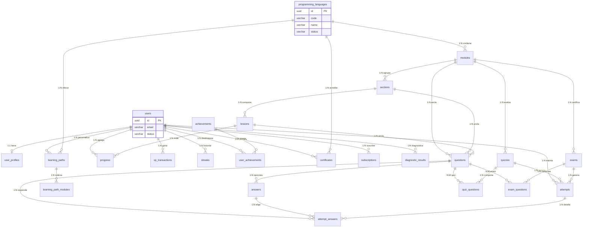

# 12 — Diseño de Base de Datos

> **Estado:** En planificación · **Versión del documento:** 1.0.0 · **Fecha:** 2026-08-29
> Complementa a `01_PROJECT_OVERVIEW.md`, `03_OBJECTIVES.md`, `04_SCOPE.md`, `05_FUNCTIONAL_REQUIREMENTS.md`, `06_NON_FUNCTIONAL_REQUIREMENTS.md`, `07_USER_STORIES.md`, `11_SYSTEM_ARCHITECTURE.md`. No duplica su contenido; lo materializa en el modelo relacional que deben implementar las migraciones versionadas. Toda decisión de motor/gestor concreto que sea arquitectónica requiere ADR en `09-decisions/`.

---

## 1. Propósito y alcance

Este documento define **qué se persiste, cómo se relaciona y con qué garantías** para el MVP descrito en `04` §2 (Python como único lenguaje disponible, arquitectura multi-lenguaje desde el día uno). Es la fuente de verdad para:

- Migraciones versionadas (`RF-ADM-005`, `RNF-035`).
- Contratos de API (`13_API_SPEC.md`): cada recurso persistido tiene reflejo en un endpoint.
- Motores `Learning`, `Question`, `Evaluation`, `Progress`, `Gamification`, `Certification` (`01` §24–§29, `03` OT-01).
- Trazabilidad `RF-*` → tabla/columna y pruebas de invariantes (`20_TESTING.md`, `RNF-033`–`RNF-036`).

**Fuera de alcance:** elección cerrada de proveedor (se especifica interfaz `PostgreSQL ≥ 15` compatible como referencia sin hardcodear hosting), sintaxis exacta de `CREATE TABLE` por vendor (se provee DDL de referencia en `§10`), y detalle de despliegue (`21`). El editor/ejecución de código es Post-MVP (`04` §4) y no modela tabla de ejecución aquí.

---

## 2. Convenciones

### 2.1 Identificadores y tipos base

| Convención | Valor |
|---|---|
| PK de todas las tablas de negocio | `UUID v4` (`uuid` / `gen_random_uuid()`), salvo catálogos pequeños inmutables donde se admite `SMALLINT` |
| FK | `UUID` hacia PK referenciada, `ON DELETE RESTRICT` por defecto; `ON DELETE CASCADE` solo en hijos sin sentido sin padre (ej. `answer → question`) |
| Timestamps | `TIMESTAMPTZ` en UTC; presentación en `America/Bogota` en capa de aplicación (`RNF-018`, `RNF-045`) |
| Moneda | `amount_cents INTEGER` + `currency CHAR(3)` para evitar flotantes |
| Enumeraciones | `VARCHAR` + `CHECK` + `TYPE ENUM` opcional; nunca `INTEGER` mágico |
| Texto largo | `TEXT` con `CHECK (char_length(col) <= N)` cuando hay límite de producto |
| JSON | `JSONB` solo para metadatos extensibles no consultados por rango; todo lo consultable tiene columna dedicada |
| Borrado | `deleted_at TIMESTAMPTZ` (soft delete) en contenido administrable; datos de usuario eliminables se anonimizan (`RF-USR-003`, `RNF-038`) no solo soft-delete |

### 2.2 Nombres

- Tablas en `snake_case` plural (`users`, `programming_languages`).
- Columnas en `snake_case`.
- Índices `idx_{tabla}_{columnas}`, únicos `uq_{tabla}_{columnas}`, FK `fk_{tabla}_{ref}`, checks `chk_{tabla}_{regla}`.
- Migraciones `V{YYYYMMDD}_{NNN}__{descripcion}.sql` versionadas y reproducibles (`RNF-019`, `RNF-043`).

### 2.3 Principios transversales

1. **Integridad referencial en BD** (`RNF-036`): toda FK existe en BD, no solo en app. Sin huérfanos.
2. **Persistencia atómica** (`RNF-033`, `RF-PROG-001`, `RF-LEC-003`): cada `Attempt`/`AttemptAnswer` es transaccional; doble envío con `idempotency_key` no duplica (`RNF-042`, `05` regla 3).
3. **Versionado de contenido** (`RNF-035`, `RF-PREG-006`, `RF-ADM-005`): cada intento congela `content_version` y `threshold_applied`; editar una pregunta crea nueva fila versionada, no `UPDATE` destructivo.
4. **Contenido desacoplado** (`RNF-031`, `RF-LANG-004`): ningún texto de lección/pregunta hardcodeado fuera de tablas de contenido.
5. **Privacidad por diseño** (`RNF-037`–`RNF-040`): PII mínima, nunca en logs/URLs; `document_number` solo para certificado y cifrable si se requiere.

---

## 3. Gestor recomendado y justificación

| Opción | Ventajas | Desventajas | Recomendación |
|---|---|---|---|
| **PostgreSQL ≥ 15 (recomendado)** | FKs + `EXCLUDE` + `JSONB` + `GIN` + `pgcrypto`/`pg_partman`; transacciones sólidas; `TIMESTAMPTZ`; ecosistema de migraciones (Flyway/Liquibase/Prisma) | Requiere gestión de índices y `VACUUM` | ⭐ **Elegida para MVP** — cubre `RNF-033`–`RNF-036` sin extensiones exóticas |
| MySQL 8 | Amplio hosting | Menor soporte `EXCLUDE`, `JSONB` limitado | Alternativa válida si el equipo ya lo opera; exige adaptar `§10` |
| SQLite | Simplicidad local | No apto para `RNF-005` (escalado horizontal) ni concurrencia de `RNF-001` | Solo para tests locales |

> Cualquier cambio de gestor requiere ADR y revalidación de `§10` y `RNF-007`.

---

## 4. Diagrama ER (Mermaid)



> Nota: `quiz_questions` y `exam_questions` son tablas de composición versionada; `attempt_answers` congela la respuesta dada y su corrección. `user_achievements` es la materialización N:M entre `users` y `achievements`. `diagnostic_results` se detalla en `§6.3` como extensión de `attempts` para diagnóstico (`RF-DIAG-*`).

---

## 5. Resumen de entidades y trazabilidad

| # | Entidad | Tabla | RF principales | Rol en MVP |
|---|---|---|---|---|
| 1 | User | `users` | RF-AUTH-*, RF-USR-* | Identidad y autenticación |
| 2 | UserProfile | `user_profiles` | RF-PROF-*, RF-USR-002 | Perfil visible y preferencias |
| 3 | ProgrammingLanguage | `programming_languages` | RF-LANG-* | Catálogo multi-lenguaje (solo Python disponible) |
| 4 | LearningPath | `learning_paths` | RF-RUTA-*, RF-LVL-*, RF-DIAG-* | Ruta personalizada por usuario/lenguaje |
| 5 | Module | `modules` | RF-MOD-* | Unidad temática (12 en Python `01` §34) |
| 6 | Section | `sections` | RF-SEC-* | Subdivisión de módulo |
| 7 | Lesson | `lessons` | RF-LEC-* | Unidad mínima de aprendizaje |
| 8 | Question | `questions` | RF-PREG-* | Banco tipificado |
| 9 | Answer | `answers` | RF-PREG-002 | Opciones/respuestas válidas por pregunta |
| 10 | Quiz | `quizzes` | RF-QUIZ-* | Evaluación intermedia por módulo |
| 11 | Exam | `exams` | RF-EXAM-* | Evaluación final por módulo |
| 12 | Attempt | `attempts` | RF-EVAL-*, RF-QUIZ-003, RF-EXAM-003 | Intento inmutable y auditable |
| 13 | Progress | `progress` | RF-PROG-* | Agregado por usuario/lenguaje/módulo/lección |
| 14 | XPTransaction | `xp_transactions` | RF-XP-* | Ledger de XP |
| 15 | Streak | `streaks` | RF-RACHA-* | Historial diario para rachas |
| 16 | Achievement | `achievements` + `user_achievements` | RF-LOGRO-* | Catálogo y desbloqueos |
| 17 | Certificate | `certificates` | RF-CERT-*, RF-PDF-* | Acreditación por lenguaje completado |
| 18 | Subscription | `subscriptions` | RF-PREM-*, RF-ADS-* | Premium USD $1/mes |

---

## 6. Definición por entidad

### 6.1 User — `users`

Identidad canónica. Aísla autenticación de perfil (`RF-USR-005`, `RNF-008`–`RNF-009`).

| Campo | Tipo | Restricción | Descripción |
|---|---|---|---|
| `id` | `UUID` | **PK**, `DEFAULT gen_random_uuid()` | Identificador interno estable |
| `email` | `VARCHAR(320)` | `NOT NULL`, `UNIQUE`, `CHECK (email ~* '^[A-Za-z0-9._%+-]+@[A-Za-z0-9.-]+\.[A-Za-z]{2,}$')` | Email canónico en minúsculas (`LOWER(email)`) |
| `password_hash` | `VARCHAR(255)` | `NOT NULL` | Argon2id/bcrypt; nunca en claro (`RNF-008`) |
| `status` | `VARCHAR(20)` | `NOT NULL`, `DEFAULT 'active'`, `CHECK (status IN ('active','blocked','pending_verification','deleted'))` | `RF-USR-004` |
| `email_verified_at` | `TIMESTAMPTZ` | `NULL` si no verificado | `RF-AUTH-005`; bloquea solo certificado, no aprendizaje |
| `last_login_at` | `TIMESTAMPTZ` | `NULL` | Auditoría `RF-AUTH-008` |
| `created_at` | `TIMESTAMPTZ` | `NOT NULL`, `DEFAULT now()` |  |
| `updated_at` | `TIMESTAMPTZ` | `NOT NULL`, `DEFAULT now()` | Trigger `ON UPDATE` |
| `deleted_at` | `TIMESTAMPTZ` | `NULL` | Anonimización `RF-USR-003`; no reutiliza email sin confirmación |

**Relaciones:** 1:1 `user_profiles`, 1:N `learning_paths`, `attempts`, `progress`, `xp_transactions`, `streaks`, `user_achievements`, `certificates`, `subscriptions`.

**Restricciones adicionales:**
- `CHECK (email = LOWER(email))`.
- `UNIQUE (email) WHERE deleted_at IS NULL` (permite re-registro tras anonimización solo con confirmación).
- Contraseña nunca logueada (`RNF-008`).

**Índices:**
- `uq_users_email` — `UNIQUE (email) WHERE deleted_at IS NULL`.
- `idx_users_status` — `(status)` para bloqueo masivo/admin.
- `idx_users_created_at` — `(created_at)` para analytics `26`.

---

### 6.2 UserProfile — `user_profiles`

Datos visibles y preferencias. Separado de `users` para minimizar PII en joins de autenticación (`RNF-037`).

| Campo | Tipo | Restricción | Descripción |
|---|---|---|---|
| `id` | `UUID` | **PK** |  |
| `user_id` | `UUID` | **FK → users.id**, `NOT NULL`, `UNIQUE` | 1:1 estricto |
| `display_name` | `VARCHAR(80)` | `NOT NULL`, `CHECK (char_length(display_name) BETWEEN 2 AND 80)` | `RF-USR-001/002` |
| `avatar_url` | `VARCHAR(512)` | `NULL`, `CHECK (avatar_url ~* '^https?://')` | `RF-PROF-002`; por defecto URL de avatar genérico en app |
| `avatar_object_key` | `VARCHAR(512)` | `NULL` | Clave en storage S3-compatible si se sube archivo |
| `document_number` | `VARCHAR(50)` | `NULL`, `CHECK (char_length(document_number) BETWEEN 5 AND 50)` | Solo para certificado (`RF-CERT-002`); cifrable con `pgp_sym_encrypt` si se exige |
| `timezone` | `VARCHAR(50)` | `NOT NULL`, `DEFAULT 'America/Bogota'` | `RF-RACHA-004`; corte diario de racha |
| `locale` | `VARCHAR(10)` | `NOT NULL`, `DEFAULT 'es-CO'` |  |
| `bio` | `VARCHAR(500)` | `NULL` | Opcional futuro perfil público Post-MVP |
| `created_at` | `TIMESTAMPTZ` | `NOT NULL` |  |
| `updated_at` | `TIMESTAMPTZ` | `NOT NULL` |  |

**Relaciones:** N:1 `users`.

**Restricciones:**
- `CHECK (timezone IN (SELECT name FROM pg_timezone_names))` o lista blanca en app + validación en `RF-ADM-006`.
- `document_number` no se expone en listados; solo en PDF y verificación interna (`RNF-037`).

**Índices:**
- `uq_user_profiles_user_id` — `UNIQUE (user_id)`.
- `idx_user_profiles_display_name` — `GIN (display_name gin_trgm_ops)` para búsqueda admin (opcional).

---

### 6.3 ProgrammingLanguage — `programming_languages`

Catálogo extensible sin tocar el motor (`RF-LANG-004`, `RNF-006`, `RNF-031`).

| Campo | Tipo | Restricción | Descripción |
|---|---|---|---|
| `id` | `UUID` | **PK** |  |
| `code` | `VARCHAR(20)` | `NOT NULL`, `UNIQUE`, `CHECK (code ~ '^[A-Z0-9_]+$')` | Ej. `PY`, `LUA`, `JS`; usado en `CQ-{LANG}-{SEQ}` |
| `name` | `VARCHAR(50)` | `NOT NULL`, `UNIQUE` | Ej. `Python` |
| `slug` | `VARCHAR(50)` | `NOT NULL`, `UNIQUE`, `CHECK (slug ~ '^[a-z0-9-]+$')` | URL `/languages/python` |
| `description` | `TEXT` | `NULL`, `CHECK (char_length(description) <= 2000)` |  |
| `status` | `VARCHAR(20)` | `NOT NULL`, `CHECK (status IN ('available','coming_soon','hidden'))`, `DEFAULT 'coming_soon'` | `RF-LANG-001`; en MVP solo `PY=available` |
| `sort_order` | `SMALLINT` | `NOT NULL`, `DEFAULT 100` | Orden de listado |
| `icon_url` | `VARCHAR(512)` | `NULL` |  |
| `content_version` | `INTEGER` | `NOT NULL`, `DEFAULT 1` | Versión agregada del lenguaje; cambio significativo puede obsoletar certificados (`RF-CERT-005`) |
| `is_active` | `BOOLEAN` | `NOT NULL`, `DEFAULT true` | Soft habilitación sin borrar |
| `created_at` | `TIMESTAMPTZ` | `NOT NULL` |  |
| `updated_at` | `TIMESTAMPTZ` | `NOT NULL` |  |
| `deleted_at` | `TIMESTAMPTZ` | `NULL` |  |

**Relaciones:** 1:N `modules`, `learning_paths`, `certificates`.

**Restricciones:**
- `CHECK ((status='available' AND is_active=true) OR status!='available')` — disponible implica activo.

**Índices:**
- `uq_programming_languages_code` — `UNIQUE (code)`.
- `uq_programming_languages_slug` — `UNIQUE (slug)`.
- `idx_programming_languages_status_sort` — `(status, sort_order)`.

---

### 6.4 LearningPath — `learning_paths`

Ruta personalizada por usuario y lenguaje (`RF-RUTA-001`, `RF-DIAG-003`). No es el orden canónico de `modules`; es la **instancia** que adapta el punto de entrada.

| Campo | Tipo | Restricción | Descripción |
|---|---|---|---|
| `id` | `UUID` | **PK** |  |
| `user_id` | `UUID` | **FK → users.id**, `NOT NULL` |  |
| `language_id` | `UUID` | **FK → programming_languages.id**, `NOT NULL` |  |
| `declared_level` | `VARCHAR(20)` | `NOT NULL`, `CHECK (declared_level IN ('BEGINNER','MEDIUM','SEMI_PROFESSIONAL','PROFESSIONAL'))` | `RF-LVL-001` |
| `diagnostic_attempt_id` | `UUID` | **FK → attempts.id**, `NULL` | `RF-DIAG-005`; intento de tipo `diagnostic` |
| `entry_module_id` | `UUID` | **FK → modules.id**, `NULL` | Módulo/sección recomendados (`RF-DIAG-003`) |
| `entry_section_id` | `UUID` | **FK → sections.id**, `NULL` |  |
| `status` | `VARCHAR(20)` | `NOT NULL`, `CHECK (status IN ('active','completed','abandoned'))`, `DEFAULT 'active'` |  |
| `current_module_id` | `UUID` | **FK → modules.id**, `NULL` | Cursor de reanudación (`RF-RUTA-005`) |
| `current_section_id` | `UUID` | **FK → sections.id**, `NULL` |  |
| `current_lesson_id` | `UUID` | **FK → lessons.id**, `NULL` |  |
| `progress_percent` | `SMALLINT` | `NOT NULL`, `DEFAULT 0`, `CHECK (progress_percent BETWEEN 0 AND 100)` | Agregado cacheado; fuente de verdad es `progress` |
| `created_at` | `TIMESTAMPTZ` | `NOT NULL` |  |
| `updated_at` | `TIMESTAMPTZ` | `NOT NULL` |  |

**Relaciones:** N:1 `users`, `programming_languages`; N:1 opcionales a `modules`/`sections`/`lessons`; 1:N `learning_path_modules` (orden efectivo); 1:N `diagnostic_results` si se desglosa por área.

**Restricciones:**
- `UNIQUE (user_id, language_id) WHERE status='active'` — una ruta activa por lenguaje (`RF-LANG-005`).
- `CHECK ((entry_module_id IS NULL) = (entry_section_id IS NULL) OR entry_section_id IS NULL)` — sección sin módulo es inválida (validado en app + FK).
- `CHECK (progress_percent BETWEEN 0 AND 100)`.

**Índices:**
- `uq_learning_paths_user_lang_active` — `UNIQUE (user_id, language_id) WHERE status='active'` (partial).
- `idx_learning_paths_user_lang` — `(user_id, language_id)`.
- `idx_learning_paths_current` — `(current_module_id, current_section_id)` para reanudación.
- `idx_learning_paths_language` — `(language_id)`.

**Tabla de orden efectivo — `learning_path_modules`:**

| Campo | Tipo | Restricción |
|---|---|---|
| `learning_path_id` | `UUID` | **FK → learning_paths.id**, `NOT NULL`, `ON DELETE CASCADE` |
| `module_id` | `UUID` | **FK → modules.id**, `NOT NULL` |
| `position` | `SMALLINT` | `NOT NULL`, `CHECK (position > 0)` |
| `is_skipped_by_diagnostic` | `BOOLEAN` | `NOT NULL`, `DEFAULT false` |
| `status` | `VARCHAR(20)` | `CHECK (status IN ('locked','available','in_progress','passed','failed'))` |

- **PK** compuesta `(learning_path_id, module_id)`.
- **UQ** `(learning_path_id, position)`.
- Índice `(learning_path_id, position)`.

---

### 6.5 Module — `modules`

Unidad temática. Orden canónico configurable sin código (`RF-MOD-004`, `RF-ADM-004`, `RNF-017`).

| Campo | Tipo | Restricción | Descripción |
|---|---|---|---|
| `id` | `UUID` | **PK** |  |
| `language_id` | `UUID` | **FK → programming_languages.id**, `NOT NULL` |  |
| `code` | `VARCHAR(50)` | `NOT NULL` | Ej. `PY_MOD_01` |
| `title` | `VARCHAR(150)` | `NOT NULL` |  |
| `slug` | `VARCHAR(150)` | `NOT NULL` |  |
| `description` | `TEXT` | `NULL` |  |
| `objective` | `TEXT` | `NULL` | `RF-MOD-002` |
| `position` | `SMALLINT` | `NOT NULL`, `CHECK (position > 0)` | Orden pedagógico `01` §34 |
| `status` | `VARCHAR(20)` | `NOT NULL`, `CHECK (status IN ('draft','review','published','archived'))`, `DEFAULT 'draft'` | `RF-ADM-003/009` |
| `content_version` | `INTEGER` | `NOT NULL`, `DEFAULT 1` | Incrementa en cada publicación (`RF-ADM-005`) |
| `quiz_threshold` | `SMALLINT` | `NOT NULL`, `DEFAULT 70`, `CHECK (quiz_threshold BETWEEN 0 AND 100)` | `RF-EVAL-005`; inicial 70 |
| `exam_threshold` | `SMALLINT` | `NOT NULL`, `DEFAULT 80`, `CHECK (exam_threshold BETWEEN 0 AND 100)` | Inicial 80 |
| `xp_on_pass` | `INTEGER` | `NOT NULL`, `DEFAULT 150` | `01` §17 |
| `prerequisite_module_id` | `UUID` | **FK → modules.id**, `NULL` | `RF-RUTA-004`; NULL para primer módulo |
| `published_at` | `TIMESTAMPTZ` | `NULL` |  |
| `created_at` | `TIMESTAMPTZ` | `NOT NULL` |  |
| `updated_at` | `TIMESTAMPTZ` | `NOT NULL` |  |
| `deleted_at` | `TIMESTAMPTZ` | `NULL` |  |

**Relaciones:** N:1 `programming_languages`; 1:N `sections`, `quizzes`, `exams`, `questions`; self-referencia `prerequisite_module_id`.

**Restricciones:**
- `UNIQUE (language_id, code) WHERE deleted_at IS NULL`.
- `UNIQUE (language_id, slug) WHERE deleted_at IS NULL`.
- `UNIQUE (language_id, position) WHERE deleted_at IS NULL`.
- `CHECK (prerequisite_module_id IS NULL OR prerequisite_module_id != id)` — sin auto-ciclo.
- Validación de ciclos en grafo de prerrequisitos en capa app (`RF-ADM-006`) + trigger que rechaza ciclos detectables por CTE recursivo.

**Índices:**
- `uq_modules_lang_code` — `UNIQUE (language_id, code) WHERE deleted_at IS NULL`.
- `idx_modules_lang_position` — `(language_id, position) WHERE deleted_at IS NULL`.
- `idx_modules_lang_status` — `(language_id, status)`.
- `idx_modules_prereq` — `(prerequisite_module_id)`.

---

### 6.6 Section — `sections`

Subdivisión de módulo (`01` §7.3, `RF-SEC-*`).

| Campo | Tipo | Restricción | Descripción |
|---|---|---|---|
| `id` | `UUID` | **PK** |  |
| `module_id` | `UUID` | **FK → modules.id**, `NOT NULL`, `ON DELETE CASCADE` |  |
| `title` | `VARCHAR(150)` | `NOT NULL` |  |
| `slug` | `VARCHAR(150)` | `NOT NULL` |  |
| `position` | `SMALLINT` | `NOT NULL` | Orden dentro del módulo |
| `type` | `VARCHAR(20)` | `NOT NULL`, `CHECK (type IN ('theory','example','exercise','quiz','review'))`, `DEFAULT 'theory'` | `RF-SEC-001` |
| `status` | `VARCHAR(20)` | `NOT NULL`, `CHECK (status IN ('draft','published','archived'))`, `DEFAULT 'draft'` |  |
| `content_version` | `INTEGER` | `NOT NULL`, `DEFAULT 1` |  |
| `xp_on_complete` | `INTEGER` | `NOT NULL`, `DEFAULT 10` | `01` §17 |
| `estimated_minutes` | `SMALLINT` | `NULL`, `CHECK (estimated_minutes BETWEEN 1 AND 120)` |  |
| `created_at` | `TIMESTAMPTZ` | `NOT NULL` |  |
| `updated_at` | `TIMESTAMPTZ` | `NOT NULL` |  |
| `deleted_at` | `TIMESTAMPTZ` | `NULL` |  |

**Relaciones:** N:1 `modules`; 1:N `lessons`, `questions`.

**Restricciones:**
- `UNIQUE (module_id, slug) WHERE deleted_at IS NULL`.
- `UNIQUE (module_id, position) WHERE deleted_at IS NULL`.

**Índices:**
- `idx_sections_module_position` — `(module_id, position)`.
- `idx_sections_module_status` — `(module_id, status)`.

---

### 6.7 Lesson — `lessons`

Unidad mínima de aprendizaje con flujo `concepto → explicación → ejemplo → ejercicio → feedback → recompensa` (`RF-LEC-001`, `01` §6).

| Campo | Tipo | Restricción | Descripción |
|---|---|---|---|
| `id` | `UUID` | **PK** |  |
| `section_id` | `UUID` | **FK → sections.id**, `NOT NULL`, `ON DELETE CASCADE` |  |
| `title` | `VARCHAR(150)` | `NOT NULL` |  |
| `slug` | `VARCHAR(150)` | `NOT NULL` |  |
| `position` | `SMALLINT` | `NOT NULL` |  |
| `body_mdx` | `TEXT` | `NOT NULL` | Explicación breve en formato declarativo (`23_CONTENT_SPECIFICATION.md`) |
| `example_code` | `TEXT` | `NULL` | Bloques de ejemplo; nunca hardcodeado en UI |
| `status` | `VARCHAR(20)` | `NOT NULL`, `CHECK (status IN ('draft','published','archived'))`, `DEFAULT 'draft'` |  |
| `content_version` | `INTEGER` | `NOT NULL`, `DEFAULT 1` |  |
| `is_required` | `BOOLEAN` | `NOT NULL`, `DEFAULT true` | `RF-SEC-003`: obligatoria para completar sección |
| `xp_on_complete` | `INTEGER` | `NOT NULL`, `DEFAULT 0` | Normalmente 0; XP se otorga por ejercicio/section |
| `created_at` | `TIMESTAMPTZ` | `NOT NULL` |  |
| `updated_at` | `TIMESTAMPTZ` | `NOT NULL` |  |
| `deleted_at` | `TIMESTAMPTZ` | `NULL` |  |

**Relaciones:** N:1 `sections`; 1:N `questions` (ancladas a lección), `progress`.

**Restricciones:**
- `UNIQUE (section_id, slug) WHERE deleted_at IS NULL`.
- `UNIQUE (section_id, position) WHERE deleted_at IS NULL`.

**Índices:**
- `idx_lessons_section_position` — `(section_id, position)`.
- `idx_lessons_section_status` — `(section_id, status)`.

---

### 6.8 Question — `questions`

Banco tipificado (`RF-PREG-001/002`, `01` §11). Versionada: editar crea nueva fila (`RF-PREG-006`).

| Campo | Tipo | Restricción | Descripción |
|---|---|---|---|
| `id` | `UUID` | **PK** | Identidad lógica de la pregunta (estable entre versiones) |
| `version` | `INTEGER` | `NOT NULL`, `DEFAULT 1`, `CHECK (version > 0)` | Versión de esta fila |
| `language_id` | `UUID` | **FK → programming_languages.id**, `NOT NULL` |  |
| `module_id` | `UUID` | **FK → modules.id**, `NOT NULL` | Anclaje `RF-PREG-003` |
| `section_id` | `UUID` | **FK → sections.id**, `NULL` | Opcional si es de sección |
| `lesson_id` | `UUID` | **FK → lessons.id**, `NULL` | Opcional si es de lección |
| `type` | `VARCHAR(30)` | `NOT NULL`, `CHECK (type IN ('multiple_choice','true_false','fill_code','predict_output','find_error','order_lines','select_correct_code','match_concepts','write_code','small_problem'))` | `RF-PREG-001` |
| `difficulty` | `VARCHAR(20)` | `NOT NULL`, `CHECK (difficulty IN ('easy','medium','hard'))`, `DEFAULT 'medium'` |  |
| `category` | `VARCHAR(50)` | `NULL` | Ej. `variables`, `loops` para `RF-EVAL-004` |
| `prompt` | `TEXT` | `NOT NULL` | Enunciado |
| `prompt_code` | `TEXT` | `NULL` | Código asociado al enunciado |
| `explanation` | `TEXT` | `NOT NULL` | Explicación de la respuesta correcta (`RF-PREG-004`) |
| `score` | `INTEGER` | `NOT NULL`, `DEFAULT 10`, `CHECK (score > 0)` | `RF-PREG-002` |
| `status` | `VARCHAR(20)` | `NOT NULL`, `CHECK (status IN ('draft','published','archived'))`, `DEFAULT 'draft'` |  |
| `content_version` | `INTEGER` | `NOT NULL`, `DEFAULT 1` | Alias de `version` para trazabilidad de intento |
| `created_by` | `UUID` | **FK → users.id**, `NULL` | Auditoría `RF-ADM-008` |
| `published_at` | `TIMESTAMPTZ` | `NULL` |  |
| `created_at` | `TIMESTAMPTZ` | `NOT NULL` |  |
| `updated_at` | `TIMESTAMPTZ` | `NOT NULL` |  |
| `deleted_at` | `TIMESTAMPTZ` | `NULL` |  |

**Relaciones:** N:1 `programming_languages`, `modules`, opcional `sections`/`lessons`; 1:N `answers`, `attempt_answers`, `quiz_questions`, `exam_questions`.

**Restricciones:**
- **PK lógica** `(id, version)` — `PRIMARY KEY (id, version)`; `id` solo es estable, la unicidad real es compuesta. Alternativa: tabla `question_versions` con `question_id + version`; aquí se modela como tabla versionada directa por simplicidad.
- `CHECK ((lesson_id IS NULL AND section_id IS NULL) OR (lesson_id IS NOT NULL AND section_id IS NOT NULL) OR (lesson_id IS NULL AND section_id IS NOT NULL))` — si hay `lesson_id` debe haber `section_id` coherente (validado por FK + trigger que verifica `lessons.section_id = questions.section_id`).
- `CHECK (score BETWEEN 1 AND 100)`.
- `CHECK (type != 'write_code' OR prompt_code IS NOT NULL)` — ejemplo de validación por tipo.

**Índices (críticos para `RNF-007` y repaso `RF-REP-002`):**
- `pk_questions_id_version` — `PRIMARY KEY (id, version)`.
- `idx_questions_module_status` — `(module_id, status, type)` para composición de quiz/examen.
- `idx_questions_section` — `(section_id)` donde no nulo.
- `idx_questions_lesson` — `(lesson_id)` donde no nulo.
- `idx_questions_category` — `(category)` para bajo rendimiento.
- `idx_questions_difficulty` — `(difficulty)`.
- `idx_questions_language` — `(language_id)`.
- `idx_questions_published` — `(published_at) WHERE status='published'`.

> **Versionado:** `UPDATE` de una pregunta publicada está prohibido por trigger; se exige `INSERT` con mismo `id` y `version+1`. Los intentos referencian `(question_id, question_version)` congelados.

---

### 6.9 Answer — `answers`

Opciones y respuestas válidas por pregunta (`RF-PREG-002`).

| Campo | Tipo | Restricción | Descripción |
|---|---|---|---|
| `id` | `UUID` | **PK** |  |
| `question_id` | `UUID` | `NOT NULL` | Parte de FK compuesta a `questions` |
| `question_version` | `INTEGER` | `NOT NULL` |  |
| `label` | `VARCHAR(10)` | `NULL` | Ej. `A`, `B` para múltiple choice |
| `body` | `TEXT` | `NOT NULL` | Texto/código de la opción |
| `is_correct` | `BOOLEAN` | `NOT NULL`, `DEFAULT false` | Puede haber múltiples correctas (`match_concepts`) |
| `position` | `SMALLINT` | `NOT NULL` | Orden canónico; se aleatoriza en entrega (`RF-PREG-007`) |
| `explanation` | `TEXT` | `NULL` | Explicación por opción (opcional) |
| `created_at` | `TIMESTAMPTZ` | `NOT NULL` |  |

**Relaciones:** N:1 `questions` (`FK (question_id, question_version) → questions (id, version)`, `ON DELETE CASCADE`).

**Restricciones:**
- `UNIQUE (question_id, question_version, position)`.
- `CHECK (char_length(body) BETWEEN 1 AND 2000)`.
- Al menos una `is_correct=true` por pregunta (validado por trigger o en `RF-ADM-006`).

**Índices:**
- `idx_answers_question` — `(question_id, question_version)`.
- `idx_answers_correct` — `(question_id, question_version) WHERE is_correct=true`.

---

### 6.10 Quiz — `quizzes`

Evaluación intermedia por módulo (`RF-QUIZ-*`, `01` §13). Composición configurable.

| Campo | Tipo | Restricción | Descripción |
|---|---|---|---|
| `id` | `UUID` | **PK** |  |
| `module_id` | `UUID` | **FK → modules.id**, `NOT NULL` |  |
| `title` | `VARCHAR(150)` | `NOT NULL` | Ej. `Quiz — Variables` |
| `slug` | `VARCHAR(150)` | `NOT NULL` |  |
| `position` | `SMALLINT` | `NOT NULL` | Orden dentro del módulo (puede haber >1) |
| `description` | `TEXT` | `NULL` |  |
| `status` | `VARCHAR(20)` | `NOT NULL`, `CHECK (status IN ('draft','published','archived'))`, `DEFAULT 'draft'` |  |
| `content_version` | `INTEGER` | `NOT NULL`, `DEFAULT 1` |  |
| `threshold` | `SMALLINT` | `NOT NULL`, `DEFAULT 70`, `CHECK (threshold BETWEEN 0 AND 100)` | `RF-QUIZ-003`, copia de `modules.quiz_threshold` al momento de publicar; `RNF-035` congela en intento |
| `time_limit_seconds` | `INTEGER` | `NULL`, `CHECK (time_limit_seconds BETWEEN 60 AND 7200)` | Opcional |
| `max_attempts` | `INTEGER` | `NULL`, `CHECK (max_attempts > 0)` | NULL = ilimitados en MVP (`RF-QUIZ-005`) |
| `xp_on_complete` | `INTEGER` | `NOT NULL`, `DEFAULT 25` | `01` §17 |
| `shuffle_questions` | `BOOLEAN` | `NOT NULL`, `DEFAULT true` |  |
| `shuffle_answers` | `BOOLEAN` | `NOT NULL`, `DEFAULT true` | `RF-PREG-007` |
| `created_at` | `TIMESTAMPTZ` | `NOT NULL` |  |
| `updated_at` | `TIMESTAMPTZ` | `NOT NULL` |  |
| `deleted_at` | `TIMESTAMPTZ` | `NULL` |  |

**Relaciones:** N:1 `modules`; 1:N `quiz_questions`, `attempts`.

**Restricciones:**
- `UNIQUE (module_id, slug) WHERE deleted_at IS NULL`.
- `UNIQUE (module_id, position) WHERE deleted_at IS NULL`.

**Índices:**
- `idx_quizzes_module_position` — `(module_id, position)`.
- `idx_quizzes_module_status` — `(module_id, status)`.

**Tabla de composición — `quiz_questions`:**

| Campo | Tipo | Restricción |
|---|---|---|
| `quiz_id` | `UUID` | **FK → quizzes.id**, `NOT NULL`, `ON DELETE CASCADE` |
| `question_id` | `UUID` | `NOT NULL` |
| `question_version` | `INTEGER` | `NOT NULL` |
| `position` | `SMALLINT` | `NOT NULL` |

- **PK** `(quiz_id, question_id, question_version)`.
- **FK** `(question_id, question_version) → questions`.
- **UQ** `(quiz_id, position)`.
- Índice `(question_id, question_version)`.

---

### 6.11 Exam — `exams`

Evaluación final por módulo (`RF-EXAM-*`, `01` §14). Similar a `quizzes` pero con distribución por tipo configurable (`RF-EXAM-002`).

| Campo | Tipo | Restricción | Descripción |
|---|---|---|---|
| `id` | `UUID` | **PK** |  |
| `module_id` | `UUID` | **FK → modules.id**, `NOT NULL`, `UNIQUE` | Un examen por módulo en MVP; Post-MVP puede ser 1:N quitando UNIQUE |
| `title` | `VARCHAR(150)` | `NOT NULL` |  |
| `slug` | `VARCHAR(150)` | `NOT NULL` |  |
| `description` | `TEXT` | `NULL` |  |
| `status` | `VARCHAR(20)` | `NOT NULL`, `CHECK (status IN ('draft','published','archived'))`, `DEFAULT 'draft'` |  |
| `content_version` | `INTEGER` | `NOT NULL`, `DEFAULT 1` |  |
| `threshold` | `SMALLINT` | `NOT NULL`, `DEFAULT 80`, `CHECK (threshold BETWEEN 0 AND 100)` | `RF-EXAM-003` |
| `distribution` | `JSONB` | `NOT NULL`, `DEFAULT '{"multiple_choice":5,"predict_output":5,"fill_code":3,"find_error":2,"true_false":5}'` | `RF-EXAM-002`; validada por `CHECK (distribution ? 'multiple_choice')` y suma = total |
| `total_questions` | `SMALLINT` | `NOT NULL`, `DEFAULT 20` | Derivado de `distribution` pero cacheado |
| `time_limit_seconds` | `INTEGER` | `NULL`, `CHECK (time_limit_seconds BETWEEN 300 AND 7200)` |  |
| `max_attempts` | `INTEGER` | `NULL` | NULL = ilimitados (`RF-EXAM-005`) |
| `xp_on_pass` | `INTEGER` | `NOT NULL`, `DEFAULT 100` | `01` §17 |
| `shuffle_questions` | `BOOLEAN` | `NOT NULL`, `DEFAULT true` |  |
| `shuffle_answers` | `BOOLEAN` | `NOT NULL`, `DEFAULT true` |  |
| `created_at` | `TIMESTAMPTZ` | `NOT NULL` |  |
| `updated_at` | `TIMESTAMPTZ` | `NOT NULL` |  |
| `deleted_at` | `TIMESTAMPTZ` | `NULL` |  |

**Relaciones:** N:1 `modules`; 1:N `exam_questions`, `attempts`.

**Restricciones:**
- `UNIQUE (module_id) WHERE deleted_at IS NULL` (MVP).
- `CHECK (total_questions = (distribution->>'multiple_choice')::int + (distribution->>'predict_output')::int + ...)` — validado por trigger.
- `CHECK (jsonb_typeof(distribution)='object')`.

**Índices:**
- `uq_exams_module` — `UNIQUE (module_id) WHERE deleted_at IS NULL`.
- `idx_exams_module_status` — `(module_id, status)`.
- `idx_exams_distribution` — `GIN (distribution)` si se filtra por tipo.

**Tabla de composición — `exam_questions`:**

| Campo | Tipo | Restricción |
|---|---|---|
| `exam_id` | `UUID` | **FK → exams.id**, `NOT NULL`, `ON DELETE CASCADE` |
| `question_id` | `UUID` | `NOT NULL` |
| `question_version` | `INTEGER` | `NOT NULL` |
| `position` | `SMALLINT` | `NOT NULL` |

- **PK** `(exam_id, question_id, question_version)`.
- **UQ** `(exam_id, position)`.
- **FK** `(question_id, question_version) → questions`.

---

### 6.12 Attempt — `attempts`

Intento inmutable y auditable (`RF-EVAL-003`, `RF-PREG-005`, `RF-PROG-001`, `RNF-033`–`RNF-035`). **Es la tabla más crítica del sistema.**

| Campo | Tipo | Restricción | Descripción |
|---|---|---|---|
| `id` | `UUID` | **PK** |  |
| `user_id` | `UUID` | **FK → users.id**, `NOT NULL` | Dueño del intento |
| `kind` | `VARCHAR(20)` | `NOT NULL`, `CHECK (kind IN ('lesson_question','quiz','exam','diagnostic','review'))` | `RF-PREG-005`, `RF-DIAG-001`, `RF-REP-001` |
| `module_id` | `UUID` | **FK → modules.id**, `NULL` | NULL para `lesson_question` fuera de módulo si aplica |
| `section_id` | `UUID` | **FK → sections.id**, `NULL` |  |
| `lesson_id` | `UUID` | **FK → lessons.id**, `NULL` | Para `lesson_question` |
| `quiz_id` | `UUID` | **FK → quizzes.id**, `NULL` | Solo si `kind='quiz'` |
| `exam_id` | `UUID` | **FK → exams.id**, `NULL` | Solo si `kind='exam'` |
| `question_id` | `UUID` | `NULL` | Solo si `kind='lesson_question'` (una pregunta) |
| `question_version` | `INTEGER` | `NULL` | Congela versión |
| `content_version` | `INTEGER` | `NOT NULL` | Versión de contenido evaluada (`RNF-035`) |
| `threshold_applied` | `SMALLINT` | `NULL`, `CHECK (threshold_applied BETWEEN 0 AND 100)` | Umbral vigente al calificar (`RF-EVAL-005`); NULL para `lesson_question` |
| `score` | `INTEGER` | `NOT NULL`, `DEFAULT 0`, `CHECK (score >= 0)` | Puntaje total obtenido |
| `max_score` | `INTEGER` | `NOT NULL`, `CHECK (max_score > 0)` | Puntaje máximo posible |
| `percent` | `NUMERIC(5,2)` | `NOT NULL`, `CHECK (percent BETWEEN 0 AND 100)` | `score/max_score*100` |
| `is_passed` | `BOOLEAN` | `NOT NULL` | `percent >= threshold_applied` (o `score>0` para `lesson_question`) |
| `status` | `VARCHAR(20)` | `NOT NULL`, `CHECK (status IN ('in_progress','submitted','graded','invalidated'))`, `DEFAULT 'graded'` | En MVP `graded` inmediato (`RNF-012` <2s) |
| `idempotency_key` | `VARCHAR(100)` | `NOT NULL` | `RNF-042`; evita duplicados por reintento |
| `started_at` | `TIMESTAMPTZ` | `NOT NULL`, `DEFAULT now()` |  |
| `submitted_at` | `TIMESTAMPTZ` | `NULL` |  |
| `graded_at` | `TIMESTAMPTZ` | `NULL` |  |
| `created_at` | `TIMESTAMPTZ` | `NOT NULL`, `DEFAULT now()` |  |
| `updated_at` | `TIMESTAMPTZ` | `NOT NULL` |  |

**Relaciones:** N:1 `users`, opcionales `modules`/`sections`/`lessons`/`quizzes`/`exams`; 1:N `attempt_answers`.

**Restricciones:**
- `UNIQUE (user_id, idempotency_key)` — idempotencia por usuario (`05` regla 3, `RNF-042`).
- `CHECK ((kind='quiz' AND quiz_id IS NOT NULL AND exam_id IS NULL AND question_id IS NULL) OR (kind='exam' AND exam_id IS NOT NULL AND quiz_id IS NULL AND question_id IS NULL) OR (kind='lesson_question' AND question_id IS NOT NULL AND quiz_id IS NULL AND exam_id IS NULL) OR (kind IN ('diagnostic','review') AND ...))` — exclusividad por tipo.
- `CHECK ((kind IN ('quiz','exam') AND threshold_applied IS NOT NULL) OR (kind NOT IN ('quiz','exam') AND threshold_applied IS NULL) OR kind='diagnostic')` — umbral solo donde aplica.
- `CHECK (percent = ROUND(score::numeric / NULLIF(max_score,0) * 100, 2))` — trigger que lo garantiza.
- `CHECK (submitted_at IS NULL OR submitted_at >= started_at)`.
- Inmutabilidad tras `graded`: trigger rechaza `UPDATE` de `score/max_score/percent/is_passed/threshold_applied/content_version` si `status='graded'`.

**Índices (todos necesarios para `RNF-007`):**
- `uq_attempts_user_idempotency` — `UNIQUE (user_id, idempotency_key)`.
- `idx_attempts_user_module` — `(user_id, module_id, kind, created_at DESC)` — progreso por módulo, `RF-PROG-002`.
- `idx_attempts_user_quiz` — `(user_id, quiz_id, created_at DESC) WHERE quiz_id IS NOT NULL`.
- `idx_attempts_user_exam` — `(user_id, exam_id, created_at DESC) WHERE exam_id IS NOT NULL`.
- `idx_attempts_user_lesson` — `(user_id, lesson_id) WHERE lesson_id IS NOT NULL`.
- `idx_attempts_module_percent` — `(module_id, percent)` para analytics.
- `idx_attempts_kind_status` — `(kind, status)`.
- `idx_attempts_created_at` — `(created_at)` para `26_ANALYTICS.md`.
- `idx_attempts_question` — `(question_id, question_version)` parcial.
- `idx_attempts_content_version` — `(content_version)` para trazabilidad `RNF-035`.

**Tabla hija — `attempt_answers`:**

| Campo | Tipo | Restricción | Descripción |
|---|---|---|---|
| `id` | `UUID` | **PK** |  |
| `attempt_id` | `UUID` | **FK → attempts.id**, `NOT NULL`, `ON DELETE CASCADE` |  |
| `question_id` | `UUID` | `NOT NULL` |  |
| `question_version` | `INTEGER` | `NOT NULL` | Congela versión |
| `answer_id` | `UUID` | **FK → answers.id**, `NULL` | NULL para tipos sin opción predefinida (`fill_code`, `write_code`, `order_lines`) |
| `given_answer` | `JSONB` | `NOT NULL` | Respuesta dada normalizada: `{ "selected": ["A"], "text": "name", "order": [3,1,2] }` |
| `is_correct` | `BOOLEAN` | `NOT NULL` | Cálculo en servidor (`RF-EVAL-006`) |
| `score_awarded` | `INTEGER` | `NOT NULL`, `DEFAULT 0`, `CHECK (score_awarded >= 0)` | Puntaje otorgado por esta pregunta |
| `position` | `SMALLINT` | `NOT NULL` | Orden en el intento |
| `created_at` | `TIMESTAMPTZ` | `NOT NULL` |  |

- **FK** `(question_id, question_version) → questions`.
- **UQ** `(attempt_id, question_id, question_version)`.
- **UQ** `(attempt_id, position)`.
- Índices: `idx_attempt_answers_attempt` `(attempt_id)`, `idx_attempt_answers_question` `(question_id, question_version)`, `idx_attempt_answers_is_correct` `(is_correct)` para `RF-EVAL-004` / `RF-REP-002`, `GIN (given_answer)` si se analiza texto.

---

### 6.13 Progress — `progress`

Agregado por usuario/lenguaje/módulo/sección/lección (`RF-PROG-002/003`, `01` §16). **No es la fuente de verdad granular** (esa es `attempts` + `attempt_answers`); es un **materialized aggregate** para lecturas p95 <100 ms (`RNF-007`).

| Campo | Tipo | Restricción | Descripción |
|---|---|---|---|
| `id` | `UUID` | **PK** |  |
| `user_id` | `UUID` | **FK → users.id**, `NOT NULL` |  |
| `language_id` | `UUID` | **FK → programming_languages.id**, `NOT NULL` |  |
| `module_id` | `UUID` | **FK → modules.id**, `NULL` | NULL = agregado por lenguaje |
| `section_id` | `UUID` | **FK → sections.id**, `NULL` | NULL = agregado por módulo |
| `lesson_id` | `UUID` | **FK → lessons.id**, `NULL` | NULL = agregado por sección |
| `scope` | `VARCHAR(20)` | `NOT NULL`, `CHECK (scope IN ('language','module','section','lesson'))` | Nivel del agregado |
| `status` | `VARCHAR(20)` | `NOT NULL`, `CHECK (status IN ('not_started','in_progress','completed','passed','failed'))`, `DEFAULT 'not_started'` | `RF-MOD-003` |
| `total_items` | `INTEGER` | `NOT NULL`, `DEFAULT 0`, `CHECK (total_items >= 0)` | Total de lecciones/preguntas en el scope |
| `completed_items` | `INTEGER` | `NOT NULL`, `DEFAULT 0`, `CHECK (completed_items >= 0)` |  |
| `percent` | `NUMERIC(5,2)` | `NOT NULL`, `DEFAULT 0`, `CHECK (percent BETWEEN 0 AND 100)` | `completed/total*100` |
| `best_score` | `INTEGER` | `NULL` | Mejor puntaje en el scope (si aplica) |
| `best_percent` | `NUMERIC(5,2)` | `NULL`, `CHECK (best_percent BETWEEN 0 AND 100)` |  |
| `attempts_count` | `INTEGER` | `NOT NULL`, `DEFAULT 0` |  |
| `last_activity_at` | `TIMESTAMPTZ` | `NULL` | `RF-MOD-005` |
| `first_started_at` | `TIMESTAMPTZ` | `NULL` |  |
| `completed_at` | `TIMESTAMPTZ` | `NULL` |  |
| `created_at` | `TIMESTAMPTZ` | `NOT NULL` |  |
| `updated_at` | `TIMESTAMPTZ` | `NOT NULL` |  |

**Relaciones:** N:1 `users`, `programming_languages`, opcionales `modules`/`sections`/`lessons`.

**Restricciones:**
- `UNIQUE (user_id, language_id, module_id, section_id, lesson_id, scope)` — un agregado por scope.
- `CHECK ((scope='language' AND module_id IS NULL AND section_id IS NULL AND lesson_id IS NULL) OR (scope='module' AND module_id IS NOT NULL AND section_id IS NULL AND lesson_id IS NULL) OR (scope='section' AND section_id IS NOT NULL AND lesson_id IS NULL) OR (scope='lesson' AND lesson_id IS NOT NULL))` — coherencia de scope.
- `CHECK (completed_items <= total_items)`.
- `CHECK (percent = CASE WHEN total_items=0 THEN 0 ELSE ROUND(completed_items::numeric/total_items*100,2) END)`.

**Índices:**
- `uq_progress_user_scope` — `UNIQUE (user_id, language_id, module_id, section_id, lesson_id, scope)`.
- `idx_progress_user_lang` — `(user_id, language_id, scope, percent)` — lectura de perfil `RF-PROF-003`.
- `idx_progress_user_module` — `(user_id, module_id) WHERE scope='module'`.
- `idx_progress_last_activity` — `(user_id, last_activity_at DESC)` para rachas y `26`.
- `idx_progress_status` — `(status)` para listados de ruta `RF-RUTA-002`.

---

### 6.14 XPTransaction — `xp_transactions`

Ledger inmutable de XP (`RF-XP-003`, `RF-XP-005`, `RNF-034`). Cada fila es un evento auditado; el `level` se deriva, no se persiste como fuente de verdad.

| Campo | Tipo | Restricción | Descripción |
|---|---|---|---|
| `id` | `UUID` | **PK** |  |
| `user_id` | `UUID` | **FK → users.id**, `NOT NULL` |  |
| `amount` | `INTEGER` | `NOT NULL`, `CHECK (amount != 0)` | Positivo = ganancia; negativo = ajuste admin (raro) |
| `balance_after` | `INTEGER` | `NOT NULL`, `CHECK (balance_after >= 0)` | Balance tras la transacción; evita recalcular |
| `reason` | `VARCHAR(30)` | `NOT NULL`, `CHECK (reason IN ('section_complete','exercise_correct','quiz_complete','quiz_pass','exam_pass','module_complete','streak_bonus','achievement','admin_adjust'))` | `01` §17 + `RF-XP-001` |
| `reference_type` | `VARCHAR(30)` | `NULL`, `CHECK (reference_type IN ('section','lesson','question','quiz','exam','module','achievement','streak'))` | Polimórfico tipado |
| `reference_id` | `UUID` | `NULL` | FK lógica al recurso (no FK física para no acoplar; validada en app) |
| `attempt_id` | `UUID` | **FK → attempts.id**, `NULL` | Trazabilidad a intento cuando aplica |
| `idempotency_key` | `VARCHAR(100)` | `NOT NULL` | `RF-XP-005`; mismo que `attempts.idempotency_key` cuando deriva de intento |
| `created_at` | `TIMESTAMPTZ` | `NOT NULL`, `DEFAULT now()` |  |

**Relaciones:** N:1 `users`, opcional `attempts`.

**Restricciones:**
- `UNIQUE (user_id, idempotency_key)` — `RF-XP-005`, `RNF-042`.
- `CHECK ((reference_type IS NULL) = (reference_id IS NULL))`.
- `CHECK (balance_after >= 0)` — no deuda de XP.
- Inmutabilidad: trigger rechaza `UPDATE`/`DELETE`.

**Índices:**
- `uq_xp_user_idempotency` — `UNIQUE (user_id, idempotency_key)`.
- `idx_xp_user_created` — `(user_id, created_at DESC)` — historial `RF-XP-003`.
- `idx_xp_user_reason` — `(user_id, reason)` para analytics.
- `idx_xp_attempt` — `(attempt_id) WHERE attempt_id IS NOT NULL`.

---

### 6.15 Streak — `streaks`

Historial diario para rachas (`RF-RACHA-*`, `01` §18). Una fila por usuario y día con actividad válida.

| Campo | Tipo | Restricción | Descripción |
|---|---|---|---|
| `id` | `UUID` | **PK** |  |
| `user_id` | `UUID` | **FK → users.id**, `NOT NULL` |  |
| `activity_date` | `DATE` | `NOT NULL` | Fecha en `timezone` del usuario (`RF-RACHA-004`) |
| `timezone` | `VARCHAR(50)` | `NOT NULL` | Zona con la que se calculó `activity_date` |
| `activity_count` | `INTEGER` | `NOT NULL`, `DEFAULT 1`, `CHECK (activity_count > 0)` | Actividades válidas ese día |
| `first_activity_at` | `TIMESTAMPTZ` | `NOT NULL` |  |
| `last_activity_at` | `TIMESTAMPTZ` | `NOT NULL` |  |
| `created_at` | `TIMESTAMPTZ` | `NOT NULL` |  |

**Relaciones:** N:1 `users`.

**Restricciones:**
- `UNIQUE (user_id, activity_date)` — un registro por día.
- `CHECK (activity_date <= CURRENT_DATE)` — validado en app con `timezone`.
- `CHECK (last_activity_at >= first_activity_at)`.

**Índices:**
- `uq_streaks_user_date` — `UNIQUE (user_id, activity_date)`.
- `idx_streaks_user_date_desc` — `(user_id, activity_date DESC)` — racha actual/máxima `RF-RACHA-003`.
- `idx_streaks_date` — `(activity_date)` para DAU/WAU `26`.

**Cálculo de racha:** no se persiste `current_streak`/`max_streak` como columna mutable; se deriva de `streaks` con ventana:
```sql
-- Racha actual: días consecutivos hasta hoy (o ayer si hoy sin actividad)
WITH days AS (
  SELECT activity_date,
         activity_date - (ROW_NUMBER() OVER (ORDER BY activity_date DESC))::int AS grp
  FROM streaks WHERE user_id=$1
)
SELECT COUNT(*) FROM days WHERE grp = (SELECT grp FROM days ORDER BY activity_date DESC LIMIT 1);
```
Para p95 <100 ms se cachea en `user_profiles` o `progress` scope `language` y se recalcula por trigger en `streaks` o job diario con `timezone` del usuario. El historial permanece auditable (`RF-RACHA-005`).

---

### 6.16 Achievement — `achievements` + `user_achievements`

Catálogo y desbloqueos (`RF-LOGRO-*`, `01` §19). Contenido configurable sin código (`RF-LOGRO-004`).

**`achievements` (catálogo):**

| Campo | Tipo | Restricción | Descripción |
|---|---|---|---|
| `id` | `UUID` | **PK** |  |
| `code` | `VARCHAR(50)` | `NOT NULL`, `UNIQUE`, `CHECK (code ~ '^[A-Z_]+$')` | Ej. `FIRST_CODE`, `ON_FIRE`, `CODE_MASTER` |
| `name` | `VARCHAR(100)` | `NOT NULL` |  |
| `description` | `VARCHAR(500)` | `NOT NULL` |  |
| `icon_url` | `VARCHAR(512)` | `NULL` |  |
| `category` | `VARCHAR(30)` | `NOT NULL`, `CHECK (category IN ('progress','streak','score','language','special'))` |  |
| `condition` | `JSONB` | `NOT NULL` | Regla verificable: `{"type":"streak_days","days":7}` o `{"type":"module_complete","count":1}` |
| `xp_reward` | `INTEGER` | `NOT NULL`, `DEFAULT 0`, `CHECK (xp_reward >= 0)` |  |
| `is_active` | `BOOLEAN` | `NOT NULL`, `DEFAULT true` | `RF-LOGRO-004` |
| `sort_order` | `SMALLINT` | `NOT NULL`, `DEFAULT 100` |  |
| `created_at` | `TIMESTAMPTZ` | `NOT NULL` |  |
| `updated_at` | `TIMESTAMPTZ` | `NOT NULL` |  |

**Restricciones:**
- `CHECK (jsonb_typeof(condition)='object' AND condition ? 'type')`.

**Índices:**
- `uq_achievements_code` — `UNIQUE (code)`.
- `idx_achievements_category` — `(category)`.
- `idx_achievements_active` — `(is_active) WHERE is_active=true`.

**`user_achievements` (desbloqueos):**

| Campo | Tipo | Restricción | Descripción |
|---|---|---|---|
| `id` | `UUID` | **PK** |  |
| `user_id` | `UUID` | **FK → users.id**, `NOT NULL` |  |
| `achievement_id` | `UUID` | **FK → achievements.id**, `NOT NULL` |  |
| `unlocked_at` | `TIMESTAMPTZ` | `NOT NULL`, `DEFAULT now()` | `RF-LOGRO-002` |
| `context` | `JSONB` | `NULL` | Evidencia: `{"streak":7,"language":"PY"}` |

**Restricciones:**
- `UNIQUE (user_id, achievement_id)` — `RF-LOGRO-005`; un logro una vez.
- `CHECK (unlocked_at <= now())`.

**Índices:**
- `uq_user_achievements_user_ach` — `UNIQUE (user_id, achievement_id)`.
- `idx_user_achievements_user` — `(user_id, unlocked_at DESC)` — perfil `RF-PROF-004`.
- `idx_user_achievements_achievement` — `(achievement_id)`.

---

### 6.17 Certificate — `certificates`

Acreditación por lenguaje completado (`RF-CERT-*`, `04` §7, `01` §21–§22). Un certificado vigente por lenguaje.

| Campo | Tipo | Restricción | Descripción |
|---|---|---|---|
| `id` | `UUID` | **PK** |  |
| `user_id` | `UUID` | **FK → users.id**, `NOT NULL` |  |
| `language_id` | `UUID` | **FK → programming_languages.id**, `NOT NULL` |  |
| `code` | `VARCHAR(20)` | `NOT NULL`, `UNIQUE` | `CQ-{LANG}-{SEQ}` ej. `CQ-PY-000001` (`RF-CERT-003`) |
| `status` | `VARCHAR(20)` | `NOT NULL`, `CHECK (status IN ('valid','revoked','obsolete'))`, `DEFAULT 'valid'` | `RF-CERT-005` |
| `language_content_version` | `INTEGER` | `NOT NULL` | Versión del lenguaje al emitir; si cambia significativamente → `obsolete` |
| `issued_at` | `TIMESTAMPTZ` | `NOT NULL`, `DEFAULT now()` | `RF-CERT-002` |
| `revoked_at` | `TIMESTAMPTZ` | `NULL` |  |
| `pdf_object_key` | `VARCHAR(512)` | `NULL` | Clave en storage S3-compatible (`RF-PDF-002/004`) |
| `pdf_version` | `INTEGER` | `NOT NULL`, `DEFAULT 1` | Plantilla versionada (`RF-PDF-001`) |
| `qr_payload` | `VARCHAR(512)` | `NOT NULL` | URL/payload de verificación interna (`RF-CERT-004`) |
| `metadata` | `JSONB` | `NOT NULL`, `DEFAULT '{}'` | Snapshot de datos del certificado: nombre, documento, plataforma, estado (`RF-CERT-002`) |
| `created_at` | `TIMESTAMPTZ` | `NOT NULL` |  |
| `updated_at` | `TIMESTAMPTZ` | `NOT NULL` |  |

**Relaciones:** N:1 `users`, `programming_languages`.

**Restricciones:**
- `UNIQUE (code)` — correlativo por lenguaje.
- `UNIQUE (user_id, language_id) WHERE status='valid'` — un vigente por lenguaje (`RF-CERT-005`, `04` §7).
- `CHECK (code ~ '^CQ-[A-Z]+-[0-9]{6}$')`.
- `CHECK ((status='valid' AND revoked_at IS NULL) OR (status IN ('revoked','obsolete') AND revoked_at IS NOT NULL) OR status='obsolete')` — `obsolete` exige `revoked_at`.
- `CHECK (language_content_version > 0)`.
- `CHECK (pdf_version > 0)`.

**Índices:**
- `uq_certificates_code` — `UNIQUE (code)`.
- `uq_certificates_user_lang_valid` — `UNIQUE (user_id, language_id) WHERE status='valid'` (partial).
- `idx_certificates_user` — `(user_id, issued_at DESC)` — perfil `RF-PROF-005`.
- `idx_certificates_language` — `(language_id, issued_at DESC)`.
- `idx_certificates_status` — `(status)`.

**Secuencia correlativa:** no se usa `SERIAL` global; se usa tabla `certificate_sequences`:

| Campo | Tipo |
|---|---|
| `language_id` | `UUID` **PK, FK** |
| `last_seq` | `INTEGER` `NOT NULL`, `DEFAULT 0` |

- Emisión hace `UPDATE certificate_sequences SET last_seq = last_seq + 1 WHERE language_id=$1 RETURNING last_seq` en transacción, luego `code = 'CQ-'||code||'-'||LPAD(last_seq::text,6,'0')`. Garantiza correlativo por lenguaje sin huecos visibles en `code` aunque `id` sea UUID.

---

### 6.18 Subscription — `subscriptions`

Premium USD $1/mes (`RF-PREM-*`, `01` §23, `04` §8). Pasarela abstraída (`RF-PREM-004`, `RF-PREM-006`).

| Campo | Tipo | Restricción | Descripción |
|---|---|---|---|
| `id` | `UUID` | **PK** |  |
| `user_id` | `UUID` | **FK → users.id**, `NOT NULL` |  |
| `status` | `VARCHAR(20)` | `NOT NULL`, `CHECK (status IN ('active','expired','canceled','pending','failed'))`, `DEFAULT 'pending'` | `RF-PREM-002` (`activa/expirada/cancelada` + estados de pago) |
| `plan_code` | `VARCHAR(30)` | `NOT NULL`, `DEFAULT 'premium_monthly'`, `CHECK (plan_code IN ('premium_monthly'))` | Extensible a futuros planes |
| `amount_cents` | `INTEGER` | `NOT NULL`, `DEFAULT 100`, `CHECK (amount_cents > 0)` | 100 = USD $1 |
| `currency` | `CHAR(3)` | `NOT NULL`, `DEFAULT 'USD'` |  |
| `provider` | `VARCHAR(30)` | `NULL`, `CHECK (provider IN ('stripe','paypal','mock'))` | Abstraído; `mock` para MVP/tests |
| `provider_subscription_id` | `VARCHAR(150)` | `NULL` | ID en pasarela; nunca datos de tarjeta en núcleo (`RNF-037`) |
| `current_period_start` | `TIMESTAMPTZ` | `NULL` |  |
| `current_period_end` | `TIMESTAMPTZ` | `NULL` | Expiración |
| `canceled_at` | `TIMESTAMPTZ` | `NULL` |  |
| `trial_ends_at` | `TIMESTAMPTZ` | `NULL` | Opcional |
| `created_at` | `TIMESTAMPTZ` | `NOT NULL` |  |
| `updated_at` | `TIMESTAMPTZ` | `NOT NULL` |  |
| `deleted_at` | `TIMESTAMPTZ` | `NULL` |  |

**Relaciones:** N:1 `users`.

**Restricciones:**
- `CHECK ((status='active' AND current_period_end IS NOT NULL AND current_period_end > current_period_start) OR status != 'active')`.
- `CHECK ((status='canceled' AND canceled_at IS NOT NULL) OR status != 'canceled')`.
- `CHECK (amount_cents = 100 AND currency='USD')` en MVP; Post-MVP se relaja si hay planes adicionales (validado en app por `plan_code`).
- Solo una `active` por usuario: `UNIQUE (user_id) WHERE status='active'` (partial).

**Índices:**
- `uq_subscriptions_user_active` — `UNIQUE (user_id) WHERE status='active'`.
- `idx_subscriptions_user` — `(user_id, created_at DESC)`.
- `idx_subscriptions_status_period` — `(status, current_period_end)` para job de expiración.
- `idx_subscriptions_provider` — `(provider, provider_subscription_id) WHERE provider_subscription_id IS NOT NULL`.

**Tabla de auditoría — `subscription_events` (opcional pero recomendada para `RF-PREM-006`):**

| Campo | Tipo |
|---|---|
| `id` | `UUID` **PK** |
| `subscription_id` | `UUID` **FK → subscriptions.id**, `NOT NULL` |
| `event_type` | `VARCHAR(30)` `CHECK (event_type IN ('created','activated','renewed','canceled','expired','payment_failed'))` |
| `payload` | `JSONB` `NULL` (sin PII de tarjeta) |
| `created_at` | `TIMESTAMPTZ` `NOT NULL` |

- Índice `(subscription_id, created_at DESC)`.

---

## 7. Entidades de soporte no listadas en el enunciado pero requeridas por RF/RNF

Estas tablas no son entidades de dominio nuevas, sino materialización de requisitos ya trazados; se incluyen para que el modelo sea implementable sin huecos.

### 7.1 `diagnostic_results`

Desglose por área del diagnóstico (`RF-DIAG-002/003`, `RF-DIAG-005`).

| Campo | Tipo | Restricción |
|---|---|---|
| `id` | `UUID` **PK** |  |
| `attempt_id` | `UUID` **FK → attempts.id** `NOT NULL`, `UNIQUE` | `kind='diagnostic'` |
| `user_id` | `UUID` **FK → users.id** `NOT NULL` |  |
| `language_id` | `UUID` **FK → programming_languages.id** `NOT NULL` |  |
| `total_score` | `INTEGER` `NOT NULL` |  |
| `max_score` | `INTEGER` `NOT NULL` |  |
| `percent` | `NUMERIC(5,2)` `NOT NULL` |  |
| `area_scores` | `JSONB` `NOT NULL` | `{"variables":80,"loops":45}` |
| `recommended_module_id` | `UUID` **FK → modules.id** `NULL` |  |
| `recommended_section_id` | `UUID` **FK → sections.id** `NULL` |  |
| `created_at` | `TIMESTAMPTZ` `NOT NULL` |  |

- Índices: `idx_diag_user_lang` `(user_id, language_id)`, `uq_diag_attempt` `UNIQUE (attempt_id)`.

### 7.2 `content_audit_log`

Auditoría administrativa (`RF-ADM-008`, `RNF-019`).

| Campo | Tipo |
|---|---|
| `id` | `UUID` **PK** |
| `actor_user_id` | `UUID` **FK → users.id** `NOT NULL` |
| `entity_type` | `VARCHAR(30)` `CHECK (entity_type IN ('language','module','section','lesson','question','quiz','exam','achievement'))` |
| `entity_id` | `UUID` `NOT NULL` |
| `action` | `VARCHAR(20)` `CHECK (action IN ('create','update','publish','hide','archive'))` |
| `from_version` | `INTEGER` `NULL` |
| `to_version` | `INTEGER` `NULL` |
| `diff` | `JSONB` `NULL` |
| `created_at` | `TIMESTAMPTZ` `NOT NULL` |

- Índices: `(entity_type, entity_id, created_at DESC)`, `(actor_user_id)`.

### 7.3 `idempotency_keys` (alternativa a columna por tabla)

Si se prefiere tabla centralizada para `RNF-042`, se puede mantener `idempotency_key` en `attempts`/`xp_transactions` y además una tabla `idempotency_keys (user_id, key, created_at, response_snapshot)` con `UNIQUE (user_id, key)` y TTL 24h para deduplicación exacta de respuesta. En este diseño se opta por columna + índice único por tabla para simplicidad; la tabla centralizada es Post-MVP.

---

## 8. Cómo se almacena el progreso (por intento / por lección)

Este es el núcleo de `RF-PROG-*`, `RF-LEC-003`, `RF-PREG-005`, `RNF-033`–`RNF-035` y `03` OT-05 ("modelo de datos normalizado con trazabilidad de progreso por intento"). Se usa **doble capa**: granular inmutable + agregado derivado.

### 8.1 Principio: fuente de verdad vs. caché

```
Fuente de verdad (inmutable, auditable)
  attempts (1 fila por envío: lesson_question / quiz / exam / diagnostic / review)
  └── attempt_answers (1 fila por pregunta dentro del intento, con is_correct y score_awarded)
  xp_transactions (1 fila por XP otorgada, idempotente con attempt)
  streaks (1 fila por día con actividad válida)

Derivado / caché (recalculable, p95 <100ms)
  progress (1 fila por scope: language / module / section / lesson)
  learning_paths.progress_percent (cache de progress scope=language)
  user_profiles (racha actual/máxima cacheada opcionalmente)
```

**Regla de oro:** ningún `progress` se escribe sin que exista su `attempt`/`attempt_answer` correspondiente en la misma transacción. Si `progress` se corrompe, se reconstruye con:
```sql
-- Reconstrucción de progress scope=lesson para un usuario
INSERT INTO progress (user_id, language_id, module_id, section_id, lesson_id, scope, total_items, completed_items, percent, status, attempts_count, last_activity_at)
SELECT user_id, language_id, module_id, section_id, lesson_id, 'lesson',
       COUNT(DISTINCT question_id), COUNT(DISTINCT question_id) FILTER (WHERE is_passed),
       ROUND(COUNT(DISTINCT question_id) FILTER (WHERE is_passed)::numeric / COUNT(DISTINCT question_id) * 100,2),
       CASE WHEN COUNT(*) FILTER (WHERE is_passed) = COUNT(*) THEN 'completed' ELSE 'in_progress' END,
       COUNT(*), MAX(graded_at)
FROM attempts WHERE user_id=$1 AND lesson_id=$2 AND kind='lesson_question' AND status='graded'
GROUP BY user_id, language_id, module_id, section_id, lesson_id
ON CONFLICT (user_id, language_id, module_id, section_id, lesson_id, scope) DO UPDATE SET ...;
```

### 8.2 Flujo por tipo de progreso

#### A) Lección / ejercicio individual (`kind='lesson_question'`)

1. Cliente envía `POST /v1/lessons/{id}/answer` con `idempotency_key` (UUID del cliente), `question_id`, `question_version`, `given_answer`.
2. Servidor en transacción:
   - Valida `question_version` publicada y pertenencia a `lesson_id`.
   - Calcula `is_correct` y `score_awarded` en servidor (`RF-EVAL-006`).
   - `INSERT INTO attempts (user_id, kind='lesson_question', lesson_id, section_id, module_id, language_id, question_id, question_version, content_version, score, max_score, percent, is_passed, idempotency_key, status='graded')` — `UNIQUE (user_id, idempotency_key)` garantiza `RNF-042`.
   - `INSERT INTO attempt_answers (attempt_id, question_id, question_version, answer_id, given_answer, is_correct, score_awarded)` — 1 fila.
   - `INSERT INTO xp_transactions` si `is_correct` (ej. +5 `exercise_correct`, `idempotency_key` = mismo que attempt).
   - `UPSERT INTO progress scope='lesson'` y `scope='section'` y `scope='module'` y `scope='language'` — incrementa `completed_items`/`percent`/`last_activity_at`.
   - `UPSERT INTO streaks (user_id, activity_date)` — `activity_date = (now() AT TIME ZONE user_profiles.timezone)::date`.
3. Respuesta <1 s p95 (`RNF-010`) con `is_correct`, `explanation`, `xp_awarded`, `progress` actualizado.

**Reintento:** mismo `idempotency_key` → `ON CONFLICT DO NOTHING` + retorno de la fila existente; no duplica XP ni `progress`.

#### B) Quiz (`kind='quiz'`)

1. `POST /v1/quizzes/{id}/attempts` crea `attempts` con `status='in_progress'`, `threshold_applied = quizzes.threshold` congelado, `content_version = quizzes.content_version`.
2. Cliente envía respuestas una a una o en lote; cada `attempt_answers` se inserta con `is_correct` calculado.
3. `POST /v1/quizzes/{id}/attempts/{attempt_id}/submit` en transacción:
   - Calcula `score = SUM(score_awarded)`, `max_score = SUM(questions.score)`, `percent`, `is_passed = percent >= threshold_applied`.
   - `UPDATE attempts SET score, max_score, percent, is_passed, status='graded', submitted_at=now(), graded_at=now()`.
   - `INSERT INTO xp_transactions` (`quiz_complete` +25, `quiz_pass` bonus si `is_passed`).
   - `UPSERT progress` para el módulo (scope `module` y `section` si aplica).
   - Evaluación de logros (`user_achievements`) por trigger o job.

#### C) Examen (`kind='exam'`) — idéntico a Quiz pero con `threshold=80` y `xp_on_pass=100` + `module_complete=150` si es el último examen del módulo que lo aprueba por primera vez. Desbloquea siguiente módulo (`RF-RUTA-004`) actualizando `learning_paths.current_module_id` y `progress` del módulo a `passed`.

#### D) Repaso (`kind='review'`) — igual que `lesson_question` pero `progress` del módulo **no** avanza `percent` si es repaso de contenido ya completado; solo actualiza `last_activity_at` y alimenta `RF-EVAL-004` (conceptos con bajo rendimiento) sin penalizar (`RF-REP-004`).

### 8.3 Invariantes que el modelo garantiza (verificables en `20_TESTING.md`)

| Invariante | Verificación SQL |
|---|---|
| `lenguaje completado ↔ todos los módulos passed ↔ certificado valid` | `SELECT language_id, COUNT(*) FILTER (WHERE status!='passed') FROM progress WHERE scope='module' AND user_id=$1 GROUP BY language_id` debe ser 0 para emitir certificado (`RNF-034`) |
| `progress.percent` siempre igual a `completed/total*100` | `CHECK` + trigger + test de propiedad |
| `attempt` inmutable tras `graded` | Trigger `BEFORE UPDATE` que rechaza cambios en columnas congeladas |
| `XP` nunca duplicada por reintento | `UNIQUE (user_id, idempotency_key)` en `xp_transactions` + test de doble envío |
| `question_version` de `attempt_answers` conserva la vista histórica | `JOIN questions` por `(id, version)` no por `id` solo (`RNF-035`) |
| `streak` coherente con `timezone` | Test que simula actividad a las 23:55 `America/Bogota` y 00:05 UTC |

### 8.4 Retención y reanudación (`RF-RUTA-005`, `RNF-023`, `RNF-044`)

- **Reanudación exacta:** `learning_paths.current_*` + `attempts` con `status='in_progress'` para quiz/examen no enviado permiten restaurar posición en <2 s. `progress.last_activity_at` y `attempts.started_at` permiten ordenar.
- **Pérdida de conexión:** cliente guarda `idempotency_key` en `localStorage`; al reconectar reenvía; servidor deduplica. `progress` solo avanza con `attempts` confirmados en servidor (`RF-PROG-004`).
- **Cambio de dispositivo:** todo en servidor; cliente solo hidrata `GET /v1/me/progress?language_id=...` que lee `progress` (índices `idx_progress_user_lang`).

---

## 9. Índices y rendimiento (RNF-001, RNF-007, RNF-010–RNF-012)

### 9.1 Matriz de índices por consulta crítica

| Consulta crítica | Tabla | Índice | p95 objetivo |
|---|---|---|---|
| Lectura de lección + preguntas | `lessons`, `questions`, `answers` | `idx_lessons_section_position`, `idx_questions_lesson`, `idx_answers_question` | <300 ms (`RNF-001`) |
| Envío de respuesta | `attempts`, `attempt_answers`, `xp_transactions` | `uq_attempts_user_idempotency`, `uq_xp_user_idempotency` | <500 ms (`RNF-001`), <1 s feedback (`RNF-010`) |
| Calificación quiz/examen | `attempts`, `attempt_answers` | `idx_attempt_answers_attempt`, `idx_attempts_user_exam` | <2 s (`RNF-012`) |
| Progreso por lenguaje/módulo | `progress` | `idx_progress_user_lang`, `idx_progress_user_module` | <100 ms (`RNF-007`) |
| Ruta y desbloqueo | `learning_paths`, `modules` | `uq_learning_paths_user_lang_active`, `idx_modules_lang_position` | <300 ms |
| Racha actual/máxima | `streaks` | `idx_streaks_user_date_desc` | <50 ms |
| Verificación de certificado | `certificates` | `uq_certificates_code`, `idx_certificates_user` | <200 ms |
| Composición de examen | `exam_questions`, `questions` | `idx_questions_module_status`, `GIN(distribution)` | <300 ms |

### 9.2 Estrategia de volumen

- **Particionado futuro:** `attempts` y `attempt_answers` por `created_at` mensual con `pg_partman` si `RNF-007` (100k intentos) se supera sostenidamente; no en MVP salvo que `EXPLAIN ANALYZE` lo justifique (Post-MVP `RNF-007`).
- **Vacuum y autovacuum:** activo; `attempts` es append-mostly, `progress` es update-heavy — monitorear bloat.
- **Cache de aplicación:** `progress` y `programming_languages` cacheables en Redis con TTL 60 s; invalidación por `updated_at`.

---

## 10. DDL de referencia (extracto — PostgreSQL)

> Esqueleto ilustrativo; las migraciones reales deben incluir `CREATE EXTENSION pgcrypto`, triggers de `updated_at`, y comentarios `COMMENT ON`.

```sql
-- Extensiones
CREATE EXTENSION IF NOT EXISTS "pgcrypto";

-- Users
CREATE TABLE users (
  id UUID PRIMARY KEY DEFAULT gen_random_uuid(),
  email VARCHAR(320) NOT NULL,
  password_hash VARCHAR(255) NOT NULL,
  status VARCHAR(20) NOT NULL DEFAULT 'active'
    CHECK (status IN ('active','blocked','pending_verification','deleted')),
  email_verified_at TIMESTAMPTZ,
  last_login_at TIMESTAMPTZ,
  created_at TIMESTAMPTZ NOT NULL DEFAULT now(),
  updated_at TIMESTAMPTZ NOT NULL DEFAULT now(),
  deleted_at TIMESTAMPTZ,
  CONSTRAINT chk_users_email_lower CHECK (email = LOWER(email)),
  CONSTRAINT chk_users_email_format CHECK (email ~* '^[A-Za-z0-9._%+-]+@[A-Za-z0-9.-]+\.[A-Za-z]{2,}$')
);
CREATE UNIQUE INDEX uq_users_email ON users (email) WHERE deleted_at IS NULL;

-- Programming languages
CREATE TABLE programming_languages (
  id UUID PRIMARY KEY DEFAULT gen_random_uuid(),
  code VARCHAR(20) NOT NULL CHECK (code ~ '^[A-Z0-9_]+$'),
  name VARCHAR(50) NOT NULL,
  slug VARCHAR(50) NOT NULL CHECK (slug ~ '^[a-z0-9-]+$'),
  status VARCHAR(20) NOT NULL DEFAULT 'coming_soon'
    CHECK (status IN ('available','coming_soon','hidden')),
  sort_order SMALLINT NOT NULL DEFAULT 100,
  content_version INT NOT NULL DEFAULT 1,
  is_active BOOLEAN NOT NULL DEFAULT true,
  created_at TIMESTAMPTZ NOT NULL DEFAULT now(),
  updated_at TIMESTAMPTZ NOT NULL DEFAULT now(),
  deleted_at TIMESTAMPTZ
);
CREATE UNIQUE INDEX uq_pl_code ON programming_languages (code);
CREATE UNIQUE INDEX uq_pl_slug ON programming_languages (slug);

-- Questions (versionadas)
CREATE TABLE questions (
  id UUID NOT NULL,
  version INT NOT NULL CHECK (version > 0),
  language_id UUID NOT NULL REFERENCES programming_languages(id),
  module_id UUID NOT NULL REFERENCES modules(id),
  section_id UUID REFERENCES sections(id),
  lesson_id UUID REFERENCES lessons(id),
  type VARCHAR(30) NOT NULL
    CHECK (type IN ('multiple_choice','true_false','fill_code','predict_output','find_error','order_lines','select_correct_code','match_concepts','write_code','small_problem')),
  difficulty VARCHAR(20) NOT NULL DEFAULT 'medium'
    CHECK (difficulty IN ('easy','medium','hard')),
  prompt TEXT NOT NULL,
  explanation TEXT NOT NULL,
  score INT NOT NULL DEFAULT 10 CHECK (score > 0),
  status VARCHAR(20) NOT NULL DEFAULT 'draft'
    CHECK (status IN ('draft','published','archived')),
  content_version INT NOT NULL DEFAULT 1,
  created_at TIMESTAMPTZ NOT NULL DEFAULT now(),
  updated_at TIMESTAMPTZ NOT NULL DEFAULT now(),
  deleted_at TIMESTAMPTZ,
  PRIMARY KEY (id, version)
);

-- Attempts
CREATE TABLE attempts (
  id UUID PRIMARY KEY DEFAULT gen_random_uuid(),
  user_id UUID NOT NULL REFERENCES users(id),
  kind VARCHAR(20) NOT NULL
    CHECK (kind IN ('lesson_question','quiz','exam','diagnostic','review')),
  module_id UUID REFERENCES modules(id),
  quiz_id UUID REFERENCES quizzes(id),
  exam_id UUID REFERENCES exams(id),
  question_id UUID,
  question_version INT,
  content_version INT NOT NULL,
  threshold_applied SMALLINT CHECK (threshold_applied BETWEEN 0 AND 100),
  score INT NOT NULL DEFAULT 0 CHECK (score >= 0),
  max_score INT NOT NULL CHECK (max_score > 0),
  percent NUMERIC(5,2) NOT NULL CHECK (percent BETWEEN 0 AND 100),
  is_passed BOOLEAN NOT NULL,
  status VARCHAR(20) NOT NULL DEFAULT 'graded'
    CHECK (status IN ('in_progress','submitted','graded','invalidated')),
  idempotency_key VARCHAR(100) NOT NULL,
  started_at TIMESTAMPTZ NOT NULL DEFAULT now(),
  submitted_at TIMESTAMPTZ,
  graded_at TIMESTAMPTZ,
  created_at TIMESTAMPTZ NOT NULL DEFAULT now(),
  updated_at TIMESTAMPTZ NOT NULL DEFAULT now(),
  FOREIGN KEY (question_id, question_version) REFERENCES questions(id, version),
  CONSTRAINT chk_attempt_kind CHECK (
    (kind='quiz' AND quiz_id IS NOT NULL AND exam_id IS NULL AND question_id IS NULL) OR
    (kind='exam' AND exam_id IS NOT NULL AND quiz_id IS NULL AND question_id IS NULL) OR
    (kind='lesson_question' AND question_id IS NOT NULL AND quiz_id IS NULL AND exam_id IS NULL) OR
    (kind IN ('diagnostic','review'))
  )
);
CREATE UNIQUE INDEX uq_attempts_user_idempotency ON attempts (user_id, idempotency_key);
CREATE INDEX idx_attempts_user_module ON attempts (user_id, module_id, kind, created_at DESC);
```

> El DDL completo (18 entidades + 5 tablas de soporte) se genera a partir de este documento y se versiona en `migrations/` con `V__` + `COMMENT ON TABLE/COLUMN` para trazabilidad `RF-*`.

---

## 11. Seguridad y privacidad (RNF-008, RNF-009, RNF-037–RNF-040)

| Medida | Implementación en BD |
|---|---|
| Hash de contraseñas | `password_hash` con Argon2id; nunca `SELECT password_hash` en endpoints de lectura; solo en `verify` |
| PII mínima | `document_number` solo en `user_profiles` y snapshot `certificates.metadata`; acceso por `user_id = auth.uid()` (RLS o `WHERE` en app) |
| Aislamiento entre usuarios | Toda consulta de `attempts/progress/certificates/subscriptions` filtra por `user_id = $auth_user_id` salvo admin con `RF-ADM-007`; test IDOR en `20` (`RNF-009`) |
| No fuga en logs | `RNF-037`: triggers de auditoría nunca loguean `password_hash`, `document_number` en claro, ni `given_answer` con PII |
| Borrado/anonimización | `RF-USR-003`: `UPDATE users SET email='deleted_'||id||'@deleted.local', deleted_at=now()` + `UPDATE user_profiles SET display_name='Usuario eliminado', document_number=NULL, avatar_url=NULL` + `UPDATE certificates SET metadata = metadata - 'document_number'` y `status='revoked'` si aplica |
| Backups | `RNF-043`: dump diario + WAL; retención ≥7 días; ensayo mensual en `staging` |

---

## 12. Migraciones y versionado (RNF-035, RF-ADM-005, RNF-019)

1. **Versionado de contenido:** cada `UPDATE` de `modules/sections/lessons/questions/quizzes/exams` incrementa `content_version` y crea fila de auditoría en `content_audit_log`. Los intentos congelan `content_version` y `threshold_applied`.
2. **Migraciones de esquema:** `V20260829_001__baseline.sql` crea las 18 entidades; `V20260829_002__seed_python_12_modules.sql` inserta los 12 módulos de Python (`01` §34) con `status='published'`; cada cambio posterior es una migración nueva, nunca edición retroactiva.
3. **Rollback:** cada migración debe tener `DOWN` o ser forward-only con ADR; `21_DEPLOYMENT.md` define estrategia `expand/contract` para cambios breaking.
4. **Validación pre-publicación:** `RF-ADM-006` se implementa como función `validate_content_publish()` que verifica FKs, ciclos de prerrequisitos, y que cada `quiz`/`exam` tiene composición válida antes de `UPDATE status='published'`.

---

## 13. Trazabilidad RF → Tabla

| RF | Tabla(s) | Columna(s) clave |
|---|---|---|
| RF-AUTH-001/002/005 | `users` | `email`, `password_hash`, `email_verified_at`, `status` |
| RF-USR-003 | `users`, `user_profiles`, `certificates` | `deleted_at`, anonimización |
| RF-PROF-001/003 | `user_profiles`, `progress` | `display_name`, `avatar_url`, `progress.percent` |
| RF-LANG-001–005 | `programming_languages`, `learning_paths` | `status`, `learning_paths.language_id` |
| RF-LVL-001–004 | `learning_paths` | `declared_level` |
| RF-DIAG-001–006 | `attempts` (`kind='diagnostic'`), `diagnostic_results` | `threshold_applied`, `area_scores` |
| RF-RUTA-001–005 | `learning_paths`, `learning_path_modules` | `entry_module_id`, `current_*`, `position` |
| RF-MOD-001–005 | `modules` | `position`, `status`, `prerequisite_module_id` |
| RF-SEC-001–005 | `sections` | `type`, `xp_on_complete` |
| RF-LEC-001–005 | `lessons` | `body_mdx`, `is_required` |
| RF-PREG-001–007 | `questions`, `answers` | `type`, `difficulty`, `prompt`, `is_correct` |
| RF-QUIZ-001–006 | `quizzes`, `quiz_questions` | `threshold`, `distribution` implícita |
| RF-EXAM-001–007 | `exams`, `exam_questions` | `threshold`, `distribution` |
| RF-EVAL-001–006 | `attempts`, `attempt_answers` | `score`, `percent`, `is_passed`, `threshold_applied`, `content_version` |
| RF-PROG-001–006 | `progress`, `attempts` | `scope`, `completed_items`, `percent` |
| RF-XP-001–005 | `xp_transactions` | `amount`, `reason`, `idempotency_key` |
| RF-RACHA-001–005 | `streaks` | `activity_date`, `timezone` |
| RF-LOGRO-001–005 | `achievements`, `user_achievements` | `code`, `condition`, `unlocked_at` |
| RF-REP-001–005 | `attempts` (`kind='review'`), `questions.category` | `category`, bajo rendimiento |
| RF-CERT-001–006 | `certificates`, `certificate_sequences` | `code`, `status`, `language_content_version` |
| RF-PDF-001–004 | `certificates` | `pdf_object_key`, `pdf_version` |
| RF-ADS-001–005 | `subscriptions` (inferencia `status='active'` = sin ads) | `status` |
| RF-PREM-001–006 | `subscriptions`, `subscription_events` | `plan_code`, `provider`, `current_period_end` |
| RF-ADM-001–009 | `content_audit_log`, todas las tablas de contenido | `status`, `content_version`, `created_by` |

---

## 14. Decisiones abiertas y próximos pasos

| Decisión | Estado | Siguiente paso |
|---|---|---|
| Gestor concreto y hosting (RDS, Cloud SQL, Supabase) | Abierta — requiere ADR | Evaluar costo vs. `RNF-001`/`RNF-005` en `09-decisions/` |
| RLS vs. `WHERE user_id` en app | Abierta | Si se usa Supabase/PostgREST, habilitar RLS; si API propia, `WHERE` + tests IDOR (`RNF-009`) |
| Particionado de `attempts` | Diferida a Post-MVP | Medir `RNF-007` con dataset sintético 100k intentos; si p95 >100 ms, particionar |
| Cifrado de `document_number` | Abierta | Si `RNF-037` lo exige, usar `pgcrypto` o cifrado en app con KMS |
| Caché de `progress` en Redis | Recomendada | Implementar tras MVP si `idx_progress_user_lang` no alcanza p95 |

> Actualizar este documento y `CHANGELOG.md` (fecha `America/Bogota`) ante cualquier cambio de esquema, y generar ADR si la decisión es arquitectónica (`09-decisions/`).

---

*Fin de `12_DATABASE_DESIGN.md` — cualquier adición requiere actualizar `05_FUNCTIONAL_REQUIREMENTS.md`, `11_SYSTEM_ARCHITECTURE.md`, `13_API_SPEC.md`, `20_TESTING.md` y `CHANGELOG.md`.*
