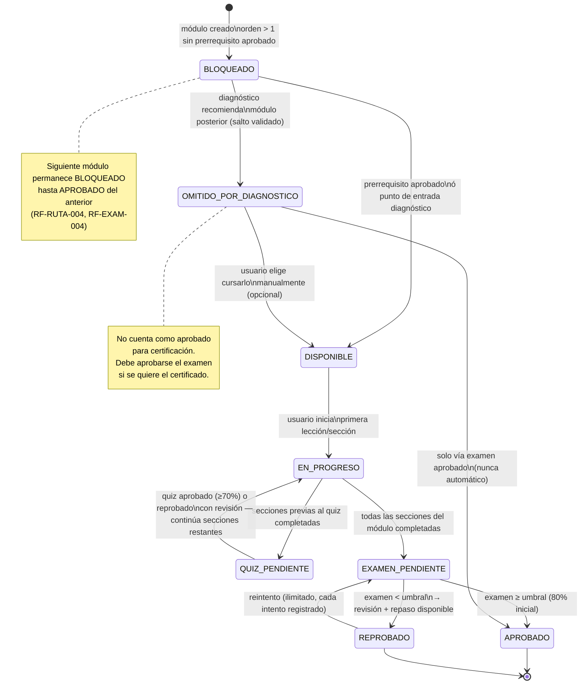
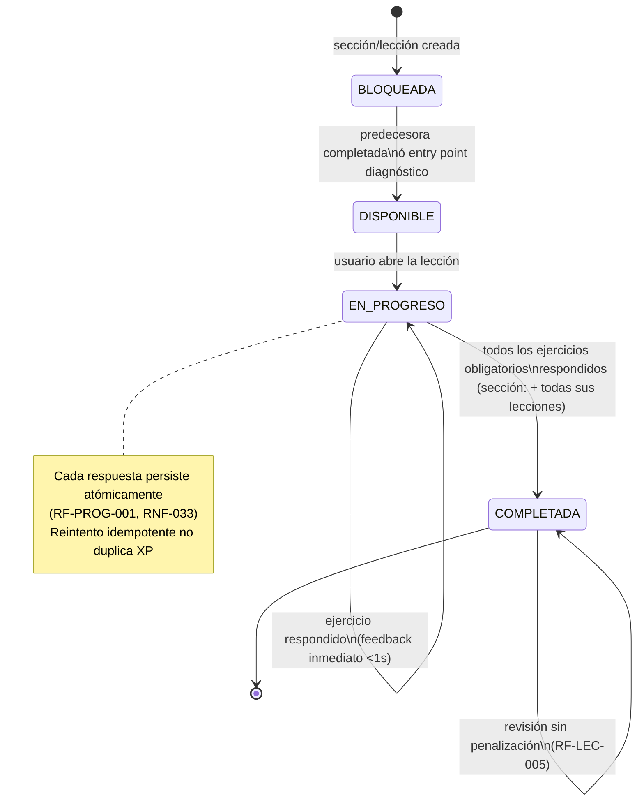
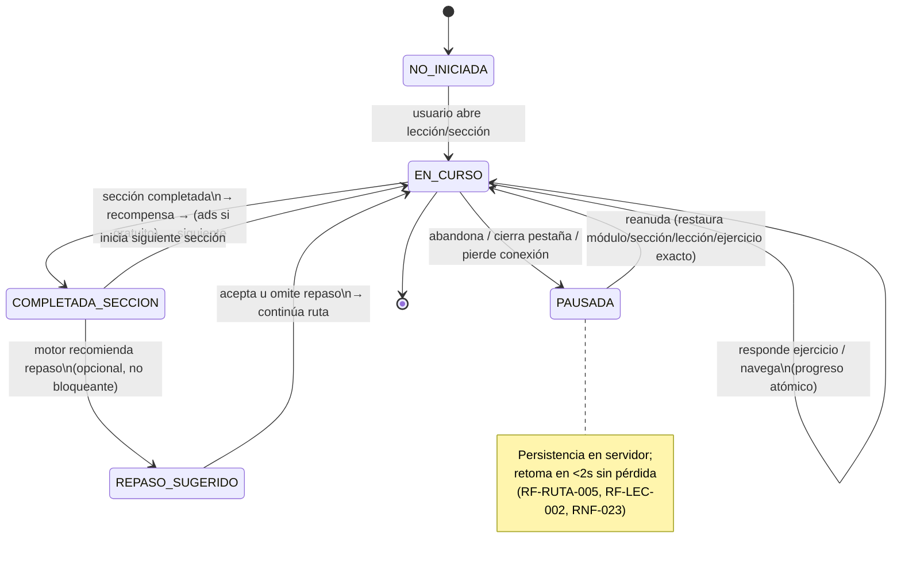
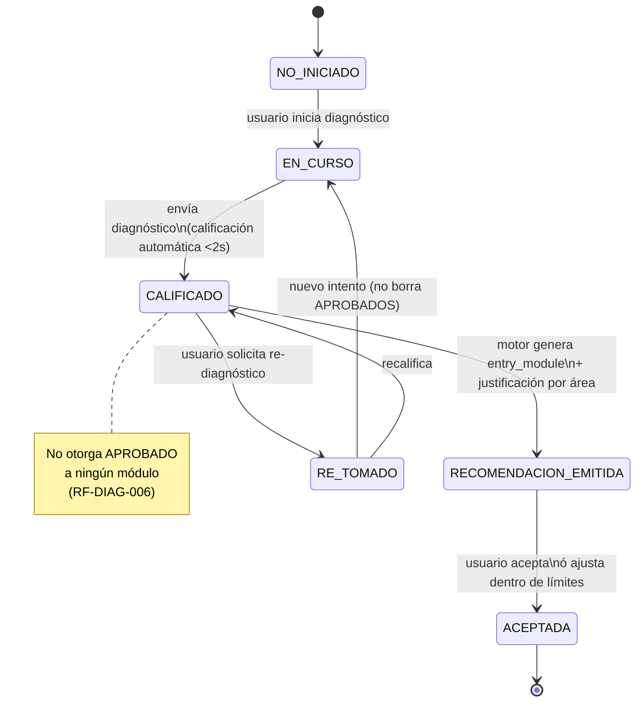
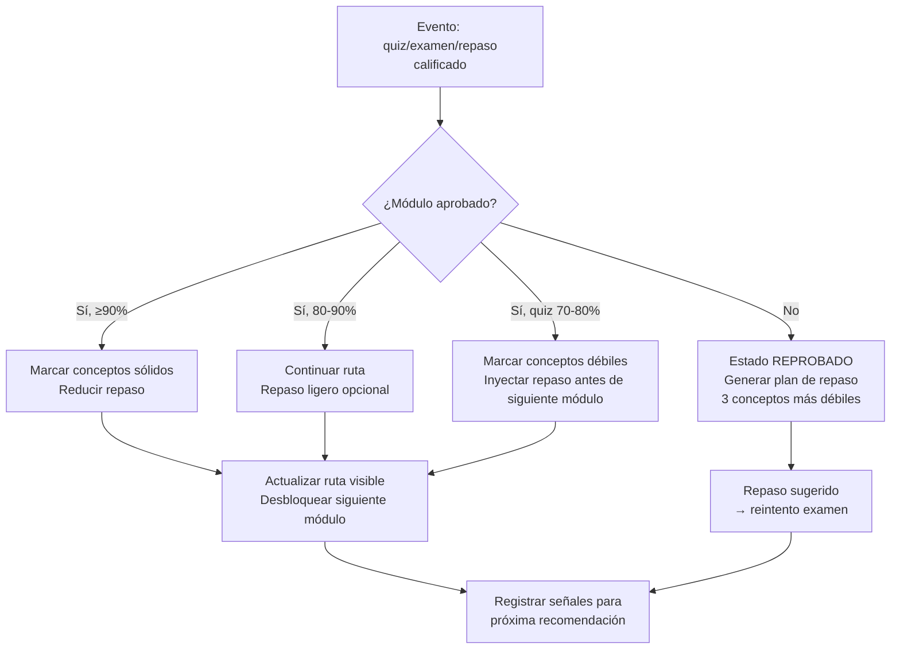

# 14 — Sistema de Aprendizaje (Learning System)

> **Estado:** En planificación · **Versión del documento:** 1.0.0 · **Fecha:** 2026-08-29
> Complementa a `01_PROJECT_OVERVIEW.md`, `02_PROBLEM_STATEMENT.md`, `03_OBJECTIVES.md`, `04_SCOPE.md` y materializa los requisitos `RF-LANG`, `RF-LVL`, `RF-DIAG`, `RF-RUTA`, `RF-MOD`, `RF-SEC`, `RF-LEC`, `RF-REP`, `RF-PROG` y `RF-EVAL` de `05_FUNCTIONAL_REQUIREMENTS.md`. Define la lógica educativa que consumen `11_SYSTEM_ARCHITECTURE.md` (Learning Engine), `12_DATABASE_DESIGN.md`, `13_API_SPECIFICATION.md`, `15_QUIZ_EXAM_SYSTEM.md` y `16_GAMIFICATION.md`. No duplica `23_CONTENT_SPECIFICATION.md` ni `24_CONTENT_AUTHORING_GUIDE.md`; los referencia como fuente de formato de contenido.

---

## 1. Propósito y alcance

Este documento es la **fuente de verdad pedagógica**. Especifica cómo se estructura el contenido, bajo qué reglas se desbloquea, cómo se diagnostica y ubica al usuario, cómo se adapta la ruta en el tiempo y cómo se prioriza el repaso. Toda decisión de motor, API o UI que afecte el aprendizaje debe ser trazable a una regla de este documento.

**Fuera de alcance:** formato físico de almacenamiento del contenido (ver `23`), tipificación fina de preguntas (ver `24`), cálculo de XP/nivel/rachas/logros (ver `16`), calificación detallada de quizzes/exámenes (ver `15`) y contratos de API (ver `13`).

### 1.1 Principios invariantes

1. **Micro-learning con práctica anclada:** ningún concepto sin ejercicio asociado (`01` §6, `03` OED-01/OED-02, `05` RF-LEC-001).
2. **Contenido desacoplado del motor:** agregar un lenguaje es agregar contenido + configuración, 0 cambios en el motor (`01` §31, `04` §10.3, `05` RF-LANG-004).
3. **Diagnóstico ubica, no certifica:** nunca otorga aprobación de módulos (`05` RF-DIAG-006).
4. **Prerrequisito es pedagógico, no burocrático:** se puede omitir por diagnóstico validado, nunca por salto manual arbitrario (`05` RF-RUTA-004).
5. **Repaso nunca penaliza progreso:** solo ajusta priorización futura (`05` RF-REP-004).
6. **Toda decisión de aprobación se toma en servidor** con trazabilidad de versión y umbral histórico (`05` RF-EVAL-006, `06` RNF-033–RNF-035).

---

## 2. Modelo jerárquico

### 2.1 Jerarquía canónica

```
Lenguaje (Language)
 └─ Módulo (Module)           — unidad temática evaluable con examen final
     └─ Sección (Section)     — unidad de sesión (teoría + ejemplo + ejercicios)
         └─ Lección (Lesson)  — micro-bloque: concepto → explicación → ejemplo → ejercicio → feedback → recompensa
             └─ Ejercicio / Pregunta (Exercise/Question) — instancia tipificada de `24`
```

**Cardinalidades (MVP Python):**

| Nivel | Cardinalidad | Orden | Evaluable |
|---|---|---|---|
| Lenguaje | 1 activo por usuario a la vez; N lenguajes en catálogo | `orden` global | No (se completa vía módulos) |
| Módulo | 12 en Python (`01` §34) | `orden` 1..12 pedagógico | Sí — Examen final |
| Sección | 3–7 por módulo (típico 5) | `orden` dentro del módulo | Parcial — completitud |
| Lección | 2–6 por sección | `orden` dentro de la sección | Sí — ejercicios |
| Ejercicio | 1–N por lección | `orden` dentro de la lección | Sí — validación inmediata |

### 2.2 Lenguaje

| Atributo | Tipo | Regla |
|---|---|---|
| `id` | UUID | PK |
| `code` | `PY`, `LUA`, `JS`, … (`04` §7) | Único, usado en `KODA-{LANG}-{SEQ}` |
| `nombre` | string | Ej. "Python" |
| `descripcion` | string | Breve, visible en catálogo |
| `estado` | `disponible` \| `proximamente` | En MVP solo `PY=disponible` (`05` RF-LANG-001) |
| `orden_catalogo` | int | Orden de presentación |
| `version_contenido` | semver | Incrementa en cada publicación (`05` RF-ADM-005) |
| `modulos[]` | FK ordenada | Referencia a `Module` |

**Invariantes:**
- Un usuario tiene un `lenguaje_activo` y progreso aislado por lenguaje (`05` RF-LANG-002/003/005).
- Cambiar de lenguaje activo no muta progreso de otros lenguajes.
- `version_contenido` se persiste en cada intento para trazabilidad (`06` RNF-035).

### 2.3 Módulo

| Atributo | Tipo | Regla |
|---|---|---|
| `id` | UUID | PK |
| `lenguaje_id` | FK | Pertenece a un lenguaje |
| `orden` | int | 1..N, sin huecos, único por lenguaje |
| `titulo` | string | Ej. "Variables y tipos de datos" |
| `objetivo` | string | Qué domina el usuario al aprobar |
| `descripcion` | string | Visible en ruta |
| `secciones[]` | FK ordenada | Al menos 3 |
| `quiz_ref` | FK | ≥1 quiz por módulo (`01` §13) |
| `examen_ref` | FK | 1 examen final por módulo (`01` §14) |
| `umbral_quiz` | int 0–100 | Configurable, inicial 70 (`01` §15) |
| `umbral_examen` | int 0–100 | Configurable, inicial 80 (`01` §15) |
| `prerrequisito` | `modulo_id` \| `null` | Por defecto `orden-1`; sin ciclos (`05` RF-ADM-006) |
| `estado_por_usuario` | ver §4.3 | Calculado, no almacenado como única fuente |

**Ruta Python MVP (orden canónico de `01` §34):**

1. Fundamentos · 2. Variables y tipos de datos · 3. Operadores · 4. Condicionales · 5. Bucles · 6. Funciones · 7. Listas y colecciones · 8. Diccionarios y estructuras de datos · 9. Manejo de errores · 10. Programación orientada a objetos · 11. Archivos · 12. Proyecto final

> El orden es configurable sin código (`05` RF-MOD-004, `06` RNF-017) pero el cambio genera nueva `version_contenido` y no reescribe historial.

### 2.4 Sección

| Atributo | Tipo | Regla |
|---|---|---|
| `id` | UUID | PK |
| `modulo_id` | FK | Pertenece a un módulo |
| `orden` | int | Único por módulo |
| `titulo` | string | Ej. "Declaración y asignación" |
| `tipo` | `teoria` \| `ejemplo` \| `ejercicios` \| `quiz` | Quiz intercalado según `01` §13 |
| `lecciones[]` | FK ordenada | ≥1 |
| `tiempo_estimado_min` | int | Solo métrica interna |

**Regla de completitud (`05` RF-SEC-003):**

```
Seccion.completada = ∀ leccion ∈ secciones.lecciones : leccion.completada
                    ∧ ∀ ejercicio_obligatorio ∈ seccion : ejercicio.estado = respondido
```

La publicidad solo se intercala tras `Seccion.completada → Recompensa → Publicidad → Siguiente sección` (`05` RF-ADS-001, nunca intra-ejercicio).

### 2.5 Lección

Sigue el flujo canónico (`01` §6, `05` RF-LEC-001):

```
Concepto → Explicación breve → Ejemplo → Ejercicio(s) → Retroalimentación inmediata → Recompensa (XP) → Siguiente concepto
```

| Atributo | Tipo | Regla |
|---|---|---|
| `id` | UUID | PK |
| `seccion_id` | FK | Pertenece a una sección |
| `orden` | int | Único por sección |
| `concepto_id` | string | Identificador pedagógico estable (ej. `py-var-declaracion`) |
| `explicacion` | rich text | Breve, sin jerga no introducida |
| `ejemplo_codigo` | code block | Anclado al concepto |
| `ejercicios[]` | FK | ≥1 obligatorio, tipificados en `24` |
| `prerrequisito_leccion` | `leccion_id` \| `null` | Por defecto `orden-1` dentro de la sección |

**Invariante pedagógica (`03` OED-02):** no existe lección sin al menos un ejercicio obligatorio.

### 2.6 Ejercicio / Pregunta

No se redefine aquí; toda pregunta cumple `24` (tipos, metadatos, dificultad, categoría, respuestas válidas, explicación, puntaje) y `05` RF-PREG-002/003. La lección solo referencia preguntas ya versionadas.

---

## 3. Estados de progreso

### 3.1 Estados por nivel de granularidad

| Entidad | Estados | Fuente de verdad |
|---|---|---|
| **Módulo** | `BLOQUEADO` · `DISPONIBLE` · `EN_PROGRESO` · `QUIZ_PENDIENTE` · `EXAMEN_PENDIENTE` · `APROBADO` · `REPROBADO` · `OMITIDO_POR_DIAGNOSTICO` | Derivado de exámenes + diagnóstico + orden |
| **Sección** | `BLOQUEADA` · `DISPONIBLE` · `EN_PROGRESO` · `COMPLETADA` | Derivado de lecciones |
| **Lección** | `BLOQUEADA` · `DISPONIBLE` · `EN_PROGRESO` · `COMPLETADA` | Derivado de ejercicios |
| **Ejercicio** | `NO_INICIADO` · `RESPONDIDO_CORRECTO` · `RESPONDIDO_INCORRECTO` | Intento persistido |

`OMITIDO_POR_DIAGNOSTICO` no es aprobación; indica que el usuario fue ubicado más adelante y no necesita cursar ese módulo para avanzar, pero tampoco lo tiene aprobado a efectos de certificación (`05` RF-DIAG-006, `04` §7). Para certificar el lenguaje debe eventualmente aprobar **todos** los exámenes.

### 3.2 Máquina de estados — Módulo



**Tabla de transiciones — Módulo:**

| Origen | Evento | Guarda | Destino | Efecto colateral |
|---|---|---|---|---|
| `BLOQUEADO` | `prerrequisito_aprobado` | `modulo.orden == prerrequisito.orden + 1 ∧ prerrequisito.estado == APROBADO` | `DISPONIBLE` | Visible en ruta |
| `BLOQUEADO` | `diagnostico_recomienda_salto` | `modulo.orden < entry_module ∧ diagnostico.estado == CALIFICADO` | `OMITIDO_POR_DIAGNOSTICO` | No bloquea avance al `entry_module` |
| `DISPONIBLE` | `iniciar_leccion` | `seccion.estado == DISPONIBLE` | `EN_PROGRESO` | `fecha_inicio_modulo = now()` |
| `EN_PROGRESO` | `secciones_previas_quiz_completadas` | `quiz.orden alcanzado` | `QUIZ_PENDIENTE` | Quiz generado (`15`) |
| `QUIZ_PENDIENTE` | `quiz_calificado` | `siempre` (aprueba ≥70% o reprueba, ambos continúan) | `EN_PROGRESO` | `intento_quiz` registrado con umbral histórico |
| `EN_PROGRESO` | `todas_secciones_completadas` | `∀ seccion : COMPLETADA` | `EXAMEN_PENDIENTE` | Examen generado (`15`) |
| `EXAMEN_PENDIENTE` | `examen_calificado` | `porcentaje ≥ umbral_examen` | `APROBADO` | Otorga XP, desbloquea siguiente módulo, registra `fecha_aprobacion` |
| `EXAMEN_PENDIENTE` | `examen_calificado` | `porcentaje < umbral_examen` | `REPROBADO` | Muestra revisión + repaso recomendado |
| `REPROBADO` | `reintentar_examen` | `siempre` (ilimitado) | `EXAMEN_PENDIENTE` | Nuevo intento, no promedia |
| `OMITIDO_POR_DIAGNOSTICO` | `cursar_manual` | `usuario solicita` | `DISPONIBLE` | Permite cursar sin perder ubicación |

### 3.3 Máquina de estados — Sección y Lección



### 3.4 Máquina de estados — Sesión



---

## 4. Reglas de desbloqueo de contenido y Sistema de Estrellas

### 4.1 Visibilidad global del Roadmap y Progresión Secuencial

En la interfaz se muestra el **Roadmap completo** (todos los módulos $M_1..M_n$ y sus secciones $S_1..S_m$) de forma visible para proveer un mapa mental claro del viaje educativo, pero con restricciones estrictas de acceso mediante candados (`🔒`):

```
┌─────────────────────────────────────────────────────────────────────────────────┐
│                        MAPA DE RUTA COMPLETO (ROADMAP)                          │
├─────────────────────────────────────────────────────────────────────────────────┤
│ [ M01: Fundamentos ] ──(⭐⭐⭐)──▶ [ M02: Variables ] ──(🔒 Bloqueado)──▶ [ M03... ]  │
│   ├── S01: Intro (⭐⭐⭐)                                                       │
│   ├── S02: Chunks (⭐⭐)                                                        │
│   ├── S03: Print (🔒 Requiere S02)                                              │
│   └── ...                                                                       │
└─────────────────────────────────────────────────────────────────────────────────┘
```

1. **Sección inicial abierta:** Al iniciar un módulo, únicamente la primera sección ($S_1$) y su primera lección ($L_1$) están en estado `DISPONIBLE`.
2. **Candados secuenciales intra-módulo:** La sección siguiente ($S_{j+1}$) permanece `BLOQUEADA` con icono de candado (`🔒`) hasta que $S_j$ haya sido completada y calificada.
3. **Condición estricta de desbloqueo de Módulo:** No es posible acceder al módulo siguiente ($M_{i+1}$) a menos que se cumplan **dos condiciones obligatorias simultáneas**:
   - **Condición A (Cobertura total):** Haber completado el 100% de las secciones ($S_1..S_m$) del módulo actual y aprobado el examen.
   - **Condición B (Umbral de estrellas):** Haber acumulado un número de estrellas mayor o igual al **mínimo de estrellas exigido** para el módulo ($Estrellas(M_i) \ge Estrellas_{min}(M_i)$, inicialmente el 80% de las estrellas máximas posibles).

```
M(i) es DISPONIBLE  ⇔  ( i = 1 )
                      ∨ ( M(i-1).todas_secciones_completadas = true 
                          ∧ M(i-1).examen = APROBADO 
                          ∧ M(i-1).estrellas_totales ≥ M(i-1).estrellas_minimas )
                      ∨ ( M(i) = OMITIDO_POR_DIAGNOSTICO con cursado manual )

M(i) permanece BLOQUEADO ⇔ M(i-1) no cumple Condición A o Condición B
```

Dentro de un módulo:
```
S(j) es DISPONIBLE  ⇔  j = 1  ∨  S(j-1) = COMPLETADA
L(k) es DISPONIBLE  ⇔  k = 1  ∨  L(k-1) = COMPLETADA
```

### 4.2 Sistema de Calificación en Estrellas (1 a 3 ⭐)

Inspirado en mecánicas de retención formativa y superación progresiva (tipo *"Score!"*), cada lección y sección evaluada otorga entre **1 y 3 estrellas** según la precisión y autonomía demostrada:

| Estrellas | Rango de Precisión | Criterio Operativo Pedagógico |
|---|---|---|
| ⭐⭐⭐ **(3 Estrellas)** | **100% Precisión** | Acierto perfecto al primer intento en todos los ejercicios, sin recurrir a la ronda de errores. |
| ⭐⭐ **(2 Estrellas)** | **80% – 99%** | 1 fallo cometido y subsanado con éxito en la Ronda de Repaso / Pista formativa. |
| ⭐ **(1 Estrella)** | **60% – 79%** | 2 o más fallos cometidos, superados tras múltiples repasos formativos. |
| **0 Estrellas** | **< 60%** | Sección o lección incompleta, abandonada o no superada. |

#### 4.2.1 Rejugabilidad Formativa para Mejora de Estrellas
- El estudiante tiene la libertad de **volver a jugar cualquier lección o sección ya completada** para perfeccionar su técnica y subir su calificación de 1 o 2 estrellas a 3 estrellas ⭐⭐⭐.
- Si al terminar todas las secciones de un módulo el estudiante no alcanza el umbral mínimo de estrellas requerido para abrir el siguiente módulo, el sistema le indica exactamente en qué secciones obtuvo 1 o 2 estrellas, invitándolo a rejugarlas para desbloquear el nuevo módulo.
- Al mejorar una calificación (ej. de 2⭐ a 3⭐), el progreso global y el contador de estrellas del módulo se actualizan de inmediato.

### 4.3 Excepción: salto adaptativo por diagnóstico

El diagnóstico puede recomendar `entry_module = E` (ver §6). Entonces:

```
∀ i < E : M(i) ← OMITIDO_POR_DIAGNOSTICO (otorga 3⭐ por defecto o estado equivalente)
M(E) ← DISPONIBLE  (aunque M(E-1) no esté APROBADO manualmente)
∀ i > E : rige regla canónica desde E con estrellas y candados
```

**Restricciones de la excepción:**

1. Solo el diagnóstico produce `OMITIDO_POR_DIAGNOSTICO`; el usuario no puede auto-saltar módulos manualmente.
2. El usuario puede ajustar `E` dentro de límites pedagógicos: `E' ∈ [max(1, E-1), min(N, E+1)]` si y solo si no rompe prerrequisitos críticos definidos por contenido (ej. no saltar "Fundamentos" si el diagnóstico muestra <50% en esa área). El ajuste requiere confirmación y queda auditado.
3. Re-diagnóstico nunca revierte `APROBADO` a otro estado (`05` RF-DIAG-004).
4. Para certificación, todo `OMITIDO_POR_DIAGNOSTICO` debe eventualmente transitar a `APROBADO` vía examen; no existe certificación con módulos omitidos sin examen.

### 4.4 Regla de aprobación y umbrales

```
Quiz APROBADO    ⇔  porcentaje_quiz ≥ umbral_quiz_vigente_al_momento_del_intento (70%)
Examen APROBADO  ⇔  porcentaje_examen ≥ umbral_examen_vigente_al_momento_del_intento (80%)
Módulo DESBLOQUEA_SIGUIENTE ⇔  Módulo.secciones_completadas = 100% 
                               ∧ Examen = APROBADO 
                               ∧ Módulo.estrellas_obtenidas ≥ Módulo.estrellas_minimas
Lenguaje COMPLETADO ⇔  ∀ modulo ∈ lenguaje.modulos : modulo.estado = APROBADO
```

Umbrales iniciales: Quiz 70%, Examen 80%, Estrellas mínimas por módulo 80% (`thresholds.json`), configurables sin despliegue (`05` RF-ADM-004, `06` RNF-017). Cada intento guarda `umbral_aplicado`, `estrellas_otorgadas` y `version_contenido` (`05` RF-EVAL-003/005).

### 4.5 Reintentos

- **Quiz:** reintentos ilimitados, cada intento registrado, la mejor nota no oculta historial (`05` RF-QUIZ-005). No bloquea avance del módulo (el quiz es formativo).
- **Examen y Secciones:** reintentos ilimitados, cada intento registrado. El desbloqueo del siguiente módulo exige cumplir la totalidad de secciones, examen aprobado y el mínimo de estrellas acumuladas (`05` RF-EXAM-005).

### 4.6 Publicación y versionado

Publicar/ocultar contenido es inmediato o programado sin despliegue (`05` RF-ADM-003). Versionar crea nueva `version_contenido`; los intentos históricos conservan la versión con la que fueron evaluados (`06` RNF-035). Validación previa a publicar: IDs únicos, prerrequisitos sin ciclos, referencias íntegras (`05` RF-ADM-006).

---

## 5. Diagnóstico inicial

### 5.1 Objetivo y no-objetivos

**Objetivo:** ubicar al usuario en el punto correcto de la ruta para no obligar a repetir contenido dominado ni saltar prerrequisitos críticos (`01` §8–§9, `05` RF-DIAG-001–003).

**No-objetivos:** no certifica nivel previo, no otorga aprobaciones, no sustituye exámenes de módulo, no es obligatorio para comenzar si el usuario elige iniciar en Módulo 1 como `BEGINNER`.

### 5.2 Composición

| Parámetro | Valor MVP | Regla |
|---|---|---|
| Preguntas totales | **24** | 2 por módulo × 12 módulos Python |
| Distribución | Estratificada por módulo, orden aleatorio de presentación | Representativa de cada módulo (`05` RF-DIAG-001) |
| Tipos | Subconjunto de `24` sin ejecución de código en MVP | Selección múltiple, V/F, completar código/línea, predecir output, identificar errores (5 tipos mínimo) |
| Dificultad | Mixta por módulo: 1 pregunta nivel básico + 1 intermedia del módulo | Permite discriminar dominio parcial del módulo |
| Tiempo estimado | 15–20 min | No cronometrado de forma punitiva; se registra duración |
| Banco | Preguntas etiquetadas `es_diagnostico = true`, versionadas | No se reutilizan preguntas de quiz/examen del módulo para evitar fuga |

**Ejemplo de distribución (Python 12 módulos):**

| Bloque | Módulos | Preguntas | Qué mide |
|---|---|---|---|
| Bloque A — Fundamentos | M1–M3 | 6 | Sintaxis básica, variables, tipos, operadores |
| Bloque B — Control | M4–M5 | 4 | Condicionales, bucles |
| Bloque C — Abstracción | M6–M8 | 6 | Funciones, listas/colecciones, diccionarios |
| Bloque D — Avanzado | M9–M12 | 8 | Errores, POO, archivos, proyecto integrador |

### 5.3 Calificación

Por cada módulo `i`:

```
P_i = (correctas_en_modulo_i / preguntas_de_modulo_i) × 100
P_global = (correctas_totales / 24) × 100
```

Se produce además un **vector de dominio por bloque:**

```
Dominio_Bloque_X = promedio(P_i) para i ∈ Bloque_X
```

Todo se registra con `version_contenido` y `umbral_informativo` (no usado para aprobar, solo para recomendar).

### 5.4 Estados del diagnóstico



### 5.5 Reglas

1. El diagnóstico es **sugerido, no impuesto** (`05` RF-DIAG-003); el usuario puede iniciar en Módulo 1 aunque el diagnóstico recomiende más adelante.
2. Re-tomar el diagnóstico no borra módulos ya `APROBADOS` (`05` RF-DIAG-004).
3. El nivel declarado se puede modificar solo antes de completar el diagnóstico (`05` RF-LVL-002); después requiere re-diagnóstico explícito (`05` RF-LVL-004).
4. El resultado se persiste en perfil e historial (`05` RF-DIAG-005) y alimenta `RF-RUTA-001` y §6.

---

## 6. Determinación de nivel y punto de entrada

### 6.1 Entradas

| Entrada | Dominio | Fuente |
|---|---|---|
| `Nivel_declarado` | `BEGINNER` · `MEDIUM` · `SEMI_PROFESSIONAL` · `PROFESSIONAL` (`01` §8) | Usuario, antes del diagnóstico |
| `P_i` | 0–100 por módulo | Diagnóstico (§5.3) |
| `P_global` | 0–100 | Diagnóstico |
| `Dominio_Bloque_*` | 0–100 | Diagnóstico agregado |

### 6.2 Mapeo de nivel declarado a expectativa

| Nivel declarado | Expectativa pedagógica | Módulos que se espera domine |
|---|---|---|
| `BEGINNER` | Sin conocimientos o mínimos | Ninguno; entry esperado M1 |
| `MEDIUM` | Básicos, algunos programas | M1–M3 con ≥70% |
| `SEMI_PROFESSIONAL` | Intermedio/avanzado considerable | M1–M6 con ≥70% |
| `PROFESSIONAL` | Dominio avanzado | M1–M9 con ≥70% |

Este mapeo no decide solo; se combina con evidencia del diagnóstico.

### 6.3 Fórmula de recomendación de `entry_module`

**Paso 1 — Detectar primer módulo no dominado:**

```
Sea UMBRAL_DOMINIO = 70  (configurable, mismo que quiz)

entry_candidato = min { i ∈ [1..N] | P_i < UMBRAL_DOMINIO }
                  si existe; si no, entry_candidato = N  (usuario domina todo, ubicar en último módulo)
```

**Paso 2 — Ajuste por coherencia de bloques (evita saltos con huecos):**

```
Si entry_candidato > 1 y P_{entry_candidato - 1} < 70 y Dominio_Bloque(entry_candidato - 1) < 60
    entonces entry_candidato ← entry_candidato - 1   (retrocede un módulo para reforzar prerrequisito)

Si entry_candidato < N y P_{entry_candidato} ≥ 70 y P_{entry_candidato+1} < 70 y |P_{entry_candidato} - P_{entry_candidato+1}| < 10
    entonces mantener entry_candidato  (no adelantar por fluctuación menor a 10 puntos)
```

**Paso 3 — Clamping por nivel declarado (evita contradicciones extremas):**

| Nivel declarado | Clamping |
|---|---|
| `BEGINNER` | `entry_module ≤ 3` aunque el diagnóstico sugiera más adelante (se prioriza no saltar fundamentos sin evidencia muy fuerte: exige `P_1 ≥ 90 ∧ P_2 ≥ 90`) |
| `MEDIUM` | `entry_module ∈ [1..6]` |
| `SEMI_PROFESSIONAL` | `entry_module ∈ [2..9]` |
| `PROFESSIONAL` | `entry_module ∈ [3..12]` sin tope superior |

```
entry_module = clamp(entry_candidato, min_por_nivel, max_por_nivel)
```

**Paso 4 — Justificación:**

El sistema expone al usuario:

```
"Recomendamos iniciar en Módulo {entry_module} — {titulo}
 porque tu puntaje en {modulos_previos} fue {P_i}% y en {modulo_entry} fue {P_entry}%
 (nivel declarado: {nivel}). Puedes ajustar ±1 módulo."
```

### 6.4 Tabla de decisión (resumen)

| P_global | Patrón por bloques | Nivel declarado | entry_module típico |
|---|---|---|---|
| < 30% | Todo bajo | Cualquiera | M1 |
| 30–55% | Bloque A medio, resto bajo | BEGINNER/MEDIUM | M2–M3 |
| 55–75% | Bloques A–B dominados, C parcial | MEDIUM/SEMI_PRO | M5–M7 |
| 75–90% | Bloques A–C dominados, D parcial | SEMI_PRO/PROFESSIONAL | M8–M10 |
| > 90% | Todo dominado | PROFESSIONAL | M11–M12 |

### 6.5 Ejemplo numérico

Usuario declara `MEDIUM`, diagnóstico 24 preguntas:

```
P_1=100, P_2=100, P_3=50, P_4=0, P_5=0, P_6=50, P_7=0, P_8=0, P_9=0, P_10=0, P_11=0, P_12=0
P_global = 25%
entry_candidato = 3  (primer P_i < 70 es M3 con 50)
Dominio Bloque A (M1-M3) = 83% → no retrocede
Clamping MEDIUM [1..6] → entry_module = 3
Recomendación: "Variables y tipos de datos" (M3) — el usuario domina Fundamentos pero falla en Variables.
```

### 6.6 Re-diagnóstico

- Disponible bajo demanda (`05` RF-DIAG-004, `07` US-021).
- Recalcula `entry_module` solo sobre módulos no `APROBADOS`.
- Nunca mueve `entry_module` hacia atrás si ya hay progreso `EN_PROGRESO` más adelante sin consentimiento del usuario.

---

## 7. Aprendizaje adaptativo

### 7.1 Señales que alimentan la adaptación

| Señal | Fuente | Uso |
|---|---|---|
| Nivel declarado + `P_i` | Diagnóstico | Punto de entrada inicial (§6) |
| % en quizzes/exámenes por módulo | `Evaluation Engine` (`15`) | Detectar dominio frágil vs. sólido |
| Historial de errores por `concepto_id` | `RF-PREG-005`, `RF-EVAL-004` | Priorizar repaso y reforzar prerrequisitos |
| Tiempo dedicado por sección | `RF-SEC-005` | Detectar fricción (tiempo alto + error alto = concepto difícil) |
| Intentos y reintentos | `RF-QUIZ-005`, `RF-EXAM-005` | Ajustar dificultad percibida |
| Resultados de repaso | `RF-REP-004` | Cerrar o mantener brechas |
| Progreso por lenguaje | `RF-PROG-001/002` | Recalcular ruta visible |

### 7.2 Reglas de adaptación continua

**R1 — Refuerzo preventivo:**
Si `quiz_porcentaje ∈ [70, 80)` (aprobado justo) en M(i), entonces el motor marca `conceptos_debiles = {concepto_id | tasa_error > 40%}` y los inyecta como repaso prioritario antes de M(i+1) (`05` RF-RUTA-003).

**R2 — Ralentización:**
Si `examen_reprobado` en M(i), entonces:
- M(i) → `REPROBADO`, siguiente módulo permanece `BLOQUEADO`.
- Se genera plan de repaso con los 3 conceptos de menor `P_concepto` del examen.
- No se permite reintentar examen sin haber completado al menos 1 sesión de repaso sugerida (recomendación fuerte, no bloqueo técnico).

**R3 — Aceleración validada:**
Si `examen_aprobado con ≥ 90%` en M(i) y `quiz_aprobado con ≥ 85%`, entonces el motor reduce repaso sugerido para M(i) y no genera refuerzo extra.

**R4 — Detección de prerrequisito frágil:**
Si en M(i) la tasa de error en preguntas que dependen de `concepto_id` de M(j < i) supera 50%, entonces el motor re-activa repaso de M(j) aunque M(j) estuviera `APROBADO`.

**R5 — Inactividad:**
Si `dias_sin_actividad ≥ 7`, el próximo inicio de sesión prioriza una sesión de repaso corta (5 preguntas) antes de contenido nuevo (opcional, no bloqueante).

### 7.3 Qué nunca hace la adaptación

- Nunca aprueba un módulo sin examen aprobado.
- Nunca salta un módulo no diagnosticado.
- Nunca oculta progreso ya validado.
- Nunca modifica `version_contenido` ni umbrales; solo recomienda.

### 7.4 Flujo de adaptación



---

## 8. Sistema de repaso y refuerzo

### 8.1 Tipos de repaso

| Tipo | Disparo | Bloquea ruta | Penaliza |
|---|---|---|---|
| **Inter-sesión sugerido** | Entre sesiones, al iniciar o al reprobar | No (`05` RF-REP-003) | No (`05` RF-REP-004) |
| **Post-evaluación** | Tras quiz/examen con conceptos débiles | No | No |
| **Manual por módulo/tema** | Usuario elige módulo/tema (`05` RF-REP-005) | No | No |

Todo repaso usa preguntas de contenido **ya estudiado** (`05` RF-REP-001), nunca introduce conceptos no vistos.

### 8.2 Priorización — Fórmula de score

Para cada `concepto_id` ya visto:

```
Score_repaso(c) = w1 × Tasa_error(c)
                + w2 × (1 - Rendimiento(c))
                + w3 × Antiguedad_norm(c)
                + w4 × Es_prerrequisito_proximo(c)

donde:
  Tasa_error(c)              = incorrectas(c) / intentos(c)          ∈ [0,1]
  Rendimiento(c)             = promedio_ponderado por dificultad de aciertos en c  ∈ [0,1]
  Antiguedad_norm(c)         = min(dias_desde_ultimo_repaso(c), 30) / 30  ∈ [0,1]
  Es_prerrequisito_proximo(c)= 1 si c es prerrequisito de los próximos 2 módulos, 0 si no
  w1=0.35, w2=0.25, w3=0.25, w4=0.15   (configurables sin despliegue, suman 1.0)
```

**Selección:**

```
Candidatos = { c | intentos(c) > 0 }  (solo conceptos ya vistos)
Ordenar por Score_repaso(c) descendente
Tomar top N (N=5 por defecto para sesión corta, N=10 para sesión post-reprobado)
Para cada c, elegir 1 pregunta no repetida recientemente del banco (evitar duplicar última sesión)
```

**Desempate:** mayor `dias_desde_ultimo_repaso` → mayor dificultad → menor `Rendimiento`.

### 8.3 Algoritmo de generación de sesión de repaso

```
function generarRepaso(usuario, lenguaje, N=5, filtro_manual=null):
    conceptos = filtro_manual != null
                ? conceptosDe(filtro_manual) ∩ conceptosVistos(usuario)
                : conceptosVistos(usuario)

    scored = conceptos.map(c => (c, Score_repaso(c))).sort(desc)

    seleccion = scored.take(N)
    preguntas = []
    para cada (c, _) en seleccion:
        pool = bancoPreguntas(c, lenguaje).filter(p => p.version == vigente
                                                   ∧ p.noVistaEnUltimas(2, usuario))
        preguntas.push(pool.sample(1))

    registrar(sesion_repaso, usuario, preguntas, Scores)
    return preguntas  // ordenadas por Score descendente
```

Efecto de completar repaso (`05` RF-REP-004): actualiza `dias_desde_ultimo_repaso`, ajusta `Tasa_error` y `Rendimiento`, retroalimenta a `Evaluation Engine` para la próxima priorización, sin modificar `%` de módulo ni estado de aprobación.

### 8.4 Ejemplo numérico

Conceptos vistos: `py-var-declaracion`, `py-var-tipos`, `py-op-aritmeticos`

| Concepto | Tasa_error | Rendimiento | Antigüedad (días) | Prerrequisito próximo | Score |
|---|---|---|---|---|---|
| `py-var-declaracion` | 0.60 | 0.40 | 12 → 0.40 | 1 | 0.35×0.60 + 0.25×0.60 + 0.25×0.40 + 0.15×1 = **0.61** |
| `py-var-tipos` | 0.20 | 0.80 | 2 → 0.07 | 1 | 0.35×0.20 + 0.25×0.20 + 0.25×0.07 + 0.15×1 = **0.29** |
| `py-op-aritmeticos` | 0.50 | 0.50 | 25 → 0.83 | 0 | 0.35×0.50 + 0.25×0.50 + 0.25×0.83 + 0 = **0.51** |

Orden de repaso: `py-var-declaracion` → `py-op-aritmeticos` → `py-var-tipos`.

---

## 9. Recomendación de contenido (qué mostrar ahora)

### 9.1 Motor de recomendación

El `Learning Engine` decide en cada arranque de sesión qué mostrar, en este orden de prioridad:

```
1. Si hay examen reprobado pendiente → recomendar repaso (N=5-10) + CTA reintento
2. Si hay conceptos con Score_repaso > 0.60 y dias_sin_repaso > 7 → sugerir repaso corto (N=5) opcional
3. Si hay sección EN_PROGRESO → continuar en lección/ejercicio exacto (reanudación)
4. Si hay módulo EXAMEN_PENDIENTE → presentar examen
5. Si hay módulo QUIZ_PENDIENTE → presentar quiz
6. Si no → siguiente sección DISPONIBLE en orden canónico
```

La recomendación es **sugerida**; el usuario siempre puede navegar manualmente a cualquier contenido `DISPONIBLE` o `COMPLETADA` para revisión (`05` RF-LEC-005).

### 9.2 Contenido de una sesión típica

```
Sesión = [ Repaso opcional (0-5) ] → Contenido nuevo (1 sección) → Quiz si corresponde → Recompensa → (Ads si gratuito)
```

Duración objetivo: 8–15 min por sesión (micro-learning, `01` §10). El usuario puede abandonar y retomar sin pérdida (`05` RF-LEC-002).

### 9.3 Reglas de no-intrusión

- El repaso sugerido nunca excede 5 preguntas salvo post-reprobado (10).
- Nunca se intercala publicidad dentro de repaso ni entre preguntas de repaso (`05` RF-ADS-002).
- La XP de repaso es configurable y menor que la de contenido nuevo (evita farmear XP solo con repaso).

---

## 10. Fórmulas consolidadas

### 10.1 Evaluación

```
Puntaje_bruto = Σ peso(pregunta_i)  para respuestas correctas
Puntaje_max   = Σ peso(pregunta_i)  para todas las preguntas del intento
Porcentaje    = (Puntaje_bruto / Puntaje_max) × 100
Aprobado      = Porcentaje ≥ umbral_vigente_al_momento_del_intento
```

Pesos por defecto: todas las preguntas peso 1 salvo configuración en `23`/`25`. Umbrales versionados (`05` RF-EVAL-005).

### 10.2 Progreso

```
Progreso_modulo(%)   = (secciones_completadas / secciones_totales) × 100
Progreso_lenguaje(%) = (modulos_aprobados / modulos_totales) × 100
Progreso_global_cuenta = promedio ponderado por lenguaje (informativo)
```

`Progreso_lenguaje = 100%` ⇔ `Lenguaje COMPLETADO` ⇔ habilita certificado (`04` §7, `05` RF-CERT-001).

### 10.3 XP y nivel (referencia, detalle en `16`)

```
XP_total = Σ XP_evento  (cada evento validado en servidor, 05 RF-XP-005)
Nivel    = f(XP_total)  con curva configurable determinista (05 RF-XP-002)
           Ej. curva inicial: XP_para_nivel(N) = 100 × N^1.5  (ajustable sin despliegue)
```

Valores iniciales por acción (`01` §17): sección +10, ejercicio correcto +5, quiz +25, examen +100, módulo +150 — todos configurables (`05` RF-XP-004).

### 10.4 Rachas (referencia, detalle en `16`)

```
Racha_actual  = días calendario consecutivos con ≥1 actividad válida (RF-PROG-001)
Racha_maxima  = max histórico de Racha_actual
Actividad_válida = completar lección/ejercicio, quiz, examen o repaso en el día
Corte_diario  = zona horaria explícita del usuario (05 RF-RACHA-004, 06 RNF pendiente)
```

### 10.5 Repaso

Ver §8.2 para `Score_repaso(c)` y algoritmo de selección.

---

## 11. Sesiones y reanudación

### 11.1 Definición de sesión

Unidad de estudio en un período determinado que puede contener: repaso, contenido nuevo, ejemplos, ejercicios, quiz y recompensas (`01` §10). No es una entidad con cierre obligatorio; el sistema la infiere por actividad.

### 11.2 Persistencia y reanudación

| Evento | Persistencia | Reanudación |
|---|---|---|
| Cada respuesta a ejercicio | Atómica, transaccional (`06` RNF-033) | Inmediata |
| Avance de lección/sección | `RF-PROG-001` con timestamp `America/Bogota` | < 2 s (`06` RNF-023) |
| Cierre de pestaña / cambio de dispositivo | Servidor como fuente de verdad | Posición exacta `lenguaje/módulo/sección/lección/ejercicio` (`05` RF-RUTA-005) |
| Pérdida de conexión | Cliente reintenta con idempotencia (`06` RNF-042) | Sincroniza al reconectar sin corrupción (`05` RF-PROG-004) |
| Expiración de sesión durante lección | Refresh silencioso (`05` RF-AUTH-007) | Sin re-login ni pérdida |

### 11.3 Navegación

La jerarquía `Lenguaje → Módulo → Sección → Lección` es visible en toda vista de aprendizaje (`05` RF-SEC-004, `06` RNF-021, `10_INFORMATION_ARCHITECTURE.md`). Transición lección→siguiente < 500 ms p95 con contenido cacheado (`06` RNF-011).

---

## 12. Reglas de negocio transversales

| # | Regla | Origen |
|---|---|---|
| RN-01 | Un módulo no se desbloquea hasta aprobar el examen del anterior, salvo salto validado por diagnóstico. | `05` RF-RUTA-004 |
| RN-02 | El diagnóstico nunca otorga aprobación. | `05` RF-DIAG-006 |
| RN-03 | Re-diagnóstico no borra módulos aprobados. | `05` RF-DIAG-004 |
| RN-04 | Quiz reprobado no bloquea avance del módulo (es formativo). | `05` RF-QUIZ-003/005 |
| RN-05 | Examen reprobado bloquea siguiente módulo hasta aprobar (es certificante). | `05` RF-EXAM-004 |
| RN-06 | Reintentos ilimitados; desbloqueo exige un intento aprobado, no promedio. | `05` RF-EXAM-005 |
| RN-07 | Umbrales y XP configurables sin despliegue; cada intento guarda umbral histórico. | `05` RF-EVAL-005, RF-XP-004, `06` RNF-017 |
| RN-08 | Repaso no penaliza progreso; solo ajusta priorización futura. | `05` RF-REP-004 |
| RN-09 | Publicidad solo entre secciones completadas, nunca intra-ejercicio/quiz/examen. | `05` RF-ADS-001/002 |
| RN-10 | Certificado solo si todos los módulos del lenguaje están aprobados. | `05` RF-CERT-001, `04` §7 |
| RN-11 | Contenido versionado; intentos conservan versión evaluada. | `05` RF-ADM-005, `06` RNF-035 |
| RN-12 | Toda calificación se calcula en servidor. | `05` RF-EVAL-006 |
| RN-13 | Idempotencia: reenvío del mismo intento no duplica registros ni XP. | `05` regla 3, `06` RNF-042 |

---

## 13. Invariantes y validaciones

### 13.1 Invariantes del sistema

```
I1: lenguaje completado  ⇔  ∀ modulo ∈ lenguaje : modulo.estado = APROBADO
I2: modulo.aprobado      ⇔  ∃ intento_examen(modulo) : porcentaje ≥ umbral_historico
I3: seccion.completada   ⇔  ∀ leccion ∈ seccion : leccion.completada
I4: leccion.completada   ⇔  ∀ ejercicio_obligatorio ∈ leccion : respondido
I5: progreso_lenguaje(%) = ( |{m: APROBADO}| / N ) × 100
I6: ningún intento modifica intentos históricos (inmutabilidad)
I7: ningún diagnóstico modifica módulos APROBADOS
I8: Score_repaso(c) solo se calcula para conceptos ya vistos
```

### 13.2 Validaciones antes de publicar contenido (ver `05` RF-ADM-006)

- IDs únicos por nivel.
- `orden` sin huecos ni duplicados por padre.
- Prerrequisitos sin ciclos (DAG).
- Toda pregunta referencia `lenguaje/módulo/sección/lección` válidos y tipo en `24`.
- Al menos 3 secciones por módulo y 1 ejercicio obligatorio por lección.
- Quiz y examen con composición válida según `15`/`23`.

### 13.3 Validaciones en tiempo de ejecución

- Intento de acceso a `BLOQUEADO` → 403 con CTA pedagógico (qué falta para desbloquear).
- Envío de respuesta a lección `BLOQUEADA` → rechazado en servidor.
- Reenvío idempotente → 200 con mismo resultado, sin duplicar XP.
- Cambio de `entry_module` manual fuera de ±1 → rechazado con explicación.

---

## 14. Trazabilidad

### 14.1 RF cubiertos por este documento

| RF | Sección de este documento |
|---|---|
| RF-LANG-001–005 | §2.2, §4, §11 |
| RF-LVL-001–004 | §6.1–6.3, §5.5 |
| RF-DIAG-001–006 | §5, §6 |
| RF-RUTA-001–005 | §4, §6, §7, §9, §11 |
| RF-MOD-001–005 | §2.3, §3.2, §4 |
| RF-SEC-001–005 | §2.4, §3.3, §4 |
| RF-LEC-001–005 | §2.5, §3.3, §11 |
| RF-PREG-001–007 | §2.6 (referencia a `24`) |
| RF-QUIZ-001–006 | §3.2, §4.3–4.4 (detalle en `15`) |
| RF-EXAM-001–007 | §3.2, §4.3–4.4 (detalle en `15`) |
| RF-EVAL-001–006 | §10.1, §12, §13 |
| RF-PROG-001–006 | §10.2, §11 |
| RF-REP-001–005 | §8, §9 |
| RF-ADM-001–006 | §2–§4, §13.2 |

### 14.2 RNF relacionados

`RNF-006` (contenido desacoplado), `RNF-010` (feedback <1 s), `RNF-011` (navegación <500 ms), `RNF-017` (config sin despliegue), `RNF-021` (jerarquía visible), `RNF-023` (sesión reanudable), `RNF-033` (persistencia atómica), `RNF-035` (versionado con trazabilidad), `RNF-042` (idempotencia).

### 14.3 Relación con otros documentos

```
01_PROJECT_OVERVIEW.md (§6-§15) ──→ 14_LEARNING_SYSTEM.md (reglas formales)
05_FUNCTIONAL_REQUIREMENTS.md ──→ 14 (materializa RF)
15_QUIZ_EXAM_SYSTEM.md ──→ 14 (consume umbrales y estados)
16_GAMIFICATION.md ──→ 14 (consume progreso y eventos)
23_CONTENT_SPECIFICATION.md ──→ 14 (formato de contenido versionado)
24_CONTENT_AUTHORING_GUIDE.md ──→ 14 (tipificación y banco)
12_DATABASE_DESIGN.md ◄── 14 (entidades y estados)
13_API_SPECIFICATION.md  ◄── 14 (contratos de desbloqueo, diagnóstico y repaso)
```

---

## 15. Decisiones abiertas y evolución

| Decisión | Estado | Nota |
|---|---|---|
| Pesos `w1..w4` de `Score_repaso` | Configurable sin despliegue, valores iniciales en §8.2 | Calibrar con datos reales de `26_ANALYTICS.md` |
| N de preguntas de diagnóstico (24) | Propuesta MVP, ajustable | Si el diagnóstico resulta largo, reducir a 18 (mantener estratificación) |
| Curva XP→Nivel | Referencia en §10.3, detalle en `16` | No bloquea este documento |
| Repetición espaciada avanzada (SM-2/FSRS) | Post-MVP (`04` §3, `22_ROADMAP.md`) | Este documento define priorización MVP; FSRS la extenderá sin romper invariantes |
| IA tutor / recomendaciones personalizadas | Post-MVP | Hook previsto en §7–§9 |

---

*Fin de `14_LEARNING_SYSTEM.md` — cualquier cambio en reglas de desbloqueo, diagnóstico, nivel, adaptación, repaso o recomendación requiere actualizar este documento, `05`, `12`, `13`, `15`, `23` y `CHANGELOG.md` con fecha `America/Bogota`.*
