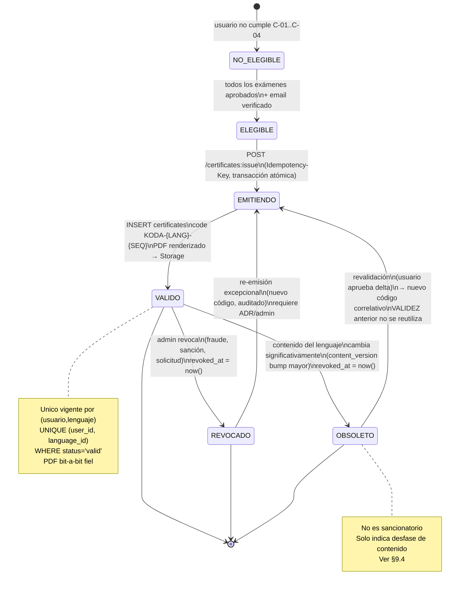

# 17 — Sistema de Certificación

> **Estado:** En planificación · **Versión del documento:** 1.0.0 · **Fecha:** 2026-08-29
> Complementa a `01_PROJECT_OVERVIEW.md` §21–§22, `04_SCOPE.md` §6–§7, `05_FUNCTIONAL_REQUIREMENTS.md` (RF-CERT-001–006, RF-PDF-001–004, RF-AUTH-005, RF-EVAL-003/005), `11_SYSTEM_ARCHITECTURE.md` §12, `12_DATABASE_DESIGN.md` §6.17, `14_LEARNING_SYSTEM.md` §4–§10 y `15_QUIZ_EXAM_SYSTEM.md`. No duplica; especifica el comportamiento verificable del Certification Engine y del pipeline de PDF/QR/verificación.

---

## 1. Propósito y alcance

Este documento es la **fuente de verdad de certificación**. Define bajo qué condiciones se emite un certificado, qué datos contiene, cómo se identifica, versiona, exporta a PDF, verifica y protege contra duplicados y falsificaciones.

**Dentro del alcance:**
- Condiciones de elegibilidad, porcentaje mínimo y módulos/exámenes requeridos.
- Datos incluidos, identificador `KODA-PY-000001`, generación de PDF y almacenamiento.
- Verificación interna por ID/QR, código QR, estados y transiciones.
- Reglas anti-duplicado y anti-falsificación.
- Naturaleza del certificado (finalización de plataforma, no título profesional oficial).
- Contratos de API, modelo de datos y trazabilidad RF/RNF.

**Fuera del alcance:**
- Calificación de quizzes/exámenes (ver `15`), cálculo de progreso adaptativo (ver `14`), pagos/premium (ver `11` §14) y diseño visual fino (ver `27_UI_UX_SPECIFICATION.md`). La verificación pública externa es Post-MVP (`04` §3).

**Principio rector:** el certificado acredita **comprensión verificada en servidor**. Nunca se emite por tiempo en plataforma, por pago, ni por diagnóstico (`05` RF-DIAG-006); solo por exámenes aprobados con trazabilidad de versión y umbral.

---

## 2. Referencias cruzadas

| Referencia | Qué aporta |
|---|---|
| `01` §21–§22, §5 paso 16–17 | Campos mínimos del certificado y formato `KODA-PY-000001` con QR opcional |
| `04` §6–§7 | Límites educativos y de certificación: un certificado por lenguaje, no equivale a título profesional |
| `05` RF-CERT-001–006, RF-PDF-001–004 | Requisitos verificables de emisión, datos, ID, QR, re-emisión, verificación y PDF |
| `11` §12, §6–§17 | Certification Engine, flujo `¿Todos los exámenes aprobados? → Email verificado → ID+QR → PDF → Storage` |
| `12` §6.17 | Tabla `certificates`, `certificate_sequences`, constraints e índices |
| `14` §3–§4, §10.2 | Estados de módulo y `Progreso_lenguaje = 100% ⇔ Lenguaje COMPLETADO ⇔ habilita certificado` |
| `15` §8–§9 | Porcentajes, umbrales versionados (quiz 70 / examen 80) y cálculo `round(P_obt/P_max*100,2)` |
| `06` RNF-033–036, RNF-042 | Atomicidad, inmutabilidad de intentos, versionado y idempotencia |

---

## 3. Naturaleza del certificado — aclaración normativa

> **Este certificado es un certificado de finalización de la plataforma, no un título profesional oficial ni una certificación académica/profesional con validez externa.**

| Aspecto | Declaración |
|---|---|
| Qué acredita | Que el titular completó y aprobó todos los módulos y exámenes de un lenguaje dentro de la plataforma, conforme a `14` y `15`. |
| Qué no acredita | Equivalencia a título universitario, técnico, ni certificación profesional oficial de terceros (`04` §6). |
| Validez | Interna a la plataforma; verificable por ID/QR dentro de la plataforma. Verificación pública externa es Post-MVP. |
| Texto obligatorio en PDF y verificación | *"Certificado de finalización emitido por Koda. No constituye título profesional oficial ni certificación académica externa. Verificable en https://koda.app/verificar/{code} con código KODA-..."* |
| Uso recomendado | Portafolio personal, perfil, LinkedIn como evidencia de finalización; no como credencial regulada. |

Esta aclaración debe aparecer **siempre** en el PDF (§10) y en la vista de verificación (§11), y nunca puede omitirse por configuración de plantilla.

---

## 4. Condiciones para obtener el certificado

Un certificado se genera **si y solo si** se cumplen **todas** las condiciones siguientes en el momento de la solicitud (evapythondas en servidor, `05` RF-EVAL-006):

### 4.1 Condiciones obligatorias

| # | Condición | Validación | Origen |
|---|---|---|---|
| C-01 | El usuario está autenticado y su cuenta está en estado `activo`. | `users.status = 'active'` | `05` RF-USR-004, `12` §6.1 |
| C-02 | El email del usuario está verificado. | `users.email_verified_at IS NOT NULL` | `05` RF-AUTH-005, RF-CERT-001 |
| C-03 | Existe un `lenguaje` en estado `disponible` (en MVP solo `PY`). | `programming_languages.status = 'available'` | `05` RF-LANG-001 |
| C-04 | **Todos** los módulos del lenguaje están en estado `APROBADO` para el usuario. | `∀ módulo ∈ lenguaje.modulos : estado = APROBADO` (`14` §4.3, I1) | `05` RF-CERT-001, `04` §7 |
| C-05 | Cada módulo `APROBADO` tiene al menos un intento de examen `APROBADO` con el umbral vigente al momento de calificar. | `attempts.kind='exam' AND is_passed=true AND percent >= threshold_applied` | `05` RF-EXAM-003/005, `12` §6.12 |
| C-06 | No existe un certificado en estado `valid` para el mismo par `(usuario, lenguaje)`. | `UNIQUE (user_id, language_id) WHERE status='valid'` | `05` RF-CERT-005, `12` §6.17 |
| C-07 | El contenido del lenguaje no ha sido marcado como obsoleto tras la emisión (ver §7). | `certificates.language_content_version = languages.content_version` | `05` RF-CERT-005 |

### 4.2 Qué no otorga certificado

- Diagnóstico aprobado o re-tomado (`05` RF-DIAG-006).
- Quizzes aprobados sin examen aprobado (`14` RN-04).
- Módulos en `OMITIDO_POR_DIAGNOSTICO` sin examen aprobado (`14` §3.1, §4.2 regla 4).
- Progreso 100% por secciones completadas sin exámenes (`14` §10.2).
- Pago de Premium (`04` §8).

### 4.3 Idempotencia de la solicitud

```
POST /v1/certificates:issue  { language_id } + Idempotency-Key
→ Si ya existe solicitud con misma key y mismo usuario/lenguaje → 200 con mismo certificado (no duplica)
→ Si C-06 falla (ya hay valid) → 409 CERT_ALREADY_EXISTS
→ Si C-04 falla → 422 CERT_REQUIREMENTS_NOT_MET + detalle { modulos_pendientes: [...] }
```

---

## 5. Porcentaje mínimo y umbrales

### 5.1 Umbrales aplicables

El certificado no fija un porcentaje único global; exige **aprobar cada examen** con su umbral vigente al momento del intento (`05` RF-EVAL-005).

| Evapythonción | Umbral inicial | Configurable | Efecto |
|---|---|---|---|
| Quiz | 70% (`threshold.quiz`) | Sí, 50–90% sin despliegue (`15` §18) | No bloquea certificado; solo es formativo |
| Examen | **80%** (`threshold.exam`) | Sí, 60–95% | **Debe ser ≥ umbral para que el módulo cuente como APROBADO** |

```
Examen APROBADO ⇔ porcentaje = round(P_obt / P_max * 100, 2) ≥ umbral_examen_vigente_al_momento_del_intento
Módulo APROBADO ⇔ ∃ intento_examen del módulo : APROBADO
Lenguaje COMPLETADO ⇔ ∀ modulo ∈ lenguaje.modulos : APROBADO
```

### 5.2 Versionado de umbrales

- Cada `attempt` persiste `threshold_applied` y `content_version` (`12` §6.12, `15` §9.1).
- Cambiar el umbral (ej. 80→75) **no re-califica** intentos históricos (`05` RF-EVAL-005, `06` RNF-035).
- Un módulo aprobado con umbral 80 sigue aprobado aunque el umbral baje; y un módulo reprobado con 80 no se vuelve aprobado retroactivamente.

### 5.3 Ejemplo de verificación

Lenguaje Python, 12 módulos. Usuario con 11 exámenes en 85% y 1 examen en 79.99% (umbral 80):

```
11 módulos APROBADO, 1 módulo REPROBADO → Lenguaje ≠ COMPLETADO → C-04 falla → 422
Si reintenta ese examen y obtiene 81.00% → 12/12 APROBADO → C-04 pasa → emite KODA-PY-000042
```

---

## 6. Módulos y exámenes requeridos

### 6.1 Módulos requeridos

- **Todos los módulos publicados del lenguaje en su `content_version` vigente al emitir.** En MVP Python: **12 módulos** (`01` §34): Fundamentos, Variables y tipos de datos, Operadores, Condicionales, Bucles, Funciones, Listas y colecciones, Diccionarios y estructuras, Manejo de errores, POO, Archivos, Proyecto final.
- Si el catálogo del lenguaje crece (Post-MVP), el certificado exige los N módulos vigentes; un certificado emitido con N=12 no se invalida automáticamente salvo §7 (cambio significativo).
- Módulos en `archived` no cuentan; solo `published` (`14` §13.2).

### 6.2 Exámenes requeridos

| Requisito | Valor |
|---|---|
| Exámenes por módulo | **1 examen final por módulo** (`05` RF-EXAM-001, `12` §6.11 `UNIQUE (module_id) WHERE deleted_at IS NULL` en MVP) |
| Cantidad total para Python MVP | **12 exámenes aprobados** (uno por módulo) |
| Composición por examen | 20 preguntas por defecto, configurable 15–25 (`15` §5.2), estratificada por tipo y dificultad |
| Quizzes | **No requeridos** para certificar; son formativos (`14` RN-04). Un módulo sin quiz aprobado pero con examen aprobado sí certifica. |
| Diagnóstico | **No requerido** ni sustitutivo (`05` RF-DIAG-006) |
| Repaso | **No requerido** |

### 6.3 Casos especiales

- **OMITIDO_POR_DIAGNOSTICO:** el usuario ubicado en M5 con M1–M4 omitidos **no certifica** hasta aprobar los exámenes de M1–M4 (`14` §4.2). No existe certificación con módulos omitidos sin examen.
- **Re-toma de diagnóstico:** no borra exámenes aprobados (`14` §5.4) y no reduce el conjunto requerido.
- **Módulo REPROBADO:** siguiente módulo permanece BLOQUEADO (`05` RF-EXAM-004); el certificado permanece bloqueado hasta aprobarlo.

---

## 7. Datos incluidos en el certificado

### 7.1 Datos obligatorios (RF-CERT-002)

Todo certificado persiste un `metadata` JSONB snapshot inmutable y lo renderiza en PDF y verificación:

| Campo | Fuente | Ejemplo | Obligatorio |
|---|---|---|---|
| `titular_nombre` | `user_profiles.display_name` | Brandon Quiroz | Sí |
| `titular_documento` | `user_profiles.document_number` | CC 1.234.567.890 | Sí (si no existe, el PDF muestra "Documento no registrado" y la emisión exige completarlo) |
| `lenguaje_nombre` | `programming_languages.name` | Python | Sí |
| `lenguaje_code` | `programming_languages.code` | PY | Sí |
| `fecha_finalizacion` | `certificates.issued_at` en `America/Bogota` | 2026-08-29 | Sí |
| `identificador_unico` | `certificates.code` | KODA-PY-000001 | Sí |
| `plataforma_nombre` | Config `platform.name` (ej. Koda) | Koda | Sí |
| `estado` | `certificates.status` | VÁLIDO | Sí |
| `version_contenido_lenguaje` | `certificates.language_content_version` | 3 | Sí (trazabilidad) |
| `qr_payload` | `certificates.qr_payload` (URL de verificación) | https://.../verificar/KODA-PY-000001 | Sí |
| `texto_aclaratorio_no_oficial` | Fijo (§3) | "Certificado de finalización..." | Sí |

### 7.2 Datos opcionales incluidos en `metadata`

`duracion_total`, `promedio_examenes`, `xp_total_al_emitir`, `logros_relevantes`, `hash_pdf_sha256`. Nunca se incluye PII de terceros ni datos de otros usuarios (`05` RF-CERT-006, `06` RNF-037).

---

## 8. Identificador único — formato `KODA-PY-000001`

### 8.1 Gramática

```
CODE = "KODA-" + LANG_CODE + "-" + SEQ_6

donde:
  "KODA"      = prefijo fijo de la plataforma (Koda) (`01` §22)
  LANG_CODE   = programming_languages.code en mayúsculas, [A-Z0-9_]+, ej. PY, JS, PY, GO
  SEQ_6       = correlativo por lenguaje, 6 dígitos con ceros a la izquierda, 000001..999999
```

**Regex de validación (BD + API):**

```
^KODA-[A-Z0-9_]+-[0-9]{6}$   (en BD `12` §6.17: '^KODA-[A-Z]+-[0-9]{6}$' — ampliar a [A-Z0-9_]+ si se usan códigos con guion bajo)
```

### 8.2 Generación correlativa por lenguaje

No se usa `SERIAL` global. Se usa tabla `certificate_sequences` (`12` §6.17):

```sql
-- Transacción atómica en Certification Engine
UPDATE certificate_sequences
   SET last_seq = last_seq + 1
 WHERE language_id = $1
RETURNING last_seq;  -- ej. 42

code = 'KODA-' || lang_code || '-' || LPAD(last_seq::text, 6, '0');
-- ej. KODA-PY-000042
INSERT INTO certificates (id, user_id, language_id, code, ...) VALUES (...);
```

- Correlativo **por lenguaje**: `KODA-PY-000001` y `KODA-JS-000001` coexisten.
- Sin huecos visibles intencionales; un rollback de transacción puede dejar hueco y es aceptable (no se recicla).
- Concurrencia: `UPDATE ... RETURNING` con lock de fila garantiza unicidad sin duplicados.

### 8.3 Ejemplos

| Lenguaje | Secuencia | Código |
|---|---|---|
| Python | 1 | `KODA-PY-000001` |
| Python | 42 | `KODA-PY-000042` |
| JavaScript | 1 | `KODA-JS-000001` |
| Python | 7 | `KODA-PY-000007` |

---

## 9. Estados del certificado y diagrama

### 9.1 Catálogo de estados (BD `12` §6.17)

| Estado | Valor BD | Significado | Visible al titular | Verificación |
|---|---|---|---|---|
| **Válido** | `valid` | Certificado vigente y verificable | Sí, con PDF y QR | "VÁLIDO" |
| **Revocado** | `revoked` | Invalidado por solicitud, fraude o sanción | Sí, marcado como revocado | "REVOCADO" |
| **Obsoleto** | `obsolete` | Contenido del lenguaje cambió significativamente; se exige revalidación (`05` RF-CERT-005) | Sí, con CTA de revalidación | "OBSOLETO — Requiere revalidación" |

> `11` §12 usa los alias `vigente/obsoleto/revalidado`; aquí `valid/revoked/obsolete` es el valor canónico en BD. `revalidado` es un nuevo `valid` tras re-emisión.

### 9.2 Diagrama de estados (Mermaid)



### 9.3 Transiciones normativas

| Origen | Evento | Guarda | Destino | Efecto colateral |
|---|---|---|---|---|
| `NO_ELEGIBLE` | `cumplir C-01..C-04` | `∀ módulo APROBADO + email verificado` | `ELEGIBLE` | CTA "Generar certificado" habilitado |
| `ELEGIBLE` | `issue` | `Idempotency-Key` único + `certificate_sequences` lock | `VALIDO` | `code` asignado, `issued_at=now()`, `language_content_version` congelada, `qr_payload` y `google_drive_file_id` generados |
| `VALIDO` | `revoke` | Solo `admin` (`RF-ADM-007`), motivo obligatorio, auditado (`RF-ADM-008`) | `REVOCADO` | `revoked_at=now()`, PDF marcado, verificación responde REVOCADO |
| `VALIDO` | `content_major_bump` | `languages.content_version` incrementa por cambio significativo (ver §9.4) | `OBSOLETO` | `revoked_at=now()`, se notifica al titular, CTA revalidación |
| `OBSOLETO` | `revalidate` | Usuario aprueba exámenes delta del nuevo contenido | `EMITIENDO→VALIDO` | Nuevo `code` con siguiente `SEQ`, `language_content_version` nueva, anterior permanece `obsolete` |

### 9.4 Cuándo un cambio de contenido vuelve obsoleto un certificado

- **Cambio menor** (typos, explicación, reorden de secciones sin afectar evapythonción): `content_version` patch → **no obsoleta**.
- **Cambio significativo** (nuevo módulo, examen con nueva composición, cambio de umbral que altera dominio): `content_version` major → **obsoleta** todos los `valid` de ese lenguaje. Decisión registrada por admin con `reason` y `content_version` (`05` RF-CERT-005, `12` metadata).
- Los intentos históricos conservan `content_version` evapythonda (`06` RNF-035); la obsolescencia no re-califica intentos.

---

## 10. Generación de PDF y Almacenamiento en Google Drive

### 10.1 Pipeline 100% Backend (NestJS CertificationModule, RF-PDF-001–004)

Por motivos de seguridad e integridad criptográfica, **el frontend NUNCA genera el archivo PDF ni tiene acceso a las credenciales de almacenamiento**. Todo el ciclo de validación, renderizado, almacenamiento y entrega se realiza exclusivamente en el backend (NestJS):

```
                                  [Usuario solicita PDF]
                                             │
                                             ▼
                          [GET /api/v1/certificates/{id}/pdf]
                                             │
                                             ▼
                           ┌───────────────────────────────────┐
                           │ ¿Ya existe certificado 'valid'    │
                           │ con google_drive_file_id en BD?   │
                           └─────────────────┬─────────────────┘
                                             │
                       ┌─────────────────────┴─────────────────────┐
                       ▼ SÍ (Caché / Pre-existente)                ▼ NO (Primera emisión)
       ┌───────────────────────────────────────┐   ┌───────────────────────────────────────┐
       │ 1. Descargar stream de Google Drive   │   │ 1. Validar C-01..C-07 en Supabase     │
       │    (drive.files.get alt='media')      │           │ 2. Reservar SEQ atómico (KODA-PY-000001)
       │ 2. Pipe directo a HTTP Response       │   │ 3. Renderizar PDF + QR en Node.js     │
       │    (Descarga inmediata en <200 ms)    │   │ 4. Subir a Google Drive (Service Acc) │
       └───────────────────────────────────────┘   │ 5. Guardar google_drive_file_id y SHA │
                                                   │ 6. Pipe del binario a HTTP Response   │
                                                   └───────────────────────────────────────┘
```

### 10.2 Reglas de Caché e Idempotencia (Sin Re-generación)

1. **Detección Previa de PDF:** Antes de renderizar cualquier PDF, el servicio `CertificationService` consulta en Supabase:
   ```sql
   SELECT id, code, google_drive_file_id, status 
   FROM certificates 
   WHERE id = $1 AND user_id = $2 AND status = 'valid';
   ```
2. **Reutilización Inmediata:** Si el registro ya posee un `google_drive_file_id` válido, se omite por completo el proceso de renderizado con `@react-pdf/renderer` o `pdfkit` y la llamada de subida a Drive. El backend únicamente solicita el stream de lectura a Google Drive API v3 y lo transmite al cliente.
3. **Ahorro de Recursos:** Garantiza 0 duplicados de archivos en Google Drive y latencia de respuesta mínima ($< 200\text{ ms}$).

### 10.3 Integración con Google Drive API v3 (Service Account)

- **Autenticación del Servidor:** Se utiliza una Cuenta de Servicio (*Google Cloud Service Account*) con permisos limitados sobre una carpeta raíz designada (`GOOGLE_DRIVE_ROOT_FOLDER_ID`).
- **Estructura de Carpetas:**
  ```
  Google Drive: Koda_Certificados/
  ├── python/
  │   ├── KODA-PY-000001_v1.pdf
  │   └── KODA-PY-000002_v1.pdf
  └── python/
      ├── KODA-PY-000001_v1.pdf
      └── KODA-PY-000002_v1.pdf
  ```
- **Metadatos en Supabase:** Se almacena `google_drive_file_id`, el hash `pdf_sha256` y `storage_provider = 'google_drive'`.
- **Descarga Autenticada:** El endpoint `GET /api/v1/certificates/{id}/pdf` exige `Authorization: Bearer <token>` y valida que `user_id == req.user.id` (salvo administradores). No se expone ningún enlace público de Google Drive al cliente.

### 10.4 Contenido del PDF

Todo PDF incluye (§7.1 + §3):

- Encabezado: nombre de la plataforma + logo oficial de Koda.
- Título: "Certificado de Finalización".
- Cuerpo: "Se certifica que **[titular_nombre]** (Documento: [documento]) completó y aprobó todos los módulos del lenguaje **[lenguaje_nombre]** el **[fecha_finalizacion America/Bogota]**.".
- Identificador: `KODA-PY-000001` / `KODA-PY-000001` destacado.
- Estado: VÁLIDO.
- Código QR (ver §12) con URL de verificación interna (`https://koda.app/verificar/KODA-...`).
- Aclaración normativa no oficial (§3) en pie de página.
- Sello y firma digital de la plataforma + `pdf_version` y `language_content_version`.
- Metadatos del documento: `Title`, `Author=Koda`, `Subject=Certificado [Lenguaje]`, `Keywords=code, python`.

### 10.3 Ejemplo de PDF (representación textual)

```
┌─────────────────────────────────────────────────────────────────┐
│  ███ Koda — Plataforma de Aprendizaje                      │
│                                                                 │
│              CERTIFICADO DE FINALIZACIÓN                        │
│                                                                 │
│  Se certifica que                                               │
│                                                                 │
│              Brandon Quiroz                                     │
│              CC 1.234.567.890                                   │
│                                                                 │
│  completó y aprobó todos los módulos del lenguaje               │
│                                                                 │
│              Python                                             │
│                                                                 │
│  el 29 de agosto de 2026 (America/Bogota).                      │
│                                                                 │
│  Código:  KODA-PY-000042                    Estado: VÁLIDO       │
│  Versión de contenido: 3                  Plantilla: v1         │
│                                                                 │
│  ┌──────────┐  Verificación:                                     │
│  │ ▄▄▄▄▄▄▄▄ │  https://koda.app/verificar/KODA-PY-000042 │
│  │ █ QR   █ │  Escanea para verificar dentro de la plataforma   │
│  │ ▀▀▀▀▀▀▀▀ │                                                    │
│  └──────────┘                                                    │
│                                                                 │
│  ─────────────────────────────────────────────────────────────   │
│  Certificado de finalización emitido por Koda.             │
│  No constituye título profesional oficial ni certificación      │
│  académica externa. Verificable en la URL/QR indicados.         │
│                                                                 │
│  [Sello Koda]                     [Firma digital plataforma]│
└─────────────────────────────────────────────────────────────────┘
```

---

## 11. Verificación

### 11.1 Verificación interna (MVP, RF-CERT-004/006)

Disponible sin autenticación para confirmar titularidad mínima sin exponer PII de terceros:

| Endpoint | Método | Auth | Descripción |
|---|---|---|---|
| `/v1/certificates/verify/{code}` | `GET` | No (público interno) | Verifica por código `KODA-PY-000001` |
| `/v1/certificates/verify?qr={payload}` | `GET` | No | Verifica por payload de QR (URL o código) |

**Respuesta — VÁLIDO (200):**

```json
{
  "code": "KODA-PY-000042",
  "status": "valid",
  "language": { "code": "PY", "name": "Python" },
  "holder": { "display_name": "B. Quiroz" },
  "issued_at": "2026-08-29T14:30:00-05:00",
  "platform": "Koda",
  "language_content_version": 3,
  "pdf_version": 1,
  "holder_document_masked": "CC ***7890"
}
```

**Respuesta — REVOCADO (200 con status):**

```json
{ "code": "KODA-PY-000042", "status": "revoked", "revoked_at": "2026-09-01T10:00:00-05:00", "reason": "content_obsolete" }
```

**Respuesta — No existe (404):**

```json
{ "code": "CERT_NOT_FOUND", "message": "Código no encontrado" }
```

- Nunca expone `email`, `document_number` completo ni progreso de otros usuarios (`05` RF-CERT-006, `06` RNF-037).
- Rate limited (`06` RNF-009) para evitar enumeración.
- Log de verificación sin PII (`06` RNF-040).

### 11.2 Verificación pública externa

Post-MVP (`04` §3). El diseño ya deja hook: `qr_payload` es URL estable (`/verificar/{code}`) que en MVP resuelve a verificación interna y en Post-MVP podrá ser página pública.

---

## 12. Código QR

### 12.1 Especificación

| Atributo | Valor |
|---|---|
| Estándar | QR Code ISO 18004, nivel de corrección `M` o `Q` |
| Payload | **URL de verificación** `https://{platform_domain}/verificar/{code}` — ej. `https://koda.app/verificar/KODA-PY-000042` |
| Alternativa offline | Si no hay dominio, `code` puro `KODA-PY-000042` es válido y la app lo resuelve a `/verify/{code}` |
| Tamaño en PDF | ≥ 2×2 cm, con margen quiet zone |
| Generación | En servidor al emitir, librería configurable (ej. `qrcode` con `errorCorrectionLevel: M`); se versiona con `pdf_version` |
| Persistencia | `certificates.qr_payload` (`12` §6.17) guarda la URL exacta renderizada |

### 12.2 Validación de QR

```
QR escaneado → GET /verificar/KODA-PY-000042 → 302 a /v1/certificates/verify/KODA-PY-000042 → JSON de §11.1
```

Un QR que no resuelve a un `code` con regex `^KODA-[A-Z0-9_]+-[0-9]{6}$` se rechaza como `CERT_INVALID_FORMAT`.

---

## 13. Reglas contra duplicados y falsificaciones

### 13.1 Anti-duplicados (emisión)

| Regla | Mecanismo | Origen |
|---|---|---|
| Un vigente por (usuario, lenguaje) | `UNIQUE (user_id, language_id) WHERE status='valid'` + check en servicio antes de INSERT | `12` §6.17, `05` RF-CERT-005 |
| Código único global | `UNIQUE (code)` + `certificate_sequences` con `UPDATE ... RETURNING` atómico | `12` §6.17 |
| Idempotencia de emisión | `Idempotency-Key` por usuario con TTL 24h (`06` RNF-042); reenvío no crea segundo certificado | `05` regla 3, `11` §6.4 |
| No emite sin exámenes | Guardas C-04/C-05 en transacción; `diagnóstico` y `premium` no bypass | `05` RF-CERT-001 |
| Email verificado obligatorio | `email_verified_at IS NOT NULL` | `05` RF-AUTH-005 |

### 13.2 Anti-falsificación (verificación y PDF)

| Regla | Mecanismo | Origen |
|---|---|---|
| Fuente de verdad en servidor | Toda validación (C-01..C-07, `%`, desbloqueo, ID) se decide en servidor; el cliente nunca decide elegibilidad (`05` RF-EVAL-006) | `05` RF-EVAL-006 |
| PDF fiel al registro | `SHA-256(pdf_bytes)` persistido en `metadata.pdf_sha256` y validado en `RF-PDF-003`; test `pdf_sha256 == sha256(pdf_descargado)` | `05` RF-PDF-003 |
| QR verificable solo por plataforma | QR contiene URL de la plataforma; cualquier copia del PDF sin registro en BD responde `CERT_NOT_FOUND` al verificar | `05` RF-CERT-004/006 |
| Inmutabilidad de intentos | `attempts` inmutable tras `graded` (`12` §6.12); no se puede fabricar un examen aprobado editando historial | `06` RNF-033–035 |
| Versionado y auditoría | `certificates.language_content_version`, `pdf_version`, `issued_at`, `revoked_at`, `audit_log` con quién/qué/cuándo (`05` RF-ADM-008) | `12` §6.17, `05` RF-ADM-008 |
| Storage no enumerable | `google_drive_file_id` no adivinable sin `code`; enlace firmado de Drive con TTL; descarga exige ser titular | `05` RF-PDF-002/004 |
| Rate limit y no enumeración | Verificación con rate limit por IP, sin listar certificados de terceros, mensajes `404` genéricos | `06` RNF-009, `05` RF-AUTH-006 patrón |
| Revocación visible | `revoked`/`obsolete` se muestran como no válidos en verificación; el PDF de un revocado sigue existiendo pero la verificación lo marca | `05` RF-CERT-005 |

### 13.3 Qué nunca se hace

- No se re-emite un certificado reutilizando el mismo `code`; toda re-emisión genera nuevo `SEQ`.
- No se edita un certificado `valid` con `UPDATE`; se revoca y se emite uno nuevo (inmutabilidad lógica).
- No se expone PII completa en verificación pública.
- No se permite al usuario auto-revocar certificados de otro usuario (`05` RF-USR-005).

---

## 14. Ciclo de vida y revalidación

```
Aprendizaje → Exámenes aprobados → ELEGIBLE → EMITIENDO → VALIDO
                                                  ↓ content_major_bump
                                               OBSOLETO → (usuario aprueba delta) → VALIDO (nuevo código)
                                                  ↓ fraude/sanción
                                               REVOCADO
```

- **Notificación:** al emitir, revocar u obsoletar se notifica al titular (email/push si consiente).
- **Revalidación tras obsolescencia:** el usuario aprueba los exámenes nuevos/delta del `content_version` vigente; no repite todo el lenguaje salvo que el bump lo exija. El nuevo certificado tiene nuevo `code` y deja el anterior en `obsolete`.
- **Conservación de historial:** `12` conserva todos los certificados (valid/revoked/obsolete) para auditoría de `26_ANALYTICS.md`.

---

## 15. API y contratos (referencia para `13_API_SPECIFICATION.md`)

### 15.1 Endpoints

| Método | Endpoint | Auth | Descripción | RF |
|---|---|---|---|---|
| `POST` | `/v1/certificates:issue` | JWT (titular) | Emite si C-01..C-07; body `{ language_id }` + `Idempotency-Key` | RF-CERT-001, RNF-042 |
| `GET` | `/v1/users/me/certificates` | JWT | Lista certificados del titular con `code, language, issued_at, status, pdf_url` | RF-PROF-005 |
| `GET` | `/v1/certificates/{code}` | JWT (titular/admin) | Detalle completo del certificado | RF-CERT-002 |
| `GET` | `/v1/certificates/{code}/pdf` | JWT (titular/admin) | Redirect a enlace firmado de Google Drive del PDF | RF-PDF-002 |
| `GET` | `/v1/certificates/verify/{code}` | No | Verificación interna (§11.1) | RF-CERT-006 |
| `GET` | `/verificar/{code}` | No | Página/redirect de QR (§12.2) | RF-CERT-004 |
| `POST` | `/v1/admin/certificates/{code}:revoke` | RBAC admin | Revoca con `{ reason }` | RF-CERT-005 |
| `POST` | `/v1/admin/certificates/{code}:reissue` | RBAC admin | Re-emite (nuevo SEQ) si procede | RF-CERT-005 |

### 15.2 Errores

| Código | HTTP | Cuándo |
|---|---|---|
| `CERT_REQUIREMENTS_NOT_MET` | 422 | C-04/C-05 no cumplidos; `details.modulos_pendientes` |
| `CERT_ALREADY_EXISTS` | 409 | Ya existe `valid` para (usuario, lenguaje) |
| `CERT_EMAIL_NOT_VERIFIED` | 403 | C-02 falla |
| `CERT_NOT_FOUND` | 404 | `code` no existe |
| `CERT_REVOKED` | 200* | Verificación de revocado (no es error, es estado) |
| `CERT_INVALID_FORMAT` | 400 | `code` no matchea `^KODA-[A-Z0-9_]+-[0-9]{6}$` |

---

## 16. Modelo de datos (referencia, DDL en `12`)

```sql
-- Tabla principal (12 §6.17)
certificates (
  id UUID PK,
  user_id UUID FK → users.id NOT NULL,
  language_id UUID FK → programming_languages.id NOT NULL,
  code VARCHAR(20) UNIQUE NOT NULL CHECK (code ~ '^KODA-[A-Z]+-[0-9]{6}$'),
  status VARCHAR(20) NOT NULL CHECK (status IN ('valid','revoked','obsolete')) DEFAULT 'valid',
  language_content_version INTEGER NOT NULL,
  issued_at TIMESTAMPTZ NOT NULL DEFAULT now(),
  revoked_at TIMESTAMPTZ NULL,
  google_drive_file_id VARCHAR(512) NULL,
  pdf_version INTEGER NOT NULL DEFAULT 1,
  qr_payload VARCHAR(512) NOT NULL,
  metadata JSONB NOT NULL DEFAULT '{}',
  created_at TIMESTAMPTZ NOT NULL,
  updated_at TIMESTAMPTZ NOT NULL,
  CONSTRAINT chk_cert_revoked CHECK ((status='valid' AND revoked_at IS NULL) OR (status IN ('revoked','obsolete') AND revoked_at IS NOT NULL)),
  CONSTRAINT uq_cert_user_lang_valid UNIQUE (user_id, language_id) WHERE status='valid'
);

certificate_sequences (
  language_id UUID PK FK,
  last_seq INTEGER NOT NULL DEFAULT 0
);
```

Índices: `uq_certificates_code`, `uq_certificates_user_lang_valid` (partial), `idx_certificates_user (user_id, issued_at DESC)`, `idx_certificates_language`, `idx_certificates_status`.

---

## 17. Configuración administrable (sin despliegue)

| Clave | Tipo | Default | Descripción |
|---|---|---|---|
| `platform.name` | string | Koda | Nombre mostrado en certificado y verificación |
| `platform.domain` | string | koda.app | Dominio para `qr_payload` URL |
| `certificate.code_prefix` | string | KODA | Prefijo del código |
| `certificate.seq_digits` | int | 6 | Dígitos de SEQ (padding) |
| `pdf.template_version` | int | 1 | Versión de plantilla PDF |
| `pdf.signed_url_ttl_seconds` | int | 600 | TTL de URL firmada de descarga |
| `cert.content_obsolete_policy` | enum | major_only | Cuándo marcar obsoleto: `major_only` vs `any_bump` |

Cambios versionados y auditados (`05` RF-ADM-005/008).

---

## 18. Trazabilidad

| Elemento de este doc | RF (`05`) | RNF (`06`) | Referencia |
|---|---|---|---|
| Condiciones C-01..C-07 | RF-CERT-001, RF-AUTH-005 | RNF-033 | `11` §12 |
| Porcentaje mínimo 80% por examen | RF-EXAM-003, RF-EVAL-002/005 | — | `15` §8–§9 |
| Módulos/exámenes requeridos (12/12) | RF-CERT-001, RF-MOD-003, RF-EXAM-001 | — | `14` §10.2 |
| Datos incluidos | RF-CERT-002 | RNF-037 | `12` §6.17 `metadata` |
| ID `KODA-PY-000001` correlativo | RF-CERT-003 | — | `12` §6.17 `certificate_sequences` || Generación PDF | RF-PDF-001–004 | RNF-004 | `11` §12 |
| Verificación interna | RF-CERT-006 | RNF-009/037 | `11` §12 |
| Código QR | RF-CERT-004 | — | `11` §12 |
| Estados valid/revoked/obsolete | RF-CERT-005 | — | `12` §6.17 |
| Anti-duplicados/falsificación | RF-CERT-005, RF-EVAL-006, RF-PDF-003 | RNF-033/035/042 | §13 |
| Aclaración no profesional | — | — | `04` §6 |

---

## 19. Criterios de aceptación

- [ ] No se puede emitir certificado si falta un examen aprobado o el email no está verificado (test de guardas C-01..C-07).
- [ ] El porcentaje se calcula como `round(P_obt/P_max*100,2)` y se compara con `≥ threshold_applied` del intento; umbrales versionados no re-califican historial.
- [ ] Un certificado por lenguaje vigente (`UNIQUE WHERE valid` pasa bajo concurrencia con `certificate_sequences`).
- [ ] Código siempre `KODA-{LANG}-{SEQ6}` validado por regex en BD y API.
- [ ] PDF incluye todos los datos de `RF-CERT-002` + QR + aclaración no oficial + `pdf_version`; `SHA-256` coincide con `metadata.pdf_sha256`.
- [ ] Verificación por `code` y por QR retorna `valid/revoked/obsolete` sin exponer PII completa; `rate limit` y `404` genérico funcionan.
- [ ] Revocación y obsolescencia por bump mayor cambian verificación y conservan historial.
- [ ] Reintento con mismo `Idempotency-Key` no duplica certificado ni `SEQ`.
- [ ] Texto de no-oficialidad presente en PDF y verificación; no configurable para omitirse.

---

## 20. Riesgos y mitigaciones

| Riesgo | Mitigación |
|---|---|
| Emisión sin dominio (falsos positivos) | Guardas C-04/C-05 en transacción; `Evapythontion Engine` como única fuente de aprobación |
| Certificados duplicados por carrera | `UNIQUE partial` + `certificate_sequences` atómico + `Idempotency-Key` |
| PDF desincronizado del registro | `RF-PDF-003` + test `sha256`; plantilla versionada |
| Falsificación por edición de PDF | Verificación por `code`/QR contra BD es la única verdad; PDF sin registro no verifica |
| Enumeración de certificados | Verificación sin listado, `rate limit`, `404` genérico, `holder_document_masked` |
| Pérdida de PDFs | Storage Google Drive con copias de seguridad (`06` RNF-043); `google_drive_file_id` recuperable |

---

*Fin de `17_CERTIFICATION.md` — cualquier cambio en condiciones, porcentajes, módulos/exámenes requeridos, datos, formato de ID, PDF, verificación, QR, estados o reglas anti-fraude requiere actualizar este documento, `05`, `11`, `12`, `13`, `14`, `15`, `04` y `CHANGELOG.md` con fecha `America/Bogota`.*
