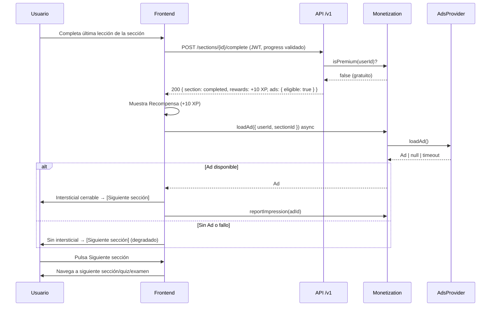
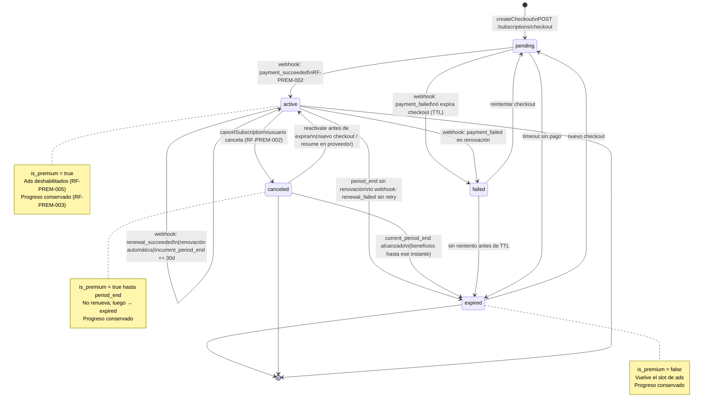

# 18 — Sistema de Monetización

> **Estado:** En planificación · **Versión del documento:** 1.0.0 · **Fecha:** 2026-08-29
> Complementa a `01_PROJECT_OVERVIEW.md` §23, `03_OBJECTIVES.md` OE-07 / OUX-07, `04_SCOPE.md` §2.6 / §8, `05_FUNCTIONAL_REQUIREMENTS.md` RF-ADS / RF-PREM / RF-PROG, `06_NON_FUNCTIONAL_REQUIREMENTS.md` RNF-014 / RNF-037–RNF-040, `11_SYSTEM_ARCHITECTURE.md` §13–§14, `12_DATABASE_DESIGN.md` §6.18, `13_API_SPECIFICATION.md` §5 y `16_GAMIFICATION.md` P-07. No duplica su contenido; lo especifica de forma implementable y auditable.
> **Principio rector:** la monetización nunca condiciona el aprendizaje. Gratuito y Premium acceden al mismo contenido educativo; la diferencia es la presencia o ausencia de publicidad (`04` §8, `16` P-07). Zona horaria canónica: `America/Bogota` (UTC-5).

---

## 1. Propósito y alcance

Este documento es la **fuente de verdad de monetización**. Define:

- Qué incluye el **Plan Gratuito** y qué incluye el **Plan Premium** (USD $1/mes).
- **Cuándo y dónde** aparece publicidad y bajo qué reglas.
- **Qué eventos** pueden disparar un anuncio.
- **Qué ocurre al adquirir Premium** (activación inmediata, transición de estado, efecto en la experiencia).
- **Ciclo de vida de la suscripción:** estados, renovación, cancelación y expiración.
- **Abstracción de pagos** sin asumir proveedor específico.
- Diagrama de estados, tabla comparativa, contratos de API, modelo de datos y criterios de aceptación.

**Fuera del alcance:** tarifas futuras por lenguaje, marketplace de terceros, editor/ejecución de código y precios regionales — se diseñan como extensiones sin romper este contrato. El detalle de motor de pagos externo se abstrae tras interfaz.

---

## 2. Referencias cruzadas

| Referencia | Qué aporta |
|---|---|
| `01` §23 | Modelo gratuito con ads entre secciones y Premium USD $1/mes sin anuncios |
| `03` OE-07 / OUX-07 | Objetivo de negocio y regla UX: publicidad nunca interrumpe un ejercicio |
| `04` §2.6 / §8 | Alcance MVP de monetización y límites del modelo de negocio |
| `05` RF-ADS-001–005 | Requisitos de publicidad: audiencia, ubicación, carga async, métricas, abstracción |
| `05` RF-PREM-001–006 | Requisitos Premium: oferta, ciclo, conservación de progreso, abstracción de pagos, efecto inmediato, auditoría |
| `06` RNF-014 / RNF-037–040 / RNF-041 | Degradado ante fallo de ads, privacidad y formato de errores |
| `11` §13–§14 | Arquitectura de Monetization (Ads + Premium) y contratos `AdsProvider` / `PaymentProvider` |
| `12` §6.18 | Tabla `subscriptions` y secuencia `certificate_sequences` |
| `13` §5 | Endpoints `/ads` y `/subscriptions` |
| `16` §5–§11 | Reglas de XP y filosofía no punitiva que la monetización respeta |

---

## 3. Principios de monetización

| # | Principio | Regla operativa |
|---|---|---|
| PM-01 | **Aprendizaje primero** | Ninguna decisión de monetización bloquea lecciones, quizzes o exámenes. El progreso siempre persiste (`RF-PROG-001`). |
| PM-02 | **Igualdad de contenido** | Gratuito y Premium ven el mismo catálogo, ruta y evaluaciones. Premium no desbloquea módulos adicionales en MVP (`04` §8). |
| PM-03 | **Publicidad no intrusiva** | Un único slot entre secciones; nunca intra-ejercicio, intra-quiz, intra-examen ni intra-repaso (`RF-ADS-002`, OUX-07). |
| PM-04 | **Degradado obligatorio** | Fallo del proveedor de anuncios o de pagos no impide estudiar. Mensaje no bloqueante + registro del intento (`RNF-014`, `RF-ADS-003`). |
| PM-05 | **Conservación de progreso** | Cambiar entre Gratuito ↔ Premium nunca borra XP, rachas, logros ni certificados (`RF-PREM-003`). |
| PM-06 | **Abstracción de proveedores** | Ni la red de anuncios ni la pasarela de pagos se hardcodean en el núcleo. Todo pasa por interfaces versionadas (`RF-ADS-005`, `RF-PREM-004`). |
| PM-07 | **Transparencia y privacidad** | Solo métricas esenciales de ads (impresión/clic anonimizado); sin fingerprinting ni cross-site; ningún dato de progreso se comparte con la red de anuncios (`RF-ADS-004`, `RNF-040`). |
| PM-08 | **Precio configurable** | USD $1/mes es el precio inicial; es configurable sin despliegue vía `25_ADMIN_SYSTEM.md` (`RF-PREM-001`). |

---

## 4. Plan Gratuito

### 4.1 Definición

Plan por defecto para todo usuario registrado. No requiere pago, no tiene fecha de expiración y es el estado inicial de toda cuenta (`users` sin `subscriptions.active`).

### 4.2 Funciones incluidas

- Acceso completo a **todo el contenido educativo del MVP:** selección de lenguaje (Lua disponible), módulos, secciones, lecciones, ejercicios, quizzes, exámenes, repaso, perfil, progreso, rachas y logros (`04` §2.1–§2.5).
- Diagnóstico inicial y ruta personalizada (`14`).
- Certificación al completar todos los módulos con verificación interna por ID/QR y PDF (`17`).
- Sesiones reanudables sin pérdida (`RNF-023`).

### 4.3 Publicidad en el plan gratuito

- **Ubicación única:** `Sección completada → Pantalla de Recompensa → Publicidad (intersticial) → Siguiente sección` (`01` §23, `05` RF-ADS-001).
- **No hay publicidad** durante lecciones, ejercicios, quizzes, exámenes, repaso ni pantallas de perfil/certificado (`RF-ADS-002`).
- **Carga asíncrona y no bloqueante:** el anuncio se solicita en paralelo a la pantalla de recompensa; si tarda o falla, el botón `Siguiente sección` permanece habilitado (`RF-ADS-003`, `RNF-014`).
- **Frecuencia:** como máximo **1 anuncio por sección completada**. No hay anuncios por ejercicio individual ni por navegación.

### 4.4 Limitaciones del plan gratuito

| Aspecto | Limitación |
|---|---|
| Interrupciones | Intersticial entre secciones (máx. 1 por sección) |
| Contenido | Ninguna: mismo contenido que Premium en MVP |
| Progreso/XP/rachas/logros | Ninguna: idénticos a Premium |
| Certificados | Ninguna: misma elegibilidad |
| Soporte | Estándar; Premium no otorga soporte diferenciado en MVP |

> En MVP el plan gratuito no tiene cuota de lecciones diarias ni bloqueo temporal. Cualquier paywall de contenido requeriría ADR y actualización de `04` §8.

### 4.5 Eventos que pueden mostrar publicidad

Solo el **evento `section_completed`** es elegible. Desglose:

| Evento | ¿Puede mostrar anuncio? | Condición | Slot |
|---|---|---|---|
| `lesson_completed` (lección individual) | **No** | Lección no es unidad de monetización | Ninguno |
| `section_completed` | **Sí** | Todas las lecciones obligatorias de la sección completadas (`RF-SEC-003`) + usuario `is_premium == false` | Intersticial post-recompensa |
| `quiz_attempt_submitted` | **No** | Evaluación formativa; interrumpir rompe feedback <2s (`RNF-012`) | Ninguno |
| `exam_attempt_submitted` | **No** | Evaluación certificante; bloqueo pedagógico (`RF-EXAM-004`) | Ninguno |
| `review_session_completed` | **No** | Repaso no penaliza ni interrumpe (`RF-REP-004`) | Ninguno |
| `diagnostic_completed` | **No** | Ubicación, no monetización | Ninguno |
| `certificate_issued` | **No** | Hito; sin anuncio | Ninguno |
| `profile/certificates/languages` navegación | **No** | Navegación informativa | Ninguno |

**Flujo detallado del slot:**

```
Sección completada (Progress Engine confirma RF-SEC-003)
  → Gamification Engine otorga +10 XP (configurable)
  → Frontend muestra Pantalla de Recompensa (XP, barra, racha)
  → En paralelo: AdsProvider.loadAd({ userId, sectionId })
  → Si is_premium == false y Ad != null → render intersticial con [Cerrar / Siguiente sección]
  → Si is_premium == true → no se solicita anuncio (RF-PREM-005)
  → Si AdsProvider falla/timeout → degradado: no se muestra anuncio, flujo continúa, se registra metric ads_failed
  → Usuario pulsa Siguiente sección → navega a siguiente Sección/Quiz/Examen
```

**Reglas de slot:**

1. El intersticial debe ser **cerrable con 1 toque** y nunca auto-reproduce sonido sin interacción (accesibilidad `RNF-024`).
2. Duración máxima sugerida 5–30 s; el usuario puede cerrar anticipadamente y continuar aprendiendo.
3. Métricas registradas: `ads.requested`, `ads.served`, `ads.impression`, `ads.closed`, `ads.failed` — todas seudonimizadas (`RNF-040`).

---

## 5. Plan Premium

### 5.1 Definición

Plan de suscripción mensual que elimina toda publicidad y ofrece experiencia continua sin interrupciones. **Precio inicial: USD $1/mes** (`01` §23, `05` RF-PREM-001). El precio es **configurable sin despliegue** y versionado vía `content/admin config` (`RNF-017`).

### 5.2 Funciones incluidas

- **Todo lo del plan gratuito**, más:
- **Sin anuncios:** el slot intersticial entre secciones nunca se solicita ni se renderiza (`RF-PREM-005`).
- **Experiencia continua:** transición `Recompensa → Siguiente sección` sin pausa publicitaria.
- **Conservación total:** XP, niveles, rachas, logros, progreso por lenguaje y certificados idénticos a gratuito; cambiar de plan no muta estos datos (`RF-PREM-003`).
- **Acceso conservado a rutas:** ninguna ruta se bloquea por expiración; solo reaparece el slot de ads.

> **En MVP no hay contenido exclusivo Premium.** No desbloquea módulos, preguntas, lenguajes adicionales ni certificados diferentes (`04` §8). Cualquier beneficio adicional (ej. racha congelada extra, temas cosméticos) es Post-MVP y requiere ADR + actualización de `04` y `05`.

### 5.3 Precio y configuración

| Atributo | Valor inicial | Configurable | Dónde se edita |
|---|---|---|---|
| `plan_code` | `premium_monthly` | Sí (futuros planes) | `25_ADMIN_SYSTEM.md` |
| `amount_cents` | `100` | Sí | Admin config `billing.plans.premium_monthly.amount_cents` |
| `currency` | `USD` | Sí | `billing.plans.premium_monthly.currency` |
| `interval` | `month` (30 días) | Sí (Post-MVP: anual) | `billing.plans.premium_monthly.interval` |
| `trial_days` | `0` en MVP | Sí | `billing.plans.premium_monthly.trial_days` |

Cambios de precio aplican solo a **períodos futuros**; el período ya pagado conserva el precio con el que se contrató (auditado en `subscriptions.amount_cents`).

---

## 6. Tabla comparativa

| Característica | **Gratuito** | **Premium — USD $1/mes** |
|---|---:|---|
| Acceso a lenguajes, módulos, secciones, lecciones y ejercicios | ✅ Completo | ✅ Completo |
| Quizzes y exámenes (70% / 80% umbral) | ✅ | ✅ |
| Repaso priorizado | ✅ | ✅ |
| XP, niveles, rachas, logros, perfil y estadísticas | ✅ | ✅ |
| Certificado `KODA-{LANG}-{SEQ}` + QR + PDF | ✅ (requiere email verificado) | ✅ |
| Sesión reanudable sin pérdida | ✅ | ✅ |
| Publicidad entre secciones | **Sí — 1 intersticial por `section_completed`** | **No — 0 anuncios** (`RF-PREM-005`) |
| Interrupciones durante ejercicio/quiz/examen | Nunca | Nunca |
| Progreso conservado al cambiar de plan | ✅ | ✅ (sin pérdida al expirar/cancelar) |
| Precio | **$0** | **USD $1/mes** (configurable) |
| Renovación automática | No aplica | Sí (mientras esté `active`) |
| Gestión de suscripción (renovar/cancelar/expirar) | No aplica | ✅ Ver §8 |

---

## 7. Sistema de publicidad — Especificación cerrada

### 7.1 Invariantes

| ID | Regla | Origen |
|---|---|---|
| AD-01 | Solo usuarios con `is_premium == false` reciben anuncios | `RF-ADS-001` |
| AD-02 | Solo entre secciones completadas, nunca intra-evaluación | `RF-ADS-002`, OUX-07 |
| AD-03 | Carga asíncrona; fallo no bloquea aprendizaje | `RF-ADS-003`, `RNF-014` |
| AD-04 | Solo métricas esenciales anonimizadas; sin compartir progreso con red de ads | `RF-ADS-004`, `RNF-040` |
| AD-05 | Red de anuncios tras interfaz `AdsProvider` intercambiable | `RF-ADS-005` |

### 7.2 Contrato abstracto — `AdsProvider`

Ningún motor importa un SDK concreto. El núcleo depende de la interfaz:

```ts
// Contrato abstracto — implementación intercambiable (ver 11 §13)
interface AdsProvider {
  loadAd(context: { userId: string, sectionId: string, languageId: string }): Promise<Ad | null>
  reportImpression(adId: string, context: { userId: string, sectionId: string }): Promise<void>
  reportClick?(adId: string): Promise<void> // opcional en MVP
}

type Ad = {
  id: string
  creativeUrl: string
  clickUrl?: string
  durationSeconds?: number
  provider: string // solo para auditoría, no para lógica de negocio
}
```

- `loadAd` debe resolver en < 2 s p95; pasado ese umbral el frontend hace fallback a no mostrar.
- Si retorna `null`, no hay inventario: no se muestra nada y el flujo continúa.
- El proveedor concreto (AdMob, custom, `mock` para tests) se inyecta por configuración `ads.provider` y requiere ADR al elegirse (`11` §19).

### 7.3 Secuencia



Para usuario Premium, `isPremium(userId) == true` → `ads.eligible = false` y `loadAd` nunca se invoca.

---

## 8. Sistema Premium — Ciclo de vida de la suscripción

### 8.1 Qué ocurre al adquirir Premium

1. El usuario pulsa **"Pasar a Premium — USD $1/mes"** en perfil, banner de ruta o pantalla de recompensa.
2. El frontend solicita `POST /subscriptions/checkout` → el backend delega a `PaymentProvider.createCheckout(userId, planId)` y retorna `checkout_url` (abstracta).
3. El usuario completa el pago en la pasarela externa (fuera del núcleo).
4. La pasarela notifica al sistema vía **webhook** `POST /webhooks/payments` → `PaymentProvider.handleWebhook(event)` valida firma, idempotencia y monto.
5. El sistema crea o actualiza `subscriptions` a `status = active`, con `current_period_start = now()`, `current_period_end = now() + 30 días`, `provider_subscription_id` y `amount_cents = 100`.
6. **Efecto inmediato** (`RF-PREM-005`): `is_premium(userId)` pasa a `true` en < 1 s tras procesar el webhook; toda verificación posterior `isPremium?` en el gateway omite el slot de ads sin necesidad de re-login ni refresh de token.
7. Progreso, XP, rachas y logros permanecen intactos (`RF-PREM-003`). Se emite evento auditado `subscription_activated`.
8. El usuario ve confirmación, badge `★ Premium` en perfil y la ruta sin intersticiales.

> La pasarela nunca entrega datos de tarjeta al núcleo; solo `provider_subscription_id` y eventos (`RNF-037`). El webhook es idempotente por `provider_event_id`.

### 8.2 Estados de la suscripción

Modelo canónico (`05` RF-PREM-002, `12` §6.18):

| Estado | Código | Significado | ¿Tiene beneficios Premium? | ¿Renueva automáticamente? |
|---|---|---|---|---|
| **Pendiente** | `pending` | Checkout creado, pago aún no confirmado | No | No |
| **Activa** | `active` | Período vigente y pago confirmado | **Sí** | Sí |
| **Cancelada** | `canceled` | Usuario canceló renovación; período vigente hasta `current_period_end` | **Sí hasta `current_period_end`** | No |
| **Expirada** | `expired` | Período vencido sin renovación | No | No |
| **Fallida** | `failed` | Intento de pago rechazado | No | Según política de reintentos del proveedor |

- Un usuario tiene **máximo una** suscripción `active` o `canceled` vigente a la vez (`UNIQUE WHERE status IN ('active','canceled','pending')` recomendado).
- El flag derivado `user.is_premium` equivale a `exists(subscriptions where user_id = ? and status in ('active','canceled') and current_period_end > now())`. Es decir, cancelada sigue siendo Premium hasta que expira (`§8.5`).

### 8.3 Diagrama de estados



### 8.4 Tabla de transiciones

| Origen | Evento | Guarda | Destino | Efecto colateral |
|---|---|---|---|---|
| `∅` | `createCheckout` | Usuario autenticado, plan `premium_monthly` existe | `pending` | `provider_subscription_id = null`, `checkout_url` retornada, evento `checkout_created` |
| `pending` | `payment_succeeded` (webhook) | Firma válida, `provider_event_id` no duplicado, monto = `amount_cents` | `active` | `current_period_start = now()`, `current_period_end = now()+30d`, `is_premium = true` inmediato, `subscription_activated` auditado |
| `pending` | `payment_failed` o `checkout_expired` | — | `failed` | Mensaje al usuario, CTA reintentar |
| `failed` | `createCheckout` (reintento) | — | `pending` | Nuevo checkout, idempotencia por usuario |
| `active` | `renewal_succeeded` (webhook periódico) | Firma válida, suscripción aún `active` | `active` | `current_period_end += 30d`, evento `subscription_renewed` |
| `active` | `cancelSubscription` (usuario) | `status == active` | `canceled` | `canceled_at = now()`, `is_premium` sigue `true` hasta `current_period_end`, evento `subscription_canceled` |
| `canceled` | `period_end alcanzado` (job diario `America/Bogota`) | `now() >= current_period_end` | `expired` | `is_premium = false`, reaparece ads, evento `subscription_expired` |
| `active` | `renewal_failed` sin reintento exitoso | Proveedor agotó reintentos o `period_end` vencido | `expired` | `is_premium = false`, evento `subscription_expired` |
| `active` | `payment_failed` en renovación | — | `failed` | Estado transitorio; si no se recupera antes de `period_end`, transita a `expired` |
| `canceled` | `reactivate` | `now() < current_period_end` y pasarela permite `resume` | `active` | `canceled_at = null`, renueva desde `period_end` original, evento `subscription_reactivated` |
| `expired` | `createCheckout` | — | `pending` | Nuevo ciclo completo |

**Reglas de invariantes:**

- Toda transición persiste `provider_event_id` para idempotencia de webhook (`RNF-042`).
- Ninguna transición borra `xp_transactions`, `progress`, `streaks` ni `certificates` (`RF-PREM-003`).
- `is_premium` se recalcula por lectura de `subscriptions` en cada request autenticado; no se cachea en JWT para evitar desfase tras webhook (el `access_token` de 15 min puede cachear `is_premium` solo como hint visual, la decisión autoritativa es en API).

### 8.5 Renovación

- **Automática por defecto** mientras `status == active`. El proveedor cobra cada 30 días; al confirmar `renewal_succeeded`, el backend extiende `current_period_end` +30 días de forma transaccional.
- **Idempotencia:** cada `provider_event_id` se procesa una sola vez (`UNIQUE provider_event_id` en tabla de eventos de webhook).
- **Gracia:** si la renovación falla temporalmente, el proveedor puede reintentar según su política (ej. 3 reintentos en 72 h). Durante la ventana de reintentos `status` permanece `active` hasta `current_period_end`; el usuario conserva Premium. Si ningún reintento prospera y `now() >= current_period_end` → `expired`.
- **Precio:** la renovación usa `amount_cents` vigente al momento del cobro; si el admin cambió el precio, el período ya pagado no se recalcula y el siguiente sí refleja el nuevo precio (comunicado previamente si hay incremento).

### 8.6 Cancelación

- **Voluntaria, en cualquier momento** vía `POST /subscriptions/{id}/cancel` (autenticado, solo titular, `RF-PREM-002`).
- Efecto: `status → canceled`, `canceled_at = now()`. **No hay reembolso prorrateado en MVP**; el usuario conserva beneficios Premium hasta `current_period_end` (fecha ya pagada).
- El proveedor recibe `PaymentProvider.cancelSubscription(provider_subscription_id)`; la cancelación es a fin de período (no inmediata).
- El usuario puede **reactivar** antes de `current_period_end` vía nuevo checkout o `resume` si el proveedor lo soporta; si reactiva, vuelve a `active` sin perder días pagados.
- Cancelar no borra progreso ni certificados y no impide volver a suscribirse tras `expired`.

### 8.7 Expiración

- **Causa:** `now() >= current_period_end` sin renovación exitosa, sea por cancelación previa o por fallo de cobro agotado.
- **Job diario:** tarea programada (cron en `America/Bogota`) que marca `status → expired` donde `status IN ('active','canceled') and current_period_end <= now()`.
- **Efecto inmediato:** `is_premium = false`; el siguiente `section_completed` vuelve a ser elegible para anuncio (`RF-ADS-001`). El usuario ve banner informativo no bloqueante: *"Tu Premium expiró — sigues conservando todo tu progreso. Renueva cuando quieras."*
- **Progreso:** permanece intacto. Si el usuario vuelve a pagar, nuevo `pending → active` sin pérdida (`RF-PREM-003`).
- **Auditoría:** evento `subscription_expired` con `user_id`, `subscription_id`, `expired_at`.

---

## 9. Pagos — Abstracción de proveedor

### 9.1 Principio de no-asunción (`04` §4, `06` §2.4)

El núcleo nunca importa `stripe`, `paypal` ni ningún SDK concreto. Todo pasa por la interfaz:

```ts
// Contrato abstracto — implementación intercambiable (ver 11 §14)
interface PaymentProvider {
  createCheckout(userId: string, planId: string): Promise<{ checkoutUrl: string, providerCheckoutId: string }>
  handleWebhook(rawEvent: RawEvent): Promise<SubscriptionEvent>
  cancelSubscription(providerSubscriptionId: string): Promise<void>
  // Post-MVP opcional: resumeSubscription, getSubscription, refund
}

type SubscriptionEvent =
  | { type: 'payment_succeeded', providerSubscriptionId: string, providerEventId: string, amountCents: number, currency: string, periodStart: string, periodEnd: string }
  | { type: 'payment_failed', providerSubscriptionId: string, providerEventId: string, reason: string }
  | { type: 'renewal_succeeded', providerSubscriptionId: string, providerEventId: string, periodEnd: string }
  | { type: 'renewal_failed', providerSubscriptionId: string, providerEventId: string, reason: string }
```

### 9.2 Proveedores y configuración

| Concepto | Detalle |
|---|---|
| `payments.provider` | `mock` en MVP/tests, `stripe`/`paypal`/otro en prod — elegido vía config, no hardcodeado (`RF-PREM-004`) |
| `mock` | Implementación en memoria que simula `payment_succeeded` inmediato sin red externa; usada en `dev` y E2E |
| `stripe` / `paypal` | Cada uno en un adaptador que traduce su webhook a `SubscriptionEvent` canónico |
| `webhook secret` | Almacenado en vault/env, nunca en repo ni en logs (`RNF-008`) |
| `provider_subscription_id` | Se persiste en `subscriptions.provider_subscription_id`; nunca se persisten datos de tarjeta en el núcleo (`RNF-037`) |

Elegir proveedor concreto requiere ADR en `09-decisions/` (`11` §19).

### 9.3 Seguridad y privacidad

- Validación de firma de webhook en `handleWebhook` antes de cualquier mutación.
- `provider_event_id` con `UNIQUE` para idempotencia; reenvío del mismo evento no duplica transición ni extiende el período dos veces (`RNF-042`).
- Ningún dato de tarjeta, CVV ni token sensible se almacena en BD del núcleo (`RNF-037`).
- Logs de pagos con `request_id` y `user_id` anonimizado; sin PII de pago (`RNF-045`).

---

## 10. Modelo de datos (referencia, no DDL)

> DDL autoritativo en `12_DATABASE_DESIGN.md` §6.18. Aquí solo campos mínimos para implementar este documento.

- `subscriptions(id, user_id, status, plan_code, amount_cents, currency, provider, provider_subscription_id, current_period_start, current_period_end, canceled_at, trial_ends_at, created_at, updated_at, deleted_at)`
  - `CHECK (status IN ('active','expired','canceled','pending','failed'))` — `RF-PREM-002`
  - `UNIQUE (code)` no aplica; `UNIQUE (user_id) WHERE status IN ('active','pending')` evita dobles activos
  - `amount_cents DEFAULT 100, currency DEFAULT 'USD'` — `RF-PREM-001`
  - `provider_subscription_id` nullable hasta webhook

- `payment_events(id, provider, provider_event_id, type, payload_json, processed_at, created_at)` — `UNIQUE (provider, provider_event_id)` para idempotencia

- `ads_events(id, user_id, section_id, ad_id, event_type, created_at)` — `event_type IN ('requested','served','impression','closed','failed')` para `RF-ADS-004`

**Derivación de `is_premium`:**

```sql
-- ¿Es premium ahora? (lectura autoritativa en cada request)
SELECT EXISTS (
  SELECT 1 FROM subscriptions
  WHERE user_id = $1
    AND status IN ('active','canceled')
    AND current_period_end > now()
) AS is_premium;
```

`canceled` cuenta como premium hasta `current_period_end` (§8.2).

Índices críticos: `(user_id, status, current_period_end)`, `(provider, provider_event_id)` unique, `(user_id, created_at)` en `ads_events`.

---

## 11. API y contratos (referencia para `13_API_SPECIFICATION.md`)

### 11.1 Endpoints de monetización

| Método | Endpoint | Auth | Descripción | RF |
|---|---|---|---|---|
| `GET` | `/subscriptions/plans` | No | Lista planes (solo `premium_monthly` en MVP con precio vigente) | `RF-PREM-001` |
| `POST` | `/subscriptions/checkout` | Sí (USER) | Crea checkout → `{ checkout_url, subscription_id, plan_code }` | `RF-PREM-001` |
| `GET` | `/subscriptions/me` | Sí (USER) | Suscripción vigente + `is_premium`, `current_period_end`, `status` | `RF-PREM-002/005` |
| `POST` | `/subscriptions/{id}/cancel` | Sí (USER, titular) | Cancela renovación a fin de período → `canceled` | `RF-PREM-002` |
| `POST` | `/subscriptions/{id}/reactivate` | Sí (USER, titular) | Reactiva antes de expirar si el proveedor lo permite | `§8.6` |
| `POST` | `/webhooks/payments` | No (firma de proveedor) | Webhook idempotente de pagos → `SubscriptionEvent` | `RF-PREM-002/006` |
| `GET` | `/ads/status?section_id=` | Sí (USER) | ¿Elegible para anuncio? `{ eligible, reason }` (`free_user_between_sections` | `premium_no_ads` | `not_between_sections`) | `RF-ADS-001/002` |

`POST /sections/{id}/complete` ya retorna `ads: { show_interstitial: bool, reason }` para el slot (§4.5) — no requiere endpoint adicional.

### 11.2 Reglas transversales

- `X-Request-Id` en toda respuesta y `request_id` en errores (`RNF-041`, `RNF-045`).
- `Idempotency-Key` en `POST /subscriptions/checkout` y en webhooks (por `provider_event_id`) (`RNF-042`).
- Rate limiting en `POST /subscriptions/checkout` y `POST /webhooks/payments` por IP/usuario.
- Webhook valida firma antes de mutar; firma inválida → `401` sin efecto.

### 11.3 Ejemplo de respuestas

**`GET /subscriptions/me` — usuario Premium activo:**

```json
{
  "data": {
    "subscription": {
      "id": "sub_0f8a...",
      "status": "active",
      "plan_code": "premium_monthly",
      "amount_cents": 100,
      "currency": "USD",
      "current_period_start": "2026-08-29T10:00:00-05:00",
      "current_period_end": "2026-09-28T10:00:00-05:00",
      "provider": "stripe",
      "is_premium": true
    }
  },
  "meta": { "request_id": "b3e1a...", "timestamp": "2026-08-29T15:04:05-05:00" }
}
```

**`GET /subscriptions/me` — usuario gratuito o expirado:**

```json
{
  "data": { "subscription": null, "is_premium": false },
  "meta": { "request_id": "b3e1a...", "timestamp": "2026-08-29T15:04:05-05:00" }
}
```

---

## 12. Frontend — Experiencia de usuario

### 12.1 Dónde aparece Premium

| Ubicación | Gratuito | Premium |
|---|---|---|
| Banner en ruta / perfil | CTA "Pasar a Premium — $1/mes · Sin anuncios" | Badge `★ Premium activo hasta 28 sep` |
| Pantalla de recompensa tras `section_completed` | `Recompensa → (Intersticial si hay Ad) → Siguiente` | `Recompensa → Siguiente` (sin pausa) |
| Checkout | Botón que abre `checkout_url` en nueva pestaña/redirect | No aplica |
| Perfil → Suscripción | "Sin suscripción activa" | Estado, período, botón Cancelar / Reactivar |

### 12.2 Reglas de UI

- El intersticial tiene botón **Cerrar (X)** siempre visible y accesible por teclado (WCAG AA `RNF-024`).
- Nunca se muestra más de 1 intersticial seguido; no hay cascada de anuncios.
- Mensajes de expiración/cancelación son **no bloqueantes** (toast/banner) y no impiden estudiar.
- `is_premium` del API es la fuente de verdad visual; el frontend no decide por sí mismo si mostrar ads.

---

## 13. Configurabilidad (sin despliegue)

Toda la monetización vive en config versionada (`05` RF-ADM-004, `06` RNF-017):

```yaml
# monetization.config.yaml (versionado, editable vía admin)
version: 3
ads:
  enabled: true
  provider: mock              # mock | stripe-ads | custom
  slot: between_sections      # único slot en MVP
  max_per_section: 1
  timeout_ms: 2000
  metrics: [requested, served, impression, closed, failed]

billing:
  provider: mock              # mock | stripe | paypal
  webhook_secret_ref: env.PAYMENTS_WEBHOOK_SECRET
  plans:
    premium_monthly:
      amount_cents: 100
      currency: USD
      interval: month
      interval_count: 1
      trial_days: 0
      cancel_at_period_end: true
  renewal:
    grace_retries: 3
    grace_window_hours: 72
  expiration:
    job_cron: "0 3 * * *"
    timezone: America/Bogota
```

- Cambios aplican en < 5 min a eventos **futuros**; suscripciones ya activas conservan `amount_cents` histórico.
- Auditoría: quién, qué, cuándo, versión anterior/nueva (`05` RF-ADM-008).

---

## 14. Observabilidad y métricas

| Métrica | Tipo | Uso |
|---|---|---|
| `ads.requested / served / impression / closed / failed` | Negocio (ads) | Inventario y salud del proveedor; seudonimizado (`RNF-040`) |
| `ads.eligible_rate` | Negocio | % de `section_completed` que califica para slot (debe ser ~100% de gratuitos) |
| `subscription.checkout_created / activated / renewed / canceled / expired / failed` | Negocio (billing) | Funnel de conversión gratuito → premium |
| `subscription.mrr_cents` | Negocio | `SUM(amount_cents) WHERE is_premium` |
| `subscription.churn_rate` | Negocio | Cancelaciones + expiraciones / activos en ventana |
| `payments.webhook_invalid_signature` | Técnica | Intentos de fraude/spoof |
| `payments.webhook_duplicate` | Técnica | Reenvíos idempotentes |

Logs estructurados con `request_id`, `user_id` anonimizado, `subscription_id`, `provider_event_id` y `America/Bogota` (`RNF-018`, `RNF-045`). Ningún log contiene datos de tarjeta.

---

## 15. Trazabilidad

| Elemento de este doc | RF (`05`) | US (`07` prevista) | RNF (`06`) |
|---|---|---|---|
| Plan gratuito §4 | `RF-ADS-001` | US-060–US-066 | `RNF-014` |
| Eventos elegibles §4.5 | `RF-ADS-001/002` | US-066 | `RNF-014` |
| Carga async y degradado §4.3/§7 | `RF-ADS-003` | US-066 | `RNF-014` |
| Métricas anonimizadas §4.3/§14 | `RF-ADS-004` | — | `RNF-040`, `RNF-037` |
| `AdsProvider` abstracto §7.2 | `RF-ADS-005` | — | — |
| Oferta $1/mes §5 | `RF-PREM-001` | US-066 | — |
| Ciclo y estados §8.2–§8.7 | `RF-PREM-002` | US-066 | `RNF-042` |
| Conservación de progreso §5.2/§8.1 | `RF-PREM-003` | US-066 | `RNF-034` |
| `PaymentProvider` abstracto §9 | `RF-PREM-004` | — | `RNF-037` |
| Efecto inmediato sin ads §8.1 | `RF-PREM-005` | US-066 | — |
| Auditoría de facturación §8–§9 | `RF-PREM-006` | — | `RNF-018`, `RNF-045` |
| Tabla comparativa §6 | `RF-ADS-001`, `RF-PREM-001/003/005` | US-066 | — |

---

## 16. Criterios de aceptación

- [ ] Plan gratuito accede a todo el contenido educativo; solo muestra intersticial tras `section_completed` si `is_premium == false`.
- [ ] Ningún ejercicio, quiz, examen o repaso muestra publicidad (test de invariante `RF-ADS-002` pasa).
- [ ] Fallo/timeout de `AdsProvider` no bloquea `Siguiente sección`; degradado verificado con mock que falla (`RNF-014`).
- [ ] Plan Premium USD $1/mes elimina todo anuncio de forma inmediata tras webhook `payment_succeeded` (sin re-login).
- [ ] Cambio de plan (gratuito ↔ premium) conserva XP, rachas, logros, progreso y certificados (test de conservación `RF-PREM-003` pasa).
- [ ] Estados `pending → active → canceled → expired` y `failed` transitan según diagrama §8.3; webhook idempotente no duplica período (`RNF-042`).
- [ ] Renovación automática extiende `current_period_end` +30d de forma transaccional; cancelación conserva beneficios hasta `period_end` y luego expira.
- [ ] Expiración por `current_period_end` revierte `is_premium` a `false` y reaparece el slot; sin pérdida de progreso.
- [ ] Ningún dato de tarjeta se persiste en el núcleo; `provider_subscription_id` es la única referencia externa (`RNF-037`).
- [ ] Solo métricas esenciales seudonimizadas a la red de anuncios; ningún dato de progreso se comparte (`RNF-040`).
- [ ] Precio y proveedor son configurables sin despliegue y auditados (`RNF-017`, `RF-ADM-008`).

---

## 17. Riesgos y mitigaciones

| Riesgo | Impacto | Mitigación en este doc |
|---|---|---|
| Anuncio bloquea aprendizaje | Viola `RF-ADS-002` / OUX-07 | Slot único entre secciones + async + degradado + test de invariante |
| Proveedor de ads caído | Pérdida de ingreso | `RNF-014`: no bloquea flujo; métrica `ads.failed` alerta |
| Webhook spoofeado | Suscripción falsa | Validación de firma + `provider_event_id` unique + log `webhook_invalid_signature` |
| Doble cobro por reenvío de webhook | Período extendido incorrectamente | Idempotencia por `provider_event_id` (`RNF-042`) |
| Datos de tarjeta en BD | Incumplimiento privacidad | `RF-PREM-004`: solo `provider_subscription_id`; `RNF-037` |
| Usuario paga y sigue viendo ads | Desconfianza | `is_premium` autoritativo en API, actualizado en <1s tras webhook |
| Cancelación borra progreso | Abandono | `RF-PREM-003`: invariante de conservación con test |

---

## 18. Decisiones abiertas (requieren ADR si se cambian)

- Si se introduce un segundo plan (ej. anual con descuento), agregar `plan_code = premium_yearly` sin romper `premium_monthly`; requiere ADR de pricing.
- Si se decide que Premium otorgue beneficios pedagógicos (ej. freeze extra de racha), requiere ADR y actualización de `04` §8 y `16` §7.4 — en MVP está explícitamente prohibido.
- Si se añade un segundo slot de ads (ej. entre módulos), requiere ADR y revisión de OUX-07 y `RF-ADS-002`.

---

*Fin de `18_MONETIZATION.md` — cualquier cambio en planes, precios, slots de publicidad, estados de suscripción, renovación/cancelación/expiración o abstracción de pagos requiere actualizar este documento, `05_FUNCTIONAL_REQUIREMENTS.md` si afecta RF, `11_SYSTEM_ARCHITECTURE.md` / `12_DATABASE_DESIGN.md` / `13_API_SPECIFICATION.md` si afecta contratos, y `CHANGELOG.md` con fecha `America/Bogota`.*
