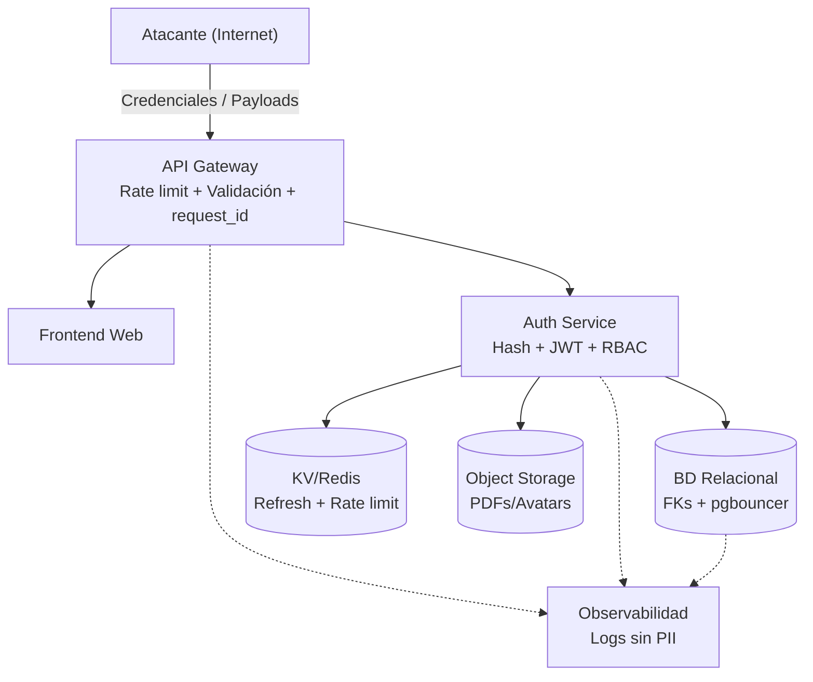
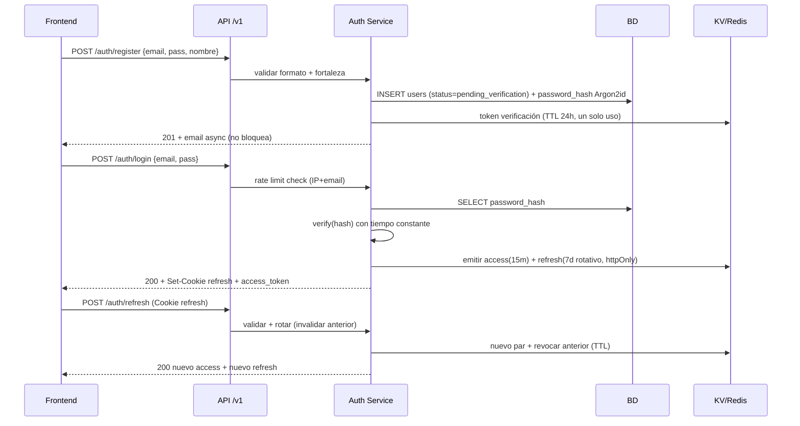
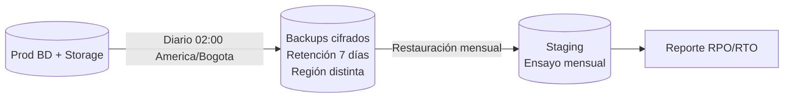

# 19 — Seguridad

> **Estado:** En planificación · **Versión del documento:** 1.0.0 · **Fecha:** 2026-08-29
> Complementa a `01_PROJECT_OVERVIEW.md` (§5 flujo, §21 certificación, §24 motores), `03_OBJECTIVES.md` (OT-04 a OT-06), `04_SCOPE.md` (§2.8, §9, §10), `05_FUNCTIONAL_REQUIREMENTS.md` (RF-AUTH-001 a 008, RF-USR-001 a 006, RF-CERT-002/003, RF-PDF-002, RF-ADM-007/008), `06_NON_FUNCTIONAL_REQUIREMENTS.md` (RNF-008, RNF-009, RNF-013, RNF-018, RNF-037 a RNF-045), `11_SYSTEM_ARCHITECTURE.md` (§7 Auth, §21 Seguridad transversal, §22 Observabilidad), `12_DATABASE_DESIGN.md` (§2.3, §6.1/6.2/6.17), `13_API_SPECIFICATION.md` (§3, §4, §8) y anticipa `20_TESTING.md`, `21_DEPLOYMENT.md`, `26_ANALYTICS.md`. No duplica; define controles verificables.

---

## 1. Propósito y alcance

Este documento es la **fuente de verdad de seguridad** de la plataforma. Define **qué se protege, contra qué amenazas y con qué controles** para el MVP descrito en `04` §2 (Python como único lenguaje disponible, arquitectura multi-lenguaje desde el día uno). Es referencia para diseño (`11`), datos (`12`), API (`13`), motores (`14`–`18`), despliegue (`21`) y pruebas (`20`).

**Sí incluye:** autenticación, contraseñas, sesiones, tokens, autorización, protección de datos, validación de entradas, protección contra abuso, rate limiting, seguridad de API, datos de certificados, datos personales (con especial cuidado), número de documento, logs y copias de seguridad. Cada sección incluye amenazas y mitigaciones con trazabilidad a `RF-*`/`RNF-*`.

**Fuera de alcance:** elección cerrada de proveedor de WAF/CDN/KV concreto (se especifica interfaz y criterio, elección requiere ADR en `09-decisions/`), y detalle de hardening de infraestructura cloud (`21`). La ejecución de código del estudiante es Post-MVP (`04` §4) y no se modela aquí.

**Principio rector:** seguridad por diseño, minimización y defensa en profundidad. Ninguna decisión de seguridad depende de secreto en el cliente (`05` RF-EVAL-006).

### 1.1 Definiciones

| Término | Definición en este documento |
|---|---|
| PII | Información personal identificable: `email`, `display_name`, `document_number`, `avatar`, `IP`. |
| PII sensible | Subconjunto con impacto de suplantación: `document_number`, `email` ligado a certificados. Requiere cuidado especial (ver §13). |
| Secreto | `password_hash`, `refresh_token`, `token de verificación/recuperación`, `provider_subscription_id`, `clave de cifrado`. Nunca en repo, logs ni URLs. |
| Control | Medida técnica u organizativa verificable en `20`/`21` con evidencia. |

---

## 2. Principios de seguridad

| # | Principio | Regla operativa | RNF/RF |
|---|---|---|---|
| P-01 | **Minimización** | Solo se recogen datos necesarios para `01` §21 y operación (ver §10 y §13). Todo campo nuevo requiere justificación en PR. | RNF-037, RF-USR-001 |
| P-02 | **Defensa en profundidad** | Validación en cliente (UX) + validación normativa en servidor + restricción en BD (FK/CHECK). Ninguna capa confía en la anterior. | RNF-009, RNF-036 |
| P-03 | **Menor privilegio** | RBAC mínimo (`user`/`admin`), ningún endpoint expone datos de otro usuario; aislamiento por `user_id` del token. | RF-USR-005, RF-ADM-007, RNF-009 |
| P-04 | **No inventar criptografía** | Hash adaptativo y JWT con librería auditada; sin criptografía propia. | RNF-008 |
| P-05 | **Fallo seguro** | Error de dependencia no crítica (email, ads, PDF) no bloquea aprendizaje; fallo de auth niega acceso por defecto. | RNF-014 |
| P-06 | **Transparencia y trazabilidad** | Toda decisión de seguridad es auditable (`audit_log`), versionada y registrada en `CHANGELOG.md` con fecha `America/Bogota`. | RNF-018, RNF-045 |
| P-07 | **Privacidad por diseño** | PII nunca en logs, URLs ni respuestas a terceros; seudonimización en `26`; consentimiento explícito. | RNF-037, RNF-039, RNF-040 |
| P-08 | **Datos personales con especial cuidado** | Tratamiento diferenciado para PII sensible: minimización extrema, cifrado opcional en reposo, acceso restringido, portabilidad y eliminación garantizadas. | RNF-037, RNF-038, RF-USR-003/006 |

---

## 3. Modelo de amenazas (resumen)

Se usa STRIDE como marco de referencia. La tabla consolida amenazas por dominio; cada sección (§4–§17) detalla su mitigación.

| Dominio | Spoofing | Tampering | Repudiation | Information Disclosure | DoS | Elevation of Privilege | Mitigaciones clave (ref) |
|---|---|---|---|---|---|---|---|
| Autenticación / Contraseñas | Suplantación por credencial robada | — | Negar registro/login | Hash filtrado en log | Fuerza bruta | — | §4 + §5 + §7 + §8 |
| Sesiones / Tokens | Robo/replay de token | Manipulación de JWT | Negar logout | Fuga de refresh en XSS | — | Reuso de refresh robado | §6 + §7 |
| Autorización / API | Suplantar otro usuario (IDOR) | Modificar evaluación en cliente | Negar intento | Enumeración de usuarios | Abuso de reintentos | Escalar a admin | §8 + §9 + §11 + §12 |
| Datos / Certificados | Certificado falso | PDF desincronizado | Negar emisión | PII en verificación pública | — | Re-emisión indebida | §10 + §12 + §13 + §14 |
| Logs / Backups | — | Alterar auditoría | Negar acción admin | PII en logs | Destruir backups | Restaurar backup ajeno | §15 + §16 |



> El diagrama marca fronteras de confianza: todo lo que cruza `GW` se valida en servidor; `DB` no confía en `FE`.

---

## 4. Autenticación

### 4.1 Flujos cubiertos (RF-AUTH)

| Flujo | Endpoint (`13`) | RF | Requisito de seguridad |
|---|---|---|---|
| Registro | `POST /auth/register` | RF-AUTH-001 | Validar email, fortaleza, unicidad; hashear; enviar verificación |
| Login | `POST /auth/login` | RF-AUTH-002 | Verificar hash + rate limit + mensaje genérico |
| Logout | `POST /auth/logout` | RF-AUTH-003 | Invalidar refresh en KV |
| Recuperación | `POST /auth/forgot-password` + `POST /auth/reset-password` | RF-AUTH-004 | Token un solo uso, expiración corta, límite |
| Verificación | `POST /auth/verify-email` | RF-AUTH-005 | Token un solo uso; no bloquea aprendizaje, sí certificado |
| Refresh | `POST /auth/refresh` | RF-AUTH-007 | Rotativo, silencioso |
| Auditoría | — | RF-AUTH-008 | Eventos con timestamp `America/Bogota` |

### 4.2 Amenazas y mitigaciones

| # | Amenaza | Mitigación | Verificación |
|---|---|---|---|
| A-01 | Fuerza bruta sobre login / forgot-password | Rate limiting por IP+email (§8), backoff exponencial, CAPTCHA invisible tras 5 fallos (configurable) | Test de carga que supera 5 intentos/min → `429` + `Retry-After` |
| A-02 | Enumeración de usuarios (saber si email existe) | Respuestas genéricas: login `401 INVALID_CREDENTIALS` idéntico exista o no; `forgot-password` siempre `200` "Si el email existe..." | Test IDOR/enumeración en `20` |
| A-03 | Reuso de token de verificación/recuperación | Token de un solo uso, TTL ≤ 24 h (verificación) / ≤ 1 h (recuperación), invalidado tras uso | Test unitario de expiración y reuso |
| A-04 | Cuenta bloqueada sigue operando | Estado `blocked` verificado en middleware en cada request autenticado; `403 ACCOUNT_BLOCKED` | Test de integración con usuario bloqueado |
| A-05 | Negación de auditoría | `audit_log` con `quién/qué/cuándo/IP anonimizada/request_id` (§15); inmutable | Inspección de `audit_log` tras login fallido |



---

## 5. Contraseñas

### 5.1 Política (RNF-008, RF-AUTH-001)

| Aspecto | Especificación | Justificación |
|---|---|---|
| Almacenamiento | **Argon2id** (preferido) o **bcrypt** con factor calibrado para ≥ 200 ms en hardware de prod; nunca en claro, nunca reversible | OWASP Password Storage Cheat Sheet; `12` §6.1 `password_hash VARCHAR(255)` |
| Fortaleza mínima | ≥ 8 caracteres, ≥ 1 mayúscula, ≥ 1 número, ≥ 1 símbolo; validación en servidor con mensaje pedagógico; sugerencia de passphrase | RF-AUTH-001; NIST 800-63B sin composición excesiva pero con entropía mínima |
| Verificación | Tiempo constante, protección contra timing oracle; hash nunca en respuesta API ni en log | RNF-008, RNF-041 |
| Cambio | `PATCH /users/me` exige `current_password` correcta antes de aceptar `new_password` (RF-USR-002) | Evita takeover con sesión robada |
| Recuperación | Token opaco de un solo uso enviado a email registrado; no revela si email existe | RF-AUTH-004 |
| Secretos en repo | Escáner de secretos en CI (gitleaks/trufflehog) falla el build si detecta `password`, `secret`, `BEGIN PRIVATE KEY` | RNF-008 |

### 5.2 Amenazas y mitigaciones

| # | Amenaza | Mitigación | Verificación |
|---|---|---|---|
| C-01 | Filtración de BD expone contraseñas | Hash adaptativo con salt único por usuario + pepper opcional en HSM/KV; rotación de factor sin re-hashear masivo (re-hash al próximo login) | Revisión de `12` + test de verify con distintos factores |
| C-02 | Contraseña débil o reutilizada | Validación de fortaleza + lista de top 10k contraseñas comunes rechazadas + mensaje "Elige una más larga" | Test de validación con `123456`, `password` → `422 WEAK_PASSWORD` |
| C-03 | Contraseña en log / URL / error | Regla: `password`, `password_hash`, `refresh_token` nunca se loguean; body se sanitiza antes de log estructurado (§15) | Test que inspecciona logs tras registro/login y falla si aparece PII/secreto |
| C-04 | Ataque de diccionario offline si se filtra hash | Argon2id con memoria ≥ 64 MB y tiempo ≥ 200 ms hace diccionario costoso; rate limit (§8) limita online | Benchmark de hash en `staging` |

> **No se implementa:** preguntas secretas, SMS como 2FA en MVP (Post-MVP con TOTP/WebAuthn si se justifica con ADR y `RNF-037`).

---

## 6. Sesiones

### 6.1 Modelo stateless (RNF-005, `11` §7)

| Propiedad | Valor | Nota |
|---|---|---|
| Arquitectura | **Stateless**: sin sesión en memoria local; el servidor no guarda estado de sesión salvo `refresh_token` en KV | Permite escalado horizontal sin sticky sessions |
| Access token | JWT corto (15 min), firmado (RS256 preferido, HS256 si secreto rotativo), con `sub=user_id`, `role`, `jti`, `exp`, `iat` | Ver §7 |
| Refresh token | Opaco, rotativo, 7 días, almacenado en KV con TTL, enviado en `httpOnly; Secure; SameSite=Lax` cookie | Mitiga XSS |
| Renovación | Silenciosa durante lección activa sin re-login (`RF-AUTH-007`, `RNF-023`); refresh usado se invalida inmediatamente | Ventana de reuso = 0 |
| Logout | `POST /auth/logout` revoca refresh vigente en KV (lista de revocados con TTL = tiempo restante del refresh) | RF-AUTH-003 |
| Sesión reanudable | Posición `lenguaje/módulo/sección/lección/ejercicio` persiste en BD (`RF-RUTA-005`); no en cookie | RNF-023 |

### 6.2 Amenazas y mitigaciones

| # | Amenaza | Mitigación | Verificación |
|---|---|---|---|
| S-01 | Fijación de sesión | Nuevo par access+refresh en cada login y en cada refresh; `jti` único por token | Test de reuso de `jti` → `401` |
| S-02 | Concurrencia con refresh robado | **Detección de reuso**: si llega un refresh ya rotado/invalidado, se revocan todos los refresh del usuario y se exige re-login | Test de reuso de refresh antiguo → `401 INVALID_REFRESH` + revocación en cascada |
| S-03 | Sesión pegajosa impide escalar | Stateless verificado: test con 2 réplicas tras balanceador sin sticky sessions pasa con JWT | Prueba de escalado en `staging` |
| S-04 | Cierre de pestaña pierde progreso | Progreso en BD, no en sesión; reanudación < 2 s (§11) | Test E2E de reanudación |

---

## 7. Tokens

### 7.1 Inventario de tokens

| Token | Formato | Vida | Almacenamiento | Transporte | Un solo uso | RF/RNF |
|---|---|---|---|---|---|---|
| `access_token` | JWT (RS256/HS256) | 15 min | Memoria JS (no `localStorage` persistente si XSS preocupa; alternativa: memoria + refresh en cookie) | `Authorization: Bearer` | No | RF-AUTH-002, RNF-008 |
| `refresh_token` | Opaco 32+ bytes (CSPRNG) | 7 días | KV (`refresh:{jti}` con `user_id`, `exp`, `revoked`) | `httpOnly; Secure; SameSite=Lax` cookie | Sí (rotativo) | RF-AUTH-007 |
| `verify_email_token` | Opaco | ≤ 24 h | KV (`verify:{token}` → `user_id`) | Link en email `https://app.../verify?token=` | Sí | RF-AUTH-005 |
| `reset_password_token` | Opaco | ≤ 1 h | KV (`reset:{token}` → `user_id`) | Link en email | Sí | RF-AUTH-004 |
| `qr_payload` (certificado) | URL firmada | Indefinida (revocable por `status=revoked/obsolete`) | `certificates.qr_payload` | QR en PDF | No | RF-CERT-004, RF-CERT-006 |
| `Idempotency-Key` | UUID v4 | 24 h | KV/BD (`uq_attempts_user_idempotency`, `uq_xp_user_idempotency`) | Header `Idempotency-Key` | Efecto idempotente | RNF-042 |

### 7.2 Reglas de implementación

- **Firma JWT:** RS256 con rotación de claves (`kid` en header, `jwks` endpoint); HS256 solo con secreto ≥ 256 bits rotado por ADR y nunca en repo.
- **Validación estricta:** `exp`, `nbf`, `iss`, `aud` verificados; algoritmo no confía en `alg` del cliente (`alg` whitelisted).
- **Revocación:** `refresh_token` revocado va a lista con TTL = `exp - now()`; `access_token` corto no requiere lista (expira en 15 min). Si se exige revocación inmediata de access, usar KV con `jti` y TTL 15 min.
- **Transporte:** toda cookie con `Secure` (solo HTTPS), `httpOnly` (no JS), `SameSite=Lax` (mitiga CSRF sin romper navegación). CSRF token adicional solo si se usan cookies para mutaciones `POST/PUT/DELETE`; con `Bearer` no aplica.
- **QR de certificado:** `qr_payload = https://koda.app/verificar/KODA-LUA-000001`; no contiene PII; verificación pública enmascara documento (§12).

### 7.3 Amenazas y mitigaciones

| # | Amenaza | Mitigación | Verificación |
|---|---|---|---|
| T-01 | Robo de access_token vía XSS | `httpOnly` para refresh + CSP `script-src` + validación de entrada (§9); access en memoria, no en `localStorage` persistente | Auditoría CSP + test XSS almacenado |
| T-02 | JWT manipulado (`none` alg) | Whitelist de `alg` (RS256/HS256) y rechazo de `none`; verificación de firma obligatoria | Test que envía JWT con `alg:none` → `401` |
| T-03 | Replay de Idempotency-Key con payload distinto | `409 IDEMPOTENCY_CONFLICT` si mismo `Idempotency-Key` con body distinto; mismo body → `200` idempotente | Test de doble envío con mismo y distinto payload |
| T-04 | Fuga de token en log/URL | Tokens nunca en `GET` query ni en log; `Authorization` sanitizado en `OBS` | Inspección de logs tras refresh |

---

## 8. Autorización

### 8.1 RBAC mínimo MVP (RF-ADM-007, `13` §3.2)

| Rol | Valor | Permisos | Endpoints |
|---|---|---|---|
| `USER` | `user` | CRUD propio: `/users/me/*`, aprendizaje, evaluación, progreso, certificados propios | Todo excepto `/admin/*`; aislamiento estricto por `user_id` del token |
| `ADMIN` | `admin` | `USER` + administración de contenido | `POST/PATCH/DELETE /admin/*` (RF-ADM-001 a 008); auditoría obligatoria |
| Premium | `user.is_premium: true` | Flag derivado de `subscriptions` (no rol); condiciona `ads` pero no permisos de contenido | `RF-PREM-005`; verificado en gateway |

### 8.2 Controles de autorización

- **Aislamiento por usuario:** todo `GET /users/me/*`, `/progress`, `/certificates/{id}/pdf` filtra por `user_id` del token. Acceso a recurso ajeno → `403 FORBIDDEN` o `404 NOT_FOUND` (no revela existencia, `RNF-041`).
- **IDOR protegido:** `user_id` nunca viene del body/query para recursos propios; se toma del token. Tests de IDOR en `20` intentan `GET /users/me/progress?user_id=otro` → `403`.
- **RBAC en gateway:** middleware `AuthGuard` + `RolesGuard` antes de rate limiting; `ADMIN_REQUIRED` si falta rol.
- **Premium no es autorización de contenido:** `is_premium` solo decide si se sirve `ads` (`RF-ADS-001`); nunca desbloquea módulos (`RNF-037`).
- **Prerrequisitos pedagógicos:** `Learning Engine` valida prerrequisitos en servidor (`RF-RUTA-004`); el cliente no puede forzar `M(i)` bloqueado.

### 8.3 Amenazas y mitigaciones

| # | Amenaza | Mitigación | Verificación |
|---|---|---|---|
| Z-01 | IDOR: ver progreso/certificado de otro usuario | Filtro por `token.sub` + test de IDOR automatizado | Test `GET /certificates/{id}/pdf` con token de otro usuario → `403` |
| Z-02 | Escalada a admin | `role` solo modificable por `ADMIN` en BD; sin endpoint público para cambiar rol; `audit_log` en cambios de rol | Revisión de `12` (sin `PATCH /users/me` que toque `role`) |
| Z-03 | Cliente aprueba módulo sin examen | `RF-EVAL-006`: calificación solo en servidor; `is_passed` nunca viene del cliente | Test que envía `passed:true` desde cliente → ignorado, servidor recalcula |

---

## 9. Protección de datos

### 9.1 Clasificación (RNF-037)

| Nivel | Datos | Ejemplos | Requisitos |
|---|---|---|---|
| **Público** | Catálogo | `languages`, `modules`, `sections` publicados | Sin restricción |
| **Interno** | Operación | `content_version`, `threshold_applied`, `progress.percent` | Autenticado, aislado por usuario |
| **Confidencial** | PII estándar | `email`, `display_name`, `avatar_url`, `timezone`, `progress` detallado | Cifrado en tránsito, minimizado en logs |
| **Restringido** | PII sensible + secretos | `document_number`, `password_hash`, `refresh_token`, `reset_token`, `provider_subscription_id` | Cifrado en tránsito y en reposo opcional (§13), acceso restringido, auditoría, nunca en logs/URLs |

### 9.2 Cifrado y almacenamiento

| Capa | Control | Estado |
|---|---|---|
| **Tránsito** | TLS 1.2+ obligatorio en `prod` y `staging`; `Strict-Transport-Security` (HSTS) con `max-age ≥ 31536000` + `includeSubDomains`; redirección HTTP→HTTPS | Obligatorio (RNF-009) |
| **Reposo (BD)** | Cifrado a nivel de volumen/BD gestionado por proveedor; `document_number` opcionalmente cifrado a nivel de columna con `pgp_sym_encrypt` + clave en KMS/Vault (ver §14) | Recomendado; obligatorio si auditoría lo exige |
| **Reposo (Object Storage)** | Cifrado en reposo de Google Drive para PDFs; SSE-S3 o SSE-KMS para `avatar_object_key` | Recomendado |
| **Reposo (Backups)** | Backups cifrados con clave distinta a la de BD; rotación de claves documentada | Obligatorio (§16) |
| **Secretos** | Variables de entorno o Vault; nunca en repo ni en `openapi.yaml`; rotación sin deploy | Obligatorio (RNF-008) |

### 9.3 Retención y ciclo de vida (RNF-038/040)

- **Retención mínima:** solo lo necesario para operación y certificación. `attempts`, `xp_transactions`, `certificates` se conservan mientras la cuenta exista; tras eliminación se anonimizan (ver §13).
- **Seudonimización en analytics (`26`):** métricas sin `email` ni `document_number`; `user_id` hasheado con salt rotativo; sin sharing con red de anuncios (`RNF-040`).
- **Derechos del titular:** portabilidad (`GET /users/me` + export JSON) y eliminación (`DELETE /users/me` → anonimización) en ≤ 30 días (`RNF-038`).

---

## 10. Validación de entradas

### 10.1 Controles (RNF-009, OWASP ASVS L1)

| Entrada | Validación en servidor | Ejemplo |
|---|---|---|
| `email` | Regex `^[A-Za-z0-9._%+-]+@[A-Za-z0-9.-]+\.[A-Za-z]{2,}$` + `LOWER(email)` + `UNIQUE WHERE deleted_at IS NULL` | `12` §6.1 |
| `password` | Fortaleza §5.1 + longitud ≤ 128 + no en top 10k comunes | `422 WEAK_PASSWORD` |
| `display_name` | `2–80` chars, trim, sin solo espacios, sin HTML | `CHECK (char_length(display_name) BETWEEN 2 AND 80)` |
| `document_number` | `5–50` chars, alfanumérico + guiones, trim, solo para certificado | `CHECK (char_length(document_number) BETWEEN 5 AND 50)` |
| `avatar` | Validación de formato (`jpg/png/webp`), tamaño ≤ 2 MB, `Content-Type` verificado por magic bytes, URL con `^https?://` | `12` §6.2 |
| `answer` / `given_answer` | Tipado por `question.type`; `JSONB` con esquema; nunca `eval` de código del cliente | `05` RF-PREG-001, `15` §3 |
| `Idempotency-Key` | UUID v4 válido | `RNF-042` |
| `language_id`, `module_id` | FK existente + `status='available'` para contenido publicado; sin IDs inyectados | `12` §6.3–6.8 |

Cabeceras de seguridad base (RNF-009):

```
Strict-Transport-Security: max-age=31536000; includeSubDomains
X-Content-Type-Options: nosniff
X-Frame-Options: DENY
Content-Security-Policy: default-src 'self'; script-src 'self'; object-src 'none'; base-uri 'self'
Referrer-Policy: strict-origin-when-cross-origin
Permissions-Policy: camera=(), microphone=(), geolocation=()
```

### 10.2 Amenazas y mitigaciones

| # | Amenaza | Mitigación | Verificación |
|---|---|---|---|
| V-01 | Inyección SQL | ORM con queries parametrizadas; sin concatenación de SQL; FKs y `CHECK` en BD; SAST en CI | Test de inyección `' OR 1=1` en `email` → `400` |
| V-02 | XSS almacenado (ej. `display_name` con `<script>`) | Saneamiento + escape en servidor + CSP + validación que rechaza HTML; avatar sin SVG activo | Test XSS en `display_name` + auditoría axe |
| V-03 | CSRF (si cookies para mutaciones) | `SameSite=Lax` + `CSRF token` doble submit en `POST /auth/*` si se usan cookies; con `Bearer` no aplica pero se documenta | Test CSRF con `Origin` distinto |
| V-04 | IDOR / Broken Access Control | §8.2; tests de IDOR en cada endpoint con `user_id` ajeno | `20` suite de IDOR |
| V-05 | SSRF / Path traversal en `avatar_object_key` | `avatar_object_key` generado por servidor (UUID), nunca path del cliente; validación de URL con allowlist | Test con `../../etc/passwd` → `400` |

---

## 11. Protección contra abuso

| Abuso | Control | RF/RNF |
|---|---|---|
| Farm de XP / clic sin aprender | Solo `POST` de respuesta/intento calificado en servidor otorga XP (§7.2); `GET` nunca otorga XP; idempotencia + `Idempotency-Key`; heurística de tiempo mínimo 20 s por lección y <2 s por 5 ejercicios → flag `sospechoso` sin XP hasta verificación | RF-XP-005, RNF-042, `16` §5.5 |
| Fuerza bruta de login | §8 (5 intentos/min/IP) + backoff + CAPTCHA invisible | RF-AUTH-006, RNF-009 |
| Spam de reintentos quiz/examen | `rate.eval_per_hour = 5` por usuario/hora (§11, `15` §11.2) | `15` RN-QE-016 |
| Scraping de banco de preguntas | Revisión post-evaluación solo muestra N preguntas del intento, nunca banco completo; paginación obligatoria + rate limit por IP | RF-QUIZ-004, RF-EXAM-006 |
| Creación masiva de cuentas | Rate limit en `POST /auth/register` por IP (ej. 10/h) + validación de email + verificación | RF-AUTH-001, §8 |
| Publicidad fraudulenta | `AdsProvider` abstracto con `reportImpression` solo tras `loadAd` validado; sin incentivo por clic en MVP | RF-ADS-004/005 |

> **Filosofía no punitiva (`16` §11):** el abuso se registra y se audita, no se resta XP ni se baja nivel. Solo racha y gracia/freeze se ven afectados por inactividad.

---

## 12. Rate limiting

### 12.1 Política (RF-AUTH-006, RNF-009, `13` §3.3)

| Endpoint / recurso | Límite | Ventana | Clave | Respuesta al exceder |
|---|---|---|---|---|
| `POST /auth/login` | 5 intentos | 1 min | IP + `email` (normalizado) | `429 RATE_LIMITED` + `Retry-After: 60` + `RateLimit-*` headers |
| `POST /auth/forgot-password` | 3 solicitudes | 1 min | IP + `email` | `429` (siempre `200` genérico si no se quiere revelar, pero rate limit igual aplica) |
| `POST /auth/register` | 10 registros | 1 hora | IP | `429` |
| `POST /auth/reset-password` | 5 intentos | 1 hora | IP + token | `429` |
| `POST /lessons/{id}/answer` | 60 envíos | 1 min | `user_id` | `429` |
| `POST /quiz/{id}/attempt` y `POST /exam/{id}/attempt` | 5 envíos | 1 hora | `user_id` | `429` (ver `15` §11.2) |
| `POST /diagnostics/{id}/attempt` | 3 intentos | 1 hora | `user_id` | `429` |
| `GET /languages`, `/modules` | 100 req | 1 min | IP | `429` (límite generoso, solo anti-scraping) |

Implementación: **ventana deslizante** en KV (Redis `INCR` + `EXPIRE` o `sorted set` con TTL); sin estado en memoria local (stateless, `RNF-005`). El límite se verifica **antes** de validar credenciales para no filtrar tiempo de respuesta.

Cabeceras en toda respuesta bajo rate limit:

```
RateLimit-Limit: 5
RateLimit-Remaining: 2
RateLimit-Reset: 42
Retry-After: 60  (solo en 429)
```

### 12.2 Amenazas y mitigaciones

| # | Amenaza | Mitigación | Verificación |
|---|---|---|---|
| R-01 | Bypass por IP rotativa | Límite también por `user_id`/`email`, no solo IP; CAPTCHA tras umbral | Test con IPs distintas mismo email → sigue limitado |
| R-02 | DoS por rate limit demasiado bajo | Límites diferenciados por endpoint (lectura generosa, escritura estricta); degradado mantiene lecturas (`RNF-014`) | Prueba de pico `staging` con 300 concurrentes → tasa error <1% |

---

## 13. Seguridad de API

Referencia normativa: `13_API_SPECIFICATION.md` §3–§4, §8, §11. Aquí controles de seguridad adicionales.

| Control | Especificación | Verificación |
|---|---|---|
| **Versionado** | `/api/v1` con OpenAPI 3.1 linteado en CI; breaking → `/v2`; deprecación con `Deprecation` + `Sunset` ≥30 días | `RNF-032`; linter en CI |
| **Autenticación** | `Bearer JWT` requerido salvo `GET /languages`, `GET /languages/{id}`, `GET /certificates/{id}`, `POST /certificates/verify`; sin token → `401 UNAUTHORIZED` | `13` §5 tabla Auth |
| **Autorización** | §8; IDOR con `403/404` sin fuga | `20` suite IDOR |
| **Validación** | §10; toda entrada validada en servidor con DTOs + `400 VALIDATION_ERROR` con `field`/`issue` | `13` §4.3 |
| **Idempotencia** | `Idempotency-Key: <uuid>` obligatorio en `POST /intentos`, `/quiz/*/attempt`, `/examenes/*/attempt`; duplicado con mismo payload → `200` idempotente; con distinto payload → `409 IDEMPOTENCY_CONFLICT` | RNF-042, `13` §6.4 |
| **Paginación** | Ninguna lista >100 ítems sin `?page&per_page`; payload lección <200 KB | RNF-003 |
| **Correlación** | `X-Request-Id: <uuid>` en request/response + `request_id` en errores y logs | RNF-045 |
| **Errores** | Envelope `{ code, message, request_id, details? }`; nunca stack traces; `500 INTERNAL_ERROR` genérico | RNF-041 |
| **CORS** | Allowlist de orígenes (`app.duolingo-programacion.com`); `Access-Control-Allow-Credentials` solo si se usan cookies; preflight validado | Test CORS con `Origin` no permitido → bloqueado |
| **Cabeceras** | Ver §10.1 (HSTS, nosniff, DENY, CSP) | `13` §3.3 |

---

## 14. Datos de certificados

### 14.1 Datos incluidos (RF-CERT-002, `01` §21)

`certificates` contiene: `user_id`, `language_id`, `code KODA-{LANG}-{SEQ}`, `status (valid/revoked/obsolete)`, `language_content_version`, `issued_at`, `google_drive_file_id`, `qr_payload`, `metadata` (snapshot con nombre, documento, plataforma, estado). `PDF` con plantilla versionada + QR (`RF-PDF-001/003`).

### 14.2 Controles

| Aspecto | Control | RF/RNF |
|---|---|---|
| Emisión | Solo si todos los módulos del lenguaje están `APROBADOS` + `email_verified_at IS NOT NULL` (RF-AUTH-005); transacción con `SELECT ... FOR UPDATE` en `certificate_sequences` para correlativo sin huecos | RF-CERT-001, `12` §6.17 |
| Identificador | `KODA-{LANG}-{SEQ}` con `CHECK (code ~ '^KODA-[A-Z]+-[0-9]{6}$')` + `UNIQUE (code)` + `UNIQUE (user_id, language_id) WHERE status='valid'` (un vigente por lenguaje) | RF-CERT-003 |
| QR | URL interna `https://app.../verify/{code}`; no contiene PII; `qr_payload` regenerable si cambia dominio | RF-CERT-004 |
| Verificación pública | `GET /certificates/{id}` y `POST /certificates/verify` públicos pero **enmascaran** PII: `holder_name = "B. P."`, `holder_document_masked = "CC ***678"`; nunca email completo ni documento completo | RF-CERT-006, RNF-037 |
| Re-emisión / obsolescencia | Cambio significativo de contenido → `status='obsolete'` + `revoked_at`; no se duplican vigentes; PDF bit-a-bit fiel al certificado vigente con `pdf_version` | RF-CERT-005, RF-PDF-003 |
| Descarga PDF | `GET /certificates/{id}/pdf` solo titular autenticado (`403 NOT_CERTIFICATE_OWNER` si no); `Content-Disposition: attachment`; storage con SSE | RF-PDF-002 |

### 14.3 Amenazas y mitigaciones

| # | Amenaza | Mitigación | Verificación |
|---|---|---|---|
| CE-01 | Certificado falso / ID adivinado | `code` correlativo con lock optimista + verificación por QR firmada; sin validación pública que acepte cualquier `code` sin existir | Test `GET /certificates/KODA-LUA-999999` inexistente → `404` |
| CE-02 | Fuga de PII en verificación pública | Enmascaramiento + nunca `document_number` completo en endpoint público; titular ve completo solo en PDF autenticado | Test que inspecciona respuesta de verificación y falla si aparece documento completo |
| CE-03 | PDF desincronizado del certificado | `pdf_version` + `metadata` snapshot; regeneración obligatoria si `certificate` cambia; `RF-PDF-003` | Test que compara hash de PDF con `metadata` |

---

## 15. Datos personales — Especial cuidado

> **Esta sección es de cumplimiento crítico.** Los datos personales se tratan con el estándar más alto del sistema. Todo incumplimiento es defecto bloqueante.

### 15.1 Inventario de datos personales (RNF-037, `12` §6.1/6.2)

| Dato | Tabla.campo | Necesidad | Base | Sensibilidad | Retención |
|---|---|---|---|---|---|
| `email` | `users.email` | Identidad, login, verificación, recuperación | RF-AUTH-001 | Confidencial | Hasta eliminación (anonimizado) |
| `display_name` | `user_profiles.display_name` | Perfil visible, certificado (`holder_name`) | RF-USR-001, RF-CERT-002 | Confidencial | Hasta eliminación |
| `document_number` | `user_profiles.document_number` | **Solo** para certificado (`01` §21) | RF-CERT-002 | **Restringido** (ver §16) | Hasta eliminación; opcionalmente cifrado en reposo |
| `avatar_url` / `avatar_object_key` | `user_profiles.avatar_*` | Perfil | RF-PROF-002 | Confidencial | Hasta eliminación o reemplazo |
| `timezone` / `locale` | `user_profiles.timezone` | Racha, i18n | RF-RACHA-004 | Interno | Hasta eliminación |
| `progress`, `attempts`, `xp_transactions`, `streaks` | Varias | Operación educativa | RF-PROG-001 | Confidencial | Hasta eliminación (anonimizado) |
| `IP` (anonimizada) | `audit_log` | Auditoría, rate limiting | RF-AUTH-008 | Confidencial | TTL corto (30–90 días) |

**Lo que nunca se recoge en MVP:** datos biométricos, ubicación precisa, tarjetas de pago en el núcleo (`RF-PREM-004`, `RNF-037`), fingerprinting ni tracking cross-site (`RNF-039/040`).

### 15.2 Principios específicos para datos personales

1. **Minimización extrema:** si un flujo puede funcionar sin el dato, no se pide. `document_number` solo se solicita al momento de emitir certificado, no en registro.
2. **Finalidad explícita:** cada dato se recoge con propósito documentado en `05`/`12`; uso distinto requiere consentimiento y ADR.
3. **Consentimiento:** política de privacidad y términos accesibles antes del registro; consentimiento explícito para email y analytics esencial; sin `dark patterns` (`RNF-039`).
4. **Acceso restringido:** solo `Auth` y `Certification Engine` acceden a `document_number`; ningún otro motor lo lee. Listados y búsquedas admin no lo exponen sin filtro explícito.
5. **Seudonimización:** `26_ANALYTICS.md` usa `user_id` hasheado; nunca `email` ni `document_number` en eventos de analytics (`RNF-040`).
6. **Derechos del titular (RNF-038):** acceso, rectificación, portabilidad y eliminación garantizados (ver §15.3).
7. **No re-identificación tras eliminación:** anonimización irreversible, no soft-delete con PII legible.

### 15.3 Derechos del titular — Implementación

| Derecho | Endpoint / flujo | SLA | RF/RNF |
|---|---|---|---|
| **Acceso** | `GET /users/me` + `GET /users/me/progress` | Inmediato | RF-USR-006, RNF-038 |
| **Portabilidad** | `GET /users/me/export` (JSON con `user, profile, progress, attempts, certificates`) — paginado, sin datos de terceros | ≤ 30 días (MVP: inmediato) | RF-USR-006, RNF-038 |
| **Rectificación** | `PATCH /users/me` (nombre, avatar, `document_number`, timezone) | Inmediato | RF-USR-002 |
| **Eliminación / Anonimización** | `DELETE /users/me` → `users.status='deleted'` + `deleted_at=now()` + anonimización: `email = anon_{uuid}@deleted.local`, `display_name = "Usuario eliminado"`, `document_number = NULL` o `ENCRYPTED_DELETED`, `avatar` removido; `certificates` anonimizados (mantienen `code` y `status` pero sin PII re-identificable) | ≤ 30 días | RF-USR-003, RNF-038 |
| **Oposición / consentimiento** | Banner de consentimiento antes de analytics no esencial; sin consentimiento no se cargan scripts de terceros | Inmediato | RNF-039 |

> **Regla de no reutilización:** `UNIQUE (email) WHERE deleted_at IS NULL` permite re-registro con mismo email solo tras anonimización con confirmación; nunca se recicla `document_number`.

### 15.4 Amenazas y mitigaciones

| # | Amenaza | Mitigación | Verificación |
|---|---|---|---|
| DP-01 | Fuga de PII en logs/URLs/respuestas a terceros | Sanitización de logs (§17) + PII nunca en query string + auditoría de respuestas API que falla si `document_number` aparece fuera de PDF | Test de inspección de logs y payloads |
| DP-02 | Acceso masivo a PII por admin comprometido | RBAC `admin` + `audit_log` por acceso a PII + paginación + sin exportación masiva sin ADR | Revisión de `audit_log` + test RBAC |
| DP-03 | Eliminación no efectiva (soft-delete con PII legible) | Anonimización irreversible + `deleted_at` + job que verifica que filas `deleted` no contienen PII legible | Test E2E de eliminación que verifica `SELECT` post-delete |
| DP-04 | Analytics expone PII | Seudonimización + sin sharing con ads; payloads a terceros inspeccionados en `staging` | Inspección de payloads a `26` en `staging` |

---

## 16. Número de documento

### 16.1 Tratamiento diferenciado (RF-CERT-002, `12` §6.2, RNF-037)

`document_number` es el dato personal de **mayor sensibilidad** del MVP y recibe controles adicionales.

| Aspecto | Especificación |
|---|---|
| **Recolección** | Solo cuando el usuario solicita certificado o lo declara explícitamente; nunca obligatorio en registro. Input `5–50` chars, validado en servidor. |
| **Almacenamiento** | `user_profiles.document_number VARCHAR(50) NULL`; opcionalmente cifrado a nivel de columna con `pgp_sym_encrypt(document_number, :key)` + clave en KMS/Vault; `CHECK (char_length(document_number) BETWEEN 5 AND 50)` |
| **Exposición** | Nunca en listados, búsquedas, `GET /users/me` sin filtro, ni verificación pública. Solo visible: (1) en `GET /users/me` para el titular autenticado, (2) en PDF del certificado descargado por el titular, (3) en verificación pública **enmascarado** (`***678`, `CC ***678`). |
| **Logs / URLs** | Nunca en logs, URLs, `audit_log` (se registra `document_number_present: true/false`, no el valor), ni en analytics. |
| **Búsqueda** | No indexado para búsqueda por prefijo; índice solo `UNIQUE` parcial si se requiere unicidad (no en MVP). `GIN` no aplica. |
| **Eliminación** | En `DELETE /users/me` se borra o se cifra como `DELETED` sin clave recuperable. |
| **Portabilidad** | Incluido en export del titular si lo solicitó; enmascarado en cualquier otro contexto. |

### 16.2 Ejemplo de manejo seguro

```sql
-- Escritura con cifrado opcional (clave en Vault, nunca en repo)
INSERT INTO user_profiles (user_id, display_name, document_number)
VALUES ($1, $2, pgp_sym_encrypt($3, :vault_key));

-- Lectura solo para titular o Certification Engine
SELECT pgp_sym_decrypt(document_number::bytea, :vault_key) AS document_number
FROM user_profiles WHERE user_id = $1;

-- Verificación pública: enmascarado en API, nunca descifrado completo
SELECT code, status, language_name,
       LEFT(display_name,1) || '. ' || SPLIT_PART(display_name,' ',2) AS holder_masked,
       'CC ***' || RIGHT(pgp_sym_decrypt(document_number::bytea, :key), 3) AS doc_masked
FROM certificates JOIN user_profiles USING (user_id)
WHERE code = $1;
```

### 16.3 Amenazas y mitigaciones

| # | Amenaza | Mitigación | Verificación |
|---|---|---|---|
| DN-01 | Exposición en PDF interceptado | PDF solo vía `GET /certificates/{id}/pdf` autenticado + TLS + `Cache-Control: no-store` + `Content-Disposition: attachment` | Test `GET /pdf` sin auth → `401`; con token ajeno → `403` |
| DN-02 | Fuga en backup | Backups cifrados con clave distinta; `document_number` cifrado en BD ya está cifrado en backup; acceso a backups auditado | Ensayo de restauración verifica descifrado solo con KMS |
| DN-03 | Re-identificación tras anonimización | `document_number` borrado, no solo `deleted_at`; certificados anonimizados no permiten join inverso | Test de re-identificación post-delete |

---

## 17. Logs

### 17.1 Política (RNF-018, RNF-045, `11` §22)

| Aspecto | Especificación |
|---|---|
| Formato | Estructurado JSON con `timestamp` en `America/Bogota` (ISO 8601 con `-05:00`), `level`, `request_id` (UUID), `user_id` anonimizado (hash con salt), `endpoint`, `method`, `status_code`, `content_version`, `latency_ms`, `ip_anon` (último octeto enmascarado), `error_code` |
| PII / Secretos | **Nunca** `email`, `document_number`, `password`, `password_hash`, `refresh_token`, `reset_token`, `Authorization` completo. `email` solo como `email_hash` si se requiere correlación; `document_number` como `present: true/false` |
| Niveles | `ERROR` (5xx), `WARN` (4xx), `INFO` (auth, admin, certificación), `DEBUG` solo en `dev` |
| Auditoría | `audit_log` en BD para `RF-AUTH-008` (registro, login, fallo, recuperación) y `RF-ADM-008` (quién/qué/cuándo/versión anterior/nueva) — inmutable, sin `UPDATE/DELETE` |
| Retención | Logs de app 30 días en caliente + 90 días en frío; `audit_log` 1 año; acceso con RBAC y trazado |
| Correlación | `X-Request-Id` en request/response + `request_id` en error envelope (`RNF-041`) + `request_id` en log |

Ejemplo de log seguro:

```json
{
  "timestamp": "2026-08-29T15:04:05-05:00",
  "level": "INFO",
  "request_id": "b3e1a7c2-...",
  "user_id_hash": "a3f5...",
  "endpoint": "POST /api/v1/auth/login",
  "status_code": 401,
  "error_code": "INVALID_CREDENTIALS",
  "ip_anon": "192.168.1.***",
  "content_version": "2026-08-29.1",
  "latency_ms": 42
}
```

Ejemplo **prohibido** (falla en CI):

```json
{ "email": "brandon@example.com", "password": "S3gura!2026", "document_number": "12345678" }
```

### 17.2 Amenazas y mitigaciones

| # | Amenaza | Mitigación | Verificación |
|---|---|---|---|
| L-01 | PII en logs filtra datos | Sanitización centralizada en interceptor `LoggingInterceptor` + test que inspecciona logs tras cada endpoint y falla si detecta regex de email/documento/token | `20` test de sanitización |
| L-02 | Sin trazabilidad ante fallo | `request_id` obligatorio en cada 5xx + log con `request_id` y `user_id_hash` | Test que provoca `500` y verifica log |
| L-03 | Logs sin zona horaria consistente | `America/Bogota` en app + `TIMESTAMPTZ` en UTC en BD; conversión en capa de presentación | Inspección de `12` + test de formato |

---

## 18. Copias de seguridad

### 18.1 Política (RNF-013, RNF-043, `11` §20)

| Aspecto | Especificación | Métrica |
|---|---|---|
| **Frecuencia** | Backup diario automatizado de BD (pg_dump / snapshot) + Object Storage (PDFs/avatars) con retención ≥ 7 días; WAL archiving continuo si `RPO < 1 h` se requiere | RPO ≤ 24 h |
| **Cifrado** | Backups cifrados en reposo con clave en KMS distinta a la de BD; transporte con TLS | Obligatorio |
| **Almacenamiento** | Bucket/región distinta a `prod` con `Object Lock` (WORM) opcional; sin acceso público | — |
| **Restauración** | Ensayo de restauración en `staging` **mensual** con reporte de fecha/resultado en `21`; medición de `RTO` real | RTO ≤ 4 h |
| **Degradado** | Fallo de backup no bloquea aprendizaje; alerta en `OBS` sin exponer PII | RNF-014 |
| **Retención post-eliminación** | Backups que contienen PII anonimizada tras `DELETE /users/me` se purgan o re-cifran en siguiente ciclo; no se restaura PII eliminada | RNF-038 |



### 18.2 Procedimiento de restauración (resumen para `21`)

1. Detectar fallo → abrir incidente con `request_id` y `timestamp America/Bogota`.
2. Seleccionar backup más reciente ≤ 24 h; verificar checksum y descifrado con KMS.
3. Restaurar en `staging` primero; validar `FKs`, `certificate_sequences` y `content_version`.
4. Promover a `prod` con ventana comunicada; `RTO` medido desde detección hasta `health_check` OK.
5. Registrar ensayo en `CHANGELOG.md` y `21` con fecha, duración y lecciones.

### 18.3 Amenazas y mitigaciones

| # | Amenaza | Mitigación | Verificación |
|---|---|---|---|
| B-01 | Backup sin cifrar filtra PII si se expone | Cifrado obligatorio + bucket sin acceso público + auditoría de acceso | Inspección de config de bucket en `21` |
| B-02 | Backup nunca probado → RTO > 4 h en crisis | Ensayo mensual obligatorio con métrica `RTO` real; fallo del ensayo = incidente | Reporte mensual en `21` |
| B-03 | Ransomware borra backups | Retención con `Object Lock` / versionado + región distinta + credenciales separadas | Test de borrado simulado en `staging` |

---

## 19. Tabla de controles consolidada

| # | Control | Dominio | Amenaza(s) | Mitigación técnica | Estado MVP | Verificación | RF/RNF |
|---|---|---|---|---|---|---|---|
| C-01 | Hash Argon2id/bcrypt + pepper opcional | Contraseñas | C-01, A-01 | `users.password_hash`, factor calibrado | Obligatorio | Test hash/verify + benchmark | RNF-008, RF-AUTH-001 |
| C-02 | Validación de fortaleza + top 10k rechazadas | Contraseñas | C-02 | DTO + `422 WEAK_PASSWORD` | Obligatorio | Test con `password` → `422` | RF-AUTH-001 |
| C-03 | Sanitización de logs (sin PII/secretos) | Logs, Contraseñas | C-03, L-01, DP-01 | Interceptor centralizado + regex | Obligatorio | Test inspección logs | RNF-018, RNF-045, RNF-037 |
| C-04 | JWT 15 min + refresh rotativo 7d httpOnly Secure SameSite=Lax | Sesiones/Tokens | S-01, S-02, T-01 | KV con `jti` + rotación + revocación en cascada | Obligatorio | Test reuso refresh → `401` | RF-AUTH-002/003/007, RNF-008 |
| C-05 | Whitelist `alg` + verificación firma + `exp/nbf/iss/aud` | Tokens | T-02 | Middleware JWT estricto | Obligatorio | Test `alg:none` → `401` | RNF-008 |
| C-06 | RBAC `user`/`admin` + `is_premium` flag | Autorización | Z-01, Z-02 | `RolesGuard` + `audit_log` | Obligatorio | Test IDOR + `ADMIN_REQUIRED` | RF-ADM-007, RF-USR-005, RNF-009 |
| C-07 | Aislamiento por `user_id` del token (IDOR) | Autorización/API | Z-01, V-04 | Filtro por `token.sub` en todos los `GET /users/me/*` | Obligatorio | Suite IDOR en `20` | RF-USR-005, RNF-009 |
| C-08 | Validación y saneamiento en servidor (OWASP L1) | Entradas | V-01 a V-05 | DTOs + ORM parametrizado + CSP + HSTS | Obligatorio | SAST/DAST + tests inyección/XSS | RNF-009 |
| C-09 | Rate limiting ventana deslizante en KV | Abuso/Rate limiting | A-01, R-01, CE-01 | 5/min login, 5/h eval, etc. (§12.1) | Obligatorio | Test `429` + headers | RF-AUTH-006, RNF-009 |
| C-10 | Idempotencia `Idempotency-Key` 24h | API | T-03, Z-03 | `UNIQUE (user_id, idempotency_key)` + `409` | Obligatorio | Test doble envío idempotente | RNF-042, RF-XP-005 |
| C-11 | TLS 1.2+ + HSTS + CSP + nosniff + DENY | Protección datos/API | V-02, T-01 | Gateway + `21` | Obligatorio | Inspección cabeceras | RNF-009 |
| C-12 | Cifrado en reposo (volumen/BD) + columna `pgp_sym_encrypt` para `document_number` | Protección datos | DN-02, B-01 | KMS/Vault + `12` §6.2 | Recomendado (obligatorio si auditoría) | Revisión `12` + ensayo restore | RNF-037 |
| C-13 | Enmascaramiento en verificación pública (`***678`) | Certificados/Datos personales | CE-02, DP-01, DN-01 | `GET /certificates/{id}` con máscara | Obligatorio | Test respuesta pública | RF-CERT-006, RNF-037 |
| C-14 | PDF solo titular + `no-store` + SSE | Certificados/Número doc | DN-01, CE-03 | `403 NOT_CERTIFICATE_OWNER` + storage cifrado | Obligatorio | Test `GET /pdf` con token ajeno | RF-PDF-002, RNF-037 |
| C-15 | Minimización + consentimiento + portabilidad + anonimización | Datos personales | DP-01 a DP-04 | `DELETE /users/me` anonimiza + export ≤30d | Obligatorio | Test E2E eliminación | RNF-037, RNF-038, RF-USR-003/006 |
| C-16 | Número de documento: recolección tardía + nunca en logs/URLs + cifrado opcional | Número documento | DN-01 a DN-03 | Solo para certificado, `present:true/false` en audit | Obligatorio | Inspección logs + test | RF-CERT-002, RNF-037 |
| C-17 | Logs JSON con `request_id`, `America/Bogota`, sin PII | Logs | L-01 a L-03 | `LoggingInterceptor` + `audit_log` | Obligatorio | Test 5xx con `request_id` | RNF-018, RNF-045 |
| C-18 | Backups diarios cifrados + ensayo mensual RPO≤24h RTO≤4h | Backups | B-01 a B-03 | Snapshot + WAL + Object Lock | Obligatorio | Reporte `21` mensual | RNF-013, RNF-043 |
| C-19 | `X-Request-Id` + envelope `{code, message, request_id}` sin stack | API/Logs | L-02, V-05 | Middleware correlación | Obligatorio | Test error `500` sin stack | RNF-041, RNF-045 |
| C-20 | `audit_log` inmutable (quién/qué/cuándo/versión) | Autenticación/Admin/Logs | A-05, Z-02, L-02 | Tabla append-only + trigger sin UPDATE | Obligatorio | Inspección `audit_log` | RF-AUTH-008, RF-ADM-008 |

> Cada control con `Estado = Obligatorio` bloquea la aceptación del MVP si no tiene evidencia en `20`/`21`.

---

## 20. Trazabilidad

### 20.1 RF cubiertos por este documento

| RF | Sección | Control |
|---|---|---|
| RF-AUTH-001 | §4, §5 | C-01, C-02 |
| RF-AUTH-002/006/007 | §4, §6, §7, §12 | C-04, C-05, C-09 |
| RF-AUTH-003 | §6 | C-04 |
| RF-AUTH-004 | §4, §7 | C-04, C-09 |
| RF-AUTH-005 | §4, §7, §14 | C-04, C-13 |
| RF-AUTH-008 | §4, §17 | C-17, C-20 |
| RF-USR-002/003/006 | §5, §15 | C-15, C-16 |
| RF-USR-005 | §8, §13 | C-07 |
| RF-CERT-002/003 | §14, §16 | C-13, C-14, C-16 |
| RF-CERT-006 | §14 | C-13 |
| RF-PDF-002 | §14, §18 | C-14, C-18 |
| RF-ADM-007/008 | §8, §17 | C-06, C-20 |
| RF-XP-005 | §11, §13 | C-10 |
| RF-EVAL-006 | §8, §11 | C-07, C-08 |

### 20.2 RNF cubiertos

`RNF-008` (hash/tokens), `RNF-009` (OWASP/validación), `RNF-013`/`043` (disponibilidad/backups), `RNF-018`/`045` (observabilidad/trazabilidad), `RNF-037`/`038`/`039`/`040` (privacidad/derechos/consentimiento/seudonimización), `RNF-041` (errores sin fuga), `RNF-042` (idempotencia).

### 20.3 Relación con otros documentos

```
01_PROJECT_OVERVIEW.md (§5,§21,§24) ──→ 19_SECURITY.md (controles por flujo)
05_FUNCTIONAL_REQUIREMENTS.md ──→ 19 (materializa RF-AUTH/USR/CERT/PDF/ADM)
06_NON_FUNCTIONAL_REQUIREMENTS.md ──→ 19 (materializa RNF-008/009/037-045)
11_SYSTEM_ARCHITECTURE.md (§7,§21,§22) ◄── 19 (invariantes de Auth y seguridad transversal)
12_DATABASE_DESIGN.md (§6.1/6.2/6.17) ◄── 19 (hash, PII, cifrado, certificados)
13_API_SPECIFICATION.md (§3,§4,§8) ◄── 19 (rate limiting, errores, idempotencia, RBAC)
20_TESTING.md ◄── 19 (suite de seguridad: IDOR, inyección, XSS, rate limit, sanitización)
21_DEPLOYMENT.md ◄── 19 (TLS, HSTS, backups, KMS, ensayo restore)
26_ANALYTICS.md ◄── 19 (seudonimización, sin sharing con ads)
```

---

## 21. Checklist de implementación

Cada control se considera **terminado** solo si:

- [ ] Está implementado en el componente indicado (gateway, Auth Service, BD, KV, storage).
- [ ] Tiene validación en servidor + restricción en BD donde aplica (FK/CHECK/`UNIQUE`).
- [ ] No expone PII/secretos en logs, URLs ni respuestas públicas (test de sanitización pasa).
- [ ] Tiene test en `20` (unit/integration/API/seguridad) que falla si se regresa.
- [ ] Está trazado en §20 y en `12`/`13` (migración/OpenAPI) y registrado en `CHANGELOG.md`.
- [ ] Tiene evidencia en `21` si afecta despliegue (TLS, backups, KMS).

Checklist específico por entrega:

- [ ] `C-01`/`C-02`: registro con contraseña débil → `422`; hash con factor calibrado y escáner de secretos en CI.
- [ ] `C-04`/`C-05`: login → `access` 15m + `refresh` rotativo; reuso de refresh revoca todos; `alg:none` rechazado.
- [ ] `C-07`: `GET /users/me/progress` con token ajeno → `403/404`; sin token → `401`.
- [ ] `C-09`: 6º login en 1 min → `429` con `Retry-After` y `RateLimit-*`.
- [ ] `C-10`: doble `POST /quiz/{id}/attempt` con mismo `Idempotency-Key` y mismo body → `200` idempotente; con distinto body → `409`.
- [ ] `C-13`: `GET /certificates/KODA-LUA-000001` público muestra `***678`, no documento completo.
- [ ] `C-15`: `DELETE /users/me` anonimiza `email`/`document_number`; export incluye datos del titular en ≤30d.
- [ ] `C-17`: `500` genera log JSON con `request_id` y `America/Bogota` sin PII.
- [ ] `C-18`: ensayo de restore en `staging` con `RTO ≤ 4h` reportado en `21`.

---

## 22. Referencias cruzadas

| Documento | Relación |
|---|---|
| `01_PROJECT_OVERVIEW.md` §5, §21, §24–§29 | Flujo y motores que 19 protege |
| `05_FUNCTIONAL_REQUIREMENTS.md` | 128 RF origen de cada control (§20.1) |
| `06_NON_FUNCTIONAL_REQUIREMENTS.md` | RNF de seguridad, privacidad, disponibilidad y trazabilidad que 19 materializa |
| `07_USER_STORIES.md` | US-001 a US-010 (auth/perfil) validadas contra controles de §4–§8 |
| `11_SYSTEM_ARCHITECTURE.md` §7, §21, §22 | Arquitectura de Auth, seguridad transversal y observabilidad que 19 detalla |
| `12_DATABASE_DESIGN.md` §6.1, §6.2, §6.17 | Tablas `users`, `user_profiles`, `certificates`, `audit_log` con restricciones |
| `13_API_SPECIFICATION.md` §3, §4, §8, §11 | Contratos de auth, errores, rate limiting e idempotencia que 19 hace cumplir |
| `14_LEARNING_SYSTEM.md` / `15_QUIZ_EXAM_SYSTEM.md` | Motores que consumen `document_number` solo vía Certification Engine |
| `20_TESTING.md` (futuro) | Pirámide de pruebas de seguridad (SAST/DAST, IDOR, inyección, XSS) |
| `21_DEPLOYMENT.md` (futuro) | TLS, HSTS, KMS, backups cifrados, ensayo mensual, RPO/RTO |

---

*Fin de `19_SECURITY.md` — cualquier adición de control, cambio de política de contraseñas/sesiones/tokens, modificación de tratamiento de datos personales o de número de documento, cambio de rate limiting o de retención de logs/backups requiere actualizar este documento, `05`/`06`/`11`/`12`/`13` si afecta a su contrato, ADR en `09-decisions/` si es arquitectónico, y entrada en `CHANGELOG.md` con fecha `America/Bogota`.*
