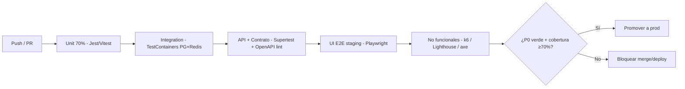

# 20 — Estrategia de Testing

> **Estado:** En planificación · **Versión del documento:** 1.0.0 · **Fecha:** 2026-08-29
> **Zona horaria:** America/Bogota (UTC-5)
> Complementa a `01_PROJECT_OVERVIEW.md`, `02_PROBLEM_STATEMENT.md`, `03_OBJECTIVES.md` (`03` OT-08), `04_SCOPE.md` §2/§10, `05_FUNCTIONAL_REQUIREMENTS.md` (128 RF), `06_NON_FUNCTIONAL_REQUIREMENTS.md` (45 RNF), `07_USER_STORIES.md` (72 US), `08_USE_CASES.md` (UC-001 a UC-020), `09_USER_FLOWS.md` (F-01 a F-15), `10_INFORMATION_ARCHITECTURE.md` (S-01 a S-32), `11_SYSTEM_ARCHITECTURE.md` (9 motores), `12_DATABASE_DESIGN.md` (18 entidades), `13_API_SPECIFICATION.md` (39 endpoints), `14_LEARNING_SYSTEM.md` (máquinas de estados y fórmulas), `15_QUIZ_EXAM_SYSTEM.md` (RN-QE-*), `16_GAMIFICATION.md` (economía XP/racha/logro), `17_CERTIFICATION.md`, `18_MONETIZATION.md` y `19_SECURITY.md`. No duplica su contenido; lo hace verificable.
> **Principio rector:** ningún `RF` Must se considera entregado sin al menos 1 test automatizado que lo cubra y pase en CI (`05` §7, `06` RNF-016).

---

## 1. Propósito y alcance

Este documento es la **fuente de verdad de calidad**. Define qué se prueba, cómo, con qué herramienta, en qué entorno y con qué criterio de aceptación para el MVP (Python, 12 módulos) y su evolución multi-lenguaje.

**Sí incluye:** pirámide de testing, 11 categorías de prueba solicitadas, herramientas y entornos, tablas de casos de prueba trazables `TC-* → RF-* → pasos → esperado`, criterios de cobertura y salida (exit criteria), gestión de defectos, y trazabilidad a RF/RNF/UC/US.

**No incluye:** el código de los tests (vive en `tests/`), el DDL (`12`) ni el `openapi.yaml` (`13`); aquí se referencian.

**Regla anti-scope-creep (`04` §10.1):** todo nuevo `RF` exige al menos 1 fila en §9; todo `TC` huérfano (sin `RF`) se rechaza en revisión.

---

## 2. Convenciones

### 2.1 Formato de IDs

| Prefijo | Significado | Ejemplo |
|---|---|---|
| `TC-XXX` | Test Case (caso de prueba funcional) | `TC-001` |
| `TC-BD-XXX` | Caso de BD | `TC-BD-001` |
| `TC-SEC-XXX` | Caso de seguridad | `TC-SEC-001` |
| `TC-REG-XXX` | Caso de regresión | `TC-REG-001` |

Correlativo global con ceros. Un `TC` puede cubrir varios `RF` si es E2E; se lista el `RF` principal y los secundarios en columna dedicada.

### 2.2 Atributos por caso

| Campo | Descripción |
|---|---|
| **Objetivo** | Qué verifica, en lenguaje de negocio |
| **RF / RNF / UC** | Trazabilidad a `05`, `06`, `08` |
| **Precondiciones** | Estado requerido (usuario, contenido publicado, BD seed) |
| **Pasos** | Secuencia numerada y reproducible |
| **Resultado esperado** | Observable verificable (status, payload, BD, evento) |
| **Tipo / Nivel** | Unit / Integration / API / UI / BD / Motor / Seguridad / Regresión |
| **Prioridad** | `P0` (bloqueante) / `P1` (alta) / `P2` (media) |
| **Automatizable** | Sí / No (y con qué herramienta) |

### 2.3 Niveles de prioridad

- **P0:** bloquea release si falla. Todo `RF` Must + invariantes (`14` §13.1, `06` RNF-033/034).
- **P1:** debe pasar en `staging` antes de promoción a `prod`.
- **P2:** deseable; puede quedar como `known issue` documentado con plan de cierre en `22_ROADMAP.md`.

---

## 3. Estrategia — Pirámide de Testing

```
              ┌─────────────┐
              │  UI / E2E   │  ~10% — Flujos críticos F-01..F-15 (Playwright/Cypress)
              │  (lentos)   │  Validan que el sistema integrado entrega valor
              ├─────────────┤
              │ API / Contr.│  ~20% — 39 endpoints + contratos OpenAPI (Supertest/REST Assured)
              │  + Integ.   │  + Integración entre motores y con BD/Storage/Email mock
              ├─────────────┤
              │    Unit     │  ~70% — Motores, fórmulas, validaciones, utils (Jest/Vitest)
              │  (rápidos)  │  Cobertura ≥70% en núcleo educativo (RNF-016)
              └─────────────┘
```

### 3.1 Distribución y justificación

| Nivel | % del total | Objetivo | Tiempo de ejecución | Cuándo se ejecuta |
|---|---|---|---|---|
| **Unit** | 70% | Lógica aislada: fórmulas de nivel, `Score_repaso`, calificación, validación de DTOs, guards, helpers de racha | < 5 min en CI | Cada push / PR |
| **Integration** | 10% | Interacción entre módulos y con infra real (BD de test, KV, storage mock): transacción `attempts → xp → progress → streak` | 5–10 min | Cada PR + nightly |
| **API / Contrato** | 10% | Contratos `openapi.yaml`, paginación, idempotencia, auth, códigos de error `13` §8, headers `X-Request-Id` | 5–10 min | Cada PR + pre-release |
| **UI / E2E** | 10% | Flujos `F-01` a `F-15` y `S-01` a `S-32` navegables; accesibilidad `RNF-024` y responsive `RNF-027` | 10–20 min | Nightly + pre-release en `staging` |

> Pirámide invertida (muchos E2E, pocos unit) es **antipatrón**: se rechaza en revisión. Los E2E cubren solo caminos críticos; el detalle vive en unit/API.

### 3.2 Diagrama de flujo de calidad (Mermaid)



### 3.3 Métricas de salida (exit criteria) del MVP

| Métrica | Objetivo | Verificación |
|---|---|---|
| Cobertura de líneas en `learning/question/evaluation/progress/gamification/certification/content` | ≥ 70% (`06` RNF-016) | Reporte `coverage/lcov` en CI; falla si < umbral |
| `TC` P0 | 100% pasan | Pipeline en rojo si alguno falla |
| `TC` P1 | ≥ 95% pasan | Nightly report |
| Defectos P0 abiertos | 0 | Board del sprint |
| Tests de seguridad `TC-SEC-*` P0 | 100% pasan (`06` RNF-009) | SAST/DAST en pipeline |
| Performance p95 feedback < 1 s, calificación < 2 s | Cumple `RNF-010`/`RNF-012` | Reporte k6 en `staging` |

---

## 4. Tipos de prueba exigidos

### 4.1 Unit Tests

**Objetivo:** verificar lógica aislada, determinista y sin I/O real (mocks para BD/storage/email).

**Alcance:**

| Área | Qué se prueba | Ejemplo de caso unit | Herramienta |
|---|---|---|---|
| `14_LEARNING_SYSTEM` §6.3 | `determinarEntryModule(P_i, nivel_declarado)` — 4 pasos + clamping | `TC-U-001`: `BEGINNER` con `P_1=100,P_2=100` → `entry=3` clamped a 3 | Vitest / Jest |
| `14` §8.2 | `Score_repaso(c)` con pesos `w1..w4 = 0.35/0.25/0.25/0.15` | `TC-U-002`: conceptos con tasas 0.6/0.2/0.5 → orden `py-var-decl` primero | Vitest |
| `14` §10 / `15` §7–§8 | `calcularPorcentaje(P_obt,P_max)` + redondeo half-up 2 decimales | `TC-U-003`: `69.995% → 70.00%` aprueba; `69.994% → 69.99%` no | Vitest |
| `15` §6.2 | `seleccionarPreguntas` — Fisher-Yates con semilla, B_min, compensación a MEDIUM | `TC-U-004`: banco corto en HARD compensa a MEDIUM, nunca a EASY | Vitest |
| `16` §6.1 | `nivelActual(XP_total)` curva exponencial `floor(100×N^1.65+20×N)` | `TC-U-005`: `265 XP → nivel 3`, `120 XP → nivel 2` | Vitest |
| `16` §7 | `calcularRacha(días, TZ, gracia=2h, freeze)` | `TC-U-006`: actividad a `00:30` local con gracia cuenta para día anterior | Vitest |
| Validación | DTOs `RegisterRequest`, `AnswerPayload`, `ThresholdConfig` | `TC-U-007`: email inválido → `VALIDATION_ERROR` por campo | Zod/Joi + Vitest |
| Seguridad | `hashVerify`, `isIdempotencyDuplicate` | `TC-U-008`: mismo `Idempotency-Key` + payload distinto → `409` | Vitest |

**Reglas:**

- Sin acceso a BD real; todo I/O mockeado (`vi.fn()` / `jest.mock`).
- Cada `TC` unit es independiente y < 100 ms.
- Mutación de `content_version` o `threshold` no cambia el resultado de tests con `threshold_aplicado` congelado — se verifica con fixtures versionadas.

### 4.2 Integration Tests

**Objetivo:** verificar que los motores colaboran y que la persistencia es atómica y consistente.

**Alcance:**

| Flujo integrado | Qué se verifica | Invariante |
|---|---|---|
| `POST /lessons/{id}/answer` → `Question.validate` → `Evaluation.calificar` → `Progress.persistirAttempt` → `Gamification.otorgarXP` → `Streak.registrar` | Transacción ACID; evento `xp_granted` con `config_version` | `06` RNF-033, `05` regla 3 |
| `POST /quiz/{id}/attempt` y `POST /exam/{id}/attempt` (dos envíos con mismo `Idempotency-Key`) | Idempotencia: segundo `POST` no duplica `attempts`, `xp_transactions` ni `streaks` | `06` RNF-042, `05` RF-XP-005 |
| `Learning.liberarSiguienteModulo` tras `Exam APROBADO` | `M(i+1)` pasa `BLOQUEADO → DISPONIBLE`; `M(i)` → `APROBADO` | `14` §4.1, `05` RF-RUTA-004 |
| `Content.publish` con IDs duplicados / ciclo en `prerequisite_module_id` | Rechazo con `CONTENT_VALIDATION_FAILED` y detalle | `05` RF-ADM-006 |
| `Certificate.emitir` con `todosLosExamenesAprobados` + `email_verified` | `KODA-LUA-000001` correlativo por lenguaje con `SELECT ... FOR UPDATE` en `certificate_sequences` | `05` RF-CERT-003, `04` §7 |
| Fallo inyectado a mitad de `POST /intentos` (kill de conexión) | Ningún `attempt` queda a medias | `06` RNF-033 |

**Entorno:** `Testcontainers` con PostgreSQL 15 + Redis (KV) + MinIO mock (S3) + Mailhog/adapter mock. Se ejecutan con `npm run test:integration`.

### 4.3 API Tests (Contrato + Funcionales)

**Objetivo:** verificar que `13_API_SPECIFICATION.md` se cumple bit-a-bit y que los códigos de error son estables.

**Cobertura:**

| Grupo | Endpoints | Verificaciones |
|---|---|---|
| Auth | `POST /auth/register`, `/auth/login`, `/auth/refresh`, `/auth/logout`, `/auth/forgot-password`, `/auth/reset-password`, `/auth/verify-email` | `201/200/204`, `400 VALIDATION_ERROR`, `409 EMAIL_TAKEN`, `401 INVALID_CREDENTIALS`, `429 RATE_LIMITED` con `Retry-After`, hash no en claro, `X-Request-Id` presente |
| Catálogo | `GET /languages`, `GET /languages/{id}/modules`, `GET /modules/{id}` | Paginación `RNF-003` (≤100 ítems), `200` con `progress.percent`, `422 LANGUAGE_NOT_AVAILABLE` si `coming_soon` |
| Aprendizaje | `POST /users/me/level`, `POST /diagnostics`, `POST /diagnostics/{id}/attempt`, `GET /lessons/{id}`, `POST /lessons/{id}/answer`, `POST /lessons/{id}/complete` | Feedback < 1 s `RNF-010`, XP `+10` sección / `+5` ejercicio, `ads.show_interstitial` solo si gratuito |
| Evaluación | `POST /quiz/{id}/attempt`, `POST /exam/{id}/attempt`, `GET /quiz/{id}/attempts` | Calificación < 2 s `RNF-012`, `threshold_aplicado` persistido, `% = round(P_obt/P_max*100,2)`, `APROBADO ≥70/80` |
| Progreso/Gamif. | `GET /users/me/progress`, `GET /users/me/achievements`, `GET /progress/streak` | Aislamiento por `user_id` del token (`IDOR` → `403`), `level` derivado determinista |
| Certificación | `GET /users/me/certificates`, `GET /certificates/{id}`, `GET /certificates/{id}/pdf`, `POST /certificates/verify` | `KODA-LUA-000001` formato, `403 NOT_CERTIFICATE_OWNER` si no titular, `410 CERTIFICATE_OBSOLETE`, PDF bit-a-bit |
| Admin | `/admin/*` CRUD + `POST /admin/content/publish` | `403 ADMIN_REQUIRED` sin rol, `422 CONTENT_VALIDATION_FAILED`, auditoría `quién/qué/cuándo/versión` |

**Herramientas:** `Supertest` (Node) o `REST Assured` (Java), `openapi.yaml` linteado con `spectral`/`redocly` en CI, `Idempotency-Key` aleatorio por caso, `X-Request-Id` assertivo.

**Contrato:** `openapi.yaml` es la fuente; `openapi-coverage` falla el build si un endpoint de §5 de `13` no tiene test.

### 4.4 UI Tests (E2E)

**Objetivo:** verificar flujos navegables `F-01` a `F-15` y pantallas `S-01` a `S-32` en navegador real, mobile-first y accesible.

**Matriz de flujos críticos (P0):**

| Flujo `09` | Pantallas `10` | Escenario E2E | RNF verificado |
|---|---|---|---|
| `F-01` Primer inicio | `S-02→S-06→S-08→S-09→S-10→S-11→S-14` | Registro → biblioteca → nivel → diagnóstico 24Q → recomendación `M3` → ruta 12 módulos → lección con `concepto→ejemplo→ejercicio→feedback<1s` | `RNF-020` <3 min, `RNF-021` breadcrumb |
| `F-06` Completar sección | `S-13→S-14→S-15` | 5 lecciones obligatorias → `COMPLETADA` → `+10 XP` → `Recompensa → Ads (gratuito) → Siguiente` (premium sin ads) | `RNF-014` degradado, `RNF-011` <500 ms |
| `F-07→F-08` Quiz y Examen | `S-16→S-17→S-18→S-19` | Quiz 10Q ≥70% → revisión sin banco completo; Examen 20Q ≥80% → `APROBADO → desbloquea M(i+1)`; reprobado → `BLOQUEADO` con CTA | `RNF-012` <2 s, `RN-QE-011` |
| `F-09→F-10` Fallar y repasar | `S-19→S-20→S-21` | Examen 56.67% reprobado → desglose por tipo + débiles → repaso 5Q `Score_repaso` → reintento con ≥60% preguntas distintas | `RF-REP-002`, `§15.4` overlap |
| `F-11` Racha | `S-22` | Actividad válida hoy → `racha+1`; sin actividad + gracia 00:00–02:00 → mantiene; día sin actividad ni freeze → `0` | `RF-RACHA-002` |
| `F-13` Certificado | `S-28→S-29` | módulos Lua `APROBADO` + email verificado → `KODA-LUA-000001` + QR → `GET /certificates/{id}/pdf` bit-a-bit → verificación pública sin PII | `RF-CERT-006`, `RF-PDF-003` |

**Responsive (`06` RNF-027):** cada P0 se ejecuta en 3 viewports `360×640`, `768×1024`, `1280×800`; touch target ≥44×44 px; zoom 200% sin rotura.

**Accesibilidad (`06` RNF-024–026):** `axe-core` en cada pantalla crítica (`S-02, S-11, S-14, S-16, S-18, S-22, S-28`): `WCAG 2.1 AA`, foco visible, `aria-current`, contraste AA, `axe` score ≥95.

**Herramientas:** `Playwright` (recomendado: Chromium + WebKit en CI) o `Cypress`. Page Objects por dominio (`AuthPage`, `LearningPage`, `QuizPage`).

### 4.5 Tests de BD

**Objetivo:** garantizar integridad referencial, invariantes y rendimiento de consultas críticas (`06` RNF-033 a RNF-036, `RNF-007`).

**Casos BD (`TC-BD-*`):**

| ID | Invariante / Consulta | Verificación | Origen |
|---|---|---|---|
| `TC-BD-001` | FK `attempts.content_version` + `threshold_aplicado` congelados | Editar `modules.quiz_threshold` 70→75 no muta `attempts` previos (leer `threshold_aplicado` = 70) | `06` RNF-035 |
| `TC-BD-002` | `UNIQUE (user_id, idempotency_key)` en `attempts` y `xp_transactions` | Segundo `INSERT` con misma key → `23505` | `06` RNF-042 |
| `TC-BD-003` | `UNIQUE (user_id, activity_date)` en `streaks` | Doble registro mismo día → violación | `05` RF-RACHA-001 |
| `TC-BD-004` | `UNIQUE (user_id, achievement_id)` en `user_achievements` | Segundo desbloqueo mismo logro → violación | `05` RF-LOGRO-005 |
| `TC-BD-005` | `UNIQUE (user_id, language_id) WHERE status='valid'` en `certificates` | Segundo vigente mismo lenguaje → violación | `05` RF-CERT-005 |
| `TC-BD-006` | `certificate_sequences.last_seq` correlativo por lenguaje | 10 emisiones concurrentes → `KODA-LUA-000001`..`000010` sin huecos ni duplicados | `05` RF-CERT-003 |
| `TC-BD-007` | `progress.percent = ROUND(completed/total*100,2)` | `completed_items=3,total=5 → 60.00%` | `12` §6.13 |
| `TC-BD-008` | Sin huérfanos: `questions.module_id → modules.id` con FK `RESTRICT` | `DELETE` de módulo con preguntas → `FK violation` | `06` RNF-036 |
| `TC-BD-009` | Trigger rechaza `UPDATE` de `attempts` con `status='graded'` en campos `score/percent/threshold_applied` | `UPDATE attempts SET percent=100 WHERE status='graded'` → `RAISE EXCEPTION` | `06` RNF-033 |
| `TC-BD-010` | Trigger de versionado `questions`: `UPDATE` directo prohibido, exige `INSERT (id, version+1)` | `UPDATE questions SET prompt='x' WHERE status='published'` → rechazado | `05` RF-PREG-006 |
| `TC-BD-011` | Índices para p95 < 100 ms con 100k `attempts` | `EXPLAIN ANALYZE SELECT * FROM attempts WHERE user_id=$1 AND module_id=$2` usa `idx_attempts_user_module` (Index Scan) | `06` RNF-007 |

**Herramientas:** `pgTAP` o tests de integración con `EXPLAIN` assertions, `sqlfluff` para lint, migraciones idempotentes `V{YYYYMMDD}_{NNN}__*.sql`.

### 4.6 Tests del Motor Educativo (Learning Engine)

**Objetivo:** verificar que `14_LEARNING_SYSTEM.md` se cumple sin ambigüedad (desbloqueo, diagnóstico, repaso, reanudación).

| ID | Regla | Caso | Esperado |
|---|---|---|---|
| `TC-LEARN-001` | `14` §4.1 secuencial | `M2` con `M1=REPROBADO` → intentar acceder a `M2` | `403 PREREQUISITE_NOT_MET` con CTA pedagógico |
| `TC-LEARN-002` | `14` §4.2 salto adaptativo | Diagnóstico recomienda `E=5`, usuario ajusta a `E'=6` (dentro de ±1) | `M1..M4=OMITIDO_POR_DIAGNOSTICO`, `M5` sigue omitido, `M6=DISPONIBLE`; ajuste auditado |
| `TC-LEARN-003` | `14` §4.2 fuera de ±1 | Intento ajustar `E=5 → 8` | `422` "Ajuste fuera de límites pedagógicos" |
| `TC-LEARN-004` | `14` §6.3 clamping `BEGINNER ≤3` | `BEGINNER` con `entry_candidato=6` (`P_1=100,P_2=100,P_3=100,P_4=60`) | `entry_module=3` (clamped) |
| `TC-LEARN-005` | `14` §3.2 `OMITIDO → APROBADO` solo vía examen | `M2=OMITIDO` sin examen aprobado → verificar `lenguaje_completado` | `false`; no habilita certificado |
| `TC-LEARN-006` | `14` §8.2 `Score_repaso` | Ver ejemplo `14` §8.4 → `py-var-decl 0.61 > py-op 0.51 > py-var-tipos 0.29` | Orden de repaso es ese |
| `TC-LEARN-007` | `14` §9.1 recomendación prioritaria | Examen reprobado pendiente + `Score_repaso>0.60` | Recomienda `repaso (5-10) + CTA reintento` antes que `siguiente sección` |
| `TC-LEARN-008` | `14` §11.2 reanudación < 2 s | Cerrar pestaña en `M2/S3/L2/Ej1` → reabrir | Restaura `lenguaje/módulo/sección/lección/ejercicio` exacto en < 2 s |
| `TC-LEARN-009` | `14` RN-03 | Re-diagnóstico con `M1=APROBADO, M2=APROBADO` | `M1,M2` permanecen `APROBADO`; nueva recomendación solo sobre `M3..M12` |
| `TC-LEARN-010` | `14` §4.4 Quiz no bloquea | Quiz `65% REPROBADO` → intentar iniciar `Siguiente sección` | Permitido; solo sugiere repaso |

### 4.7 Tests de Evaluación (Quiz / Examen — `15_QUIZ_EXAM_SYSTEM.md`)

| ID | Regla `15` | Caso | Esperado |
|---|---|---|---|
| `TC-EVAL-001` | §7 `P_max=140` quiz 4E+4M+2H | Acierta 3E(30)+3M(45)+1H(20)=95 | `67.86% → REPROBADO` (`<70`) |
| `TC-EVAL-002` | §8 redondeo | `69.995%` | `70.00% → APROBADO`; `69.994% → 69.99% → REPROBADO` |
| `TC-EVAL-003` | §9.1 umbrales versionados | Quiz calificado con `threshold=70`, luego admin cambia a `75`, mismo `attempt` | `threshold_aplicado` sigue `70` (inmutable) |
| `TC-EVAL-004` | §5.4 `B_min` quiz 30 / examen 80 | Intentar publicar módulo con banco `HARD=2` (requiere ≥9 para examen) | `422 CONTENT_VALIDATION_FAILED` con detalle `HARD insuficiente` |
| `TC-EVAL-005` | §13.1 aleatorización | Dos `intentos` consecutivos mismo módulo (banco 80) | Orden de preguntas y de opciones distintos; `semilla` distinta; trazable |
| `TC-EVAL-006` | §13.4 exclusión `k=2` | `Intento3` con banco 80 y `k=2` | `overlap = 0%`; con banco 30 → `overlap 50%` + métrica `eval.overlap_high` |
| `TC-EVAL-007` | §6.2 compensación a MEDIUM | Bucket `HARD` corto (cuota 6, disponible 3) | Compensa 3 con `MEDIUM`, nunca con `EASY` |
| `TC-EVAL-008` | §10.1 ≥60% distintas en examen reintento | Reintento examen con banco 80 | ≥12/20 preguntas distintas al intento previo |
| `TC-EVAL-009` | §11.2 XP decae por reintento | Quiz `APROBADO` 1er intento `+25`, 2do aprobado | 2do otorga `50%` del bono (`+12.5 → floor 12`) |
| `TC-EVAL-010` | `15` §12.3 revisión detallada | Examen aprobado 85% (5E+7M+5H → `255/300`) | Desglose `by_type` + `weak_concepts=[]`; conceptos <60% listados |
| `TC-EVAL-011` | `05` RF-EVAL-006 solo servidor | Cliente envía `percent=100` manipulado | Servidor recalcula `P_obt/P_max` y prevalece (ignora `percent` del cliente) |

### 4.8 Tests de Gamificación (`16_GAMIFICATION.md`)

| ID | Regla `16` | Caso | Esperado |
|---|---|---|---|
| `TC-GAM-001` | §5.2 `XP-SEC +10` / `XP-EJ-CORR +5` | Completar sección con 5E correctos → sección completa | `+35 XP` en `xp_event`; `level` recalculado; `streak+1` |
| `TC-GAM-002` | §5.1 anti-clic | `GET /lessons/{id}` repetido sin `POST /answer` | `0 XP` otorgada; no existe `xp_event` |
| `TC-GAM-003` | §5.5 idempotencia | Doble `POST /lessons/{id}/answer` mismo `Idempotency-Key` | Un `xp_event` (`uq_xp_user_idempotency` protege); segundo `200` con mismo `xp_awarded` |
| `TC-GAM-004` | §5.2 `XP-EJ-RECUP +2` | Fallar ejercicio, luego acertar tras ≥30 s | `+2` (no `+5`); 2do reintento mismo ejercicio → `0` |
| `TC-GAM-005` | §6.1 curva `N^1.65` | `120 XP → nivel 2`, `265 XP → nivel 3` | Determinista; `level_up` dispara evento |
| `TC-GAM-006` | §7.3 corte `00:00` `America/Bogota` | Actividad `2026-08-29T00:30-05:00` | `activity_date=2026-08-29` local (no UTC) |
| `TC-GAM-007` | §7.4 gracia 2h | Día sin actividad, luego actividad `2026-08-30T01:00-05:00` | Cuenta para `2026-08-29`; racha se mantiene 1 vez |
| `TC-GAM-008` | §7.4 freeze | 7 días de racha → `freeze_tokens=1`; día 8 sin actividad | Auto-consume `freeze_used`; racha se mantiene; 3er día sin actividad → `0` |
| `TC-GAM-009` | §9.1 `ON_FIRE` 7 días | Día 7 consecutivo | `user_achievements(ON_FIRE)` con `unlocked_at`; 2do intento día 7 → no duplica (`UNIQUE`) |
| `TC-GAM-010` | §5.4 examen reprobado = 0 XP | Examen `56.67% REPROBADO` | `0 XP`; no existe `xp_event` de tipo `exam_pass` |
| `TC-GAM-011` | §5.5 tiempo sospechoso <20 s + ≥3 ejercicios | 3 ejercicios en 15 s | Marcado `sospechoso`; XP retenida hasta pausa/CAPTCHA; progreso sí guardado |

### 4.9 Tests de Certificación (`01` §21–§22, `05` RF-CERT/PDF, `04` §7)

| ID | RF | Caso | Esperado |
|---|---|---|---|
| `TC-CERT-001` | `RF-CERT-001` | módulos Lua `APROBADO` + `email_verified=true` → `POST /certificates` | `200` con `KODA-LUA-000001`, `status=valid`, `qr_payload` |
| `TC-CERT-002` | `RF-CERT-001` | 11/12 aprobados → solicitar certificado | `422 CERTIFICATE_NOT_ELIGIBLE` con lista de módulos faltantes |
| `TC-CERT-003` | `RF-AUTH-005` | 12/12 pero `email_verified=false` | `403 EMAIL_NOT_VERIFIED` con CTA verificar; no genera |
| `TC-CERT-004` | `RF-CERT-003` correlativo | 5 emisiones concurrentes LUA | `KODA-LUA-000001`..`000005` sin duplicados (lock en `certificate_sequences`) |
| `TC-CERT-005` | `RF-CERT-005` no duplica vigente | Ya `KODA-LUA-000001 valid` → re-emitir | No crea 2do vigente; mantiene existente; `409` o `200` idempotente |
| `TC-CERT-006` | `RF-CERT-005` obsolescencia | `programming_languages.content_version 1→2` (cambio significativo) | Certificado pasa `valid→obsolete` con `revoked_at`; requiere revalidación |
| `TC-CERT-007` | `RF-CERT-006` verificación pública | `GET /certificates/KODA-LUA-000001` (sin auth) | `200 valid, language_name=Lua, holder_name=B. P., document_masked=CC ***678` sin PII completa |
| `TC-CERT-008` | `RF-PDF-003` bit-a-bit | `GET /certificates/{id}/pdf` (titular) vs `GET /certificates/{id}` JSON | PDF contiene mismos `nombre/documento/lenguaje/fecha/ID/QR` que JSON vigente; `pdf_version` trazada |
| `TC-CERT-009` | `RF-PDF-002` solo titular | No titular solicita `GET /certificates/KODA-LUA-000001/pdf` | `403 NOT_CERTIFICATE_OWNER` |
| `TC-CERT-010` | `RF-CERT-004` QR | Escanear QR → `POST /certificates/verify` | `valid` + `issued_at` con `America/Bogota` |

### 4.10 Tests de Seguridad (`19_SECURITY.md`, `06` RNF-008/009/037–041, `05` RF-AUTH/USR/ADM)

| ID | Control | Caso | Esperado |
|---|---|---|---|
| `TC-SEC-001` | `RNF-008` hash adaptativo | `POST /auth/register` → inspeccionar BD y logs | `password_hash` es `argon2id/bcrypt` (no claro), no aparece en `audit_log` ni en response |
| `TC-SEC-002` | `06` RNF-009 OWASP Top 10 — Inyección | `POST /auth/login { email: "' OR 1=1 --", password:"x" }` + payloads SQLi en `lessons/answer` | `400/401` sin `500` ni dump; SAST no reporta `high` sin corregir |
| `TC-SEC-003` | IDOR / Broken Access Control | `USER_A` con `JWT_A` → `GET /users/me/progress` de `USER_B` (cambiando `user_id` en path si existiera) o `GET /certificates/KODA-LUA-000002/pdf` de otro titular | `403/404` sin revelar existencia; no expone PII ajena |
| `TC-SEC-004` | `RNF-041` mensajes accionables | `POST /auth/login` con email inexistente, `POST /auth/register` con email existente, `GET /modules/{id}` bloqueado | Mensaje genérico sin revelar existencia; `request_id` + `timestamp` coherentes; nunca stack trace |
| `TC-SEC-005` | Rate limiting `RF-AUTH-006` | 6× `POST /auth/login` en < 1 min misma IP | 6to → `429 RATE_LIMITED` + `Retry-After: 60` + headers `RateLimit-*` |
| `TC-SEC-006` | XSS almacenado `RNF-009` | Crear lección/pregunta con `<script>alert(1)</script>` vía `/admin/questions` y renderizarla como usuario | Contenido sanitizado/escaped; `script` no ejecuta; Content-Security-Policy activa |
| `TC-SEC-007` | `RNF-008` secretos en repo | `git log --all -p \| trufflehog / gitleaks` en CI | 0 secretos detectados; build falla si hay `password`/`token` hardcodeado |
| `TC-SEC-008` | `RF-ADM-007` RBAC | `USER` (role=user) → `POST /admin/languages` | `403 ADMIN_REQUIRED`; `ADMIN` → `201` |
| `TC-SEC-009` | JWT expiración + refresh rotativo `RF-AUTH-007` | `access_token` expirado (15 min) → `GET /progress` | `401` → `POST /auth/refresh` con `refresh` rotativo → nuevo par; `refresh` viejo invalidado (replay → `401 INVALID_REFRESH`) |
| `TC-SEC-010` | `RNF-037` minimización PII | `GET /verify/{code}` + logs de `GET /lessons/{id}/answer` | `document_number` enmascarado, nunca en URL ni en `X-Request-Id` logs; `00` no anonimizado |
| `TC-SEC-011` | `RNF-009` cabeceras de seguridad | `GET /` y `GET /languages` | `Strict-Transport-Security`, `X-Content-Type-Options: nosniff`, `X-Frame-Options: DENY`, `Cache-Control: no-store` en autenticadas |

### 4.11 Tests de Regresión

**Objetivo:** garantizar que ningún cambio rompe lo ya validado; especialmente tras `publicar contenido`, `cambiar umbral/XP` o `agregar lenguaje`.

| ID | Disparador de regresión | Suite de regresión ejecutada | Criterio |
|---|---|---|---|
| `TC-REG-001` | Publicar nueva `version_contenido` en Python | `TC-EVAL-003` (intentos viejos con `threshold=70` siguen válidos) + `TC-BD-001` (versionado) + E2E `F-06` con contenido viejo | `old attempts` no se re-califican; `EXPLAIN` sigue usando índices |
| `TC-REG-002` | Cambiar `threshold.quiz 70→75` sin despliegue | `TC-EVAL-003` + `TC-LEARN-010` + contrato `openapi.yaml` sin breaking | Solo futuros intentos usan `75`; `openapi.yaml` `MINOR` |
| `TC-REG-003` | Agregar lenguaje `Lua` (solo contenido) | `TC-LEARN-002` en Lua + `06` RNF-006 (grep CI sin `if language==='python'` en motor) + E2E `F-01` para Lua | 0 cambios en `src/modules/*` del motor |
| `TC-REG-004` | Hotfix de `Score_repaso` pesos `w1..w4` | `TC-LEARN-006` + snapshot de `06` `RNF-006` ensayo `RNF-006` | Pesos suman `1.0`; orden de repaso no regresiona en golden dataset de 100 conceptos |
| `TC-REG-005` | Fix de `level.curve` | `TC-GAM-005` + `16` §6.2 tabla | Niveles ya alcanzados no bajan; solo afecta progreso al siguiente |
| `TC-REG-006` | Upgrade de dependencias (NestJS, PG driver) | Full `TC` P0 + SAST | 0 `P0` nuevos fallos; `npm audit` sin `high` sin mitigación |

**Golden datasets:** `tests/fixtures/golden/` contiene 3 snapshots versionados: `attempts_python_v1.json` (100 intentos), `repaso_scores_v1.json` (50 conceptos), `racha_calendar_v1.json` (60 días `America/Bogota`). Toda PR que toque `14`/`15`/`16` debe pasar `diff` contra golden sin cambios no intencionados.

---

## 5. No funcionales — Tests transversales

| RNF | Instrumento | Umbral y frecuencia |
|---|---|---|
| `RNF-001` p95 lectura <300 ms, escritura <500 ms, 100 conc. | `k6` `tests/perf/k6_read_lesson.js` en `staging` | Por versión; `p95` report en `21_DEPLOYMENT` |
| `RNF-002` pico 3× (300 conc, 5 min, error <1%) | `k6` spike | Pre-release |
| `RNF-010` feedback <1 s, `RNF-012` calificación <2 s p95 | `k6` + APM (`tests/perf/k6_eval.js`) + `Playwright` trace | Cada PR en `staging` |
| `RNF-003` paginación ≤100 | `spectral` rule `no-list-without-pagination` + integration test | Cada PR |
| `RNF-013` disponibilidad 99.5% | `uptime` sintético 1 min (staging/prod) | Continuo |
| `RNF-024` axe ≥95 | `axe-playwright` en `S-02,S-11,S-14,S-16,S-18,S-22,S-28` | Cada E2E |
| `RNF-027` 3 viewports | `Playwright` fixtures viewports | Nightly |
| `RNF-033` atomicidad | Chaos `kill mid-request` en integration (`TC` §4.2) | Cada PR |
| `RNF-042` idempotencia | Doble `POST` con misma `Idempotency-Key` | Cada PR |

---

## 6. Entornos y herramientas

| Capa | Herramientas recomendadas | Alternativas válidas | Decisión documentada |
|---|---|---|---|
| Unit | **Vitest** (Vite) o **Jest** | Mocha | ADR si se elige otra |
| API | **Supertest** + `spectral`/`redocly` + `openapi-coverage` | REST Assured, Postman/Newman | — |
| Integration | **Testcontainers** (PG 15, Redis, MinIO) + `pgTAP` | `docker-compose` manual | — |
| UI E2E | **Playwright** (Chromium + WebKit) + Page Objects | Cypress | ADR |
| Perf | **k6** o JMeter + APM (OpenTelemetry) | Artillery | — |
| Accesibilidad | **axe-core** + Lighthouse CI | Pa11y | — |
| Seguridad | **gitleaks/trufflehog** (secretos), **ESLint security**, **Snyk/npm audit**, **OWASP ZAP** DAST | SonarQube | — |
| CI | GitHub Actions / GitLab CI: `lint → unit → integration → api → e2e:staging → perf/a11y/security → coverage gate` | — | `21_DEPLOYMENT.md` |

**Entornos:**

| Entorno | Uso | Datos | Deploy |
|---|---|---|---|
| `dev` (local) | Unit + integration con containers | Seed `tests/seed/dev.sql` | `npm run dev` |
| `staging` | E2E, perf, a11y, DAST, caos | Snapshot anonimizado de `prod` + `B_min` completo | Auto por PR (`preview`) |
| `prod` | Solo smoke + uptime + RUM | Real | Manual con `CHANGELOG` y tag |

---

## 7. Gestión de datos de prueba

- **Seed determinista:** `tests/seed/mvp.sql` crea: 1 admin, 3 users (`BORRAR` / `USER_A/B`), `PY` con 12 módulos, banco `30` por quiz / `80` por examen (cumple `15` §5.4), 18 logros, 1 suscripción `premium` mock.
- **Factories:** `createUser({ emailVerified, premium, timezone })`, `createAttempt({ kind, module, percent })`, `createStreak({ user, dates })`. Nunca datos reales de prod.
- **Anonimización:** `RNF-037`; `document_number` solo sintético `CC 10xxxxxx`.
- **Versionado:** cada seed lleva `content_version` y `config_version` para `TC-BD-001`/`TC-EVAL-003`.

---

## 8. Cobertura y trazabilidad

### 8.1 Matriz RF → Test (extracto — matriz completa en `tests/traceability.csv`)

| RF | `TC` que lo cubren | Nivel | P0 |
|---|---|---|---|
| `RF-AUTH-001/005` | `TC-001, TC-002, TC-SEC-001` | API + Unit | Sí |
| `RF-AUTH-002/006/007` | `TC-003, TC-004, TC-SEC-005, TC-SEC-009` | API + Integration | Sí |
| `RF-LANG-001/002/003/005` | `TC-008, TC-009, TC-REG-003` | API + Integration | Sí |
| `RF-LVL-001/002/003` | `TC-010, TC-011, TC-LEARN-004` | Unit + API | Sí |
| `RF-DIAG-001/002/003/006` | `TC-011, TC-012, TC-LEARN-002/004` | Unit + API + E2E F-03 | Sí |
| `RF-RUTA-001/004/005` | `TC-LEARN-001/002/008` | Integration + E2E F-04 | Sí |
| `RF-SEC-003, RF-LEC-001/002/003` | `TC-013, TC-014, TC-LEARN-008` | Integration + E2E F-05/F-06 | Sí |
| `RF-PREG-001/002/004/005/006/007` | `TC-013, TC-EVAL-005, TC-BD-010` | Unit + Integration | Sí |
| `RF-QUIZ-001/002/003/005/006` | `TC-016, TC-017, TC-EVAL-001/009` | API + E2E F-07 | Sí |
| `RF-EXAM-001/002/003/004/005/007` | `TC-018, TC-019, TC-020, TC-EVAL-002/008` | API + E2E F-08 | Sí |
| `RF-EVAL-001/003/005/006` | `TC-EVAL-001/003/011, TC-BD-001/009` | Unit + BD | Sí |
| `RF-PROG-001/002` | `TC-022, TC-BD-007` | Integration + BD | Sí |
| `RF-XP-001/002/005` | `TC-GAM-001/003/005, TC-023` | Unit + Integration | Sí |
| `RF-RACHA-001/002/004` | `TC-GAM-006/007/008, TC-024` | Unit + Integration | Sí |
| `RF-LOGRO-001/002/005` | `TC-GAM-009, TC-025` | Integration + E2E | Sí |
| `RF-REP-001/002/004` | `TC-LEARN-006/007, TC-031` | Unit + Integration | Sí |
| `RF-CERT-001/003/005/006` | `TC-CERT-001/004/006/007, TC-BD-005` | Integration + BD + E2E F-13 | Sí |
| `RF-PDF-001/002/003` | `TC-CERT-008/009` | Integration + E2E | Sí |
| `RF-ADS-001/002/003/005` | `TC-029, TC-030` | Unit + E2E F-14/F-15 | Sí |
| `RF-PREM-001/002/003/005` | `TC-030, TC-031` | Integration + E2E F-15 | Sí |
| `RF-ADM-001/003/005/006/007/008` | `TC-032, TC-033, TC-BD-010, TC-SEC-008` | API + BD | Sí |

> Regla `06` RNF-016: toda fila Must tiene al menos 1 `TC` automatizado y verde en CI.

---

## 9. Casos de prueba para requisitos principales

> Tabla normativa `ID caso → RF → pasos → esperado`. Cubre el camino feliz y los invariantes P0 del MVP. Cada `TC` es automatizable y tiene su contraparte en `tests/cases/TC-*.spec.ts`.

| ID caso | RF / RNF / UC | Precondiciones | Pasos | Resultado esperado |
|---|---|---|---|---|
| **TC-001** | `RF-AUTH-001, RF-USR-001` · `UC-001` · `US-001` | Sin usuario con `brandon@example.com`; `staging` limpio | 1. `POST /auth/register { name:"Brandon", email:"brandon@example.com", password:"S3gura!2026" }` con `Idempotency-Key` | `201` con `user.email_verified=false`, `password_hash` en BD es `argon2id` (no claro), `audit_log` registra `registro` con `America/Bogota`, email de verificación en cola `mailhog` |
| **TC-002** | `RF-AUTH-001` (unicidad) | `brandon@example.com` ya existe | 1. `POST /auth/register` con mismo email 2. Repetir con email distinto pero password débil `123` | 1. `409 EMAIL_TAKEN` o `400` genérico sin revelar existencia (según política `RNF-041`) + `X-Request-Id` 2. `400 VALIDATION_ERROR` con `details[password].issue` accionable |
| **TC-003** | `RF-AUTH-002, RF-AUTH-006` · `UC-002` | Usuario `brandon` con `S3gura!2026`; `staging` con rate limit 5/min | 1. `POST /auth/login { email, password }` válidos 2. `POST /auth/login` con password errónea ×6 | 1. `200` con `access_token` (15 min) + `refresh_token` rotativo; `last_login_at` actualizado 2. 6to → `429 RATE_LIMITED` + `Retry-After: 60` |
| **TC-004** | `RF-AUTH-007, RNF-023` | Sesión autenticada en `S-14` lección activa | 1. Esperar expiración `access_token` 2. `GET /progress` con token expirado 3. `POST /auth/refresh` con `refresh` vigente | 2. `401` 3. `200` con nuevo par; `refresh` viejo replay → `401 INVALID_REFRESH`; progreso no perdido |
| **TC-005** | `RF-AUTH-005, RF-CERT-001` | Usuario no verificado con módulos Lua `APROBADO` | 1. `GET /certificates/verify` sin verificar 2. `POST /auth/verify-email` con token 3. Reintentar certificado | 1. Bloquea emisión con `EMAIL_NOT_VERIFIED` (aprendizaje sigue) 3. `200` con `KODA-LUA-...` |
| **TC-006** | `RF-AUTH-004` | Usuario registrado | 1. `POST /auth/forgot-password { email }` exista o no 2. `POST /auth/reset-password { token, new_password }` válido 3. Reintentar con mismo token | 1. `200` genérico idéntico exista o no (no revela) 2. `200` password hasheada nueva 3. `400` token ya usado/expirado |
| **TC-007** | `RF-USR-002` | Autenticado como `USER_A` | 1. `PATCH /users/me { name:"B. P.", current_password:"S3gura!2026", new_password:"N3w!2026" }` 2. Repetir con `current_password` errónea | 1. `200` nombre persiste; certificados futuros usan nuevo nombre 2. `422 INVALID_CURRENT_PASSWORD` |
| **TC-008** | `RF-LANG-001` · `UC-003` | Catálogo con `PY=available`, `LUA=coming_soon` | 1. `GET /languages` (público) 2. `GET /languages/{id}/modules` con `LUA` | 1. `200` `PY` con `modules_count=12`, `LUA` `status=coming_soon` 2. `422 LANGUAGE_NOT_AVAILABLE` |
| **TC-009** | `RF-LANG-003, RF-LANG-005` | `USER_A` con progreso `PY M1 100%` | 1. Cambiar `language_id=PY` → otro disponible (cuando exista) 2. Volver a `PY` | 1. Progreso `PY` intacto; ruta del nuevo lenguaje vacía 2. Reanuda `M1 100%` en posición exacta |
| **TC-010** | `RF-LVL-001, RF-LVL-002` | Lenguaje `PY` activo sin diagnóstico | 1. `POST /users/me/level { level:"MEDIUM" }` 2. `PATCH /users/me/level { level:"PROFESSIONAL" }` antes de diagnóstico | 1. `200` `declared_level=MEDIUM` 2. `200` actualizado; tras iniciar diagnóstico → `422 LEVEL_LOCKED` (requiere re-diagnóstico) |
| **TC-011** | `RF-DIAG-001/002/003` · `UC-004` · `F-03` | `MEDIUM` declarado; banco diagnóstico 24Q | 1. `POST /diagnostics` (genera 24) 2. `POST /diagnostics/{id}/attempt` con `P_1=100,P_2=100,P_3=50,...` 3. Consultar recomendación | `200` con `by_area { variables:80, condicionales:60 }`, `recommended_entry { module_id: M3 }` (`entry=3` ver `14` §6.5); `diagnostic_result` persiste |
| **TC-012** | `RF-DIAG-004, RF-DIAG-006` | `M1=APROBADO` previo | 1. Re-tomar `POST /diagnostics` 2. Verificar módulos | Nuevo `recommended_entry` no borra `M1=APROBADO`; diagnóstico nunca otorga `APROBADO` |
| **TC-013** | `RF-LEC-001, RF-PREG-003/004, RNF-010` · `UC-006` · `F-05` | `M2` disponible; lección con ejercicio | 1. `GET /lessons/{id}` 2. `POST /lessons/{id}/answer { question_id, answer }` con `predicción output` | 1. `concepto→explicación→ejemplo→ejercicio` anclado 2. `200` `correct:true, explanation, xp_awarded=+5` en <1 s p95 |
| **TC-014** | `RF-LEC-003, RF-PROG-001, RNF-033/042` | Lección con 3 ejercicios | 1. `POST /lessons/{id}/answer` con fallo inyectado a mitad 2. Reenviar mismo `Idempotency-Key` | 1. Sin `attempt` a medias (rollback) 2. Segundo `200` idéntico sin duplicar `attempts` ni `xp_transactions` |
| **TC-015** | `RF-SEC-003, RF-XP-001` | Sección con 5 lecciones (5 obligatorias) | 1. Completar 4/5 → `GET /sections/{id}` 2. Completar 5/5 → `POST /sections/{id}/complete` | 1. `status=in_progress` 2. `completed` + `xp_awarded=+10` + `Section completada→Recompensa→(Ads si gratuito)→Siguiente` |
| **TC-016** | `RF-QUIZ-001/002/003, RF-EVAL-001, RNF-012` · `UC-007` · `F-07` | Módulo con quiz 10Q (4E/4M/2H) `P_max=140` | 1. `POST /quiz/{id}/attempt { answers:10 }` con aciertos `3E+3M+1H=95` | `201` `67.86% REPROBADO (<70)`, `details` por pregunta, `threshold_applied=70` |
| **TC-017** | `RF-QUIZ-004/005` | Quiz reprobado `67.86%` | 1. `GET /quiz/{id}/attempts/{id}/review` 2. `POST /quiz/{id}/attempt` reintento con nuevo set | 1. Solo `N=10` del intento, nunca banco completo 2. `intento_numero=2` con ≥50% distintas si banco≥30 |
| **TC-018** | `RF-EXAM-001/002/003, RF-EVAL-001` · `UC-008` · `F-08` | Módulo con examen 20Q (6E/8M/6H) `P_max=300` | 1. `POST /exam/{id}/attempt` con `5E(50)+7M(105)+5H(100)=255` | `201` `85.00% APROBADO (≥80)`, `module_status=passed`, `rewards +100` + `module_bonus +50`, `next_module=DISPONIBLE` |
| **TC-019** | `RF-EXAM-004, RF-RUTA-004` | Examen reprobado `56.67%` | 1. `POST /exam/{id}/attempt` `60+90+20=170/300=56.67%` 2. `GET /languages/{id}/modules` del siguiente | 1. `REPROBADO` 2. `Siguiente M=BLOQUEADO` con `CTA revisión+repaso` |
| **TC-020** | `RF-EXAM-005` reintentos ilim. | `M2=REPROBADO` | 1. Reintento 1 `REPROBADO` 2. Reintento 2 `APROBADO` | Cada intento persiste; desbloqueo exige 1 `APROBADO` (no promedio); `intento_numero` incrementa |
| **TC-021** | `RF-EVAL-002/003/005` versionado | `attempt` con `threshold=70` y `content_version=1`; admin cambia a `75` | 1. Nuevo `POST /quiz/{id}/attempt` 2. Leer `attempt` viejo | 1. Nuevo `threshold_aplicado=75` 2. Viejo sigue `70`; ningún viejo se re-califica |
| **TC-022** | `RF-PROG-001/002, RNF-033` | Usuario con 2 módulos mixtos | 1. `GET /users/me/progress?language_id=py` | `200` `languages[PY].percent= (aprobados/12*100)`, `current { module, section, lesson }` coherente con `progress` stake |
| **TC-023** | `RF-XP-001/002/005, 16` §5 | Módulo típico 5 sec + 8 ej + quiz + examen | 1. Completar módulo (ver cálculo `16` §5.2) | `5×10+8×5+25+150=265 XP`; `level` determinista `265→3`; `xp_event` con `config_version` |
| **TC-024** | `RF-RACHA-001/002/004, 16` §7 | `timezone=America/Bogota`; 7 días consecutivos | 1. Actividad válida diaria `14:00-05:00` ×7 2. Día 8 sin actividad 3. Día 9 con actividad | 1. `racha=7, max=7, ON_FIRE desbloqueado` 2. `racha=0` (o `freeze` si hay token) 3. `racha=1` |
| **TC-025** | `RF-LOGRO-001/002/005` | Sin logros | 1. Primer ejercicio correcto → `FIRST_CODE` 2. Completar `M1` → `FIRST_MODULE` 3. Repetir condición `FIRST_CODE` | 1-2. `user_achievements` con `unlocked_at` + `xp_bono` 3. No duplica (`UNIQUE`) |
| **TC-026** | `RF-REP-001/002/004` | Historial con errores `py-var-decl 60%` | 1. `GET /review/recommended` 2. `POST /review/attempt` con fallos | 1. Top `Score_repaso` `py-var-decl 0.61` primero 2. No penaliza `%` de módulo; solo ajusta próxima priorización |
| **TC-027** | `RF-CERT-001/002/003` · `UC-012` · `F-13` | módulos Lua `APROBADO`, `email_verified=true` | 1. `POST /certificates` o `GET /users/me/certificates` | `200` `id=KODA-LUA-000001`, `holder_name, document, language_name, issued_at America/Bogota` |
| **TC-028** | `RF-PDF-001/002/003` | Certificado `KODA-LUA-000001 valid` | 1. `GET /certificates/{id}/pdf` (titular) 2. `GET /certificates/{id}` JSON | `200 application/pdf` con `Content-Disposition`; contenido idéntico a JSON vigente (fecha/ID/QR) |
| **TC-029** | `RF-ADS-001/002/003, RNF-014` · `UC-019` · `F-14` | `USER gratuito` + sección completa; mock ads caído | 1. `POST /sections/{id}/complete` → `GET /progress` con `ads` | `show_interstitial=true` entre secciones, nunca intra-ejercicio; fallo ads → `degradado` (progreso intacto); métricas sin fingerprinting |
| **TC-030** | `RF-PREM-001/002/005, RF-ADS-002` · `UC-014` · `F-15` | `USER` gratuito → `POST /subscriptions` con `mock` provider | 1. Activar `premium` ($1 `USD 100 cents`) 2. `POST /sections/{id}/complete` 3. Cancelar | 1. `status=active`, `is_premium=true` 2. `show_interstitial=false` (sin ads) 3. Vuelve a `gratuito` con ads; progreso conservado |
| **TC-031** | `RF-ADM-001/003/006/007` · `UC-016/017` | `ADMIN` y `USER` | 1. `USER POST /admin/languages` 2. `ADMIN POST /admin/modules { code duplicado, prereq ciclo }` 3. `ADMIN POST /admin/content/publish` válido | 1. `403 ADMIN_REQUIRED` 2. `422 CONTENT_VALIDATION_FAILED` con `details[ids,ciclo]` 3. `200` versionado con auditoría `quién/qué/cuándo/versión` |
| **TC-032** | `RF-ADM-004, RF-EVAL-005, 06` RNF-017 | `ADMIN` cambia `threshold.quiz 70→75` | 1. `PATCH /admin/config { threshold.quiz:75 }` 2. Nuevo quiz | 1. Sin rebuild, efecto <5 min 2. `threshold_aplicado=75` solo futuros; viejos `70` |

> Cobertura P0 mínima: `TC-001` a `TC-032` + `TC-BD-001` a `TC-BD-011` + `TC-EVAL-*`, `TC-GAM-*`, `TC-CERT-*`, `TC-SEC-*` y `TC-REG-*` asociados. Todo nuevo `RF` Post-MVP debe añadir su `TC` aquí y en `tests/traceability.csv`.

---

## 10. Automatización en CI/CD

```yaml
# .github/workflows/quality.yml (resumen)
jobs:
  lint:
    - spectral lint openapi.yaml
    - sqlfluff lint migrations/
    - gitleaks detect --no-git
  unit:
    - vitest --coverage --threshold 70
  integration:
    - docker: pg:15, redis:7, minio
    - npm run test:integration  # RNF-033/042/035
  api:
    - supertest --openapi openapi.yaml
    - k6 run tests/perf/k6_read_lesson.js  # p95 asserts
  e2e:
    needs: [unit, integration, api]
    environment: staging
    - playwright test --project=chromium --project=webkit
    - axe --threshold 95
  security:
    - npm audit --audit-level=high
    - zap baseline scan
  gate:
    needs: [lint, unit, integration, api, e2e, security]
    - coverage gate ≥70% en learning/question/evaluation/progress/gamification/certification/content
    - zero P0 failures
```

Artefactos por ejecución: `coverage/lcov.info`, `playwright-report/`, `k6/summary.json`, `axe/*.json`, `openapi-coverage.html` — todos subidos como `artifacts` y enlazados en el PR.

---

## 11. Gestión de defectos

| Severidad | Definición | SLA de corrección | Ejemplo |
|---|---|---|---|
| `S0 Bloqueante` | Pérdida de progreso, XP duplicada, certificado falso, fuga de PII | Fix en < 24 h, hotfix con `CHANGELOG` | `Idempotency-Key` no protege `xp_transactions` |
| `S1 Alta` | Flujo P0 roto, `E2E F-08` falla, `p95 >2 s` sostenido | Fix en < 72 h | Quiz siempre `REPROBADO` por redondeo mal implementado |
| `S2 Media` | Degradado no funciona, `axe 90`, `overlap 55%` sin métrica | Fix en sprint | Ads bloquea `Siguiente sección` si timeout |
| `S3 Baja` | Cosmético, copy, tooltip | Backlog | Badge `Próximamente` sin tooltip |

Workflow: `Nuevo → Triage (P0/P1/P2) → Asignado → En corrección → Verificado con TC de regresión → Cerrado`. Todo `S0/S1` exige `TC-REG-*` nuevo antes de cerrar.

---

## 12. Criterios de promoción por entorno

| Entorno | Puerta de calidad |
|---|---|
| `dev` → `staging` | `lint` + `unit` + `integration` + `api` verdes; `coverage ≥70%` |
| `staging` → `prod` | + `E2E` P0 verde + `perf` p95 dentro de `RNF-010/012` + `axe ≥95` + `security` sin `high` abierto + `TC-BD-*` verdes |
| `prod` | Smoke `TC-001, TC-008, TC-013, TC-018, TC-027` post-deploy + uptime sintético continuo |

Rollback automático si `error rate >1%` en 5 min post-deploy (`06` RNF-002/015).

---

## 13. Trazabilidad a objetivos y problemas

| `TC` (grupo) | `OE` (`03` §2) | `OED/OUX/OT` (`03` §4–§6) | `PS` (`02` §2) |
|---|---|---|---|
| `TC-001..TC-007` (Auth) | `OE-01, OE-08` | `OT-04, OT-06, OUX-04` | — |
| `TC-008..TC-012` (Onboarding/Diagnóstico) | `OE-02, OE-03` | `OED-03, OT-01` | `PS-04, PS-07` |
| `TC-013..TC-015` (Lecciones/Secciones) | `OE-01, OE-03` | `OED-01/02, OUX-03` | `PS-01, PS-03, PS-10` |
| `TC-016..TC-021` (Quiz/Examen/Evaluación) | `OE-04` | `OED-05, OUX-03` | `PS-05` |
| `TC-022..TC-026` (Progreso/Gamificación/Repaso) | `OE-05` | `OED-04, OT-01` | `PS-06, PS-08` |
| `TC-027..TC-028` (Certificación/PDF) | `OE-06` | `OT-05` | `PS-06` (demostrabilidad) |
| `TC-029..TC-030` (Ads/Premium) | `OE-07` | `OUX-07` | — |
| `TC-031..TC-032` (Admin) | `OE-03, OE-08` | `OT-02, OT-03` | Causa estructural `02` §3 |
| `TC-SEC-*` | `OE-08` | `OT-06` | `02` Seguridad |
| `TC-BD-*` | `OE-08` | `OT-05` | `RNF-033..036` |
| `TC-REG-*` | `OE-08` | `OT-08` | Deuda técnica |

---

## 14. Checklist de implementación por `TC`

Cada `TC` se considera **terminado** solo si:

- [ ] Tiene `RF`/`RNF`/`UC` trazados en la tabla de §9 o §4.
- [ ] Tiene archivo en `tests/cases/TC-*.spec.ts` (o `TC-BD-*`, `TC-SEC-*`) con `describe` y `expect` estables.
- [ ] Es determinista (sin `sleep` fijo; usa `await expect.poll` o `step_until` si es E2E).
- [ ] Limpia su estado (`afterEach` con `DELETE FROM attempts WHERE idempotency_key LIKE 'test-%'` o transacción rollback).
- [ ] Registra `request_id` y `content_version` en assertions donde aplica.
- [ ] Está en `tests/traceability.csv` y en la matriz §8.1.
- [ ] Pasa en `dev` (unit/integration), `staging` (API/E2E) y `CI` sin flakiness >1% en 10 reruns.

---

## 15. Riesgos y mitigaciones

| Riesgo | Impacto | Mitigación en este doc |
|---|---|---|
| Flakiness en E2E | Falsos rojos, pérdida de confianza | Page Objects + `auto-wait` de Playwright; sin `sleep`; reintento 1 con `trace`; golden datasets versionados |
| Cobertura 70% con tests triviales | Falsa seguridad | Gate por **motor** (`RNF-016`): cada uno de `learning/question/evaluation/progress/gamification/certification` ≥70%, no solo total repo |
| Banco insuficiente (`B_min`) | Exámenes repetitivos | `TC-EVAL-004` bloquea publicación; nightly genera 5 sets y valida `overlap` |
| Repaso mal priorizado | Usuario no refuerza lo que más falla | `TC-LEARN-006` con golden de `Score_repaso`; `TC-REG-004` lo protege |
| Certificados duplicados bajo concurrencia | Pérdida de confianza | `TC-BD-006` + `TC-CERT-004` con 10 workers concurrentes |
| PII en logs | Incumple `RNF-037` | `TC-SEC-010` + `gitleaks` en `lint` |
| E2E caro y lento | Pirámide invertida | Límite `10%` E2E; todo lo demás en unit/API; `staging` con `sharding` |

---

## 16. Referencias cruzadas

| Documento | Relación |
|---|---|
| `01_PROJECT_OVERVIEW.md` §5–§22 | Flujo, jerarquía, gamificación y certificación que aquí se verifica |
| `05_FUNCTIONAL_REQUIREMENTS.md` | 128 RF origen de cada `TC`; `05` §7 exige 1 test por RF Must |
| `06_NON_FUNCTIONAL_REQUIREMENTS.md` | 45 RNF con métrica y método de verificación (§5 aquí) |
| `07_USER_STORIES.md` | 72 US con criterios de aceptación que cada `TC` valida (Given/When/Then) |
| `08_USE_CASES.md` | `UC-001` a `UC-020` con flujos alternativos y excepciones cubiertos en §9 |
| `09_USER_FLOWS.md` | `F-01` a `F-15` mapeados a E2E en §4.4 |
| `10_INFORMATION_ARCHITECTURE.md` | `S-01` a `S-32` y reglas `RN-01`–`RN-10` verificadas en E2E + `axe` |
| `11_SYSTEM_ARCHITECTURE.md` | 9 motores y contratos `request_id`/`Idempotency-Key`/`stateless` verificados en §4.1–§4.3 |
| `12_DATABASE_DESIGN.md` | 18 entidades, índices `RNF-007`, triggers de inmutabilidad y `certificate_sequences` verificados en §4.5 |
| `13_API_SPECIFICATION.md` | 39 endpoints, schemas, `openapi.yaml` y catálogo de errores (§8) verificados en §4.3 |
| `14_LEARNING_SYSTEM.md` | 4 máquinas de estados, fórmula `entry_module` y `Score_repaso` verificados en §4.6 |
| `15_QUIZ_EXAM_SYSTEM.md` | 11 tipos, `B_min`, Fisher-Yates, redondeo, umbrales, `RN-QE-*` verificados en §4.7 |
| `16_GAMIFICATION.md` | Tabla `10` acciones, curva `N^1.65`, racha `America/Bogota` y 18 logros verificados en §4.8 |
| `17_CERTIFICATION.md` | Certificado `KODA-{LANG}-{SEQ}` y PDF bit-a-bit |
| `18_MONETIZATION.md` | Ads solo entre secciones y premium `USD 1/mes` |
| `19_SECURITY.md` | Hash, JWT, IDOR, XSS, rate limit, cabeceras | 
| `21_DEPLOYMENT.md` | Entornos `dev/staging/prod`, rollback y observabilidad donde corren estos tests |
| `22_ROADMAP.md` | Fases Post-MVP que reutilizan esta pirámide |
| `26_ANALYTICS.md` | Métricas `tasa_acierto_global`, `overlap_high`, `streak` que calibran `15` §15.3 |
| `09-decisions/` | ADRs de stack (Vitest/Jest, Playwright/Cypress, k6/JMeter) |

---

*Fin de `20_TESTING.md` — cualquier adición de categoría de prueba, cambio de herramienta, nuevo `TC` o modificación de umbrales de cobertura requiere actualizar este documento, `05`, `06`, `13`, `CHANGELOG.md` con fecha `America/Bogota`, y `tests/traceability.csv`.*
