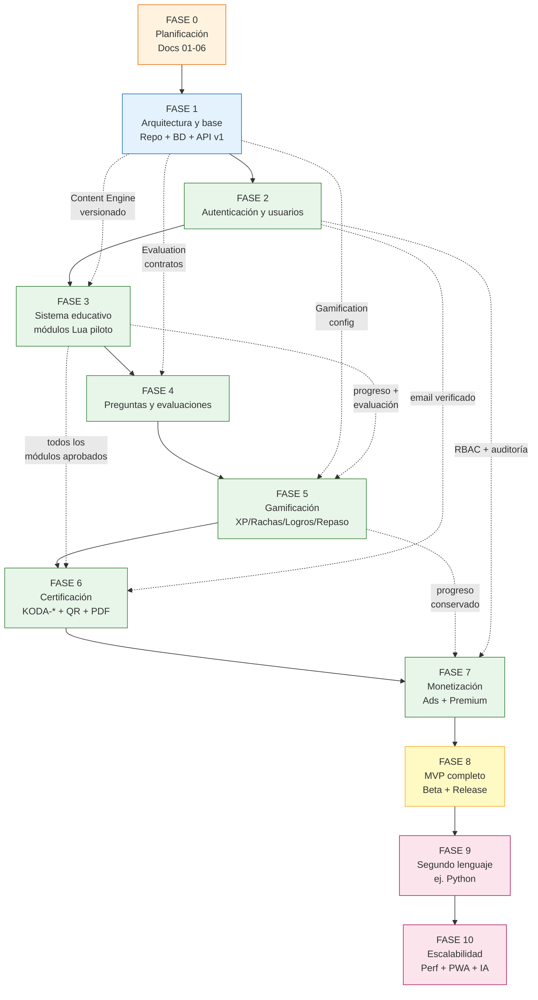
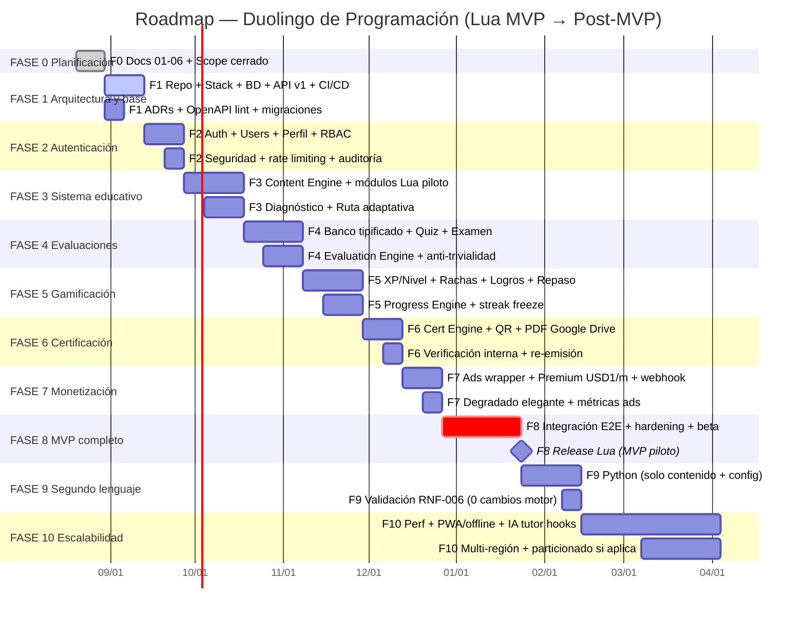

# 22 — Roadmap

> **Estado:** En planificación · **Versión del documento:** 1.0.0 · **Fecha:** 2026-08-29
> **Zona horaria:** America/Bogota (UTC-5)
> Complementa a `01_PROJECT_OVERVIEW.md` (§33–§34 MVP y ruta Lua, §36 visión), `02_PROBLEM_STATEMENT.md`, `03_OBJECTIVES.md` (§2 OE-01–OE-08, §7 criterios), `04_SCOPE.md` (§2 IN SCOPE MVP, §3 Post-MVP, §4 OUT OF SCOPE, §10 anti-scope-creep), `05_FUNCTIONAL_REQUIREMENTS.md` (128 RF), `06_NON_FUNCTIONAL_REQUIREMENTS.md` (RNF-001–RNF-045), `07_USER_STORIES.md`, `08_USE_CASES.md`, `09_USER_FLOWS.md`, `10_INFORMATION_ARCHITECTURE.md`, `11_SYSTEM_ARCHITECTURE.md`, `12_DATABASE_DESIGN.md`, `13_API_SPECIFICATION.md`, `14_LEARNING_SYSTEM.md`, `15_QUIZ_EXAM_SYSTEM.md`, `16_GAMIFICATION.md` y anticipa `17_CERTIFICATION.md`, `18_MONETIZATION.md`, `19_SECURITY.md`, `20_TESTING.md`, `21_DEPLOYMENT.md`, `23_CONTENT_SPECIFICATION.md`, `25_ADMIN_SYSTEM.md`, `26_ANALYTICS.md`, `27_UI_UX_SPECIFICATION.md`.
> **Fuente de verdad temporal:** este documento ordena **cuándo** se entrega cada RF/RNF. Si un elemento no aparece aquí ni en `04`, no debe implementarse sin actualizar ambos y `CHANGELOG.md`.

---

## 1. Principio

Priorizar un **MVP funcional con un solo lenguaje (Lua)** que valide el núcleo educativo completo antes de escalar. Todo lo demás es roadmap, no MVP. Ver `04_SCOPE.md` §1.

**Reglas del roadmap:**
1. Ninguna fase Post-MVP se inicia sin que su dependencia MVP esté **Done** y probada (`20_TESTING.md`).
2. Agregar un lenguaje Post-MVP es **solo contenido + config** (`01` §31, `04` §10.3, `11` §18, `RNF-006/RNF-031`); si exige cambiar el motor, se revisa con ADR.
3. Todo nuevo requisito debe mapear a un `RF-*` en `05` y a un `UC-*` en `08`; si no mapea, se rechaza o se mueve a roadmap (`04` §10).
4. Cada fase cierra solo si cumple su **Definition of Done (DoD)** — sin excepciones.

---

## 2. Resumen de fases y entregas

| Fase | Nombre | Objetivo central | Entrega | RF principales | RNF críticos |
|---|---|---|---|---|---|
| **0** | Planificación | Cerrar alcance, requisitos y arquitectura base | Docs 01–06 aprobados | — | RNF-019 |
| **1** | Arquitectura y base | Repo, stack, BD, API v1, CI/CD y observabilidad mínima | Infra + esqueleto desacoplado | RF-ADM-005/006 | RNF-005/016/017/018/032/043 |
| **2** | Autenticación y usuarios | Identidad segura y perfil reanudable | Auth + Users + Perfil base | RF-AUTH-001–008, RF-USR-001–006, RF-PROF-001–007 | RNF-008/009/022/023/037/038 |
| **3** | Sistema educativo | Jerarquía Lenguaje→Módulo→Sección→Lección + diagnóstico y ruta adaptativa | Learning Engine + Content Engine (módulos Lua piloto) | RF-LANG-001–005, RF-LVL-001–004, RF-DIAG-001–006, RF-RUTA-001–005, RF-MOD-001–005, RF-SEC-001–005, RF-LEC-001–005 | RNF-006/010/011/021/023/031/033 |
| **4** | Preguntas y evaluaciones | Banco tipificado + Quiz + Examen + Evaluation Engine | Question + Evaluation Engines | RF-PREG-001–007, RF-QUIZ-001–006, RF-EXAM-001–007, RF-EVAL-001–006 | RNF-010/012/033/035/036/042 |
| **5** | Gamificación | XP, niveles, rachas, logros y repaso | Gamification + Progress Engines | RF-PROG-001–006, RF-XP-001–005, RF-RACHA-001–005, RF-LOGRO-001–005, RF-REP-001–005 | RNF-016/017 |
| **6** | Certificación | Certificado verificable con QR y PDF | Certification Engine + Google Drive | RF-CERT-001–006, RF-PDF-001–004 | RNF-004/034/035 |
| **7** | Monetización | Gratuito con ads + Premium USD $1/mes | Monetization (Ads + Premium) | RF-ADS-001–005, RF-PREM-001–006 | RNF-014/039/040 |
| **8** | MVP completo | Integración, hardening, beta y release Lua | MVP desplegado 99.5% | Todos los Must MVP (128 RF) | RNF-001/002/003/013/015/020/024–028/041/043/045 |
| **9** | Segundo lenguaje | Validar escalabilidad de contenido (ej. Python) | +1 lenguaje sin tocar motor | RF-LANG-004, RF-MOD-004 | RNF-006/031 |
| **10** | Escalabilidad | Performance, multi-región, PWA/offline, IA tutor (hooks) | Post-MVP avanzado | RF-ADM-009 + futuros RF | RNF-004/007/015/040 |

> **MVP = Fases 0–8.** Fases 9–10 son Post-MVP (`04` §3). Fases 0–1 no entregan valor al usuario final pero bloquean todo lo demás.

---

## 3. Dependencias entre fases

**Tabla de dependencias explícitas:**

| Fase | Depende de | Por qué no puede adelantarse |
|---|---|---|
| 0 | — | Sin 01–06 aprobados no hay RF trazables; todo lo demás es especulación. |
| 1 | 0 | Sin ADRs (`11` §19) ni `12`/`13` no hay migraciones ni contratos OpenAPI. |
| 2 | 1 | Auth es prerrequisito de toda ruta protegida (`RF-RUTA-005`, `RNF-008/009`). |
| 3 | 2 | Learning Engine requiere `user_id` + JWT + `Content Engine` versionado (`14` §5, `RNF-006`). |
| 4 | 3 | Question/Evaluation dependen de jerarquía `Módulo→Sección→Lección` y de `content_version` (`15` §5.4). |
| 5 | 4 | XP/racha/logro/repaso reaccionan a eventos ya calificados en servidor (`16` §4, `RF-EVAL-006`). |
| 6 | 5 | Certificado exige `lenguaje completado ↔ todos los exámenes aprobados` (`RNF-034`, `RF-CERT-001`). |
| 7 | 6 | Ads/Premium se intercalan en flujo ya estable (`RF-ADS-001` entre secciones); premium conserva progreso (`RF-PREM-003`). |
| 8 | 7 | Release exige integración end-to-end (F-01 a F-15 en `09`). |
| 9 | 8 | Segundo lenguaje valida `RNF-006` sin re-arquitectura; solo posible con MVP estable (`11` §18). |
| 10 | 9 | Escalabilidad se mide con datos reales de `26`; prematura es desperdicio. |

---

## 4. Diagrama Gantt

> Duraciones orientativas para equipo de 3–5 personas. Cada fase solapa levemente con la siguiente en tareas de preparación (docs/QA), pero el **DoD** es secuencial — no se declara Done hasta checklist completo.

**Hitos (milestones):**

| Hito | Fecha objetivo | Criterio |
|---|---|---|
| M0 — Scope cerrado | 2026-08-30 | Docs 01–06 + ADRs iniciales aprobados; `04` sin contradicciones. |
| M1 — Esqueleto usable | 2026-09-13 | `POST /auth/register` → `GET /languages` funciona en `staging`; CI verde. |
| M2 — Auth Done | 2026-09-27 | Login/refresh/logout + perfil + reanudación básica probados. |
| M3 — Ruta Lua navegable | 2026-10-18 | Módulos Lua listables, lecciones con ejercicios y feedback <1 s. |
| M4 — Evaluación confiable | 2026-11-08 | Quiz 70% / Examen 80% con `B_min` y revisión sin fuga de banco. |
| M5 — Gamificación viva | 2026-11-29 | 265 XP por módulo, curva exponencial, racha con gracia 2h y freeze. |
| M6 — Certificado verificable | 2026-12-13 | `KODA-LUA-000001` con QR y PDF bit-a-bit almacenado en Google Drive. |
| M7 — Monetización no intrusiva | 2026-12-27 | Ads solo entre secciones + premium sin ads, degradado probado. |
| **MVP Release** | **2027-01-24** | Lua (piloto), retención D7 ≥25%, 99.5% uptime, WCAG AA. |
| M9 — Python sin tocar motor | 2027-02-14 | `content/languages/python/` publicado; test `RNF-006` pasa. |
| M10 — Escalabilidad | 2027-04-04 | p95 <300 ms con 300 concurrentes; PWA y hooks IA listos. |

---

## 5. Detalle por fase

### FASE 0 — Planificación

**Objetivo:** Cerrar **qué** se construye y **qué no**, con trazabilidad RF→UC→US y sin ambigüedad para implementar.

**Alcance:**
- Docs `01_PROJECT_OVERVIEW.md`, `02_PROBLEM_STATEMENT.md`, `03_OBJECTIVES.md`, `04_SCOPE.md`, `05_FUNCTIONAL_REQUIREMENTS.md`, `06_NON_FUNCTIONAL_REQUIREMENTS.md`, `07_USER_STORIES.md` (72 US), `08_USE_CASES.md`, `09_USER_FLOWS.md`, `10_INFORMATION_ARCHITECTURE.md` (32 pantallas S-01–S-32).
- Matriz `RF (128) → UC → US` y criterios anti-scope-creep (`04` §10).

**Entregables:**
- `docs/01–10` v1.0.0 aprobados y sin contradicciones.
- `04` con IN SCOPE MVP (§2), Post-MVP (§3) y OUT OF SCOPE (§4) firmados.
- Backlog priorizado Must/Should/Post-MVP (`05` §2).

**Dependencias:** Ninguna.

**Riesgos y mitigación:**
- Scope creep temprano → `04` §10 exige ADR + actualización de `22`/`CHANGELOG.md` para todo nuevo RF.

#### Definition of Done — FASE 0

- [ ] `01–10` publicados, versionados (1.0.0) y referenciados entre sí sin contradicciones.
- [ ] `04` lista IN SCOPE MVP (8 grupos §2.1–2.8), Post-MVP y OUT OF SCOPE (9 exclusiones) explícitos.
- [ ] Los 128 RF de `05` mapean a ≥1 UC en `08` y a ≥1 US en `07`; ningún RF sin UC.
- [ ] `03` §7 criterios de cumplimiento (funcional/educativo/producto) acordados.
- [ ] `CHANGELOG.md` con entradas por cada doc creado, fecha `America/Bogota`.

---

### FASE 1 — Arquitectura y base

**Objetivo:** Levantar el esqueleto desacoplado, stateless y testeable sobre el que se montan los motores.

**Alcance:**
- Estilo `monolito modular con fronteras explícitas` (`11` §2.1), 3 capas + 9 motores desacoplados (`11` §2.3).
- Repo `src/modules/{auth,users,languages,learning,questions,evaluation,progress,gamification,certification,monetization,content}` (`11` §4.3) con linter de grafo de imports (CI falla si `gamification → evaluation`).
- BD **PostgreSQL ≥15** con migraciones versionadas `V{YYYYMMDD}_{NNN}__*.sql` (`12` §2.2), FKs, índices para `RNF-007` y `content_version` por intento (`RNF-035`).
- API **REST `/api/v1`** con OpenAPI 3.0.3 auto-generado y linteado en CI (`13`, `RNF-032`), envelope `{code,message,request_id}` (`RNF-041`), `X-Request-Id` + `Idempotency-Key` (`RNF-042/045`).
- Cache/KV (Redis o equivalente) para rate limit y refresh; Google Drive API v3 para PDFs de certificados; Object Storage S3-compatible para avatares y assets (`11` §5).
- Pipeline CI/CD: `dev → staging → prod` con rolling deploy, health checks, backups diarios y ensayo de restore (`06` RNF-013/043, `21`).
- Observabilidad mínima: logs JSON estructurados con `request_id` + métricas p50/p95/p99 por endpoint + trazas en `POST /intentos` (`11` §22, `RNF-018`).

**Entregables:**
- `09-decisions/` con ADRs: estilo arquitectónico, lenguaje backend (NestJS), BD (PostgreSQL), frontend (Next.js), storage y KV.
- `openapi.yaml` con 39 endpoints + `/admin/*` esqueleto y schemas `User/Language/Module/Question/Attempt/Progress/Certificate`.
- Migraciones iniciales para `users`, `programming_languages`, `modules`, `sections`, `lessons`, `questions`, `attempts` + `content_versions`.
- `staging` con `GET /languages` y `POST /auth/register` funcionando.

**Dependencias:** FASE 0.

#### Definition of Done — FASE 1

- [ ] ADRs en `09-decisions/` para cada fila con "ADR requerido = Sí" en `11` §19; este doc no impone stack.
- [ ] `openapi.yaml` linteado en CI; cambio breaking exige `/v2` (`RNF-032`).
- [ ] Migraciones reproducibles con FKs, `UNIQUE (email) WHERE deleted_at IS NULL`, índices `(user_id, language_id, module_id)` y `content_version` por intento (`RNF-036/035`).
- [ ] Linter de grafo de imports en CI verde; `evaluation → progress → gamification` es el flujo permitido (`RNF-030`).
- [ ] Grep en CI falla si hay literales de contenido hardcodeados fuera de `content/` (`RNF-031`).
- [ ] Logs con `request_id`, `user_id` anonimizado y `America/Bogota`; ningún secreto en repo ni logs (`RNF-008/045`).
- [ ] Backup diario con retención ≥7 días y ensayo de restore exitoso en `staging` (`RNF-043`); RPO ≤24 h, RTO ≤4 h.
- [ ] Cobertura ≥70% en módulos base y contrato OpenAPI documentado (`RNF-016/032`).

---

### FASE 2 — Autenticación y usuarios

**Objetivo:** Identidad segura, sesión reanudable y perfil con progreso visible — sin esto nada es personal ni trazable.

**Alcance:**
- `RF-AUTH-001–008`: registro/login/logout/refresh/verify/forgot-password, hash adaptativo (Argon2id/bcrypt), JWT corto (15 min) + refresh rotativo 7 días en `httpOnly` (`11` §7, `13` §3), rate limiting 5 intentos/min, mensaje genérico sin enumerar emails (`RNF-041`).
- `RF-USR-001–006`: estados `activo/bloqueado/pendiente_verificacion`, actualización de nombre/credenciales, eliminación/anonimización y portabilidad (`RNF-037/038`).
- `RF-PROF-001–007`: perfil con `nombre, avatar, nivel derivado de XP, XP total, racha actual/máxima, lenguajes estudiados, % por lenguaje, módulo/sección actual, logros y certificados` (`01` §20).
- `S-02–S-05` (Registro/Login/Recuperar/Verificar) + `S-22–S-27` (Perfil) en `10` §6.
- Flujos `F-01` (Primer inicio <3 min) y `F-02` (Registro) en `09`.

**Entregables:**
- Endpoints `POST /auth/*`, `GET/PATCH/DELETE /users/me`, `GET /users/me/progress` (vacío al inicio), `GET /languages` (público).
- Frontend `Auth` + `Onboarding` (lenguaje/nivel/diagnóstico placeholder) y reanudación `RF-RUTA-005` básica.
- Auditoría `audit_log` con `quién/qué/cuándo/versión` (`RF-AUTH-008`, `RF-ADM-008`).

**Dependencias:** FASE 1.

#### Definition of Done — FASE 2

- [ ] Registro con validación de email, fortaleza de contraseña y unicidad; email de verificación en cola con reintentos y no bloquea lecciones (`RF-AUTH-005`, `RNF-014`).
- [ ] Login emite `access` + `refresh` rotativo; refresh silencioso intra-lección sin re-login (`RF-AUTH-007`, `RNF-023`); logout invalida refresh en KV.
- [ ] Rate limiting por IP+usuario en `POST /auth/login` y `POST /auth/forgot-password` con `429 + Retry-After`; mensaje genérico sin revelar existencia (`RF-AUTH-006`).
- [ ] Sesión reanudable: cerrar pestaña/cambiar dispositivo restaura `módulo/sección/lección/ejercicio` exacto en <2 s (`RF-RUTA-005`, `RNF-023`).
- [ ] Perfil muestra avatar por defecto, nivel/XP/racha y progreso por lenguaje; aislamiento `RF-USR-005` verificado (403 al acceder a progreso ajeno, `RNF-009` IDOR).
- [ ] Flujo `F-01` registro→primera lección <3 min con 5 usuarios nuevos (`RNF-020`).
- [ ] Contraseñas nunca en claro ni en logs; escáner de secretos en CI verde (`RNF-008`).
- [ ] Tests: hash/verify, expiración/refresh, IDOR, XSS almacenado y auditoría `audit_log` con `America/Bogota`.

---

### FASE 3 — Sistema educativo

**Objetivo:** Hacer navegable y pedagógicamente correcta la jerarquía que consumen todos los motores.

**Alcance:**
- Jerarquía canónica `Lenguaje → Módulo → Sección → Lección → Ejercicio` (`01` §7, `14` §2) con **módulos Lua** (`01` §34, `ADR-005`): Fundamentos → Variables y tipos → Operadores → Condicionales → Bucles → Funciones → Tablas → Metatables → Manejo de errores → Módulos → I/O → Proyecto final.
- `RF-LANG-001–005`: catálogo (solo `PY=disponible`, resto `proximamente`), selección de lenguaje activo y progreso aislado por lenguaje.
- `RF-LVL-001–004`: `BEGINNER/MEDIUM/SEMI_PROFESSIONAL/PROFESSIONAL` con descripciones `01` §8.
- `RF-DIAG-001–006`: diagnóstico de **24 preguntas** (2 por módulo ×12), estratificado por bloque, calificación por módulo/bloque y recomendación de `entry_module` en 4 pasos con clamping por nivel (`14` §6).
- `RF-RUTA-001–005`, `RF-MOD-001–005`, `RF-SEC-001–005`, `RF-LEC-001–005`: estados `BLOQUEADO/DISPONIBLE/EN_PROGRESO/QUIZ_PENDIENTE/EXAMEN_PENDIENTE/APROBADO/REPROBADO/OMITIDO_POR_DIAGNOSTICO` con máquinas de estados Mermaid (`14` §3–§4), prerrequisitos `M(i) disponible ⇔ M(i-1)=APROBADO ∨ i=1 ∨ salto diagnóstico`, sesiones reanudables y lección `concepto→explicación→ejemplo→ejercicio→feedback→recompensa` (`01` §6).
- `Content Engine`: CRUD `Lenguaje/Módulo/Sección/Lección`, publicación/ocultamiento sin deploy, versionado con trazabilidad por intento (`RF-ADM-001/003/005`, `RNF-035`) y validación `IDs únicos + prerrequisitos sin ciclos` (`RF-ADM-006`).
- Pantallas `S-06–S-15` (Biblioteca, Ruta, Módulo, Sección, Lección, Intersticial) y flujos `F-03–F-06`.

**Entregables:**
- `content/languages/python/` con `manifest.json`, `modules/01_fundamentos/...` y `config/thresholds.json` + `xp.json` versionados.
- Endpoints `GET /languages/{id}/modules`, `GET /modules/{id}`, `POST /lessons/{id}/complete`, `POST /lessons/{id}/answer` con `Idempotency-Key` y `Cache-Control + ETag` por `content_version`.
- Learning Engine con fórmula de `Score_repaso(c)` y recomendación priorizada (`14` §8–§9).

**Dependencias:** FASE 2 + Content Engine de FASE 1.

#### Definition of Done — FASE 3

- [ ] Módulos Lua navegan en `S-11` (timeline) y `S-12` (detalle) con estados y % correctos; prerrequisito bloquea siguiente módulo salvo `OMITIDO_POR_DIAGNOSTICO` validado por diagnóstico (`RF-RUTA-004`).
- [ ] Diagnóstico de 24 preguntas genera `entry_module` reproducible con justificación por área; `re-diagnóstico` no borra `APROBADOS` (`RF-DIAG-004/006`).
- [ ] Lección cumple `OED-02`: ninguna sin ejercicio obligatorio; feedback <1 s p95 (`RNF-010`) y transición lección→siguiente <500 ms p95 cacheada (`RNF-011`).
- [ ] Persistencia atómica por respuesta con `Idempotency-Key`; reenvío no duplica XP ni progreso (`RNF-033/042`, `RF-LEC-003`).
- [ ] Breadcrumb `Lenguaje → Módulo → Sección → Lección` visible en toda vista de aprendizaje (`RNF-021`, `RF-SEC-004`).
- [ ] Publicar/ocultar contenido sin deploy y con validación de ciclos/huérfanos bloqueante (`RF-ADM-003/006`, `RNF-017`).
- [ ] Contenido desacoplado verificado: `grep` en CI sin literales + ensayo `RNF-006` con lenguaje de prueba (Lua 1 módulo) sin cambios en motor.

---

### FASE 4 — Preguntas y evaluaciones

**Objetivo:** Convertir la práctica en evaluación confiable, no memorizable y auditable en servidor.

**Alcance:**
- `RF-PREG-001–007`: **11 tipos** canónicos (`SINGLE_CHOICE` … `SMALL_PROBLEM`, `15` §3.1) con metadatos `lenguaje/módulo/sección/lección/tipo/dificultad/categoría/respuestas/explicación/puntaje/versión`, entrega **anclada** al contenido actual (no aleatoria global), aleatorización de opciones con trazabilidad.
- `RF-QUIZ-001–006`: ≥1 quiz por módulo, **10 preguntas** por defecto (3 single, 2 V/F, 2 predict, 1 fill, 1 find_error, 1 select_code), dificultad 40/40/20, umbral **70%** configurable, revisión sin exponer banco.
- `RF-EXAM-001–007`: 1 examen por módulo, **20 preguntas** por defecto (`01` §14 ejemplo + variante ampliada `15` §5.2), distribución configurable, dificultad 30/40/30, umbral **80%**, bloqueo de siguiente módulo si reprueba (`RF-EXAM-004`), reintentos ilimitados sin promediar.
- `RF-EVAL-001–006`: motor determinista en servidor, `porcentaje = round(P_obt/P_max*100, 2)`, registro inmutable con `usuario/módulo/puntaje/%/umbral_aplicado/fecha/version_contenido/semilla` (`RNF-035`), desglose por tipo/dificultad/concepto y `conceptos_débiles` para repaso.
- Anti-trivialidad `15` §13/§15: `B_min` (quiz 30 / examen 80, ratio 3×/4×), `max_easy_ratio=40%`, ponderación por dificultad (HARD 20 pts vs EASY 10 pts), barajado Fisher-Yates con `semilla = hash(intento_id + modulo + version)`, exclusión de los últimos 2 intentos (`overlap` quiz ≤50% / examen ≤40%).
- Pantallas `S-16–S-19` (Quiz/Examen + Revisiones) y flujos `F-07–F-09`.

**Entregables:**
- `Question Engine` con `getQuestionsForLesson/Quiz/Exam/Review` y `validateAnswer` en servidor; contrato en `11` §9.
- `Evaluation Engine` con `<2 s` p95 en calificación (`RNF-012`) y `bank.min_ratio` bloqueante en publicación (`RF-ADM-006`).
- Endpoints `POST /quiz/{id}/attempt`, `POST /exam/{id}/attempt` (con `Idempotency-Key`), `GET .../attempts` y `GET .../revision`.

**Dependencias:** FASE 3 (jerarquía + `content_version`).

#### Definition of Done — FASE 4

- [ ] Banco mínimo por tipo/dificultad validado en publicación; publicar examen pobre es rechazado con detalle de faltantes (`15` §5.4, `RF-ADM-006`).
- [ ] Quiz/Examen se califican **exclusivamente en servidor**; manipulación en cliente no altera % (`RF-EVAL-006`); toda calificación es recalculable bit-a-bit con `semilla` (`RF-EVAL-003`).
- [ ] Umbrales versionados: cambiar 70/80 afecta solo intentos futuros; intentos previos conservan `umbral_aplicado` (`RF-EVAL-005`, `RNF-035`).
- [ ] Revisión muestra `pregunta/respuesta_dada/correcta/explicación/concepto` solo de las N preguntas del intento, nunca el banco completo (`RF-QUIZ-004/006`); desglose por tipo/dificultad y `conceptos_débiles` en examen (`RF-EXAM-006`).
- [ ] Aleatorización auditable: orden de preguntas y opciones difiere entre intentos con misma semántica (`15` §15.1); `overlap` de reintento dentro de límites o métrica `eval.overlap_high` en `26`.
- [ ] Feedback individual <1 s y calificación de quiz/examen <2 s p95 con 50 envíos concurrentes (`RNF-010/012`); APM por endpoint verde.
- [ ] Reintentos ilimitados, desbloqueo exige **un** aprobado, no promedio (`RF-EXAM-005`); XP por reintento con decaimiento (`15` §11.2) verificado.
- [ ] Cobertura ≥70% en `Evaluation Engine` y matriz `RF → test` en `20`.

---

### FASE 5 — Gamificación

**Objetivo:** Sostener constancia sin premiar clics — solo comprensión verificada.

**Alcance:**
- `RF-PROG-001–006`: `progress` como **doble capa** — fuente de verdad inmutable (`attempts` + `attempt_answers` + `xp_transactions` + `streaks`) y agregado derivado `progress` por `scope (language/module/section/lesson)` con lectura p95 <100 ms (`12` §6.13, `RNF-007/033/034`).
- `RF-XP-001–005`: tabla de 10 acciones (`16` §5.2 — `XP-SEC +10`, `XP-EJ-CORR +5`, `XP-EJ-RECUP +2`, `XP-QUIZ +25`, `XP-EXAM +100`, `XP-MOD-BONO +50`, `XP-REPASO +3` con tope 9/día, `XP-DIAG +10`), multiplicadores (racha ≥7 +5%, perfección +10, remontada +5, eventos ×1.5/×2 sin tocar umbrales), 6 reglas anti-gaming (solo POST validados otorgan XP — ningún GET—, idempotencia, tiempo mínimo 20 s, flag `posible_automatización` si <2 s en 5 seguidos, tope blando 200 XP/día, versionado).
- `RF-XP-002` — Fórmula de nivel exponencial `XP(N)=floor(100×N^1.65+20×N)` con tabla hasta nivel 50 y alternativa `tiered` (`16` §6), configurable sin deploy y sin reducir nivel ya alcanzado.
- `RF-RACHA-001–005`: actividad válida (lección/sección/quiz/examen/repaso/diagnóstico), ventana `[00:00,23:59:59]` en `user.timezone` (default `America/Bogota`), gracia 2 h no acumulable y `Streak Freeze` (1 cada 7 días, máx 2) (`16` §7).
- `RF-LOGRO-001–005`: catálogo de **18 logros MVP** (`FIRST_CODE`, `FIRST_MODULE`, `ON_FIRE` 7 días, `PERFECT SCORE`, `PYTHON_BEGINNER`, `CODE_MASTER` … `16` §9.2) con XP bono y rareza, desbloqueo automático una sola vez, configurable sin tocar motor.
- `RF-REP-001–005`: repaso priorizado con `Score_repaso(c)=0.35×Tasa_error+0.25×(1-Rendimiento)+0.25×Antigüedad_norm+0.15×Prerrequisito_próximo` (`14` §8), 3 tipos (inter-sesión/post-evaluación/manual), opcional y no bloqueante, sin penalizar % de módulo.
- `S-20–S-21` (Repaso Hub + Sesión) y flujos `F-10–F-11`.

**Entregables:**
- `Gamification Engine` con `level.curve = exponential|tiered` y `gamification.config.yaml` versionado (`16` §13) editable vía `/admin/configuracion`.
- `Progress Engine` con `progress_percent` y `streak_day` derivados de `streaks` (ventana diaria + `ROW_NUMBER()` → `grp`).
- Endpoints `GET /users/me/progress`, `GET /progress/streak`, `GET /users/me/achievements`, `GET /review/recommended`, `POST /review/attempt`.

**Dependencias:** FASE 4 (eventos calificados).

#### Definition of Done — FASE 5

- [ ] Ningún `GET` otorga XP; abrir lección o navegar no genera `xp_granted` (test anti-clic pasa, `16` §5.1).
- [ ] `Reintento idempotente` no duplica XP ni progreso (doble `Idempotency-Key` con mismo payload → 200 sin duplicar, `RNF-042`).
- [ ] Curva de nivel determinista: misma `XP_total` → mismo nivel; cambiar `BASE/FACTOR/OFFSET` no reduce nivel ya alcanzado (`RF-XP-002`, `16` §6.3).
- [ ] Racha respeta `user.timezone`, gracia 2 h y freeze 1×7 días máx 2 con historial `streak_day` auditable; `racha máxima` nunca se resetea (`RF-RACHA-002/003/005`).
- [ ] Logro se desbloquea automáticamente, una sola vez, con `unlocked_at`; reintento no duplica (`RF-LOGRO-005`).
- [ ] Progreso agregado por `language/module/section/lesson` con `percent = completed/total*100` y `scope` coherente (`12` §6.13); invariante `lenguaje completado ↔ todos los exámenes aprobados` pasa (`RNF-034`).
- [ ] Repaso genera top N=5 (corto) / N=10 (post-reprobado) sin repetir preguntas de las últimas 2 sesiones y sin bloquear ruta (`RF-REP-003/004`).
- [ ] Perfil muestra `Nivel 12 — 1.240 XP — Racha 7 días 🔥 — ❄️×1` y barras por lenguaje con % (`S-22`, `RF-PROF-001`).

---

### FASE 6 — Certificación

**Objetivo:** Acreditar finalización con un certificado único, verificable y exportable que no se falsifica ni se duplica.

**Alcance:**
- `RF-CERT-001–006`: condición `todos los módulos/exámenes del lenguaje aprobados en versión vigente` (`04` §7, `RNF-034`), datos mínimos `nombre/documento/lenguaje/fecha/ID/plataforma/estado` (`01` §21), ID `KODA-{LANG}-{SEQ}` correlativo por lenguaje (`01` §22, `12` §6.17 `certificate_sequences` con `UPDATE ... RETURNING last_seq`), QR de verificación interna y exposición `validez/lenguaje/fecha/titular` sin PII de terceros.
- `RF-PDF-001–004`: plantilla versionada con QR, almacenamiento en Google Drive API v3 (Service Account), correspondencia bit-a-bit, descarga autenticada solo titular.
- Estados `vigente → obsoleto (por cambio significativo de contenido) → revalidado` (`11` §12); un vigente por lenguaje (`UNIQUE (user_id, language_id) WHERE status='valid'`).
- Requisito `email verificado` antes de emitir (`RF-AUTH-005`, `US-059`).
- Pantallas `S-26–S-29` y flujos `F-12–F-13`.

**Entregables:**
- `Certification Engine` con `code ~ ^KODA-[A-Z]+-[0-9]{6}$`, `qr_payload` y `google_drive_file_id` (`12` §6.17).
- Endpoints `GET /users/me/certificates`, `GET /certificates/{id}` (público sin PII), `GET /certificates/{id}/pdf` (solo titular), `POST /certificates/verify`.
- Verificación pública Post-MVP como diseño (no implementación) — `04` §3.

**Dependencias:** FASE 5 (lenguaje completado) + FASE 2 (email verificado).

#### Definition of Done — FASE 6

- [ ] Certificado solo se emite con `email_verified_at IS NOT NULL` y `∀ módulo: APROBADO` en `content_version` vigente; si falta módulo, lista faltantes (`RF-CERT-001`, `RNF-034`).
- [ ] ID `KODA-LUA-000001` correlativo sin huecos visibles por lenguaje; `UNIQUE (code)` + `UNIQUE (user_id, language_id) WHERE valid` verificados bajo concurrencia (lock optimista).
- [ ] QR verifica por `ID/QR` sin exponer `document_number` (enmascarado `CC ***678`, `RNF-037`).
- [ ] PDF con plantilla versionada, QR y `America/Bogota`; re-generación reutiliza artefacto si no cambió certificado; `GET /pdf` exige titular (403 si no, `RNF-009`).
- [ ] Re-emisión: cambio significativo de `language.content_version` marca previo `obsoleto` y exige revalidación; nunca dos vigentes (`RF-CERT-005`).
- [ ] Degradado: fallo de Object Storage no impide lecciones/quizzes/exámenes; certificado lógico sigue válido con reintento async (`RNF-014`).
- [ ] `GET /certificates/{id}` público con `status valid/obsolete` correcto.

---

### FASE 7 — Monetización

**Objetivo:** Monetizar sin degradar el aprendizaje — ads nunca intra-ejercicio, premium sin perder progreso.

**Alcance:**
- `RF-ADS-001–005`: solo entre secciones `Sección completada → Recompensa → Publicidad → Siguiente sección` (`01` §23), **nunca** durante ejercicio/quiz/examen (`RF-ADS-002`, `04` §8, `03` OUX-07), carga asíncrona no bloqueante, métricas esenciales sin fingerprinting ni cross-site (`RNF-039/040`), interfaz `AdsProvider` abstraída (`11` §13).
- `RF-PREM-001–006`: plan **USD $1/mes** (precio inicial configurable), estados `activa/expirada/cancelada`, efecto inmediato `isPremium → sin ads` (`RF-PREM-005`), conservación `progreso/XP/rachas/logros` al cambiar de plan (`RF-PREM-003`), pasarela `PaymentProvider` abstraída (`11` §14) con idempotencia de webhooks y auditoría sin almacenar tarjetas (`RNF-037`).
- `S-15` (Intersticial Recompensa+Ad) + `S-30` (Premium) y flujos `F-14–F-15`; gratuito y premium acceden al **mismo contenido** en MVP (`US-066`, `04` §8).

**Entregables:**
- `Monetization` con `isPremium(user)` en gateway y `AdsProvider { loadAd, reportImpression }`.
- Endpoints de suscripción (webhook idempotente, estados y fechas) y `ads.show_interstitial` en `POST /lessons/{id}/complete`.

**Dependencias:** FASE 6 (flujo estable) + FASE 2 (auditoría).

#### Definition of Done — FASE 7

- [ ] Test de invariante: intentar disparar ad intra-ejercicio/quiz/examen falla (`RF-ADS-002`).
- [ ] Test de caos: deshabilitar mock de `AdsProvider` o `EmailService` no bloquea `Sección completada` ni registro de progreso (`RNF-014`, `RF-ADS-003`).
- [ ] Activar premium elimina publicidad de forma inmediata en web y futuras sesiones; al expirar/cancelar vuelve a `gratuita` sin perder avance (`RF-PREM-002/003/005`).
- [ ] Webhook de pasarela duplicado no duplica activación ni auditoría (idempotencia).
- [ ] Métricas de ads solo `impresiones/clics` esenciales; inspección de payloads a terceros sin PII de progreso (`RNF-040`).
- [ ] Premium no desbloquea contenido adicional en MVP; solo elimina ads (`04` §8, `US-066`).

---

### FASE 8 — MVP completo

**Objetivo:** Integrar, endurecer y liberar el MVP de Lua (piloto) de a `prod` con criterios de producto y negocio.

**Alcance:**
- Integración end-to-end de `F-01` a `F-15` (`09` §3 mapa general) con `S-01–S-32` (`10` §6) y los 9 motores (`11` §2.3).
- Hardening `06`: p95 lectura lección <300 ms, envío ejercicio <500 ms, feedback <1 s, calificación <2 s (`RNF-001/010/012`), paginación ≤100 ítems y payload lección <200 KB (`RNF-003`), disponibilidad ≥99.5% mensual (`RNF-013`), deploy rolling sin downtime (`RNF-015`), WCAG 2.1 AA en flujos críticos con `axe/Lighthouse ≥95` (`RNF-024–026`), responsive 360×640/768×1024/1280×800 con touch ≥44×44 px (`RNF-027/028`), mensajes pedagógicos sin stack traces (`RNF-022/041`).
- Pirámide de pruebas `20`: unit → integration → API → UI (Playwright/Cypress en 2 motores: Chromium + WebKit/Firefox), carga/pico/volumen en `staging` con 100 concurrentes y 3× pico 5 min con error <1% (`RNF-001/002`), volumen 100k intentos con progreso/ruta <100 ms p95 (`RNF-007`), tolerancia a pérdida de conectividad sin corrupción (`RNF-044`).
- Beta cerrada con 5 usuarios nuevos (onboarding <3 min, Módulo 1 sin ayuda) y 20 usuarios intermedios (diagnóstico ubica correctamente ≥80%) (`03` §7.2).
- `21_DEPLOYMENT.md` (entornos, backups, rollback) + `26_ANALYTICS.md` (funnel, DAU/WAU, % aprobación) operativos.

**Entregables:**
- `prod` con **Lua (piloto) publicado**, `content_version` trazable y certificados vigentes.
- Reportes: cobertura ≥70% por motor (`RNF-016`), APM p95/p99, uptime sintético, auditoría `axe`, y ensayo de backup/restore con RPO/RTO.
- `CHANGELOG.md` al día con cada cambio y fecha `America/Bogota`.

**Dependencias:** FASE 7 (todo el flujo monetizado).

#### Definition of Done — FASE 8 (MVP Release)

- [ ] Los módulos Lua en `prod` con `status published`; ningún texto hardcodeado en motor/UI (`RNF-031`).
- [ ] Flujos `F-01–F-15` ejecutables end-to-end en `staging` y `prod` sin callejones sin salida.
- [ ] Criterios `03` §7.2 educativos: 5/5 principiantes completan Módulo 1 sin ayuda; 16/20 intermedios ubicados correctamente por diagnóstico; tasa de aprobación Examen primer intento 55–85%.
- [ ] Criterios `03` §7.3 producto: `100%` Lua → certificado `KODA-LUA-*` + PDF verificado; retención **D7 ≥25%** en cohorte beta (`26`).
- [ ] RNF obligatorios MVP (38) medidos en `staging`/`prod` con evidencia registrada; sin regresión en la siguiente versión (`06` §5.2).
- [ ] Accesibilidad WCAG 2.1 AA: `axe/Lighthouse ≥95` en `S-02, S-14, S-16, S-18, S-22, S-28`; navegación solo teclado recorre quiz completo sin trampa (`RNF-025`).
- [ ] Seguridad: SAST/DAST + OWASP ASVS L1 sin hallazgos críticos (`RNF-009`); PII minimizada y no en logs/URLs (`RNF-037`).
- [ ] Documentación `01–27` sin contradicciones y `CHANGELOG.md` con `America/Bogota` al día (`RNF-019`).
- [ ] Tag `v1.0.0` desplegado con rollback probado y `Sunset` ≥30 días para deprecaciones (`13` §12).

> **Post-MVP no se implementa prematuramente.** Ver `04` §10: sin ADR y sin actualizar `04`/`22`/`CHANGELOG.md` no se hace.

---

### FASE 9 — Segundo lenguaje

**Objetivo:** Demostrar que la arquitectura escala en contenido sin re-arquitectura.

**Alcance:**
- Agregar **Lua** (o JS/TS a elección pedagógica) siguiendo `11` §18.2: `content/languages/lua/manifest.json` + `modules/01_fundamentos/...` + `config/*` + validación `POST /admin/content/validate` + `publish` sin deploy.
- Reutilizar **0 cambios** en `src/modules/*` (`RF-LANG-004`, `RNF-006`); progreso aislado por lenguaje (`RF-LANG-005`).

**Entregables:**
- Lua disponible con al menos 1–12 módulos (mínimo 1 para ensayo `RNF-006`, ideal 12).
- Ensayo en `staging` con lenguaje de prueba y checklist `23_CONTENT_SPECIFICATION.md`.

**Dependencias:** FASE 8.

#### Definition of Done — FASE 9

- [ ] `content/languages/python/` publicado en `staging` y `prod` con `status available`; Lua intacto y versionado independiente (`RNF-035`).
- [ ] Grep en CI sin literales de `Lua` en el motor tras agregar Python (`RNF-031`).
- [ ] Usuario con progreso en Lua cambia a Python y viceversa sin contaminación (`RF-LANG-003/005`).
- [ ] Diagnóstico y ruta de Lua funcionan con 24 preguntas estratificadas si se completa el banco.
- [ ] Tiempo de incorporación de Lua (contenido + config) documentado y <5 días-hombre de autoría excluyendo creación pedagógica (`RNF-006`).

---

### FASE 10 — Escalabilidad

**Objetivo:** Preparar el sistema para 10× usuarios y funcionalidades avanzadas sin reescribir el núcleo.

**Alcance:**
- **Performance:** índices y `EXPLAIN ANALYZE` con 100k intentos, réplicas stateless con HPA y balanceo sin sticky sessions (`RNF-005/007`); CDN para PDFs/assets (`RNF-004` Post-MVP).
- **Confiabilidad:** blue-green deploy (`RNF-015` Post-MVP), multi-región si `26` lo justifica (`04` §5, `06` §6), partícionado de `attempts`/`attempt_answers` por `language_id` si se justifica.
- **Funcionalidades Post-MVP** (`04` §3) diseñadas para no bloquear MVP: editor y ejecución en sandbox, proyectos prácticos y proyecto final evaluado, rankings/competencias, amigos/perfiles públicos, marketplace de cursos de terceros, modo offline y PWA, apps móvil/escritorio, IA tutor y recomendaciones personalizadas, repetición espaciada **FSRS/SM-2** (extiende `Score_repaso` sin romper invariantes, `14` §15), verificación pública de certificados.
- **Privacidad:** auditoría externa de `RNF-040` si se requiere y seudonimización en `26`.

**Entregables:**
- Runbooks de escalado, particionado y blue-green; dashboards de `21`/`26` con p50/p95/p99 y DAU/WAU.
- Hooks para PWA (`Cache-Control` + `ETag` por `content_version`) y para IA tutor (sin LLM obligatorio — ver `18` en `modo-trabajo.md`).

**Dependencias:** FASE 9 + métricas reales de `26`.

#### Definition of Done — FASE 10

- [ ] Prueba 1→2 réplicas reduce p95 bajo carga linealmente; sin estado local pegajoso (`RNF-005`).
- [ ] `EXPLAIN ANALYZE` en `staging` con dataset sintético muestra progreso/ruta <100 ms p95 con 100k intentos (`RNF-007`).
- [ ] PWA instalable con contenido ya visto cacheado y sincronización al reconectar sin corrupción (`RNF-044`); offline no bloquea lecciones descargadas.
- [ ] Nuevos lounges/modos (rankings, sandbox, IA tutor) detrás de feature flags y con ADR; no alteran umbrales 70/80 ni desbloquean sin examen aprobado.
- [ ] Retención de analytics documentada, seudonimizada y sin compartir progreso con ads (`RNF-040`).

---

## 6. Criterios de release y puertas de calidad

| Puerta | Cuándo | Quién decide | Qué se revisa |
|---|---|---|---|
| **Design Review** | Fin de FASE 0 | Producto + Arquitectura | `04` IN/OUT sin ambigüedad; 128 RF mapeados. |
| **Architecture Review** | Fin de FASE 1 | Arquitectura | ADRs, OpenAPI linteado, grafo de imports, migraciones FK + índices. |
| **Security Review** | Fin de FASE 2 y 8 | Seguridad | Hash, JWT, rate limiting, IDOR, SAST/DAST, PII. |
| **Content Review** | Fin de FASE 3 y 9 | Pedagógico + ADM | `RF-ADM-006` (sin ciclos/huérfanos), cobertura por concepto ≥1, `B_min`. |
| **Evaluation Review** | Fin de FASE 4 | Pedagógico + QA | `B_min`, `max_easy_ratio`, `overlap`, calificación <2 s. |
| **Beta Go/No-Go** | Fin de FASE 8 | Producto + QA | Criterios `03` §7.2/7.3 + RNF obligatorios + WCAG AA. |
| **Post-MVP Go** | Inicio de FASE 9/10 | Producto | Métricas `26` justifican Lua y escalabilidad. |

---

## 7. Trazabilidad fase → RF / RNF / US / UC

| Fase | RF (de `05`) | RNF (de `06`) | US (de `07`) | UC (de `08`) | Docs expuestos |
|---|---|---|---|---|---|
| 0 | — (define los 128) | RNF-019 | — | — | 01–10 |
| 1 | RF-ADM-005/006, RF-PREG-006 | RNF-005/016/017/018/030/031/032/043 | — | — | 11,12,13,23 |
| 2 | RF-AUTH-001–008, RF-USR-001–006, RF-PROF-001–007 | RNF-008/009/022/023/037/038/041/045 | US-001–012 | UC-001,UC-002,UC-009,UC-010,UC-020 | 19 |
| 3 | RF-LANG-001–005, RF-LVL-001–004, RF-DIAG-001–006, RF-RUTA-001–005, RF-MOD-001–005, RF-SEC-001–005, RF-LEC-001–005, RF-ADM-001/003/005 | RNF-006/010/011/021/023/031/033 | US-013–030 | UC-003–UC-006, UC-016 | 14 |
| 4 | RF-PREG-001–007, RF-QUIZ-001–006, RF-EXAM-001–007, RF-EVAL-001–006, RF-ADM-002/004 | RNF-010/012/033/035/036/042 | US-031–040 | UC-007,UC-008,UC-017,UC-018 | 15 |
| 5 | RF-PROG-001–006, RF-XP-001–005, RF-RACHA-001–005, RF-LOGRO-001–005, RF-REP-001–005 | RNF-017 | US-041–053 | UC-009,UC-010,UC-011,UC-015 | 16 |
| 6 | RF-CERT-001–006, RF-PDF-001–004 | RNF-004/034/035 | US-054–060 | UC-012,UC-013 | 17 |
| 7 | RF-ADS-001–005, RF-PREM-001–006 | RNF-014/039/040 | US-061–066 | UC-014,UC-019 | 18 |
| 8 | Todos los Must MVP | RNF-001/002/003/013/015/020/024–028 | Todas | F-01–F-15 | 20,21,26,27 |
| 9 | RF-LANG-004, RF-MOD-004 | RNF-006/031 | US-014,US-029 | UC-016 | 23 |
| 10 | RF-ADM-009 (+ futuros) | RNF-004/007/015/040 | Post-MVP | Post-MVP | 21,26 |

---

## 8. Riesgos globales y mitigaciones

| Riesgo | Impacto | Fase donde duele | Mitigación en este roadmap |
|---|---|---|---|
| Contenido hardcodeado en UI/motor | Rompe `RNF-006/031`; agregar Lua exige deploy | 1, 3, 9 | Grep en CI + ensayo `RNF-006` + Content Engine como única fuente (`11` §18). |
| Evaluación en cliente | Fraude de XP/certificados | 4 | `RF-EVAL-006`: solo servidor; cliente nunca decide aprobación. |
| Acoplamiento entre motores | Cambio en Gamificación rompe Evaluación | 1, 5 | Linter de grafo de imports en CI (`RNF-030`). |
| Publicidad bloquea aprendizaje | Viola `RF-ADS-002`/`RNF-014` | 7 | Wrapper async + test de caos con ads deshabilitados. |
| Certificados duplicados/falsos | Pérdida de confianza | 6 | `KODA-*` con lock + un vigente + verificación sin PII + PDF bit-a-bit. |
| Pérdida de progreso por red | Abandono | 3, 4, 8 | `RNF-033` atómico + `Idempotency-Key` + reanudación `RNF-023/044`. |
| Elección tecnológica prematura | Deuda y re-trabajo | 1 | ADRs obligatorios; este doc propone duraciones, no impone stack. |
| Scope creep Post-MVP prematuro | Retrasa MVP | 0–8 | `04` §10 + §6 puertas; sin ADR no entra a MVP. |

---

## 9. Referencias cruzadas

| Documento | Relación |
|---|---|
| `01_PROJECT_OVERVIEW.md` §33–§38 | Flujo principal, filosofía y ruta Lua que este roadmap calendariza. |
| `04_SCOPE.md` §2–§4, §10 | IN/OUT/Post-MVP y anti-scope-creep que este roadmap hace cumplir por fases. |
| `05_FUNCTIONAL_REQUIREMENTS.md` §4–§6 | 128 RF y dependencias `RF-AUTH→...→RF-ADM` que dictan el orden §3. |
| `06_NON_FUNCTIONAL_REQUIREMENTS.md` §5 | Matriz de verificación por fase (tests, Lighthouse, carga, auditoría UAT). |
| `11_SYSTEM_ARCHITECTURE.md` §18 | Procedimiento de 10 pasos para agregar Lua sin tocar el núcleo (FASE 9). |
| `14_LEARNING_SYSTEM.md` §6–§8 | Fórmula `entry_module` y `Score_repaso` que se implementan en FASE 3/5. |
| `15_QUIZ_EXAM_SYSTEM.md` §5–§6/§15 | `B_min`, composición y anti-trivialidad que bloquean publicación en FASE 4. |
| `16_GAMIFICATION.md` §5–§7 | Tabla XP, curva de nivel y rachas con gracia/freeze de FASE 5. |
| `20_TESTING.md` (futuro) | Pirámide por fase y matriz RF→test exigida en cada DoD. |
| `21_DEPLOYMENT.md` (futuro) | Entornos, backups y observabilidad de FASE 1/8. |

---

## 10. Checklist de cierre del roadmap (para quien lo revisa)

- [ ] Cada fase lista **objetivo, alcance, entregables, dependencias y DoD** verificable.
- [ ] Ningún RF Post-MVP se implementa en FASE 0–8 sin ADR.
- [ ] Gantt Mermaid renderiza sin errores y cubre 2026-08-20 → 2027-04-04.
- [ ] Dependencias Mermaid sin ciclos y coherentes con `05` §5.3.
- [ ] Cada DoD incluye métrica o test que lo hace falsable (no "terminado cuando se vea bien").
- [ ] `CHANGELOG.md` actualizado con fecha `America/Bogota`.

---

*Fin de `22_ROADMAP.md` — cualquier adición de fase, cambio de orden, alteración de DoD o ajuste de Gantt requiere actualizar este documento, `04_SCOPE.md` si afecta al MVP, `05`/`06` si reordena RF/RNF, y entrada en `CHANGELOG.md` con fecha `America/Bogota`.*
