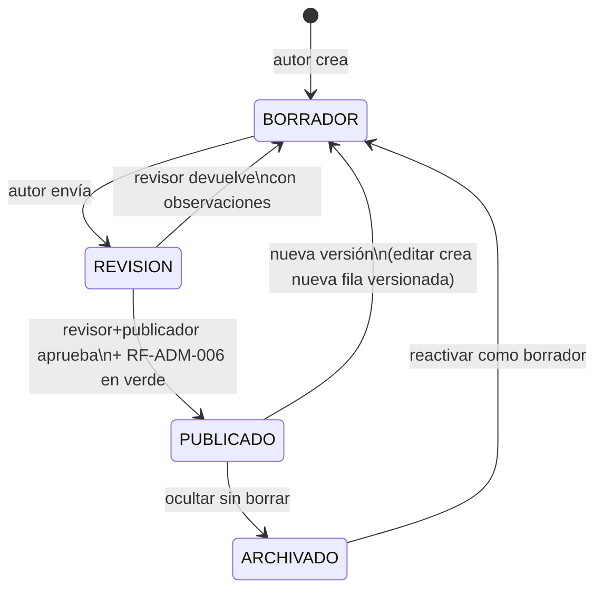

# 24 — Guía de Autoría de Contenido (Content Authoring Guide)

> **Estado:** En planificación · **Versión del documento:** 1.0.0 · **Fecha:** 2026-08-29
> Complementa a `01_PROJECT_OVERVIEW.md` §6–§7/§31/§38, `02_PROBLEM_STATEMENT.md` PS-01–PS-10, `04_SCOPE.md` §2.2/§5–§6, `05_FUNCTIONAL_REQUIREMENTS.md` RF-PREG/RF-LEC/RF-SEC/RF-ADM/RF-EVAL, `06_NON_FUNCTIONAL_REQUIREMENTS.md` RNF-022/RNF-031/RNF-035/RNF-036, `11_SYSTEM_ARCHITECTURE.md` §15 (Content Engine), `12_DATABASE_DESIGN.md` §6.8–6.9, `14_LEARNING_SYSTEM.md` §2.5/§13, `15_QUIZ_EXAM_SYSTEM.md` §3–§5/§15. No duplica; es la norma operativa para autores, revisores y publicadores de contenido. La especificación de **formato declarativo y almacenamiento** vive en `23_CONTENT_SPECIFICATION.md`; aquí se define **cómo escribir bien** dentro de ese formato.
> **Principio rector:** `01` §38 — cada concepto se aprende → se practica → se puede fallar → se recibe feedback inmediato → se reintenta. El contenido es el vehículo de ese ciclo; si el texto es ambiguo, el ciclo se rompe.

---

## 1. Propósito y alcance

Este documento norma **cómo se redacta, ejemplifica, pregunta y corrige** en la plataforma para que cualquier persona —sin o con experiencia— avance sin fricción y la evaluación mida comprensión real, no memoria ni adivinación.

**Dentro del alcance de este documento:**

- Cómo redactar explicaciones, con longitud, tono y nivel calibrados.
- Cómo crear ejemplos de código anclados al concepto.
- Cómo crear preguntas por tipo (`15` T-01..T-11), calibrar dificultad y componer quiz/examen.
- Cómo crear distractores plausibles y explicar errores sin ambigüedad.
- Cómo mantener coherencia entre lenguajes sin traducción literal.
- Checklist de calidad y catálogo de anti-patrones con mitigación.

**Fuera de alcance:** esquema JSON/YAML del contenido y validación automática de coherencia (`23` + `05` RF-ADM-006), contratos de API (`13`), modelo de datos (`12`) y diseño visual (`27`). Aquí se referencian sin duplicarlos.

### 1.1 A quién va dirigida

| Rol | Responsabilidad sobre este documento |
|---|---|
| **Autor** | Redacta lección/ejemplo/pregunta siguiendo §3–§11; autoevalúa con checklist §12 antes de enviar a revisión. |
| **Revisor pedagógico** | Verifica claridad, progresión, dificultad y ausencia de ambigüedad; aprueba o devuelve con observaciones trazables. |
| **Revisor técnico** | Verifica corrección del código, cobertura de conceptos y validez de respuestas/distractores. |
| **Publicador (admin)** | Ejecuta validación `RF-ADM-006` y publica; versiona (`RNF-035`). En MVP el publicador puede ser el revisor. |

> Flujo de estados en MVP: `borrador → revisión → publicado`. Post-MVP: `borrador → revisión → publicado` con roles separados (`05` RF-ADM-009). Ver §14.

### 1.2 Principios invariantes de autoría

1. **Un concepto, una lección, un aprendizaje verificable.** Si una lección necesita dos ideas nuevas, son dos lecciones (`01` §6, `14` §2.5).
2. **Práctica anclada obligatoria.** No existe lección sin al menos un ejercicio obligatorio (`14` §2.5, `05` RF-LEC-001, `03` OED-02).
3. **Lenguaje al servicio del concepto, no al revés.** Se define un término una sola vez, se usa siempre igual y nunca se introduce jerga sin andamiaje (`02` PS-01/PS-02).
4. **Evaluar comprensión, no memoria.** Preguntas y distractores nacen de errores reales del aprendiz, no de trampas tipográficas (`02` PS-10, `15` §15).
5. **Feedback enseña, no sentencia.** Todo error explica *por qué* falló y *qué hacer ahora* en lenguaje del usuario, nunca stack trace (`06` RNF-022, `15` §12).
6. **Contenido desacoplado del motor.** Nada de lo escrito aquí exige cambiar código; agregar un lenguaje es agregar contenido (`01` §31, `06` RNF-031).

---

## 2. Voz, tono y audiencia

### 2.1 Audiencia primaria

El lector es hispanohablante, con o sin experiencia previa, que estudia en sesiones cortas (8–15 min, `14` §9.2) y puede abandonar y retomar (`05` RF-LEC-002). No asumas conocimientos fuera de la ruta canónica (`01` §34) ni fuera de lecciones previas del mismo módulo.

### 2.2 Voz

| Atributo | Regla operativa | Ejemplo |
|---|---|---|
| **Cercana y directa** | Segunda persona singular (`tú`), verbos en presente, frases cortas. | "Vas a crear tu primera variable." no "El usuario procederá a la creación..." |
| **Precisa y sin jerga gratuita** | Cada término técnico se define la primera vez que aparece y se enlaza al glosario. | Primera aparición: "variable — un nombre que guarda un valor". Siguientes: "variable" a secas. |
| **Alentadora y no punitiva** | El error es parte del aprendizaje (`01` §38); nunca ridiculiza ni etiqueta al aprendiz. | "Casi — `55` concatena texto. `10` suma números. Revisa..." no "Te equivocaste, es obvio que..." |
| **Consistente** | Mismo término para el mismo concepto en todo el lenguaje y entre lenguajes equivalentes (ver §11). | Siempre `imprimir`/`print` según convención del lenguaje; no alternar `mostrar`, `escribir`, `printear`. |

### 2.3 Tono por contexto

| Contexto | Tono | Justificación |
|---|---|---|
| Explicación de lección | Didáctico, neutro, con andamiaje progresivo | Minimiza sobrecarga cognitiva (`02` PS-01). |
| Ejemplo de código | Sobrio, comentado solo donde aporta | Evita ruido; el código enseña por sí mismo. |
| Enunciado de pregunta | Neutro, inequívoco, sin humor que distraiga | Evita ambigüedad cultural. |
| Feedback de acierto | Breve, confirmatorio, con refuerzo del concepto | Fija el aprendizaje sin redundancia. |
| Feedback de error | Empático, diagnóstico, con siguiente paso accionable | Sostiene motivación y dirige repaso (`14` §7–§8). |

---

## 3. Cómo redactar explicaciones

Toda lección sigue el flujo canónico (`01` §6, `14` §2.5): `Concepto → Explicación breve → Ejemplo → Ejercicio(s) → Retroalimentación → Recompensa`. La explicación es el primer eslabón; si falla, todo lo siguiente se resiente.

### 3.1 Estructura obligatoria de una explicación

```
1. Frase de anclaje (qué vas a aprender en 1 línea)
2. Definición en lenguaje llano (1–2 oraciones, sin jerga no introducida)
3. Por qué importa / dónde se usa (1 oración, conecta con la vida del código)
4. Cómo se ve en código (anticipa el ejemplo, no lo duplica)
5. Precaución o límite si aplica (1 oración, solo si evita un error frecuente)
```

**Plantilla:**

> **Concepto:** [nombre del concepto]
> **En una frase:** [qué hace, para qué sirve].
> **Definición:** [1–2 oraciones con términos ya definidos].
> **Por qué importa:** [contexto de uso en el módulo].
> **En código se ve así:** [referencia al ejemplo sin repetirlo completo].
> **Ten en cuenta:** [solo si hay trampa frecuente; si no, omitir].

**Ejemplo — bueno (lección "Declaración y asignación", Python):**

> **Vas a guardar tu primer dato en una variable.**
> Una variable es un nombre que guarda un valor para usarlo después.
> La usas cada vez que necesitas recordar algo: el nombre del usuario, el puntaje, el precio.
> En Python se ve así: `nombre = "Brandon"` — el nombre a la izquierda, el valor a la derecha.
> Ten en cuenta: el nombre no lleva comillas, el texto sí.

**Ejemplo — malo (mismo concepto):**

> "Las variables son entidades de tipado dinámico que referencian objetos en memoria heap y permiten binding polimórfico..." — viola longitud, jerga sin andamiaje, y no ancla a ningún uso real. Rechazado en revisión.

### 3.2 Reglas de redacción

| # | Regla | Verificación |
|---|---|---|
| E-01 | **Una idea nueva por párrafo, máx. 3 oraciones por párrafo.** | Lectura en voz alta sin perder el hilo; si necesitas respirar dos veces en una oración, córtala. |
| E-02 | **Voz activa y verbos de acción.** "Python asigna..." no "Es asignado por Python..." | Buscar "se" impersonal excesivo; reescribir en activa. |
| E-03 | **Define antes de usar.** Ningún término aparece sin definición previa en la ruta; si lo necesitas, defínelo ahí mismo en ≤12 palabras. | Revisar contra glosario del lenguaje (§11.2); término sin entrada = bloqueante. |
| E-04 | **Sin sinónimos para el mismo concepto.** Elige un término y mantenlo. | `grep` de sinónimos en el módulo; si aparece `arreglo` y `lista` para lo mismo, unificar. |
| E-05 | **Conecta con lo ya visto, no con lo que viene.** Referencia prerrequisitos, no futuros. | Si la explicación menciona un concepto de 3 módulos más adelante, mover o eliminar. |
| E-06 | **Evita negaciones innecesarias y dobles negaciones.** | "No es no-mutable" → "Es inmutable". |
| E-07 | **Cifras y código en línea con formato consistente.** Variables y código en `` ` ``; salida en bloque. | Linter de estilo en `23` debe validar inline code. |
| E-08 | **Cierra con puente al ejemplo.** Última oración anticipa qué verá el aprendiz en el bloque de código. | Si la explicación termina sin mencionar el ejemplo, añadir puente. |

### 3.3 Errores frecuentes al explicar

| Error | Por qué rompe el aprendizaje | Corrección |
|---|---|---|
| Explicar 3 conceptos en una lección | Sobrecarga cognitiva (`02` PS-01) | Dividir en 2–3 lecciones de 1 concepto cada una. |
| Definición circular ("un bucle itera iterativamente") | No aporta significado | Definir por función: "un bucle repite un bloque mientras se cumpla una condición". |
| Ejemplo antes que definición | El aprendiz no tiene andamiaje para leer el código | Reordenar: definición → ejemplo. |
| Anticipar excepciones avanzadas en lección básica | Ruido para el nivel actual | Mover a lección posterior; aquí solo nota de 1 línea si es trampa inmediata. |

---

## 4. Longitud recomendada

Basado en `06` RNF-010/011 (feedback <1 s, navegación <500 ms), `14` §9.2 (sesión 8–15 min) y micro-learning (`01` §6). Toda longitud es **máxima recomendada**; más breve es mejor si no pierde precisión.

| Elemento | Longitud recomendada | Máximo bloqueante | Notas |
|---|---|---|---|
| **Explicación por lección** | 60–120 palabras (3–6 oraciones) | 180 palabras | Si supera 180, dividir. Un concepto no necesita más. |
| **Ejemplo de código** | 1–8 líneas ejecutables + 0–2 líneas de comentario | 12 líneas | Más de 12 → extraer a 2 ejemplos o simplificar. Sin imports innecesarios. |
| **Bloque de salida esperada** | 1–3 líneas | 5 líneas | Mostrar solo lo relevante de la salida. |
| **Enunciado de pregunta** | 12–28 palabras + snippet ≤8 líneas | 40 palabras / 10 líneas de snippet | Enunciado largo = señal de 2 preguntas. |
| **Opción de respuesta** | 1–12 palabras | 20 palabras | Opciones largas deben ser similares en longitud (ver §8.5). |
| **Explicación de feedback (acierto)** | 12–25 palabras | 40 palabras | Refuerza el concepto, no repite el enunciado. |
| **Explicación de feedback (error)** | 25–60 palabras | 90 palabras | Estructura: por qué falló → cuál es la correcta → siguiente paso (ver §9). |
| **Lección completa** (explicación + ejemplo + 1–2 ejercicios) | 3–6 min de lectura/ejecución | 8 min | Si supera 8 min, es una sección, no una lección. |
| **Sección completa** (2–6 lecciones) | 8–15 min (`14` §9.2) | 20 min | Sesión reanudable (`05` RF-LEC-002) mitiga, pero no justifica secciones largas. |

**Cómo medir:** contador de palabras en el editor de contenido (`23`); el publicador ve advertencia amarilla al superar recomendado y bloqueo rojo al superar máximo.

### 4.1 Calibración por nivel del módulo

| Nivel del módulo en la ruta | Ajuste de longitud y densidad |
|---|---|
| Módulos 1–3 (Fundamentos, Variables, Operadores) | Extremo breve y concreto; más ejemplos, menos texto abstracto. Glosario visible. |
| Módulos 4–8 (Condicionales → Diccionarios) | Longitud estándar; introduce 1 término nuevo por lección con definición explícita. |
| Módulos 9–12 (Errores, POO, Archivos, Proyecto) | Permite 10–15% más de texto por explicación si el concepto lo exige; siempre con ejemplo anclado. |

---

## 5. Nivel de dificultad

Toda pregunta y lección declara exactamente un nivel (`05` RF-PREG-002, `15` §4.1). El nivel **no es opinión**; se asigna por criterios verificables y se calibra con datos reales (`15` §15.3).

### 5.1 Escala canónica

| Nivel | Código | Peso `w` (`15` §4.1) | Criterio pedagógico | Tiempo estimado | Bloquea publicación si... |
|---|---|---|---|---|---|
| **Fácil** | `EASY` | 1.0 | **Recuerdo/comprensión directa** del concepto recién enseñado, sin combinar con otro. | 20–40 s | Se usa para evaluar prerrequisitos no enseñados. |
| **Medio** | `MEDIUM` | 1.5 | **Aplicación:** combinar 2 conceptos o predecir output con 1 trampa no trivial. | 40–90 s | Es en realidad 2 fáciles concatenadas sin trampa. |
| **Difícil** | `HARD` | 2.0 | **Análisis:** detectar error sutil, ordenar lógica o resolver problema con condición compuesta. | 60–150 s | Se resuelve por descarte sin comprender el concepto. |

> Pesos y tiempos de `15` §4.1; configurables sin código (`05` RF-ADM-004). Distribución objetivo por evaluación: Quiz 40/40/20 y Examen 30/40/30 (`15` §4.1). Si el banco no permite la distribución, la publicación se bloquea (`15` §5.4).

### 5.2 Matriz de asignación de dificultad

| Señal | EASY | MEDIUM | HARD |
|---|---|---|---|
| **# conceptos involucrados** | 1, recién enseñado en la lección actual | 2 (actual + 1 prerrequisito del mismo módulo) | ≥2 con dependencia cruzada o concepto del módulo anterior |
| **Transformación cognitiva** | Recordar o identificar (Bloom 1–2) | Aplicar o predecir con 1 inferencia (Bloom 3) | Analizar, depurar u ordenar (Bloom 4) |
| **Distractores** | 1 distractor obvio, 2 plausibles | 3 plausibles basados en errores comunes | 3 plausibles + 1 casi-correcto que exige lectura exacta |
| **Snippet** | ≤3 líneas, sin ramificación | 3–6 líneas, 1 rama o 1 bucle | 5–10 líneas, 2 ramas/bucles o manejo de error |
| **Tasa de acierto esperada** (calibración `15` §15.3) | 75–90% | 55–75% | 35–60% |

**Test de nivel:** si un revisor que domina el concepto resuelve la pregunta en <15 s sin leer el snippet completo, es EASY aunque el autor la haya marcado HARD. Re-etiquetar.

### 5.3 Progresión de dificultad dentro del módulo

```
Sección 1–2 (introducción)  →  70% EASY / 30% MEDIUM
Sección 3–4 (desarrollo)    →  40% EASY / 40% MEDIUM / 20% HARD
Quiz (mitad del módulo)     →  40/40/20  (15 §4.1)
Sección 5–6 (consolidación) →  20% EASY / 50% MEDIUM / 30% HARD
Examen (cierre)             →  30/40/30  (15 §4.1)
```

> Nunca colocar HARD en la primera lección de un módulo ni EASY como única evaluación del examen final. La curva debe ser legible para el aprendiz.

### 5.4 Calibración con datos

Cada pregunta registra `tasa_acierto_global` y `tiempo_mediano_respuesta` (`15` §15.3). Trimestralmente:

- Si una `HARD` sostiene tasa >85% con ≥100 intentos → proponer recalificación a `MEDIUM`.
- Si una `EASY` sostiene tasa <40% → proponer a `MEDIUM` (posible ambigüedad o error en clave).
- El sistema **no** auto-recambia dificultad; requiere aprobación de revisor (`15` §15.3, `05` RF-ADM-009 post-MVP, manual en MVP).

---

## 6. Cómo crear ejemplos

Un ejemplo no es decoración; es el puente entre la explicación abstracta y el ejercicio (`01` §6). Un mal ejemplo enseña el patrón equivocado.

### 6.1 Reglas de oro

| # | Regla | Por qué | Ejemplo |
|---|---|---|---|
| EJ-01 | **Un ejemplo, un concepto.** No combines 2 ideas nuevas en el mismo snippet. | Evita sobrecarga y permite ejercicio anclado de 1 concepto (`03` OED-02). | Para enseñar `if`, no uses `if` + `for` + `dict` en el mismo ejemplo. |
| EJ-02 | **Nombres significativos, no `foo/bar/x1`.** Usa contextos reales del dominio del módulo. | Nombres vacíos ocultan el propósito; `edad = 25` enseña más que `x = 25`. | `precio = 19.99` no `a = 19.99`. |
| EJ-03 | **Sin jerga fuera de la ruta.** No uses `lambda`, `decorator` o `comprehension` en Fundamentos. | Rompe andamiaje (`02` PS-01). | En Variables, no uses `f-string` con formato avanzado si aún no se enseñó. |
| EJ-04 | **Salida visible y verificable.** Todo ejemplo ejecutable debe mostrar su salida esperada. | Cierra el ciclo concepto→evidencia (`15` T-05). | Tras `print(edad)`, mostrar `# Salida: 25`. |
| EJ-05 | **Mínimo ruido, sin imports muertos.** Solo lo necesario para el concepto. | Cada línea extra es carga cognitiva. | No importes `math` si solo sumas enteros. |
| EJ-06 | **Idiomático del lenguaje.** El ejemplo en Python debe parecer Python; en Lua, Lua. | Coherencia inter-lenguaje sin traducción literal (ver §11). | `for i in range(3)` en Python, no `for i=1,3 do` traducido. |
| EJ-07 | **Sin errores ocultos ni atajos engañosos.** Nunca muestres un anti-patrón como ejemplo positivo. | El aprendiz copia lo que ve. | No uses `l = [1,2]` como nombre de variable (confunde con `1`). |

### 6.2 Plantilla de ejemplo

```markdown
**Ejemplo — [título en 3–5 palabras]:** [qué demuestra en 1 frase]

```python
# Contexto en 1 línea si hace falta: qué representa el código
nombre = "Brandon"      # ← comentario solo si aclara, no si repite
print(nombre)           # Salida: Brandon
```

**Qué observar:** [1–2 bullets de qué debe notar el aprendiz]
- La variable guarda texto entre comillas.
- `print` muestra el contenido, no el nombre.
```

### 6.3 Ejemplo bueno vs. malo

**Bueno — Variables (Python, lección "Declaración y asignación"):**

```python
edad = 25
print(edad)          # Salida: 25

edad = 26            # reasignación: la variable ahora guarda 26
print(edad)          # Salida: 26
```
*Qué observar:* una variable puede cambiar de valor; el último asignado es el que se imprime.

**Malo — mismo concepto:**

```python
import os, sys; x1=5; y2=10; print(x1+y2) # 15
# sin contexto, nombres crípticos, imports muertos, sin salida etiquetada
```
*Por qué se rechaza:* viola EJ-02, EJ-05, EJ-04; el aprendiz no sabe qué concepto se demuestra.

### 6.4 Dónde colocar el ejemplo

- Dentro de la **lección**, inmediatamente después de la explicación y antes del ejercicio (`14` §2.5, flujo `RF-LEC-001`). Nunca en sección separada.
- Si el concepto tiene 2 variantes (ej. `if` vs `if-else`), usa **2 ejemplos cortos** en lugar de 1 largo con ambas.
- El ejemplo **no se evalúa**; el ejercicio sí. No pongas la respuesta del ejercicio dentro del ejemplo.

---

## 7. Cómo crear preguntas

Toda pregunta cumple `05` RF-PREG-001–007, `15` §3 y `23`. La lección solo referencia preguntas ya versionadas (`14` §2.6). Crear una pregunta es diseñar **enunciado + clave + distractores + explicación + metadatos** como unidad indivisible.

### 7.1 Metadatos obligatorios (ver `12` §6.8, `15` §3.2)

```
lenguaje, modulo, seccion, leccion, tipo (T-01..T-11), dificultad (EASY/MEDIUM/HARD),
categoria/concepto_id, enunciado, prompt_code (si aplica), opciones/bloques/pares,
respuesta(s) válida(s), explicación (feedback), puntaje, peso, tiempo_estimado_seg, version
```

> Sin `concepto_id` no hay repaso priorizado (`14` §8, `15` §12.4). Sin `version` no hay trazabilidad (`06` RNF-035).

### 7.2 Tipos y cuándo usar cada uno

| ID | Tipo (`15` §3.1) | Cuándo usarlo | Evitar cuando... |
|---|---|---|---|
| T-01 | `SINGLE_CHOICE` (1 correcta / 4 opciones) | Verificar comprensión directa o predicción simple. | El concepto exige más de una respuesta válida. |
| T-02 | `MULTIPLE_CHOICE` (2–3 correctas / 4–5) | Evaluar conjuntos (ej. "marca los mutables"). | No hay conjunto claro; fuerza ambigüedad. |
| T-03 | `TRUE_FALSE` | Definiciones y propiedades binarias. | La afirmación depende de contexto no dado. |
| T-04 | `FILL_BLANK` (completar código/línea) | Sintaxis exacta, 1 hueco canónico + alias. | Hay >2 respuestas válidas distintas sin alias normalizable. |
| T-05 | `PREDICT_OUTPUT` | Dado snippet, predecir salida exacta. | El snippet tiene comportamiento indefinido. |
| T-06 | `FIND_ERROR` | Señalar línea/tipo de error. | El código tiene >1 error y solo pides 1. |
| T-07 | `ORDER_LINES` | Secuencia lógica (definir función, flujo). | Hay >1 permutación válida sin advertirlo. |
| T-08 | `SELECT_CODE` (elegir snippet correcto / 3–4) | Comparar implementaciones. | Los snippets difieren solo en estilo, no en corrección. |
| T-09 | `MATCHING` (3–5 pares) | Relacionar término↔definición o tipo↔ejemplo. | Los pares son memorización sin comprensión. |
| T-10 | `WRITE_CODE` (1–3 líneas, MVP sin runner) | Escribir forma canónica; se evalúa por tokens/orden normalizado. | Requiere ejecución real en MVP (`04` §4, `15` §3.1). |
| T-11 | `SMALL_PROBLEM` (valor/opción/hueco determinista) | Mini-problema con respuesta única. | La respuesta depende de interpretación del enunciado. |

### 7.3 Anatomía de una buena pregunta

```
Enunciado (pregunta en 1 oración, verbo en infinitivo o interrogativo)
[Snippet] (si aplica, ≤8 líneas, con números de línea si T-06)
Opciones/Bloques/Pares (según tipo, con aleatorización prevista en 15 §13.1)
Clave (única o conjunto exacto, con alias si T-04/T-05 texto)
Explicación (feedback, ver §9)
Metadatos (dificultad, concepto_id, tiempo_estimado)
```

**Ejemplo — bueno (T-05 PREDICT_OUTPUT, EASY, concepto `py-var-reasignacion`):**

> **Enunciado:** ¿Qué imprime este programa?
> ```python
> x = 5
> x = x + 3
> print(x)
> ```
> A. 5 · B. 8 · C. 53 · D. Error → **Clave: B**
> **Explicación (acierto):** Correcto — `x` empieza en 5, luego guarda `5+3=8` y eso se imprime.
> **Explicación (error, si elige C):** `53` concatena texto. Aquí `x` es número, así que `+` suma. `x` vale 8 al imprimir.

**Ejemplo — malo (misma intención):**

> "¿Qué hace el código?" con snippet de 15 líneas que mezcla `if`, `for`, `try`, sin indicar qué línea observar. Rechazado: sin foco, sin concepto_id único, sin nivel asignable.

### 7.4 Reglas por tipo (de `15` §3.3, operativizadas)

| Tipo | Regla de autoría | Validación automática (`05` RF-ADM-006) |
|---|---|---|
| T-01/T-02/T-03/T-05(opción)/T-06/T-08 | Orden de opciones **debe** ser aleatorizable; la clave se guarda por `opcion_id`, no por posición (`15` §13.1). | Test: barajar 100 veces, la clave sigue siendo la misma. |
| T-04/T-05(texto)/T-10 | Declarar `case_sensitive` (default `false` salvo que el lenguaje lo exija, ej. `True` en Python) y lista de alias normalizados (`trim`, colapso de espacios). | Test: `"  name "` y `"name"` ambas válidas si no es case-sensitive. |
| T-07 | Una sola permutación válida; si hay 2, reescribir bloques para que solo 1 sea correcta. | Validador rechaza si >1 orden pasa. |
| T-09 | Todo-o-nada en MVP; crédito parcial es post-MVP. Declararlo explícito en enunciado. | Sin `partial_credit` en MVP. |
| T-11 numérico | Si admite flotante, declarar `epsilon` (tolerancia). Por defecto exacto. | Validador exige `epsilon` si tipo es float. |

### 7.5 Composición por evaluación (de `15` §5.1–§5.2)

No crees preguntas sueltas sin saber dónde vivirán. Respeta la composición configurable:

- **Quiz (10 preguntas, `15` §5.1):** 3×T-01, 2×T-03, 2×T-05, 1×T-04, 1×T-06, 1×T-08. Distribución dificultad 40/40/20.
- **Examen (20 preguntas, `15` §5.2):** 5×T-01, 5×T-05, 3×T-04, 2×T-06, 5×T-03 (variante ampliada con T-07/T-08/T-09/T-11 si el banco lo permite). Dificultad 30/40/30.

> Si el banco no alcanza `B_min` (quiz 30, examen 80, `15` §5.4) o viola `max_easy_ratio=40%` (`15` §15.2), la publicación se bloquea. El autor ve el faltante por tipo y dificultad.

---

## 8. Cómo crear distractores plausibles

Un distractor no es una respuesta absurda para rellenar; es un espejo de un error real del aprendiz. Sin distractores plausibles, la pregunta no discrimina (`03` §7.2 exige tasa de aprobación 55–85% en primer intento).

### 8.1 Taxonomía de distractores (usar como checklist)

| Fuente del distractor | Mecánica del error | Ejemplo (Python, `x=5; print(x+5)`) |
|---|---|---|
| **Error de concepto** | Confundir operación o tipo. | `55` — cree que `+` concatena porque vio `+` con strings. |
| **Error de sintaxis transferido** | Aplica regla de otro lenguaje. | `Error` — espera punto y coma obligatorio. |
| **Valor previo vs. actual** | No sigue reasignación. | `5` — responde con el valor inicial, no el final. |
| **Off-by-one / límite** | Cuenta 1 de más o de menos. | En `range(3)`, responde `4` iteraciones. |
| **Caso borde ignorado** | No considera `None`, `""`, `0`. | En `if x:` con `x=0`, responde `True`. |
| **Lectura parcial** | Lee solo parte del snippet. | Ve `x=5` pero ignora `x=x+3`. |
| **Terminología cercana** | Confunde términos similares. | `lista` vs `tupla` en mutabilidad (T-02/T-09). |

### 8.2 Reglas de construcción

| # | Regla | Cómo verificar |
|---|---|---|
| D-01 | **Todo distractor debe ser defendible por alguien que entendió a medias.** Si nadie elegiría esa opción, no es distractor, es relleno. | Pregunta a 2 revisores: "¿qué aprendiz real elegiría esta opción y por qué?" Si no hay respuesta, reescribir. |
| D-02 | **Un concepto erróneo por distractor.** No combines 2 errores en 1 opción. | Cada distractor mapea a 1 fila de la taxonomía §8.1. |
| D-03 | **Longitud y formato homogéneos.** Opciones de longitud muy distinta delatan la clave. | Contar palabras: todas las opciones dentro de ±30% de la clave. Mismo formato (todas código o todas texto). |
| D-04 | **Sin "todas las anteriores" ni "ninguna".** Enmascaran comprensión y rompen análisis por concepto. | Prohibido en MVP; validador lo rechaza. |
| D-05 | **Sin negaciones dobles ni "excepto / no".** Si debes usar "no", resáltalo en **negrita**. | Buscar "no " en enunciado; si hay negación, revisar 2 veces y añadir negrita. |
| D-06 | **Aleatorización obligatoria.** La clave no puede estar siempre en B o C. | `15` §13.1: barajado por `semilla` trazable; test de uniformidad. |
| D-07 | **Para T-04 (hueco), alias exhaustivos.** Lista todas las formas equivalentes que un aprendiz correcto podría escribir. | Ej. `name`, `nombre`, `variable` si el enunciado es agnóstico; si es específico, solo `name`. Definir alias en metadatos. |

### 8.3 Ejemplo de conjunto de distractores — bueno

**Pregunta:** `x = 5; x = x + 3; print(x)` — ¿Qué imprime?

| Opción | Valor | Qué error captura | Plausible |
|---|---|---|---|
| A | 5 | Valor inicial, ignora reasignación | Sí — aprendiz que no sigue flujo |
| **B** | **8** | **Clave** | — |
| C | 53 | Concatenación (confunde `+` numérico con `+` de strings) | Sí — error de tipo |
| D | Error | Cree que falta `;` o `:` | Sí — transferencia de otro lenguaje |

*Todas plausibles, cada una 1 error, longitud homogénea, sin "ninguna".*

### 8.4 Ejemplo — malo

A. 8 · B. Un número muy grande con decimales y explicación de 3 líneas · C. patata · D. Error sintáctico desconocido del compilador interno — viola D-03 (longitud heterogénea), D-01 (patata no es defendible), D-04 implícito.

### 8.5 Checklist de distractores antes de enviar a revisión

- [ ] Cada distractor mapea a un error real de la taxonomía §8.1.
- [ ] Ningún distractor es descartable sin leer el snippet.
- [ ] Longitud homogénea (±30%) y mismo formato.
- [ ] Clave verificada por revisor técnico con snippet ejecutado (cuando el lenguaje lo permite sin runner, por inspección).
- [ ] Sin "todas/ninguna", sin doble negación sin resaltar.
- [ ] Alias (si T-04/T-10) listados y normalización declarada.

---

## 9. Cómo explicar errores (feedback)

El feedback es la mitad del aprendizaje (`01` §38, `06` RNF-022). Un buen feedback **enseña en el momento exacto** donde el aprendiz está receptivo: acaba de fallar y quiere entender por qué.

### 9.1 Estructura obligatoria (toda explicación de error)

```
1. Reconocimiento breve (1 frase, empática, sin culpar)
2. Por qué falló (causa precisa, 1–2 oraciones, nombra el concepto)
3. Cuál es la correcta y por qué (1–2 oraciones, conecta con el ejemplo de la lección)
4. Siguiente paso accionable (1 frase: qué repasar o qué probar ahora)
```

**Longitud:** 25–60 palabras (ver §4). Nunca stack trace, nunca código de error interno (`06` RNF-022, `15` §12.1).

### 9.2 Plantillas

**Feedback de acierto (12–25 palabras):**

> "¡Correcto! `x` guarda 8 porque `5+3` se evalúa antes de asignar. Este patrón lo usarás en contadores y acumuladores."

**Feedback de error (25–60 palabras):**

> "Casi — elegiste `53`, que pasaría si `x` fuera texto y `+` concatenara. Aquí `x` es número, así que `+` suma. `x` vale 8 al imprimir. Repasa la lección de reasignación y prueba cambiar `x` a `10` mentalmente."

**Feedback para T-06 (identificar error):**

> "No era la línea 2 — esa asigna bien. El error está en la línea 3: `print(x` le falta el paréntesis de cierre. En Python todo `(` necesita su `)`. Corrige esa línea y el programa imprime 8."

### 9.3 Reglas de tono y contenido

| # | Regla | Ejemplo |
|---|---|---|
| F-01 | **Nombra la respuesta dada.** El aprendiz debe reconocerse. | "Elegiste `55`..." no "Tu respuesta es incorrecta." |
| F-02 | **Explica el mecanismo, no solo el resultado.** Di *por qué* esa opción parecía correcta. | "Elegiste `55` porque `+` con texto concatena, pero aquí `x` es número..." |
| F-03 | **Conecta con el ejemplo de la lección.** No introduzcas un ejemplo nuevo en el feedback. | "Como en el ejemplo `edad = 25; edad = 26`..." |
| F-04 | **Un siguiente paso, no cinco.** El aprendiz no puede hacer 5 cosas a la vez. | "Revisa la lección X" o "Prueba con `x=10`" — no ambos en el mismo feedback. |
| F-05 | **Sin jerga no introducida.** Si debes usar un término nuevo, defínelo en ≤8 palabras. | "inmutable — que no puede cambiar después de creado" |
| F-06 | **Tiempo verbal consistente.** Presente para el código ("`x` vale"), pasado para la acción ("elegiste"). | Mantener en todo el feedback. |

### 9.4 Qué nunca hacer en feedback

| Anti-patrón de feedback | Por qué se rechaza | Alternativa |
|---|---|---|
| "Incorrecto. La respuesta es B." | No enseña; solo califica. | Añadir causa + mecanismo (ver plantilla §9.1). |
| "Te equivocaste porque no estudiaste." | Culpa al aprendiz, rompe motivación (`02` PS-08). | "Casi — este error es común cuando..." |
| Explicación de 150 palabras con 3 conceptos nuevos | Sobrecarga en momento de frustración. | 25–60 palabras, 1 concepto, 1 siguiente paso. |
| Copiar la explicación de la lección verbatim | Redundante; el aprendiz ya la leyó y falló igual. | Reformular desde el ángulo del error cometido. |

---

## 10. Cómo evitar ambigüedad

La ambigüedad es el defecto más caro: genera falsos negativos (aprende pero reprueba) y falsos positivos (aprueba sin comprender), erosiona confianza y dispara `tasa_acierto` anómala (`15` §15.3).

### 10.1 Fuentes de ambigüedad y cómo neutralizarlas

| Fuente | Síntoma | Técnica de desambiguación | Ejemplo |
|---|---|---|---|
| **Enunciado vago** | "¿Qué hace el código?" sin especificar qué observar. | Verbo preciso + foco: "¿Qué **imprime**?", "¿Qué **valor guarda `x` al final**?" | "¿Qué imprime `print(x)`?" no "¿Qué hace?" |
| **Snippet con comportamiento indefinido** | Depende de versión, orden de evaluación o estado no mostrado. | Snippet autocontenido, sin dependencia externa, con imports y valores explícitos. | Mostrar `x = 5` explícito, no asumir `x` previo. |
| **Múltiples respuestas defendibles** | Dos opciones son correctas según interpretación. | Una sola clave; si hay matiz, reescribir opciones para que solo 1 sea defendible. | Si `0` y `False` ambos parecen correctos, cambiar enunciado a "¿Qué **tipo** retorna?" |
| **Negación oculta** | "¿Cuál **no** es correcto?" sin resaltar. | Evitar negación; si es imprescindible, **negrita** + mayúscula: "**NO**". | "**¿Cuál NO es mutable?**" |
| **Opciones heterogéneas** | Mezcla código, texto y números sin criterio. | Homogeneizar formato y longitud (ver §8.2 D-03). | Todas opciones son valores (`5`, `8`, `53`) o todas son snippets. |
| **Alias incompletos (T-04/T-10)** | Respuesta correcta marcada como error por `case` o espacio. | Declarar `case_sensitive` y lista de alias; normalización `trim` + colapso de espacios (`15` §3.3). | `name`, `Name`, ` name ` según `case_sensitive`. |
| **Dependencia de cultura/idioma** | Ejemplo con chiste local o fecha ambigua. | Contextos universales; fechas en ISO; sin humor que altere la clave. | `precio = 100` no `precio del tinto`. |

### 10.2 Test de ambigüedad (aplicar a cada pregunta antes de revisión)

1. **Test del revisor ciego:** entrega solo enunciado + snippet + opciones a un revisor que no vio la clave. ¿Llega a la misma clave sin ayuda? Si duda entre 2, reescribir.
2. **Test de la negación:** ¿puede un aprendiz entender lo opuesto a lo que preguntas y aun así defender su respuesta? Si sí, el enunciado es ambiguo.
3. **Test del alias:** para T-04/T-10, escribe la respuesta correcta de 3 formas válidas (con/sin espacios, mayúsculas). ¿Todas pasan normalización? Si no, ampliar alias.
4. **Test de la longitud:** ¿puede descartarse una opción solo por ser visiblemente más larga/corta? Si sí, homogeneizar (ver §8.2 D-03).

### 10.3 Reglas de enunciado inequívoco

| # | Regla | Verificación |
|---|---|---|
| A-01 | **Un verbo, un foco, una clave.** Cada pregunta evalúa 1 concepto_id. | Si necesitas "y" en el enunciado ("¿Qué imprime y qué tipo es?"), son 2 preguntas. |
| A-02 | **Snippet autocontenido.** Incluye todo lo necesario para responder sin asumir estado previo. | Copiar snippet a un intérprete mental; ¿puedes responder sin leer lecciones previas? Si no, añadir contexto. |
| A-03 | **Sin pronombres ambiguos.** "Este", "ese", "él" con antecedente explícito. | Reemplazar "este valor" por "`x` vale 8". |
| A-04 | **Números y tipos explícitos.** Si la distinción `int` vs `str` importa, hazla visible. | `x = "5"` (texto) vs `x = 5` (número) — comillas visibles. |
| A-05 | **Instrucción de formato en el enunciado cuando el tipo lo exige.** | "Escribe el nombre de la variable (sin `print`)" para T-04/T-10. |

---

## 11. Cómo mantener coherencia entre lenguajes

Agregar un lenguaje es agregar contenido, no reescribir el motor (`01` §31, `04` §10.3, `06` RNF-006/RNF-031, `11` §18). La coherencia no es copiar Python en otro lenguaje; es **enseñar el mismo concepto con el código idiomático de cada lenguaje**.

### 11.1 Qué se mantiene idéntico entre lenguajes

| Elemento | Regla | Ejemplo |
|---|---|---|
| **Jerarquía** `Lenguaje → Módulo → Sección → Lección` | Mismo esqueleto pedagógico (`01` §7, `14` §2.1); el orden canónico de 12 módulos es la referencia (`01` §34). | Módulo 02 es "Variables y tipos" en Python y en Lua, aunque los tipos difieran. |
| **Concepto_id** | Mismo `concepto_id` para el mismo concepto transversal (`14` §2.5). | `var-declaracion`, `var-reasignacion`, `cond-if` existen en todo lenguaje. |
| **Objetivo de módulo** | Misma competencia al aprobar, adaptada a la semántica del lenguaje. | "Comprender qué es una variable" — el *qué* es igual, el *cómo* cambia. |
| **Tipos de pregunta y dificultad** | Mismo catálogo T-01..T-11 y escala EASY/MEDIUM/HARD (`15` §3–§4). | Un `PREDICT_OUTPUT` es `PREDICT_OUTPUT` en cualquier lenguaje. |
| **Umbrales y XP** | Mismos defaults (Quiz 70/Examen 80, XP de `01` §17) salvo config explícita por lenguaje (`05` RF-ADM-004). | No inventar XP distinta por lenguaje sin ADR. |
| **Voz y tono** | Misma guía de voz §2 en todo lenguaje. | Cercana, precisa, no punitiva, siempre. |

### 11.2 Qué se adapta por lenguaje (y cómo)

| Elemento | Cómo adaptar | Ejemplo Python → Lua |
|---|---|---|
| **Sintaxis y ejemplo** | Reescribir con forma idiomática, no transliterar. | Python `nombre = "Brandon"` → Lua `local nombre = "Brandon"` (con `local`). |
| **Terminología** | Usar el término de la comunidad del lenguaje; mapear en glosario. | Python `lista` → Lua `tabla` (table); no forzar "lista" en Lua. |
| **Tipos de datos** | Enseñar los tipos reales del lenguaje, no los de Python. | Python `list`/`tuple`/`dict` → Lua `table` con distintas semánticas; explicar sin comparar. |
| **Errores frecuentes** | Distractores basados en errores reales de **ese** lenguaje (§8.1). | En Lua, distractor `nil` por indexar fuera de rango; en Python, `IndexError`. |
| **Salida y `print`** | Usar la forma de salida del lenguaje. | Python `print(x)` → Lua `print(x)` (coincide) vs JavaScript `console.log(x)` — usar la real. |

### 11.3 Glosario y memoria de traducción

| Artefacto | Contenido | Dónde vive | Uso |
|---|---|---|---|
| **Glosario por lenguaje** | Término canónico, definición ≤12 palabras, alias prohibidos, ejemplo mínimo. | `content/languages/{lang}/glossary.json` (`23`) | Validador rechaza término fuera de glosario. |
| **Glosario transversal** | Conceptos compartidos (`variable`, `condicional`, `bucle`, `función`) con definición agnóstica. | `content/shared/glossary.json` | Autor consulta antes de crear término nuevo. |
| **Memoria de estilo** | Decisiones de traducción: `string`→`cadena`/`texto`, `array`→`lista`/`arreglo` según lenguaje. | `content/shared/style-guide.json` | Evita que 3 autores traduzcan distinto. |
| **Matriz de conceptos** | `concepto_id` × lenguaje → lección donde se enseña + nota de adaptación. | `content/shared/concept-matrix.json` | Garantiza que ningún concepto queda sin cobertura en ningún lenguaje (`15` §5.3 exige ≥1 pregunta por concepto). |

### 11.4 Anti-traducción literal

| Traducción literal (rechazada) | Adaptación idiomática (aceptada) | Por qué |
|---|---|---|
| Copiar el snippet Python a Lua cambiando solo `print` | Reescribir el snippet con `local`, índices `1`-based y `table` | El aprendiz de Lua debe ver Lua real, no Python disfrazado. |
| "En Lua, las listas se llaman tables pero son como las listas de Python" | "En Lua, una `table` guarda colecciones. A diferencia de Python, el primer elemento está en `1`, no en `0`." | Explica desde el lenguaje, no por comparación. |
| Traducir `True`/`False` a `Verdadero`/`Falso` en código | Mantener `True`/`False` (Python) y `true`/`false` (Lua/JS) tal cual en código; traducir solo en explicación. | El código es literal; la explicación es localizada. |

### 11.5 Checklist de coherencia inter-lenguaje (antes de publicar un lenguaje nuevo)

- [ ] Todo `concepto_id` del lenguaje tiene al menos 1 lección y 1 pregunta (cobertura `15` §5.3).
- [ ] Ningún ejemplo contiene sintaxis del lenguaje origen (grep de `def` en Lua, `local` en Python, etc.).
- [ ] Glosario del lenguaje sin huecos: cada término del módulo aparece definido.
- [ ] Distractores no son traducción de los de Python; nacen de errores reales del lenguaje destino (ver §8.1).
- [ ] Feedback no menciona conceptos de otro lenguaje.
- [ ] Validación `RF-ADM-006` pasa sin ciclos ni huérfanos y `B_min` por tipo/dificultad (`15` §5.4) se cumple.

---

## 12. Checklist de calidad

Todo contenido pasa por este checklist antes de `publicado`. Un solo ítem bloqueante rechaza la publicación (`05` RF-ADM-006, `14` §13.2). Los no bloqueantes generan advertencia amarilla.

### 12.1 Checklist por lección

| # | Ítem | Bloqueante | Verifica |
|---|---|---|---|
| L-01 | Un solo concepto nuevo, con `concepto_id` estable. | Sí | `grep concepto_id` único por lección. |
| L-02 | Explicación 60–180 palabras, 3–6 oraciones, sin jerga no definida. | Sí si >180 | Contador de palabras; revisión de glosario. |
| L-03 | Ejemplo 1–12 líneas, nombres significativos, salida visible, sin imports muertos (§6). | Sí | Revisión técnica + linter `23`. |
| L-04 | Al menos 1 ejercicio obligatorio anclado al concepto (§1.2 #2). | Sí | `14` §2.5, `05` RF-LEC-001. |
| L-05 | No introduce concepto de módulos futuros. | Sí | Matriz de conceptos §11.3. |
| L-06 | Cierra con puente al ejemplo y al ejercicio. | No | Lectura de cierre. |

### 12.2 Checklist por pregunta

| # | Ítem | Bloqueante | Verifica |
|---|---|---|---|
| P-01 | Metadatos completos: lenguaje/módulo/sección/lección, tipo T-01..T-11, dificultad, concepto_id, puntaje, versión. | Sí | Esquema `23` + `12` §6.8. |
| P-02 | Enunciado 12–40 palabras, 1 verbo, 1 foco, 1 clave; snippet ≤10 líneas autocontenido (§10.1). | Sí | Contador + test de ambigüedad §10.2. |
| P-03 | Dificultad calibrada según matriz §5.2, no por intuición. | No (advertencia) | Revisión pedagógica + tasa histórica si existe. |
| P-04 | Distractores plausibles (§8): cada uno 1 error real, longitud homogénea, sin "todas/ninguna". | Sí | Taxonomía §8.1 + checklist §8.5. |
| P-05 | Clave única y verificada por revisor técnico con snippet ejecutado/inspeccionado. | Sí | Ejecución o inspección firmada. |
| P-06 | Explicación de feedback con estructura §9.1 (causa→correcta→siguiente paso), 12–90 palabras según acierto/error. | Sí si falta o >90 | Contador + plantilla §9. |
| P-07 | Aleatorización prevista: clave por `opcion_id`, no por posición (`15` §13.1). | Sí | Test de barajado. |
| P-08 | Alias y `case_sensitive` declarados si T-04/T-05 texto/T-10. | Sí | Validador `15` §3.3. |
| P-09 | Sin ambigüedad: pasa los 4 tests de §10.2. | Sí | Tests §10.2. |
| P-10 | Sin revelar banco: la pregunta no menciona ni depende de otra pregunta. | Sí | Revisión. |

### 12.3 Checklist por módulo

| # | Ítem | Bloqueante | Verifica |
|---|---|---|---|
| M-01 | Al menos 3 secciones por módulo, 1 ejercicio obligatorio por lección (`14` §13.2). | Sí | `14` §13.2, `05` RF-ADM-006. |
| M-02 | Banco mínimo: quiz ≥30, examen ≥80 preguntas; por dificultad ≥1.5× cuota; por tipo ≥2× cuota (`15` §5.4). | Sí | `15` §5.4, preview de 5 sets (`15` §15.5). |
| M-03 | Distribución dificultad: quiz 40/40/20, examen 30/40/30; `max_easy_ratio` ≤40% (`15` §15.2). | Sí | Validador `15` §15.2. |
| M-04 | Cobertura: cada concepto del módulo aparece en ≥1 pregunta; ningún concepto >30% del examen (`15` §5.3). | Sí | Matriz concepto→preguntas. |
| M-05 | Orden sin huecos ni duplicados por padre; prerrequisitos sin ciclos (`05` RF-ADM-006). | Sí | CTE recursivo + validación `RF-ADM-006`. |
| M-06 | IDs únicos, referencias `lenguaje→módulo→sección→pregunta` íntegras, tipos válidos. | Sí | `05` RF-ADM-006. |
| M-07 | Contenido versionado; intentos históricos conservan versión (`06` RNF-035, `05` RF-ADM-005). | Sí | `12` §6.8, trigger de inmutabilidad. |
| M-08 | Tasa de aprobación esperada 55–85% en primer intento (`03` §7.2, `15` §15) — estimación por dificultad y validación con 5 sets de prueba. | No (advertencia) | Preview `15` §15.5. |

### 12.4 Checklist de publicación (publicador)

- [ ] Validación `RF-ADM-006` en verde (IDs, ciclos, referencias, tipos).
- [ ] `B_min`, `max_easy_ratio` y cobertura por concepto en verde.
- [ ] Preview de 5 sets sin `overlap_high` >50/40% (`15` §15.4).
- [ ] Glosario sin términos indefinidos; estilo sin literales hardcodeados fuera de `23` (`06` RNF-031, grep en CI).
- [ ] Auditoría: quién/qué/cuándo/versión anterior-nueva registrada (`05` RF-ADM-008).
- [ ] `content_version` incrementada; intentos previos no reescritos (`06` RNF-035).

---

## 13. Anti-patrones — catálogo

Si reconoces uno de estos en tu borrador, reescribe antes de enviar a revisión. Cada anti-patrón indica **consecuencia** y **alternativa**.

### 13.1 Anti-patrones de explicación

| # | Anti-patrón | Consecuencia | Alternativa |
|---|---|---|---|
| AP-E01 | **Muro de texto** (>180 palabras, 5 conceptos) | Abandono, sobrecarga (`02` PS-01) | Dividir en 2–3 lecciones de 1 concepto. |
| AP-E02 | **Jerga sin andamiaje** ("polimorfismo" en Módulo 1) | El aprendiz no puede decodificar | Definir en ≤12 palabras o mover a módulo donde se enseña. |
| AP-E03 | **Definición circular** ("un bucle itera") | No aporta significado | Definir por función: "repite un bloque mientras..." |
| AP-E04 | **Explicar por negación** ("no es no-mutable") | Doble carga cognitiva | Afirmativo: "es inmutable". |
| AP-E05 | **Anticipar excepciones avanzadas** en lección básica | Ruido | Mover a lección posterior; aquí solo nota de 1 línea si es trampa inmediata. |

### 13.2 Anti-patrones de ejemplo

| # | Anti-patrón | Consecuencia | Alternativa |
|---|---|---|---|
| AP-J01 | **Nombres crípticos** (`x1`, `foo`, `a`) | Oculta propósito | `edad`, `precio`, `nombre` (§6 EJ-02). |
| AP-J02 | **Snippet con ruido** (imports muertos, 15 líneas para 1 concepto) | Carga cognitiva, copia el patrón equivocado | 1–8 líneas, solo lo necesario (EJ-05). |
| AP-J03 | **Ejemplo sin salida** | El aprendiz no verifica | Siempre `# Salida: ...` (EJ-04). |
| AP-J04 | **Anti-patrón como ejemplo positivo** (`l = [1,2]`) | El aprendiz lo copia | Usar `numeros = [1, 2]`. |
| AP-J05 | **Traducción literal entre lenguajes** | Código no idiomático | Reescribir idiomático (§11.4). |

### 13.3 Anti-patrones de pregunta

| # | Anti-patrón | Consecuencia | Alternativa |
|---|---|---|---|
| AP-P01 | **Enunciado vago** ("¿Qué hace el código?") | Ambigüedad, falsos negativos (§10.1) | Verbo preciso: "¿Qué imprime?" (§10.3 A-01). |
| AP-P02 | **Snippet con comportamiento indefinido** | Dos respuestas defendibles | Snippet autocontenido (§10.3 A-02). |
| AP-P03 | **Opciones heterogéneas** (1 larga, 3 cortas) | Delata la clave por longitud | Homogeneizar ±30% (§8.2 D-03). |
| AP-P04 | **"Todas/Ninguna"** | Enmascara comprensión | Prohibido (D-04). |
| AP-P05 | **Negación oculta sin resaltar** | El aprendiz responde lo opuesto | Evitar o resaltar **NO** en negrita. |
| AP-P06 | **Alias incompletos (T-04/T-10)** | Correcta marcada como error | Declarar alias + normalización (§8.2 D-07). |
| AP-P07 | **Pregunta que evalúa 2 conceptos** | No hay `concepto_id` único, rompe repaso (`14` §8) | Dividir en 2 preguntas. |
| AP-P08 | **Banco pequeño** (<B_min) | Repetición y memorización (`15` §15.4) | Bloquea publicación; ampliar banco. |
| AP-P09 | **Examen 80% EASY** | Aprobación trivial, 100% primer intento | `max_easy_ratio` 40% + ponderación (`15` §15.2). |
| AP-P10 | **Mismo set en reintento** | Farm de intentos | Nueva semilla + exclusión temporal (`15` §15.4). |
| AP-P11 | **Opciones siempre en mismo orden** | Memorización posicional | Barajado por semilla (`15` §13.1). |

### 13.4 Anti-patrones de feedback

| # | Anti-patrón | Consecuencia | Alternativa |
|---|---|---|---|
| AP-F01 | **"Incorrecto. La respuesta es B."** | No enseña | Causa→correcta→siguiente paso (§9.1). |
| AP-F02 | **Culpar al aprendiz** ("no estudiaste") | Desmotiva (`02` PS-08) | "Casi — este error es común cuando..." |
| AP-F03 | **150 palabras con 3 conceptos nuevos** | Sobrecarga en frustración | 25–60 palabras, 1 concepto, 1 paso. |
| AP-F04 | **Copiar la explicación verbatim** | Redundante | Reformular desde el ángulo del error. |

### 13.5 Anti-patrones de coherencia y sistema

| # | Anti-patrón | Consecuencia | Alternativa |
|---|---|---|---|
| AP-C01 | **Contenido hardcodeado en UI/motor** | Rompe `RNF-031`/`RNF-006`; agregar lenguaje exige deploy | Todo en `23` declarativo; grep en CI lo detecta (`11` §18.3). |
| AP-C02 | **Calificar en cliente** | Fraude de XP/certificados | Solo servidor (`05` RF-EVAL-006, `11` §17.2). |
| AP-C03 | **Diagnóstico que aprueba módulos** | Viola `05` RF-DIAG-006 | Diagnóstico solo ubica; examen aprueba. |
| AP-C04 | **Reutilizar `concepto_id` para 2 ideas distintas** | Repaso prioriza mal (`14` §8) | Un `concepto_id` por idea; si diverge, crear nuevo. |

---

## 14. Flujo de autoría y publicación

### 14.1 Estados y roles



| Estado | Quién actúa | Qué se valida | Efecto |
|---|---|---|---|
| `borrador` | Autor | Auto-checklist §12.1–12.2 | No visible para aprendices. |
| `revisión` | Revisor pedagógico + técnico | Checklist §12 completo + tests de ambigüedad §10.2 | No visible; bloquea publicación si hay bloqueantes. |
| `publicado` | Publicador (admin) | `RF-ADM-006` + `B_min` + `max_easy_ratio` + auditoría `RF-ADM-008` | Visible; crea `content_version` nueva. |
| `archivado` | Publicador | Sin validación adicional | No visible; intentos históricos conservan versión (`RNF-035`). |

> En MVP el revisor puede ser el mismo publicador; post-MVP se separan (`05` RF-ADM-009).

### 14.2 Validación automática antes de publicar (`05` RF-ADM-006)

El Content Engine rechaza la publicación si detecta:

- IDs duplicados o `orden` con huecos/duplicados por padre.
- Prerrequisitos con ciclos (DAG, CTE recursivo).
- Referencias `lenguaje→módulo→sección→pregunta` rotas o huérfanas (`06` RNF-036).
- Tipos de pregunta inválidos o `concepto_id` sin cobertura.
- Banco insuficiente (`15` §5.4) o composición que viola `max_easy_ratio`.
- Preguntas sin `explicación` o sin `respuesta válida`.

### 14.3 Versionado y trazabilidad (`06` RNF-035)

- Editar una pregunta/lección **publicada** no hace `UPDATE`; crea nueva fila con `version+1` (`12` §6.8).
- Cada intento guarda `content_version` y `threshold_applied` vigentes al calificar (`05` RF-EVAL-003/005, `12` §6.12).
- Cambiar contenido **no reescribe historial**; cambiar umbral no re-califica intentos pasados.

---

## 15. Trazabilidad

| Elemento de este documento | RF (`05`) | RNF (`06`) | `14`/`15`/`23` | OE/OED/OUX (`03`) | PS (`02`) |
|---|---|---|---|---|---|
| Estructura lección + práctica anclada §3/§6 | RF-LEC-001, RF-SEC-002/003, RF-PREG-003 | RNF-031 | `14` §2.5 | OED-01, OED-02 | PS-01, PS-03 |
| Longitud y sesión §4 | RF-SEC-005, RF-LEC-001 | RNF-010, RNF-011 | `14` §9.2 | OUX-03, OUX-04 | PS-01 |
| Dificultad y pesos §5 | RF-PREG-002, RF-ADM-004, RF-EVAL-005 | — | `15` §4–§5 | OED-05 | PS-10 |
| Ejemplos §6 | RF-LEC-001, RF-ADM-001 | RNF-031 | `14` §2.5, `23` | OED-01 | PS-01, PS-02 |
| Preguntas por tipo §7 | RF-PREG-001–007, RF-QUIZ-001/002, RF-EXAM-001/002 | RNF-035, RNF-036 | `15` §3, `23` | OED-05 | PS-05, PS-10 |
| Distractores §8 | RF-PREG-001, RF-PREG-007, RF-EVAL-004 | — | `15` §13.1/§15 | OED-05, `03` §7.2 | PS-10 |
| Feedback §9 | RF-PREG-004, RF-QUIZ-004, RF-EXAM-006, RF-EVAL-004 | RNF-022 | `15` §12 | OUX-03 | PS-05 |
| Ambigüedad §10 | RF-PREG-001/002, RF-ADM-006 | RNF-022, RNF-036 | `15` §15, `23` | OUX-03 | PS-05, PS-10 |
| Coherencia entre lenguajes §11 | RF-LANG-004, RF-MOD-004, RF-ADM-001/006 | RNF-006, RNF-031 | `11` §18, `23` | OT-02, OT-03 | PS-09 |
| Checklist §12 | RF-ADM-006, RF-PREG-006, RF-ADM-005 | RNF-035, RNF-036 | `14` §13.2, `15` §5.4 | — | — |
| Anti-patrones §13 | RF-ADM-006, RF-EVAL-006, RF-DIAG-006 | RNF-031, RNF-022 | `15` §15, `14` §13 | OUX-03 | PS-01–PS-10 |
| Flujo publicación §14 | RF-ADM-001–008, RF-PREG-006 | RNF-035, RNF-036 | `12` §6.8, `23` | OT-02 | — |

---

## 16. Referencias cruzadas

| Documento | Relación |
|---|---|
| `01_PROJECT_OVERVIEW.md` §6–§7/§31/§38 | Filosofía micro-learning, jerarquía educativa y principio de contenido independiente. |
| `02_PROBLEM_STATEMENT.md` PS-01–PS-10 | Problemas que esta guía previene (sobrecarga, falta de práctica, ambigüedad, mono-lenguaje). |
| `03_OBJECTIVES.md` OED-01–07/OUX-01–07/OT-01–03 | Objetivos educativos y de UX que la autoría debe hacer observables. |
| `04_SCOPE.md` §2.2/§5–§6 | Límites del sistema y educativos que acotan qué se puede enseñar en MVP. |
| `05_FUNCTIONAL_REQUIREMENTS.md` RF-PREG/RF-LEC/RF-SEC/RF-ADM/RF-EVAL | Requisitos que cada lección/pregunta debe satisfacer. |
| `06_NON_FUNCTIONAL_REQUIREMENTS.md` RNF-022/RNF-031/RNF-035/RNF-036 | Feedback pedagógico, contenido desacoplado, versionado y referencias íntegras. |
| `10_INFORMATION_ARCHITECTURE.md` | Dónde vive cada pantalla; la lección y el ejercicio coexisten en la misma vista (P-02). |
| `11_SYSTEM_ARCHITECTURE.md` §15/§18 | Content Engine y procedimiento para agregar un lenguaje sin tocar el núcleo. |
| `12_DATABASE_DESIGN.md` §6.8–§6.9 | Metadatos de `questions`/`answers` y versionado `(id, version)`. |
| `13_API_SPECIFICATION.md` | Contratos que exponen lecciones/preguntas; validación en servidor (`RF-EVAL-006`). |
| `14_LEARNING_SYSTEM.md` §2.5/§8/§13 | Flujo de lección, repaso priorizado y validaciones antes de publicar. |
| `15_QUIZ_EXAM_SYSTEM.md` §3–§5/§12/§13/§15 | Tipos, dificultades, cantidades, selección, feedback y anti-trivialidad. |
| `23_CONTENT_SPECIFICATION.md` | **Formato declarativo y almacenamiento** del contenido; este documento (`24`) es su norma de redacción. |
| `25_ADMIN_SYSTEM.md` | Flujos de publicación, auditoría y configuración sin despliegue (`RF-ADM-004`). |
| `27_UI_UX_SPECIFICATION.md` | Sistema visual y responsive que presenta explicaciones/ejemplos sin romper layout a 200% zoom. |

---

## 17. Criterios de aceptación de esta guía

Esta guía se considera cumplida solo si:

- [ ] Toda lección y pregunta nueva referencia esta guía en su revisión y pasa el checklist §12 sin bloqueantes.
- [ ] Ninguna lección supera 180 palabras de explicación ni ejemplo >12 líneas sin justificación aprobada.
- [ ] Toda pregunta tiene `concepto_id`, dificultad calibrada (§5.2) y distractores con 1 error real (§8.1).
- [ ] Todo feedback sigue la estructura §9.1 y no expone stack trace (`06` RNF-022).
- [ ] Toda pregunta pasa los 4 tests de ambigüedad §10.2.
- [ ] Todo lenguaje nuevo pasa el checklist inter-lenguaje §11.5 y `RF-ADM-006` en verde.
- [ ] La publicación de un módulo respeta `B_min`, `max_easy_ratio` y cobertura por concepto (§12.3).
- [ ] Editar contenido publicado crea nueva versión sin reescribir historial (`06` RNF-035).

---

*Fin de `24_CONTENT_AUTHORING_GUIDE.md` — cualquier cambio en criterios de redacción, ejemplos, preguntas, distractores, feedback, ambigüedad o coherencia inter-lenguaje requiere actualizar este documento, `23_CONTENT_SPECIFICATION.md` si afecta al formato, `15_QUIZ_EXAM_SYSTEM.md` si afecta a tipos/dificultades/composición, y `CHANGELOG.md` con fecha `America/Bogota`.*
