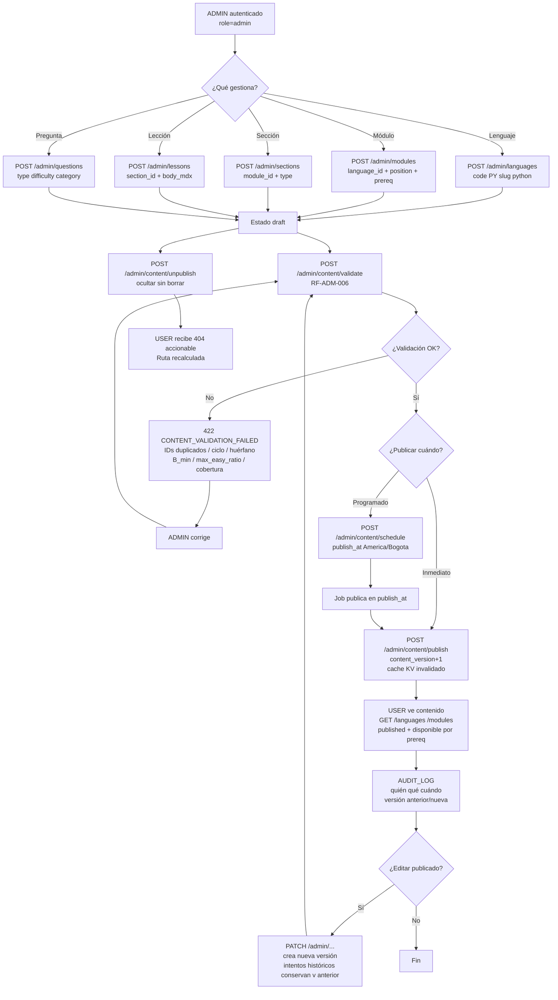
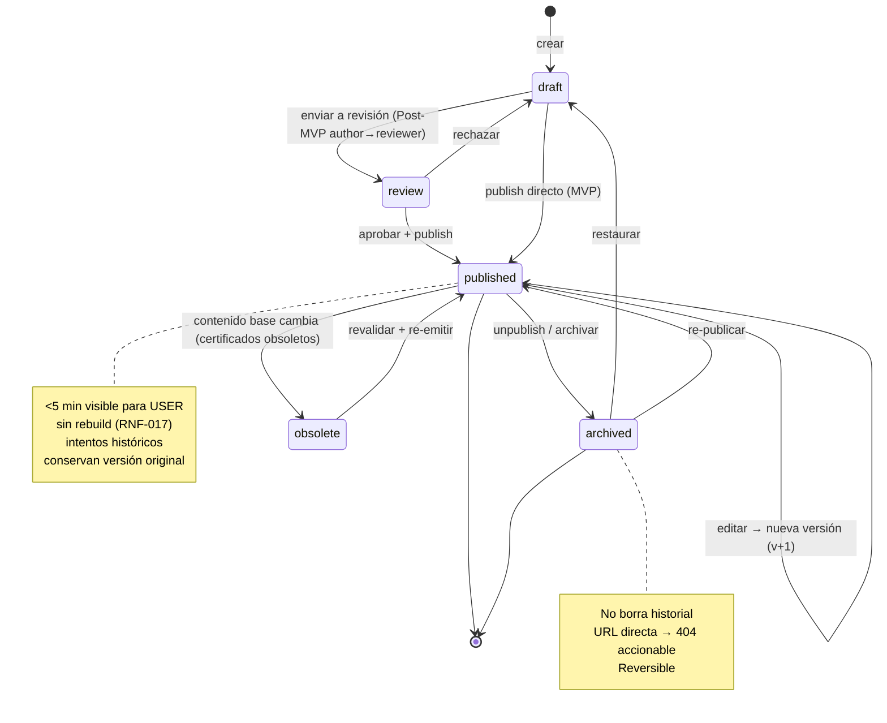
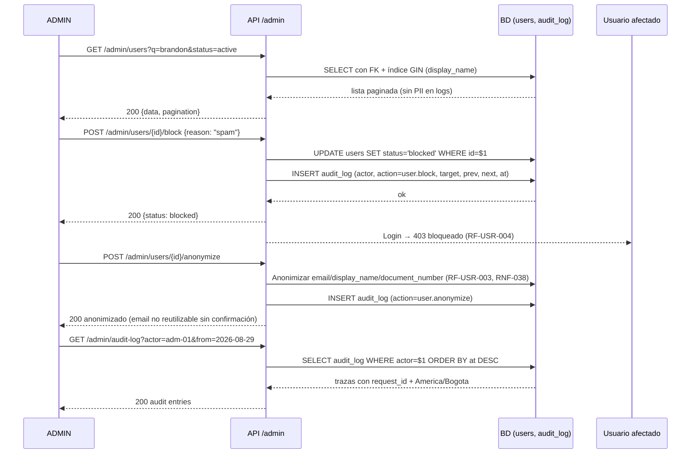
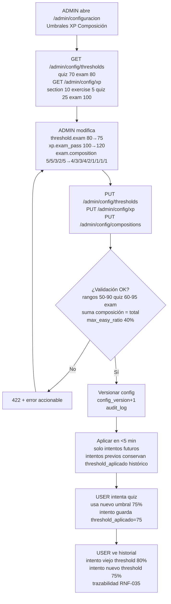

# 25 — Sistema de Administración (Admin System)

> **Estado:** En planificación · **Versión del documento:** 1.0.0 · **Fecha:** 2026-08-29
> **Zona horaria:** America/Bogota (UTC-5)
> Complementa a `01_PROJECT_OVERVIEW.md` §24 y §31, `03_OBJECTIVES.md` OE-03/OE-08/OT-01/OT-02, `04_SCOPE.md` §2.7 y §10, `05_FUNCTIONAL_REQUIREMENTS.md` RF-ADM-001–009 / RF-AUTH-002 / RF-USR-004 / RF-CERT-005 / RF-LOGRO-004, `06_NON_FUNCTIONAL_REQUIREMENTS.md` RNF-006/RNF-008/RNF-009/RNF-017/RNF-031/RNF-036/RNF-041/RNF-042/RNF-045, `07_USER_STORIES.md` US-067–US-072, `08_USE_CASES.md` UC-016–UC-020, `09_USER_FLOWS.md`, `10_INFORMATION_ARCHITECTURE.md` S-31, `11_SYSTEM_ARCHITECTURE.md` §15 (Content Engine), `12_DATA_MODEL.md` §6, `13_API_SPECIFICATION.md` §5 recurso Admin, `14_LEARNING_SYSTEM.md` §13, `15_QUIZ_EXAM_SYSTEM.md` §18, `16_GAMIFICATION.md` §9 y §13. No duplica su contenido; lo formaliza como subsistema operable.

---

## 1. Propósito y alcance

Este documento es la **fuente de verdad del subsistema administrativo**. Define cómo se gobierna el contenido educativo y la operación de la plataforma sin tocar el código del motor. Especifica qué puede hacer un administrador, qué nunca puede hacer un usuario, cómo se publica, versiona, audita y revierte el contenido, y cómo se gestionan usuarios, certificados y logros.

**Dentro del alcance:**
- CRUD de la jerarquía `Lenguaje → Módulo → Sección → Lección` y del banco de preguntas.
- Modificación de contenido con versionado no destructivo.
- Publicación / desactivación / ocultamiento sin despliegue, con efecto inmediato o programado.
- Consulta de estadísticas operativas y educativas.
- Gestión de usuarios (estados, bloqueo, anonimización, exportación).
- Gestión de certificados (emisión, verificación, obsolescencia, re-emisión, revocación).
- Gestión de logros (catálogo, condiciones, XP bono).
- Matriz RBAC, flujos con Mermaid, validaciones, auditoría y contratos API.

**Fuera de alcance:** ejecución de código en sandbox (Post-MVP, `04` §4), marketplace de cursos de terceros (Post-MVP, `04` §3), verificación pública externa de certificados (Post-MVP, `04` §3), diseño visual fino (`27_UI_DESIGN.md`) y analítica avanzada (`26_ANALYTICS.md`) — aquí solo se referencian.

---

## 2. Referencias cruzadas

| Referencia | Qué aporta a este documento |
|---|---|
| `01` §7, §31, §34 | Jerarquía educativa y principio de contenido independiente |
| `05` RF-ADM-001–009 | Requisitos funcionales origen de cada función admin |
| `05` RF-AUTH-002, RF-USR-003/004/006, RF-CERT-005, RF-LOGRO-004 | Requisitos de identidad, privacidad y certificación que el admin gobierna |
| `06` RNF-006/017/031/036 | Contenido desacoplado, config sin deploy, FKs e integridad referencial |
| `07` US-067–US-072 | Historias de administración |
| `08` UC-016–UC-020 | Casos de uso de contenido, banco, configuración y usuarios/auditoría |
| `11` §15 | Content Engine como única fuente de contenido versionado |
| `12` §6 | Entidades `programming_languages`, `modules`, `sections`, `lessons`, `questions`, `answers`, `quizzes`, `exams`, `achievements`, `certificates`, `users`, `audit_log` |
| `13` §5 | Endpoints `/admin/*` y `/admin/config` |
| `14` §2–§6, §13 | Reglas de desbloqueo, diagnóstico y versionado que el admin no puede romper |
| `15` §18, `16` §13 | Claves configurables (umbrales, XP, composiciones, pesos de dificultad) |

---

## 3. Principios invariantes

| # | Principio | Regla operativa |
|---|---|---|
| P-ADM-01 | **Contenido desacoplado del motor** | Todo texto, ejemplo, pregunta y orden vive en tablas/config versionadas consumidas por `Content Engine`. El motor nunca contiene `if (language === 'python')` (ver `11` §15, `06` RNF-031). Grep en CI falla si hay literales fuera de `content/` o BD. |
| P-ADM-02 | **Publicar sin desplegar** | Publicar, ocultar o reprogramar contenido y cambiar umbrales/XP/composiciones se refleja sin rebuild y en < 5 min (ver `05` RF-ADM-003/004, `06` RNF-017). |
| P-ADM-03 | **Versionado no destructivo** | Editar una pregunta o lección publicada crea nueva versión; los intentos históricos conservan `question_version` y `content_version` originales (ver `05` RF-PREG-006, RF-ADM-005, `06` RNF-035). No existe `UPDATE` destructivo sobre contenido calificado. |
| P-ADM-04 | **Validación bloqueante** | `RF-ADM-006` — IDs únicos, prerrequisitos sin ciclos (DAG), referencias íntegras, tipos válidos, cobertura por concepto y `B_min` del banco. Publicación con validación fallida se rechaza con errores accionables. |
| P-ADM-05 | **RBAC mínimo y auditoría total** | Solo `ADMIN` accede a `/admin/*` (ver `05` RF-ADM-007, `08` UC-020). Toda mutación deja traza `quién/qué/cuándo/versión anterior/nueva` (ver `05` RF-ADM-008, `06` RNF-045). |
| P-ADM-06 | **Nunca romper invariantes pedagógicas** | Ninguna operación admin puede: otorgar aprobación de módulo sin examen, duplicar certificado vigente, degradar umbral histórico de un intento ya calificado, ni crear `BLOQUEADO` con ciclo (ver `14` §13, `15` §17). |
| P-ADM-07 | **Degradado y reversibilidad** | Ocultar o archivar contenido no borra historial; re-publicar restaura sin pérdida. Fallo de email/storage/ads no bloquea publicación ni aprendizaje (`06` RNF-014). |

---

## 4. Roles y permisos — USER vs ADMIN

### 4.1 Definición de roles (MVP)

| Rol | Valor en `users.role` | Cómo se obtiene | Alcance |
|---|---|---|---|
| `USER` | `user` | Registro (`05` RF-AUTH-001) | Dueño de su propio progreso. Accede a `/users/me/*`, aprendizaje y evaluación propios con aislamiento estricto `user_id = token.sub` (`05` RF-USR-005, `06` RNF-009). |
| `ADMIN` | `admin` | Asignación directa en BD por `ADMIN` existente o seed inicial; no auto-promoción por API pública | `USER` + todo `/admin/*` (ver `05` RF-ADM-007). Opera contenido, configuración, usuarios, certificados y logros. |
| `PREMIUM` | Flag `users.is_premium` (derivado de `subscriptions`, no rol) | Suscripción activa (`05` RF-PREM-002) | Condiciona `ads` pero **no** permisos de contenido (`07` US-066). Un `ADMIN` puede ser `premium` o no; son ortogonales. |

> Post-MVP (`05` RF-ADM-009): `ADMIN` se descompone en `author` → `reviewer` → `publisher` con estados `borrador → revisión → publicado`. En MVP existe un único `ADMIN` con todos los permisos admin.

### 4.2 Matriz RBAC — Recurso × Acción × Rol

> `—` = no aplica · `✓` = permitido · `✗` = prohibido (403 `ADMIN_REQUIRED`) · `(own)` = solo sobre recurso propio

| Recurso / Acción | USER (sobre lo propio) | USER (sobre lo ajeno) | ADMIN |
|---|---|---|---|
| **Autenticación** `POST /auth/*`, `POST /auth/refresh`, `POST /auth/logout` | ✓ | — | ✓ |
| **Perfil propio** `GET /users/me`, `PATCH /users/me`, `DELETE /users/me` | ✓ (own) | ✗ | ✓ (own) + puede gestionar cualquier usuario vía `/admin/users` |
| **Lenguajes — lectura** `GET /languages`, `GET /languages/{id}` | ✓ (solo `status=available` o `coming_soon` informativo) | — | ✓ (ve también `hidden`/`draft`) |
| **Lenguajes — escritura** `POST/PATCH/DELETE /admin/languages` | ✗ | ✗ | ✓ |
| **Módulos — lectura** `GET /languages/{id}/modules`, `GET /modules/{id}` | ✓ si `published` | ✗ | ✓ (incluye `draft`/`review`/`archived`) |
| **Módulos — escritura** `POST/PATCH/DELETE /admin/modules` | ✗ | ✗ | ✓ |
| **Secciones — lectura** `GET /modules/{id}/sections`, `GET /sections/{id}` | ✓ si `published` | ✗ | ✓ |
| **Secciones — escritura** `POST/PATCH/DELETE /admin/sections` | ✗ | ✗ | ✓ |
| **Lecciones — lectura** `GET /lessons/{id}` | ✓ si `published` y `disponible` por prerrequisitos | ✗ | ✓ |
| **Lecciones — escritura** `POST/PATCH/DELETE /admin/lessons` | ✗ | ✗ | ✓ |
| **Preguntas — lectura (alumno)** vía lección/quiz/examen | ✓ (solo preguntas del intento, nunca banco completo) | ✗ | ✓ |
| **Preguntas — escritura** `POST/PATCH/DELETE /admin/questions` | ✗ | ✗ | ✓ |
| **Quizzes/Exámenes — lectura** `GET /quizzes/{id}`, `GET /exams/{id}` | ✓ si módulo publicado | ✗ | ✓ |
| **Quizzes/Exámenes — composición** `PUT /admin/quizzes/{id}/composition` | ✗ | ✗ | ✓ |
| **Intentos — crear** `POST /lessons/{id}/answer`, `POST /quiz/{id}/attempt`, `POST /exam/{id}/attempt` | ✓ (own) | ✗ | ✓ (own, sin privilegio sobre intentos ajenos) |
| **Intentos — consultar** `GET /users/me/*`, `GET /progress` | ✓ (own) | ✗ | ✓ (own) + `GET /admin/attempts?user_id=` para soporte |
| **Progreso / Stats propias** `GET /users/me/progress`, `GET /users/me/stats` | ✓ (own) | ✗ | ✓ (own) + `GET /admin/stats/*` agregado seudonimizado |
| **Estadísticas globales** `GET /admin/stats/overview`, `/admin/stats/modules`, `/admin/stats/questions` | ✗ | ✗ | ✓ |
| **Publicar / Ocultar** `POST /admin/content/publish`, `POST /admin/content/unpublish`, `POST /admin/content/schedule` | ✗ | ✗ | ✓ |
| **Validar coherencia** `POST /admin/content/validate` | ✗ | ✗ | ✓ |
| **Configuración** `GET/PUT /admin/config/thresholds`, `/admin/config/xp`, `/admin/config/compositions` | ✗ (solo lectura de valores aplicados en su intento) | ✗ | ✓ |
| **Logros — lectura** `GET /achievements`, `GET /users/me/achievements` | ✓ | — | ✓ |
| **Logros — escritura** `POST/PATCH/DELETE /admin/achievements` | ✗ | ✗ | ✓ |
| **Certificados — lectura propia** `GET /users/me/certificates`, `GET /certificates/{id}/pdf` (own) | ✓ (own) | ✗ (solo verificación pública enmascarada) | ✓ (own) + `GET /admin/certificates` listado + `POST /admin/certificates/{id}/revoke` |
| **Certificados — verificación pública** `GET /certificates/{id}`, `POST /certificates/verify` | ✓ (pública, sin PII) | ✓ | ✓ |
| **Usuarios — gestión** `GET/PATCH /admin/users`, `POST /admin/users/{id}/block`, `/unblock`, `/anonymize` | ✗ | ✗ | ✓ |
| **Auditoría** `GET /admin/audit-log` | ✗ | ✗ | ✓ |
| **Suscripciones / Ads — lectura propia** `GET /users/me/subscription` | ✓ (own) | ✗ | ✓ (own) + `GET /admin/subscriptions` para soporte |
| **Suscripciones — gestión** `POST /admin/subscriptions/*` (soporte manual) | ✗ | ✗ | ✓ (solo soporte, no cobro directo) |

**Reglas de enforcement:**
- Token `ADMIN` con `role=admin` firmado por el servidor; suplantar `role` en cliente se rechaza con 403 (`06` RNF-009).
- Todo `GET /admin/*` exige `Authorization: Bearer <admin_token>` + `RBAC guard` + `audit` (`05` RF-ADM-008).
- `USER` que intenta `GET /admin/users` → `403 { code: "ADMIN_REQUIRED" }` (`13` §8) sin revelar existencia de recursos admin.
- Aislamiento IDOR: `GET /admin/users/{id}` con `id` ajeno como `USER` → 403/404 indistinguible; como `ADMIN` → 200 con PII mínima (`06` RNF-037).

### 4.3 Diferencia permisos — tabla comparativa resumida

| Capacidad | USER | ADMIN |
|---|---|---|
| Crear/editar lenguajes, módulos, secciones, lecciones, preguntas | ✗ | ✓ (versionado, con validación `RF-ADM-006`) |
| Modificar contenido publicado | ✗ (solo consumir) | ✓ (crea nueva versión, no muta historial) |
| Publicar / desactivar / ocultar / programar | ✗ | ✓ (inmediato o programado, < 5 min efectivo) |
| Configurar umbrales 70/80, XP, orden, composición quiz/examen | ✗ (ve el valor aplicado en su intento) | ✓ (sin deploy, versionado, solo futuros intentos) |
| Consultar estadísticas globales (DAU, aprobación, `B_min`, `overlap`) | ✗ (solo sus stats) | ✓ (seudonimizado, `06` RNF-040) |
| Gestionar usuarios (bloquear, anonimizar, exportar, verificar) | Solo su propia cuenta (`DELETE /users/me`) | ✓ cualquier usuario + estados `activo/bloqueado/pendiente_verificacion` |
| Gestionar certificados (listar, verificar, revocar, re-emitir, PDF) | Solo los propios + verificación pública enmascarada | ✓ todos + revocación/obsolescencia/invalidación |
| Gestionar logros (crear, editar, archivar, asignar XP bono) | ✗ (solo ver y desbloquear automático) | ✓ |
| Ver auditoría | ✗ | ✓ (`quién/qué/cuándo/versión anterior/nueva`) |
| Acceder a `/admin/*` | ✗ → 403 | ✓ |

---

## 5. Arquitectura del Admin System

```
┌──────────────────────────────────────────────────────────────┐
│                    Admin Console (Frontend)                  │
│  /admin/lenguajes · /admin/modulos · /admin/preguntas      │
│  /admin/configuracion · /admin/usuarios · /admin/auditoria │
│  Validación en cliente (UX) + confirmación de publicación   │
└──────────────────────┬───────────────────────────────────────┘
                       │ Bearer ADMIN + RBAC guard
┌──────────────────────▼───────────────────────────────────────┐
│  API Gateway — /api/v1/admin/*  (ver 13 §5.3)               │
│  Auth middleware (JWT + role=admin) · Rate limit            │
│  Validación (Zod/Joi) · Idempotency-Key · request_id        │
└──────────────────────┬───────────────────────────────────────┘
                       │
┌──────────────────────▼───────────────────────────────────────┐
│  Content Engine  (ver 11 §15, 14 §2, 23)                     │
│  CRUD versionado · Validación RF-ADM-006 · Publicación     │
│  Config versionada (umbrales/XP/composiciones)              │
│  Cache KV (contenido publicado) · audit_log writer          │
└──────┬───────────────┬───────────────┬───────────────────────┘
       │               │               │
  ┌────▼────┐    ┌─────▼─────┐   ┌────▼────────┐
  │ BD (PG) │    │ Object    │   │ Observ.     │
  │ FKs +   │    │ Storage   │   │ Logs JSON   │
  │ índices │    │ PDFs/QRs  │   │ Métricas    │
  └─────────┘    └───────────┘   └─────────────┘
```

**Contrato interno (pseudocódigo):**
```ts
interface AdminContentService {
  createLanguage(dto: CreateLanguageDTO): Promise<Language>          // RF-ADM-001
  updateModule(id: string, dto: UpdateModuleDTO): Promise<Module>    // crea nueva content_version
  validateBeforePublish(scope: ContentScope): Promise<ValidationReport> // RF-ADM-006
  publish(scope: ContentScope, when: Immediate | Scheduled): Promise<ContentVersion> // RF-ADM-003
  unpublish(scope: ContentScope): Promise<void>
  setThresholds(moduleId: string, quiz: number, exam: number): Promise<ConfigVersion> // RF-ADM-004
  setXPConfig(patch: Partial<XPConfig>): Promise<ConfigVersion>
  listAuditLog(filter: AuditFilter): Promise<AuditEntry[]>            // RF-ADM-008
}
```

---

## 6. Funciones administrativas por dominio

### 6.1 Gestionar lenguajes — `RF-LANG-004`, `RF-ADM-001`, US-029/US-067

| Operación | Endpoint (ver `13`) | Validación | Efecto |
|---|---|---|---|
| **Crear lenguaje** | `POST /admin/languages` | `code` único `^[A-Z0-9_]+$`, `slug` único `^[a-z0-9-]+$`, `status ∈ {available,coming_soon,hidden}` | Crea `programming_languages` en `draft`; no visible para `USER` hasta publicar |
| **Editar lenguaje** | `PATCH /admin/languages/{id}` | Cambiar `name/description/icon/sort_order`; `code` inmutable tras publicar | Nueva `content_version` si afecta catálogo |
| **Listar (admin)** | `GET /admin/languages?include_hidden=true` | — | Ve todos los estados; `USER` solo ve `available/coming_soon` en `GET /languages` |
| **Publicar / Ocultar** | `POST /admin/languages/{id}/publish`, `POST /admin/languages/{id}/unpublish` | `RF-ADM-006` previo | Publicar expone en `GET /languages`; ocultar lo retira sin borrar progreso histórico |
| **Agregar lenguaje nuevo sin tocar motor** | Directorio `content/languages/{nuevo}/` + `manifest.json` + `POST /admin/content/publish` | Ensayo `RNF-006` (Lua mínimo 1 módulo) | 0 cambios en `src/modules/*` (`11` §18) |

**Reglas:**
- En MVP solo `PY=available`; el resto `coming_soon` (ver `01` §30, `05` RF-LANG-001).
- `is_active=false` equivale a `hidden` para `USER` pero visible para `ADMIN`.
- Eliminar lenguaje publicado está prohibido; se archiva (`deleted_at` soft delete, ver `12` §6.3).

### 6.2 Gestionar módulos — `RF-MOD-004`, `RF-ADM-001`, US-067

| Operación | Detalle | Validación |
|---|---|---|
| **Crear módulo** | `POST /admin/modules` con `language_id`, `code` (ej. `PY_MOD_01`), `title`, `slug`, `position`, `prerequisite_module_id`, `quiz_threshold` (70), `exam_threshold` (80) | `UNIQUE (language_id, code)`, `UNIQUE (language_id, position)`, `prerequisite != self`, sin ciclos (ver §9) |
| **Editar módulo** | `PATCH /admin/modules/{id}` — título, objetivo, descripción, orden, umbrales, `xp_on_pass` | Reordenar exige recalcular `position` sin huecos; umbrales 50–90 quiz / 60–95 examen (ver `15` §9.1) |
| **Publicar / Archivar** | `status ∈ {draft,review,published,archived}` (ver §8) | `published` exige ≥3 secciones y ≥1 examen asociado |
| **Reordenar** | `PUT /admin/languages/{id}/modules/reorder` con array ordenado | Sin cambios en motor; ruta refleja nuevo orden (`07` US-070) |

**Dependencias:** `programming_languages` → `modules` → `sections` (ver `12` ER).

### 6.3 Gestionar secciones — `RF-SEC-*`, `RF-ADM-001`

| Operación | Detalle |
|---|---|
| **Crear sección** | `POST /admin/sections` con `module_id`, `title`, `slug`, `position`, `type ∈ {theory,example,exercise,quiz,review}`, `xp_on_complete` (10), `estimated_minutes` |
| **Editar / Reordenar** | `PATCH /admin/sections/{id}` / `PUT /admin/modules/{id}/sections/reorder` |
| **Publicar** | `status ∈ {draft,published,archived}`; `published` exige ≥1 lección |

Regla `RF-SEC-003` se valida en publicación: sección `completada` solo si lecciones obligatorias existen.

### 6.4 Gestionar lecciones — `RF-LEC-*`, `RF-ADM-001`

| Operación | Detalle |
|---|---|
| **Crear lección** | `POST /admin/lessons` con `section_id`, `title`, `slug`, `position`, `body_mdx`, `example_code`, `is_required` (true), `content_version` |
| **Editar** | `PATCH /admin/lessons/{id}` — `body_mdx` y `example_code` nunca hardcodeados en UI (`06` RNF-031) |
| **Versionado** | Editar lección `published` → `INSERT` nueva fila con `content_version+1`; intentos previos conservan versión original |

Invariante pedagógica (`03` OED-02): no existe lección sin al menos un ejercicio obligatorio; validado en `RF-ADM-006`.

### 6.5 Gestionar preguntas / banco — `RF-PREG-001/002/006`, `RF-ADM-002`, US-068, UC-017

| Operación | Detalle |
|---|---|
| **Crear pregunta** | `POST /admin/questions` con `language_id`, `module_id`, `section_id?`, `lesson_id?`, `type ∈ {multiple_choice,true_false,fill_code,predict_output,find_error,order_lines,select_correct_code,match_concepts,write_code,small_problem}`, `difficulty ∈ {easy,medium,hard}`, `category`, `prompt`, `prompt_code?`, `explanation`, `score` (10), `status` |
| **Editar (versionado)** | `PATCH /admin/questions/{id}` crea **nueva fila** `(id, version+1)`; `UPDATE` destructivo rechazado por trigger (ver `12` §6.8). Intentos referencian `(question_id, question_version)` congelados |
| **Respuestas** | `POST /admin/questions/{id}/answers` con `label`, `body`, `is_correct`, `position`; al menos una `is_correct=true` (ver `12` §6.9) |
| **Aleatorización** | `shuffle_questions`/`shuffle_answers` flags en `quizzes`/`exams`; `ADMIN` previsualiza barajado sin persistir |
| **Despublicar** | `POST /admin/questions/{id}/unpublish` → `archived`; se excluye de futuros intentos pero permanece en historial |
| **Validar banco** | `GET /admin/modules/{id}/bank/validate` verifica `B_min` (quiz 30, examen 80) y `max_easy_ratio` (ver `15` §5.4 y §15.2) |

Tipos y metadatos completos en `15` §3–§4 y `23`.

### 6.6 Modificar contenido (edición versionada) — `RF-ADM-005`, `RF-PREG-006`

```
Contenido publicado (v1) ── ADMIN edita ──► Contenido v2 (nueva fila/versión)
        │                                          │
        └─ Intentos v1 conservan v1 ───────────────┘
        └─ Intentos nuevos usan v2 ──── threshold/XP v2 si cambió config
```

- Toda mutación de contenido publicado incrementa `content_version` a nivel de `programming_languages`/`modules`/`questions`.
- Cada `attempt` guarda `content_version` y `threshold_applied` al calificar (`05` RF-EVAL-003/005, `06` RNF-035).
- Reversión: `POST /admin/content/rollback?to_version=N` restaura versión anterior como `v(N+1)` con snapshot, nunca reescribe historial.

### 6.7 Publicar / Desactivar — `RF-ADM-003`, US-069

| Acción | Endpoint | Efecto | Latencia |
|---|---|---|---|
| **Publicar inmediato** | `POST /admin/content/publish` con `scope: {language_id?, module_id?, section_id?, lesson_id?, question_ids?}` | Crea `content_version`, invalida cache KV, contenido visible para `USER` | < 5 min (`06` RNF-017) |
| **Publicar programado** | `POST /admin/content/schedule` con `publish_at: ISO8601 America/Bogota` | Job programa publicación; `audit_log` registra `scheduled_by` | En `publish_at` ±1 min |
| **Ocultar / Desactivar** | `POST /admin/content/unpublish` o `PATCH /admin/modules/{id} {status: "archived"}` | Retira de `GET /languages/{id}/modules` y de ruta; intentos históricos intactos; URL directa → 404 accionable | Inmediato |
| **Archivar** | `DELETE /admin/modules/{id}` (soft) → `deleted_at` | No aparece en listados; recuperable vía `POST /admin/modules/{id}/restore` | Inmediato |
| **Desactivar lenguaje** | `PATCH /admin/languages/{id} {is_active: false}` | `coming_soon`/`hidden`; no afecta progreso ya guardado | Inmediato |

**Validación previa obligatoria:** `POST /admin/content/validate` debe pasar antes de `publish` (ver §9). Fallo bloquea publicación con `422 CONTENT_VALIDATION_FAILED` (`13` §8).

### 6.8 Consultar estadísticas — `RF-PROG-006`, `RF-PROF-006`, `16` §17, `26`

> El admin no ve PII sin necesidad; toda estadística global es agregada y seudonimizada (`06` RNF-037/040).

| Vista admin | Endpoint | Qué muestra | Fuente |
|---|---|---|---|
| **Overview** | `GET /admin/stats/overview` | DAU/WAU, registros/día, módulos publicados, intentos/día, % aprobación quiz (70) / examen (80), certificados emitidos, racha media | `attempts`, `progress`, `streaks`, `certificates` |
| **Por módulo** | `GET /admin/stats/modules?language_id=py` | Por módulo: publicados, intentos, % aprobación, `tasa_acierto_global` por pregunta, `B_min` estado | `modules`, `attempts`, `questions` |
| **Por pregunta** | `GET /admin/stats/questions?module_id=` | `tasa_acierto_global`, `tiempo_mediano_respuesta`, `overlap_ratio`, `reused` count, propuesta de recalificación `EASY↔MEDIUM↔HARD` (ver `15` §15.3) | `attempt_answers`, `questions` |
| **Banco / Calidad** | `GET /admin/modules/{id}/bank/validate` | Faltantes por tipo/dificultad, `max_easy_ratio` violaciones, cobertura por concepto | `questions`, `answers` |
| **Usuarios (agregado)** | `GET /admin/stats/users?from=&to=` | Registros, activos, bloqueados, con certificado, premium vs gratuito (sin exponer emails en listado agregado) | `users`, `subscriptions` |
| **Filtros** | `?from=&to=&language_id=&module_id=&status=` + paginación (`06` RNF-003) | — | — |

**No permitido:** exponer `document_number` en listados, ni compartir progreso con red de anuncios (`06` RNF-040).

### 6.9 Gestionar usuarios — `RF-USR-003/004`, `RF-ADM-007`, US-072, UC-020

| Operación | Endpoint | Detalle | Auditoría |
|---|---|---|---|
| **Listar / Buscar** | `GET /admin/users?q=&status=&page=&per_page=` | Filtra por `status ∈ {active,blocked,pending_verification,deleted}`, `email_verified`, `is_premium`; `GIN (display_name gin_trgm_ops)` para búsqueda | — |
| **Ver detalle** | `GET /admin/users/{id}` | `email`, `status`, `email_verified_at`, `last_login_at`, `timezone`, `progress` resumen, `certificates` vigentes, `subscriptions` | — |
| **Bloquear / Desbloquear** | `POST /admin/users/{id}/block` / `POST /admin/users/{id}/unblock` | Cambia `users.status`; bloqueado recibe 403 en login (`05` RF-USR-004); requiere `reason` | `audit_log: {action: "user.block", actor, target, reason}` |
| **Anonimizar (GDPR)** | `POST /admin/users/{id}/anonymize` | Anonimiza `email`, `display_name`, `document_number`; progreso y certificados se conservan sin PII (ver `05` RF-USR-003, `06` RNF-038); `email` no reutilizable sin confirmación (`12` §6.1) | `who/when/previous_hash` |
| **Exportar datos** | `POST /admin/users/{id}/export` | Genera JSON portátil con datos personales registrados (`05` RF-USR-006) | `request_id` + entrega en ≤30 días |
| **Cambiar rol** | `PATCH /admin/users/{id}/role` con `{role: "admin"|"user"}` | Solo `ADMIN` puede promover/degradar; no auto-promoción | Auditoría + notificación |
| **Ver historial** | `GET /admin/users/{id}/history?include=attempts,certificates,subscriptions` | Paginado, con `content_version` y `threshold_applied` por intento | — |

**Aislamiento:** `USER` solo ve/modifica su propia cuenta vía `DELETE /users/me`; `GET /admin/users` como `USER` → 403.

### 6.10 Gestionar certificados — `RF-CERT-001–006`, `RF-PDF-001–004`, US-057/US-058, UC-012

| Operación | Endpoint | Detalle |
|---|---|---|
| **Listar** | `GET /admin/certificates?language_id=&status=&q=` | `status ∈ {valid,revoked,obsolete}`, `code CQ-{LANG}-{SEQ}` (`01` §22), `language_content_version` |
| **Ver detalle** | `GET /admin/certificates/{id}` | `user_id`, `language_id`, `code`, `status`, `issued_at`, `revoked_at`, `pdf_object_key`, `pdf_version`, `qr_payload`, `metadata` snapshot |
| **Revocar** | `POST /admin/certificates/{id}/revoke` con `{reason}` | `status → revoked`, `revoked_at = now()`; no coexisten dos `valid` por `(user_id, language_id)` (`12` §6.17 `uq_certificates_user_lang_valid`) |
| **Marcar obsoleto** | `POST /admin/certificates/{id}/mark-obsolete` | `status → obsolete` cuando `language_content_version` cambia significativamente (`05` RF-CERT-005); exige revalidación |
| **Re-emitir** | `POST /admin/certificates/{id}/reissue` | Emite nuevo `code` correlativo con lock `certificate_sequences` + `UPDATE ... RETURNING last_seq` (ver `12` §6.17); anterior pasa a `revoked/obsolete` |
| **Regenerar PDF** | `POST /admin/certificates/{id}/pdf/regenerate` | Render plantilla versionada + QR → `Object Storage` S3-compatible; `pdf_version+1`; bit-a-bit fiel (`05` RF-PDF-003) |
| **Verificar (admin)** | `GET /admin/certificates/verify?code=CQ-PY-000001` | Igual que `GET /certificates/{id}` público pero con titular completo (admin ve PII; público ve enmascarado `CC ***678`) |

**Secuencia correlativa:** `UPDATE certificate_sequences SET last_seq = last_seq + 1 WHERE language_id=$1 RETURNING last_seq` en transacción; `code = 'CQ-'||code||'-'||LPAD(last_seq::text,6,'0')`.

### 6.11 Gestionar logros — `RF-LOGRO-001/004`, `16` §9

| Operación | Endpoint | Detalle |
|---|---|---|
| **Listar catálogo** | `GET /admin/achievements?is_active=&category=` | `category ∈ {progress,streak,score,language,special}`, `is_active`, `sort_order` |
| **Crear logro** | `POST /admin/achievements` con `{code: "NEW_LOGRO", name, description, icon_url, category, condition: {type, ...}, xp_reward, is_active}` | `code` único `^[A-Z_]+$`; `condition.type` verificable (ej. `{"type":"streak_days","days":7}`) |
| **Editar** | `PATCH /admin/achievements/{id}` | Cambia `condition`/`xp_reward` sin tocar motor (`16` §13 `gamification.config.yaml`); versionado |
| **Archivar** | `POST /admin/achievements/{id}/archive` → `is_active=false` | No borra desbloqueos históricos (`user_achievements` permanece) |
| **Previsualizar impacto** | `POST /admin/achievements/preview` con `condition` | Simula cuántos usuarios lo desbloquearían hoy (seudonimizado) |
| **Auditar desbloqueos** | `GET /admin/achievements/{id}/unlocks?from=&to=` | `user_id`, `unlocked_at`, `context` (ej. `{"streak":7}`) |

Catálogo MVP de 18 logros base en `16` §9.2 (ej. `FIRST_CODE`, `ON_FIRE`, `CODE_MASTER_PY`).

---

## 7. Flujos administrativos (Mermaid)

### 7.1 Flujo A — CRUD de contenido y publicación con validación



### 7.2 Flujo B — Publicar / Desactivar / Revertir sin despliegue



### 7.3 Flujo C — Gestión de usuarios y auditoría



### 7.4 Flujo D — Gestión de certificados (revocar / re-emitir / PDF)

```mermaid
flowchart TD
    A[ADMIN lista certificados<br/>GET /admin/certificates?status=valid] --> B{¿Acción?}
    B -->|Verificar| C[GET /admin/certificates/verify?code=CQ-PY-000001<br/>muestra validez + titular completo]
    B -->|Revocar| D[POST /admin/certificates/{id}/revoke<br/>reason]
    D --> E[status=revoked<br/>revoked_at=now()<br/>uq_certificates_user_lang_valid libera slot]
    E --> F[AUDIT_LOG + notificar titular<br/>revalidación requerida]
    B -->|Obsoleto por contenido| G[POST /admin/certificates/{id}/mark-obsolete]
    G --> H[status=obsolete<br/>language_content_version desactualizado]
    H --> I[USER ve Obsoleto — revalida<br/>en /verificar/:codigo]
    I --> J[USER revalida<br/>aprueba exámenes faltantes]
    J --> K[POST /admin/certificates/{id}/reissue]
    K --> L[UPDATE certificate_sequences<br/>last_seq+1 → nuevo code CQ-PY-000042]
    L --> M[INSERT certificates<br/>status=valid<br/>pdf_version=1]
    M --> N[POST /admin/certificates/{id}/pdf/regenerate<br/>plantilla versionada + QR → S3]
    N --> O[USER descarga PDF<br/>GET /certificates/CQ-PY-000042/pdf<br/>solo titular 200 else 403]
    B -->|Regenerar PDF| N
```

### 7.5 Flujo E — Configuración sin código (umbrales / XP / composiciones)



---

## 8. Estados de contenido

### 8.1 Lenguaje

| Estado | Valor BD | Visible para USER | Visible para ADMIN | Transición permitida |
|---|---|---|---|---|
| `borrador` | `hidden` + `is_active=false` | ✗ | ✓ | → `coming_soon` / `available` vía `publish` |
| `próximamente` | `coming_soon` | ✓ (card `Próximamente`, no navegable) | ✓ | → `available` / `hidden` |
| `disponible` | `available` + `is_active=true` | ✓ (navegable, ruta, progreso) | ✓ | → `hidden` / `archived` |
| `oculto` | `hidden` | ✗ (404 accionable) | ✓ | → `available` / `archived` |
| `archivado` | `deleted_at IS NOT NULL` | ✗ | ✓ (solo listado admin con `include_deleted`) | → `draft` vía `restore` |

### 8.2 Módulo / Sección / Lección / Pregunta / Quiz / Examen

| Estado | Valor BD | Semántica | Quién lo ve |
|---|---|---|---|
| `draft` | `draft` | Creado, no validado | Solo ADMIN |
| `review` | `review` | En revisión (Post-MVP) | ADMIN `reviewer/publisher` |
| `published` | `published` | Validado y publicado, versionado | ADMIN + USER si `disponible` por prerrequisitos |
| `archived` | `archived` / `deleted_at` | Oculto sin borrar | Solo ADMIN (recuperable) |

```
draft ──validate OK──► published ──unpublish──► archived
  ▲                       │  ▲                    │
  └─────── restore ───────┘  └─ editar → nueva ───┘
                              versión (v+1)
```

Invariante: `archived` nunca borra filas referenciadas por `attempts`; `deleted_at` soft delete (ver `12` §2.1).

---

## 9. Validaciones de coherencia — `RF-ADM-006` (bloqueantes)

Toda publicación ejecuta `POST /admin/content/validate` que debe pasar **íntegramente**. Un solo fallo bloquea `publish` con `422` y detalle por campo.

| # | Validación | Cómo se verifica | Error si falla |
|---|---|---|---|
| V-01 | **IDs y slugs únicos** | `UNIQUE (language_id, code)`, `UNIQUE (language_id, slug)`, `UNIQUE (module_id, slug)` parcial `WHERE deleted_at IS NULL` | `DUPLICATE_CODE: code PY_MOD_01 ya existe en language PY` |
| V-02 | **Orden sin huecos** | `position` 1..N sin huecos ni duplicados por padre (`language_id` / `module_id` / `section_id`) | `GAP_IN_POSITION: module PY posición 4 faltante` |
| V-03 | **Prerrequisitos sin ciclos (DAG)** | CTE recursivo sobre `modules.prerequisite_module_id`; si ciclo → rechaza | `CYCLE_DETECTED: M3 → M5 → M3` |
| V-04 | **Referencias íntegras (FKs)** | Toda pregunta referencia `language_id/module_id/section_id/lesson_id` existentes y no archivados; FKs en BD (`12` §6) | `ORPHAN_QUESTION: q-xyz referencia section_id inexistente` |
| V-05 | **Tipos válidos** | `question.type ∈ T-01..T-11` (`15` §3.1), `difficulty ∈ {easy,medium,hard}`, `section.type ∈ {theory,example,exercise,quiz,review}` | `INVALID_TYPE: type=UNKNOWN` |
| V-06 | **Completitud pedagógica** | ≥3 secciones por módulo, ≥1 ejercicio obligatorio por lección (`14` §13.2) | `INCOMPLETE_MODULE: M2 tiene 1 sección (mín 3)` |
| V-07 | **Composición válida** | Quiz 8–15 preguntas, Examen 15–25; suma de cuotas = total; `max_easy_ratio ≤40%` | `INVALID_COMPOSITION: examen M2 tiene 60% EASY (máx 40%)` |
| V-08 | **Banco mínimo `B_min`** | Quiz `B_min=30` (3×), Examen `B_min=80` (4×), por dificultad `1.5×` cuota, por tipo `2×` cuota (ver `15` §5.4) | `INSUFFICIENT_BANK: examen M3 necesita 80 preguntas, tiene 42` |
| V-09 | **Cobertura por concepto** | Cada concepto del módulo aparece ≥1 vez; ningún concepto >30% del examen | `COVERAGE_GAP: concepto py-var-tipos sin cobertura en examen M2` |
| V-10 | **Umbrales y XP en rango** | `quiz_threshold 50–90`, `exam_threshold 60–95`, `xp_* ≥0`, `score 1–100` | `OUT_OF_RANGE: exam_threshold 99 > 95` |
| V-11 | **QR/PDF coherencia** | `certificates.code ~ ^CQ-[A-Z]+-[0-9]{6}$`, `qr_payload` URL válida, `pdf_version>0` | `INVALID_CERT_CODE` |
| V-12 | **Publicación programada sin conflicto** | `publish_at > now()` y no solapa con otra programada para el mismo scope | `SCHEDULE_CONFLICT: ya hay publish programado para M2 en 2026-08-30` |

Validación de quiz/examen con preview: `POST /admin/quizzes/{id}/preview` genera 5 sets de prueba y reporta `overlap` y distribución; si algún set viola reglas → bloqueo.

---

## 10. Auditoría — `RF-ADM-008`, `RF-AUTH-008`, `06` RNF-045

### 10.1 Qué se audita

| Evento | Tabla | Campos | Retención |
|---|---|---|---|
| Auth: registro, login, fallo, recuperación, verificación | `audit_log` + `users.last_login_at` | `actor, action, target, ip_anonimizada, request_id, at (America/Bogota)` | ≥1 año |
| Contenido: crear/editar/publicar/ocultar/archivar/reordenar/rollback | `audit_log` + `content_audit_log` | `actor (admin_id), action, scope (language/module/section/lesson/question), prev_version, next_version, diff_hash, at` | Indefinida (inmutable) |
| Config: cambio de umbrales/XP/composición/orden | `audit_log` + `config_versions` | `actor, key, prev_value, next_value, config_version, at` | Indefinida |
| Usuarios: block/unblock/anonymize/export/role change | `audit_log` | `actor, target_user_id, action, reason, at` | ≥1 año |
| Certificados: revoke/obsolete/reissue/pdf regenerate | `audit_log` + `certificates.revoked_at` | `actor, certificate_id, code, prev_status, next_status, reason, at` | Indefinida |
| Logros: create/update/archive | `audit_log` | `actor, achievement_id, code, prev, next, at` | Indefinida |

### 10.2 Formato de `audit_log`

```sql
-- Referencia 12 §5.3 y 12 §6.18 extendida para admin
audit_log {
  id UUID PK,
  actor_id UUID FK → users.id,        -- ADMIN que actuó
  action VARCHAR(50),                  -- ej. content.publish, user.block, cert.revoke
  target_type VARCHAR(30),             -- language | module | section | lesson | question | user | certificate | achievement | config
  target_id UUID,
  prev_value JSONB,                    -- snapshot anterior (null si creación)
  next_value JSONB,                    -- snapshot nuevo
  diff_summary TEXT,                   -- ej. "title: 'Var' → 'Variables y tipos'"
  request_id UUID,                     -- correlación (13 §2.4 X-Request-Id)
  ip_hash VARCHAR(64),                 -- IP anonimizada (RNF-037)
  created_at TIMESTAMPTZ               -- UTC, presentación America/Bogota
}
```

### 10.3 Consulta

```
GET /admin/audit-log?actor=adm-01&action=content.publish&target_type=module&from=2026-08-29&to=2026-08-30&page=1&per_page=20
→ 200 { data: [ { actor, action, target, prev, next, at, request_id } ], pagination }
```

Inmutable: trigger rechaza `UPDATE/DELETE` sobre `audit_log` y `content_audit_log`. Logs estructurados JSON con `request_id` sin PII (`06` RNF-045).

---

## 11. Seguridad

| Mecanismo | Especificación | Origen |
|---|---|---|
| **Autenticación admin** | Mismo JWT que `USER` pero con `role=admin` en claim; `access 15 min` + `refresh rotativo 7 días httpOnly Secure SameSite=Lax` (ver `11` §7, `13` §3.1) | `05` RF-AUTH-002, `06` RNF-008 |
| **Autorización** | Guard `RBAC` en `API Gateway` que exige `role=admin` para todo `/admin/*`; `USER` → 403 `ADMIN_REQUIRED` | `05` RF-ADM-007 |
| **Rate limiting** | Ventana deslizante en KV; `POST /admin/*` 60 req/min por admin; `POST /auth/login` 5/min por IP (`05` RF-AUTH-006) | `06` RNF-009 |
| **Validación** | Validación declarativa en DTOs + FKs en BD (doble capa, `06` RNF-036); sanea toda entrada (OWASP Top 10) | `06` RNF-009 |
| **PII** | `document_number` solo en `user_profiles` y `certificates.metadata`; nunca en logs/URLs/respuestas a terceros; `GET /certificates/{id}` público enmascara `CC ***678` | `06` RNF-037 |
| **Idempotencia** | `Idempotency-Key` obligatorio en `POST /admin/content/publish`, `POST /admin/questions`, `POST /admin/certificates/{id}/revoke`; `UNIQUE (user_id, idempotency_key)` 24h TTL | `06` RNF-042, `05` RF-ADM-008 |
| **Observabilidad** | Logs JSON con `request_id`, `actor_id` anonimizado, `endpoint`, `content_version`, `America/Bogota` (ver `11` §22) | `06` RNF-045 |
| **No auto-promoción** | Ningún endpoint público permite `PATCH /users/me {role: "admin"}`; solo `PATCH /admin/users/{id}/role` con `ADMIN` | `05` RF-ADM-007 |

---

## 12. API de administración (referencia para `13`)

> Contratos completos en `13_API_SPECIFICATION.md` §5 recurso Admin. Aquí se listan los endpoints que este documento exige.

| Método | Endpoint | Descripción | RF |
|---|---|---|---|
| `POST` | `/admin/languages` | Crear lenguaje | RF-ADM-001 |
| `PATCH` | `/admin/languages/{id}` | Editar lenguaje | RF-ADM-001 |
| `POST` | `/admin/modules` | Crear módulo | RF-ADM-001 |
| `PATCH` | `/admin/modules/{id}` | Editar módulo | RF-ADM-001 |
| `PUT` | `/admin/languages/{id}/modules/reorder` | Reordenar módulos | RF-ADM-004 |
| `POST` | `/admin/sections` | Crear sección | RF-ADM-001 |
| `PATCH` | `/admin/sections/{id}` | Editar sección | RF-ADM-001 |
| `POST` | `/admin/lessons` | Crear lección | RF-ADM-001 |
| `PATCH` | `/admin/lessons/{id}` | Editar lección (versiona) | RF-ADM-001/005 |
| `POST` | `/admin/questions` | Crear pregunta | RF-ADM-002 |
| `PATCH` | `/admin/questions/{id}` | Editar pregunta (nueva versión) | RF-ADM-002, RF-PREG-006 |
| `POST` | `/admin/questions/{id}/answers` | Gestionar respuestas | RF-PREG-002 |
| `POST` | `/admin/quizzes` / `POST /admin/exams` | Crear quiz/examen | RF-QUIZ-001, RF-EXAM-001 |
| `PUT` | `/admin/quizzes/{id}/composition` | Configurar composición | RF-ADM-004 |
| `POST` | `/admin/content/validate` | Validar coherencia (`RF-ADM-006`) | RF-ADM-006 |
| `POST` | `/admin/content/publish` | Publicar (inmediato) | RF-ADM-003 |
| `POST` | `/admin/content/schedule` | Publicar programado | RF-ADM-003 |
| `POST` | `/admin/content/unpublish` | Ocultar/desactivar | RF-ADM-003 |
| `POST` | `/admin/content/rollback` | Revertir a versión N | RF-ADM-005 |
| `GET` | `/admin/content/versions?scope=` | Listar versiones | RF-ADM-005 |
| `GET/PUT` | `/admin/config/thresholds` | Umbrales quiz/examen | RF-ADM-004, RF-EVAL-005 |
| `GET/PUT` | `/admin/config/xp` | Valores XP | RF-ADM-004, RF-XP-004 |
| `GET/PUT` | `/admin/config/compositions` | Composiciones | RF-ADM-004 |
| `GET` | `/admin/stats/overview` | Estadísticas globales | RF-PROG-006 |
| `GET` | `/admin/stats/modules` | Stats por módulo | RF-PROG-006 |
| `GET` | `/admin/stats/questions` | Stats por pregunta | RF-EVAL-004 |
| `GET` | `/admin/users` | Listar usuarios | RF-ADM-007 |
| `GET` | `/admin/users/{id}` | Detalle usuario | RF-ADM-007 |
| `PATCH` | `/admin/users/{id}/role` | Cambiar rol | RF-ADM-007 |
| `POST` | `/admin/users/{id}/block` | Bloquear usuario | RF-USR-004 |
| `POST` | `/admin/users/{id}/unblock` | Desbloquear | RF-USR-004 |
| `POST` | `/admin/users/{id}/anonymize` | Anonimizar (GDPR) | RF-USR-003 |
| `GET` | `/admin/certificates` | Listar certificados | RF-CERT-001 |
| `POST` | `/admin/certificates/{id}/revoke` | Revocar | RF-CERT-005 |
| `POST` | `/admin/certificates/{id}/mark-obsolete` | Marcar obsoleto | RF-CERT-005 |
| `POST` | `/admin/certificates/{id}/reissue` | Re-emitir | RF-CERT-005 |
| `POST` | `/admin/certificates/{id}/pdf/regenerate` | Regenerar PDF | RF-PDF-001 |
| `GET` | `/admin/achievements` | Listar logros | RF-LOGRO-001 |
| `POST` | `/admin/achievements` | Crear logro | RF-LOGRO-004 |
| `PATCH` | `/admin/achievements/{id}` | Editar logro | RF-LOGRO-004 |
| `POST` | `/admin/achievements/{id}/archive` | Archivar logro | RF-LOGRO-004 |
| `GET` | `/admin/audit-log` | Consultar auditoría | RF-ADM-008 |

Todos con `X-Request-Id` en respuesta, `Idempotency-Key` en POST mutables y paginación `?page=&per_page=` (`06` RNF-003, `13` §2.3).

---

## 13. Modelo de datos (referencia, DDL en `12`)

Entidades que este subsistema gobierna (ver `12` §6 para DDL completo):

```
programming_languages (id, code, name, slug, status, sort_order, content_version, is_active, deleted_at)
  └─< modules (id, language_id, code, title, slug, position, status, content_version, quiz_threshold, exam_threshold, prerequisite_module_id, published_at)
       └─< sections (id, module_id, title, slug, position, type, status, content_version)
            └─< lessons (id, section_id, title, slug, position, body_mdx, example_code, status, content_version, is_required)
                 └─< questions (id, version PK compuesta, language_id, module_id, section_id, lesson_id, type, difficulty, category, prompt, explanation, score, status, content_version)
                      └─< answers (id, question_id, question_version FK compuesta, label, body, is_correct, position)

quizzes (id, module_id, threshold, composition) ──< quiz_questions (quiz_id, question_id, question_version, position)
exams (id, module_id, threshold, distribution, total_questions) ──< exam_questions (exam_id, question_id, question_version, position)
achievements (id, code, name, description, icon_url, category, condition JSONB, xp_reward, is_active)

users (id, email, password_hash, status, email_verified_at, role) ── 1:1 user_profiles ──< certificates (id, user_id, language_id, code CQ-*, status, language_content_version, pdf_object_key, qr_payload)
users ──< audit_log (actor_id, action, target_type, target_id, prev_value, next_value, request_id, created_at)

certificate_sequences (language_id PK, last_seq)   -- correlativo CQ-{LANG}-{SEQ}
content_versions (id, scope_type, scope_id, version, published_by, published_at, config_snapshot)
config_versions (id, key, value JSONB, version, updated_by, updated_at)  -- thresholds, xp, compositions
```

**Índices críticos para `06` RNF-007:**
- `idx_modules_lang_position (language_id, position) WHERE deleted_at IS NULL`
- `idx_questions_module_status (module_id, status, type)`
- `idx_attempts_user_module (user_id, module_id, kind, created_at DESC)` — valida que publicar no rompe progreso
- `uq_users_email UNIQUE (email) WHERE deleted_at IS NULL`
- `uq_certificates_user_lang_valid UNIQUE (user_id, language_id) WHERE status='valid'`

---

## 14. Configuración sin código — `RF-ADM-004`, `06` RNF-017

> Todo cambio sin rebuild, < 5 min efectivo, versionado y auditable.

| Clave | Dónde se edita | Rango / Ejemplo | Aplica a |
|---|---|---|---|
| `threshold.quiz` | `PUT /admin/config/thresholds {quiz: 72}` | 50–90, inicial 70 (`01` §15) | Futuros intentos de quiz; históricos conservan `threshold_aplicado` |
| `threshold.exam` | `PUT /admin/config/thresholds {exam: 80}` | 60–95, inicial 80 | Futuros exámenes |
| `xp.*` | `PUT /admin/config/xp {section: 10, exercise_correct: 5, quiz_pass: 25, exam_pass: 100, module_bonus: 50, review: 3}` | `≥0` (ver `16` §5.2 y §13) | Futuros eventos `xp_transactions`; históricos conservan `config_version` |
| `level.curve` | `PUT /admin/config/xp {level: {curve: "exponential", base: 100, factor: 1.65}}` | `exponential` o `tiered` (`16` §6.1) | Futuros cálculos de nivel; niveles ya alcanzados no bajan |
| `composition.quiz` | `PUT /admin/config/compositions {quiz: {SINGLE_CHOICE: 3, ...}}` | Suma = `quiz.questions` (8–15) | Futuros quizzes generados |
| `composition.exam` | `PUT /admin/config/compositions {exam: {multiple_choice: 5, ...}}` | Suma = `exam.questions` (15–25) + `max_easy_ratio ≤40%` | Futuros exámenes |
| `difficulty.weights` | `PUT /admin/config/compositions {weights: {easy: 1.0, medium: 1.5, hard: 2.0}}` | `>0` | Ponderación `p_max` (`15` §7) |
| `order.modules` | `PUT /admin/languages/{id}/modules/reorder {order: [mod-01, mod-02, ...]}` | Sin huecos, sin ciclos | Ruta visible; requiere re-validación `RF-ADM-006` |
| `streak.*` | `PUT /admin/config/xp {streak: {grace_hours: 2, freeze_earn_every_days: 7}}` | `grace_hours 0–6` | Futuros cortes diarios (`16` §7.4) |
| `bank.*` | `PUT /admin/config/compositions {bank: {min_ratio_quiz: 3.0, min_ratio_exam: 4.0}}` | `≥1.0` | Validación `B_min` (`15` §5.4) |

Almacenamiento: tabla `config_versions` con `version` incremental; cada `attempt` guarda `config_version` vigente al calificar (`06` RNF-035).

Config combinada se refleja en `content_versions.config_snapshot` para trazabilidad bit-a-bit.

---

## 15. Reglas de negocio (normativas)

| ID | Regla | Origen |
|---|---|---|
| RN-ADM-001 | Solo `ADMIN` accede a `/admin/*`; `USER` → 403 `ADMIN_REQUIRED` sin revelar existencia. | `05` RF-ADM-007, `08` UC-020 |
| RN-ADM-002 | Toda mutación admin es versionada y auditada con `quién/qué/cuándo/prev/next/request_id`. El log es inmutable. | `05` RF-ADM-008, `06` RNF-045 |
| RN-ADM-003 | Editar contenido publicado crea nueva versión; nunca `UPDATE` destructivo sobre filas referenciadas por intentos. | `05` RF-ADM-005, RF-PREG-006, `06` RNF-035 |
| RN-ADM-004 | Publicar exige validación `RF-ADM-006` íntegra (V-01 a V-12); fallo bloquea con `422` y detalle accionable. | `05` RF-ADM-006 |
| RN-ADM-005 | Publicar/ocultar/programar se refleja sin despliegue en < 5 min. Ocultar no borra historial. | `05` RF-ADM-003, `06` RNF-017 |
| RN-ADM-006 | Configuración sin código (umbrales, XP, orden, composiciones) afecta solo intentos/eventos futuros; históricos conservan `threshold_aplicado` y `config_version`. | `05` RF-ADM-004, RF-EVAL-005, RF-XP-004 |
| RN-ADM-007 | Prerrequisitos forman DAG; ciclos se rechazan. `prerequisite_module_id = NULL` solo para primer módulo. | `05` RF-ADM-006, `12` §6.5 |
| RN-ADM-008 | Quiz ≥1 por módulo; examen 1 por módulo en MVP (`UNIQUE (module_id) WHERE deleted_at IS NULL` en `exams`); quiz no bloquea examen, examen sí bloquea siguiente módulo. | `05` RF-QUIZ-001, RF-EXAM-001, `08` UC-007/UC-008 |
| RN-ADM-009 | Banco mínimo: quiz 3×, examen 4×, por dificultad 1.5×, por tipo 2×; `max_easy_ratio` 40% en examen. Sin cumplir no se publica. | `15` §5.4, §15.2 |
| RN-ADM-010 | Un certificado vigente por `(user_id, language_id)`; re-emisión invalida anterior; `code` correlativo `CQ-{LANG}-{SEQ}` con lock. | `05` RF-CERT-005, `12` §6.17 |
| RN-ADM-011 | Certificado `obsolete` por cambio significativo de `language_content_version`; exige revalidación; verificación pública enmascara `document_number`. | `05` RF-CERT-005, `06` RNF-037 |
| RN-ADM-012 | Logro se otorga una sola vez por usuario y condición; config de logros sin tocar motor. | `05` RF-LOGRO-005, RF-LOGRO-004 |
| RN-ADM-013 | `ADMIN` puede bloquear/desbloquear usuarios; bloqueado → 403 en login; anonimización conserva progreso sin PII. | `05` RF-USR-004, RF-USR-003 |
| RN-ADM-014 | Estadísticas globales son agregadas y seudonimizadas; ningún dato de progreso se comparte con red de anuncios. | `06` RNF-040 |
| RN-ADM-015 | Idempotencia: reenvío con mismo `Idempotency-Key` no duplica contenido ni XP ni auditoría. | `06` RNF-042, `05` RF-XP-005 |

---

## 16. Trazabilidad

### 16.1 RF cubiertos por este documento

| RF | Sección de este documento |
|---|---|
| RF-ADM-001 (CRUD estructura) | §6.1–§6.4, §12 |
| RF-ADM-002 (CRUD preguntas + versionado) | §6.5, §9 V-04/V-05 |
| RF-ADM-003 (publicar/ocultar sin deploy) | §6.7, §7.1/7.2, §8 |
| RF-ADM-004 (config sin código) | §6.2, §12, §14 |
| RF-ADM-005 (versionado + trazabilidad por intento) | §6.6, §10, §13 |
| RF-ADM-006 (validación coherencia) | §9 (V-01 a V-12), §7.1 |
| RF-ADM-007 (RBAC) | §4, §11 |
| RF-ADM-008 (auditoría) | §10 |
| RF-ADM-009 (flujo borrador→revisión→publicado) | §8, §7.2 (diseñado, Post-MVP) |
| RF-LANG-004, RF-MOD-004 (contenido desacoplado) | §3 P-ADM-01, §6.1/6.2 |
| RF-PREG-006, RF-EVAL-003/005 (versionado intentos) | §6.5/6.6, §14 |
| RF-XP-004, RF-EVAL-005, RF-QUIZ-001, RF-EXAM-002 | §14 |
| RF-USR-003/004/006, RF-CERT-005, RF-LOGRO-004 | §6.9, §6.10, §6.11 |

### 16.2 RNF relacionados

`RNF-006` (contenido solo config), `RNF-008/009` (seguridad), `RNF-014` (degradado), `RNF-017` (config sin deploy), `RNF-031` (desacoplado), `RNF-033/035` (atomicidad/versionado), `RNF-036` (FKs), `RNF-037/040` (privacidad), `RNF-041/042/045` (errores/idempotencia/trazabilidad).

### 16.3 Relación con otros documentos

```
01_PROJECT_OVERVIEW.md (§7, §31) ──→ 25_ADMIN_SYSTEM.md (opera la jerarquía desacoplada)
05_FUNCTIONAL_REQUIREMENTS.md ──→ 25 (materializa RF-ADM-*)
08_USE_CASES.md UC-016–020 ──→ 25 (formaliza flujos A–E)
11_SYSTEM_ARCHITECTURE.md §15 ──→ 25 (Content Engine es el ejecutor)
12_DATA_MODEL.md ◄── 25 (gobierna 18 entidades + audit/config)
13_API_SPECIFICATION.md ◄── 25 (contratos /admin/*)
14_LEARNING_SYSTEM.md ◄── 25 (no romper desbloqueo/versionado)
15_QUIZ_EXAM_SYSTEM.md ◄── 25 (no romper B_min/composición/pesos)
16_GAMIFICATION.md ◄── 25 (no romper economía XP/logros)
```

---

## 17. Criterios de aceptación del sistema administrativo

- [ ] `USER` no puede acceder a `/admin/*` (403 `ADMIN_REQUIRED`); `ADMIN` sí, con `role=admin` validado en servidor.
- [ ] CRUD de lenguajes/módulos/secciones/lecciones/preguntas persiste con FKs, `position` sin huecos y validación `RF-ADM-006` bloqueante.
- [ ] Editar pregunta/lección publicada crea nueva versión; intentos históricos conservan `question_version` y `content_version`.
- [ ] Publicar/ocultar/programar se refleja sin rebuild en < 5 min; ocultar no borra historial y es reversible.
- [ ] Configurar umbrales/XP/composición/orden sin código afecta solo futuros intentos; históricos conservan `threshold_aplicado` y `config_version`.
- [ ] Validaciones V-01 a V-12 rechazan publicación con error accionable; preview de quiz/examen detecta `overlap` y `max_easy_ratio`.
- [ ] Gestión de usuarios: bloquear impide login, anonimizar borra PII sin borrar progreso, exportar entrega JSON portátil.
- [ ] Gestión de certificados: un vigente por lenguaje, `CQ-{LANG}-{SEQ}` correlativo con lock, revocar/obsoleto/re-emitir con auditoría, PDF bit-a-bit fiel.
- [ ] Gestión de logros: crear/editar/archivar sin tocar motor; desbloqueo automático una sola vez.
- [ ] Estadísticas admin son agregadas y seudonimizadas; ningún progreso se comparte con ads.
- [ ] Toda operación admin deja `audit_log` inmutable con `quién/qué/cuándo/prev/next/request_id` y timestamp `America/Bogota`.
- [ ] Reenvío con `Idempotency-Key` no duplica contenido, XP ni auditoría.
- [ ] Cobertura ≥70% en `AdminService`/`ContentService` y matriz RF→test completa (`06` RNF-016, `20_TESTING.md`).

---

## 18. Decisiones abiertas (requieren ADR si se cambian)

| Decisión | Estado | Nota |
|---|---|---|
| Roles finos `author/reviewer/publisher` vs `ADMIN` único | Diseñado, Post-MVP (`05` RF-ADM-009) | En MVP basta `ADMIN` único; descomponer exige migrar `audit_log` y estados `draft→review→published` |
| CMS headless externo vs JSON/YAML declarativo + `content_versions` | Propuesto JSON/YAML en `11` §19 | CMS solo si `25` demuestra necesidad con volumen de autoría |
| Soft delete vs hard delete de contenido publicado | Elegido soft delete (`deleted_at`) | Hard delete rompería trazabilidad `RNF-035`; requeriría ADR |
| Anonimización inmediata vs programada (30 días) | Inmediata con confirmación | Si se exige ventana legal, actualizar `05` RF-USR-003 y `06` RNF-038 |

---

*Fin de `25_ADMIN_SYSTEM.md` — cualquier cambio en funciones administrativas, RBAC, validaciones, versionado, publicación, estadísticas, usuarios, certificados o logros requiere actualizar este documento, `05`, `08`, `11`, `12`, `13`, `14`, `15`, `16`, `23` y `CHANGELOG.md` con fecha `America/Bogota`.*
