# 📚 Índice Maestro y Hub de Documentación — Koda 🦊

> Guía central de navegación para la arquitectura, diseño pedagógico, APIs, modelo de datos y operaciones de la plataforma educativa **Koda (Duolingo de Programación)**.

---

## 🗺️ Mapa General de Especificaciones

La documentación técnica de Koda se organiza en **5 dominios funcionales**, diseñados para ser modulares, trazables y desacoplados:

```mermaid
graph LR
    subgraph D1["1. Producto & Negocio"]
        P1["01 Visión General"]
        P2["02 Problema"]
        P3["03 Objetivos"]
        P4["04 Alcance"]
        P5["18 Monetización"]
        P6["22 Roadmap"]
    end

    subgraph D2["2. Pedagogía & Contenido"]
        C1["14 Learning System"]
        C2["15 Quiz & Exámenes"]
        C3["16 Gamificación"]
        C4["23 Content Spec"]
        C5["24 Content Authoring"]
        C6["28 Currículo Python"]
    end

    subgraph D3["3. Arquitectura & Backend"]
        A1["11 System Architecture"]
        A2["12 Database Design"]
        A3["13 API REST v2 Spec"]
        A4["17 Certificación"]
        A5["25 Admin System"]
        ADR["ADRs (docs/adr/)"]
    end

    subgraph D4["4. UI/UX & Frontend"]
        U1["07 User Stories"]
        U2["08 Use Cases"]
        U3["09 User Flows"]
        U4["10 Info Architecture"]
        U5["27 UI/UX Spec"]
    end

    subgraph D5["5. Seguridad & DevOps"]
        S1["06 Requisitos No Funcionales"]
        S2["19 Seguridad & STRIDE"]
        S3["20 Testing Strategy"]
        S4["21 Despliegue & Cloud"]
        S5["26 Analítica & Métricas"]
    end

    D1 --> D2
    D2 --> D3
    D3 --> D4
    D3 --> D5
```

---

## 🧭 Rutas de Lectura Recomendadas por Rol

Para optimizar el tiempo de incorporación al proyecto (*onboarding*), consulta los documentos en el siguiente orden según tu especialidad:

### 💻 Frontend Developer (Next.js 15, PixiJS, Tailwind)
1. [`01_PROJECT_OVERVIEW.md`](01_PROJECT_OVERVIEW.md) — Visión del producto y filosofía pedagógica.
2. [`27_UI_UX_SPECIFICATION.md`](27_UI_UX_SPECIFICATION.md) — Sistema de diseño, layout 50/50 split, atajos y Koda WebGL.
3. [`10_INFORMATION_ARCHITECTURE.md`](10_INFORMATION_ARCHITECTURE.md) — Pantallas S-01 a S-32 y flujos de navegación.
4. [`13_API_SPECIFICATION.md`](13_API_SPECIFICATION.md) — Contratos REST v2.0 para consumo de datos.
5. [`packages/types/README.md`](../packages/types/README.md) — Modelos compartidos `@koda/types`.
6. [`apps/web/README.md`](../apps/web/README.md) — Configuración del frontend, Zustand y PixiJS.

### ⚙️ Backend Developer (NestJS, Supabase, Google Drive API)
1. [`01_PROJECT_OVERVIEW.md`](01_PROJECT_OVERVIEW.md) — Principios del sistema y reglas de negocio.
2. [`11_SYSTEM_ARCHITECTURE.md`](11_SYSTEM_ARCHITECTURE.md) — Arquitectura modular, 9 motores y grafo de dependencias.
3. [`12_DATABASE_DESIGN.md`](12_DATABASE_DESIGN.md) — Modelo PostgreSQL Supabase v2.0 (estrellas, candados, errores).
4. [`13_API_SPECIFICATION.md`](13_API_SPECIFICATION.md) — Endpoints OpenAPI 3.0.3, DTOs y respuestas.
5. [`17_CERTIFICATION.md`](17_CERTIFICATION.md) — Emisión de certificados con Google Drive Service Account.
6. [`docs/adr/`](adr/README.md) — Decisiones de arquitectura formalizadas.
7. [`apps/api/README.md`](../apps/api/README.md) — Estructura NestJS, controladores y Swagger.

### ✍️ Diseñador Instruccional / Creador de Contenido (Python)
1. [`01_PROJECT_OVERVIEW.md`](01_PROJECT_OVERVIEW.md) — Filosofía de micro-lecciones atómicas (40-70 palabras, sin spoilers).
2. [`24_CONTENT_AUTHORING_GUIDE.md`](24_CONTENT_AUTHORING_GUIDE.md) — Plantillas de redacción, taxonomía de distractores y feedback formativo.
3. [`23_CONTENT_SPECIFICATION.md`](23_CONTENT_SPECIFICATION.md) — Estructura JSON y validación contra esquema declarativo.
4. [`content/README.md`](../content/README.md) — Estructura de carpetas y cursos declarativos de Python.

### 🚀 DevOps, Cloud & QA Engineer
1. [`06_NON_FUNCTIONAL_REQUIREMENTS.md`](06_NON_FUNCTIONAL_REQUIREMENTS.md) — RNF-001 a RNF-045 (latencia, concurrencia, disponibilidad).
2. [`19_SECURITY.md`](19_SECURITY.md) — STRIDE, JWT rotativo, rate limiting y anonimización PII.
3. [`20_TESTING.md`](20_TESTING.md) — Pirámide de pruebas, casos normativos TC-001 a TC-032.
4. [`21_DEPLOYMENT.md`](21_DEPLOYMENT.md) — Contenedores Docker, CI/CD GitHub Actions y entornos.
5. [`26_ANALYTICS.md`](26_ANALYTICS.md) — Eventos de analítica y métricas M-01 a M-16.

---

## 📑 Catálogo Maestro de Especificaciones

| Código | Documento | Versión | Estado | Descripción Principal |
|:---:|---|:---:|:---:|---|
| **01** | [`01_PROJECT_OVERVIEW.md`](01_PROJECT_OVERVIEW.md) | 2.0.0 | ✅ Aprobado | Propósito, modelo pedagógico atómico y alcance del producto Koda. |
| **02** | [`02_PROBLEM_STATEMENT.md`](02_PROBLEM_STATEMENT.md) | 1.0.0 | ✅ Aprobado | Análisis del problema educativo, frustración y abandono en programación. |
| **03** | [`03_OBJECTIVES.md`](03_OBJECTIVES.md) | 1.0.0 | ✅ Aprobado | Objetivos estratégicos (OE), técnicos (OT) y de experiencia (OUX). |
| **04** | [`04_SCOPE.md`](04_SCOPE.md) | 1.1.0 | ✅ Aprobado | Delimitación estricta de alcance: IN SCOPE (MVP) vs. Post-MVP. |
| **05** | [`05_FUNCTIONAL_REQUIREMENTS.md`](05_FUNCTIONAL_REQUIREMENTS.md) | 1.1.0 | ✅ Aprobado | Matriz de 128 requisitos funcionales (`RF-*`) con trazabilidad a UC. |
| **06** | [`06_NON_FUNCTIONAL_REQUIREMENTS.md`](06_NON_FUNCTIONAL_REQUIREMENTS.md) | 1.0.0 | ✅ Aprobado | 45 requisitos no funcionales (`RNF-*`): rendimiento, seguridad y accesibilidad. |
| **07** | [`07_USER_STORIES.md`](07_USER_STORIES.md) | 1.0.0 | ✅ Aprobado | Historias de usuario redactadas en formato ágil con criterios de aceptación Gherkin. |
| **08** | [`08_USE_CASES.md`](08_USE_CASES.md) | 1.0.0 | ✅ Aprobado | Casos de uso formales con precondiciones, flujos principal y alternativos. |
| **09** | [`09_USER_FLOWS.md`](09_USER_FLOWS.md) | 1.0.0 | ✅ Aprobado | 15 diagramas de flujo completos (F-01 a F-15) en Mermaid. |
| **10** | [`10_INFORMATION_ARCHITECTURE.md`](10_INFORMATION_ARCHITECTURE.md) | 1.0.0 | ✅ Aprobado | Mapa de sitio (pantallas S-01 a S-32) y jerarquía de navegación. |
| **11** | [`11_SYSTEM_ARCHITECTURE.md`](11_SYSTEM_ARCHITECTURE.md) | 2.0.0 | ✅ Aprobado | Arquitectura técnica modular: Next.js 15 + NestJS + Supabase + PixiJS. |
| **12** | [`12_DATABASE_DESIGN.md`](12_DATABASE_DESIGN.md) | 2.0.0 | ✅ Aprobado | Modelo Supabase v2.0: 1-3⭐, candados secuenciales y cuaderno de errores. |
| **13** | [`13_API_SPECIFICATION.md`](13_API_SPECIFICATION.md) | 2.0.0 | ✅ Aprobado | Especificación REST OpenAPI 3.0.3 (44 endpoints, DTOs y códigos de error). |
| **14** | [`14_LEARNING_SYSTEM.md`](14_LEARNING_SYSTEM.md) | 1.0.0 | ✅ Aprobado | Máquinas de estado pedagógicas, algoritmo de repaso y adaptatividad. |
| **15** | [`15_QUIZ_EXAM_SYSTEM.md`](15_QUIZ_EXAM_SYSTEM.md) | 1.0.0 | ✅ Aprobado | Reglas de composición de quizzes, exámenes y criterios de aprobación ($\ge 80\%$). |
| **16** | [`16_GAMIFICATION.md`](16_GAMIFICATION.md) | 1.1.0 | ✅ Aprobado | Economía de XP, fórmula de nivel, rachas diarias, estrellas y logros. |
| **17** | [`17_CERTIFICATION.md`](17_CERTIFICATION.md) | 2.0.0 | ✅ Aprobado | Pipeline backend de generación de PDF, QR ISO 18004 y Google Drive storage. |
| **18** | [`18_MONETIZATION.md`](18_MONETIZATION.md) | 1.0.0 | ✅ Aprobado | Modelo de negocio: plan gratuito con anuncios no intrusivos y Premium USD $1. |
| **19** | [`19_SECURITY.md`](19_SECURITY.md) | 1.0.0 | ✅ Aprobado | Modelo de amenazas STRIDE, JWT rotativo HttpOnly y cifrado de datos PII. |
| **20** | [`20_TESTING.md`](20_TESTING.md) | 1.0.0 | ✅ Aprobado | Pirámide de pruebas (70/10/10/10), Testcontainers, Playwright y Jest. |
| **21** | [`21_DEPLOYMENT.md`](21_DEPLOYMENT.md) | 2.0.0 | ✅ Aprobado | Plan de despliegue Docker, CI/CD, configuración de entornos dev/staging/prod. |
| **22** | [`22_ROADMAP.md`](22_ROADMAP.md) | 1.1.0 | ✅ Aprobado | Fases de desarrollo (0 a 10), Definition of Done y priorización MVP. |
| **23** | [`23_CONTENT_SPECIFICATION.md`](23_CONTENT_SPECIFICATION.md) | 1.0.0 | ✅ Aprobado | Especificación técnica declarativa JSON Schema para cursos independientes. |
| **24** | [`24_CONTENT_AUTHORING_GUIDE.md`](24_CONTENT_AUTHORING_GUIDE.md) | 1.0.0 | ✅ Aprobado | Manual de estilo editorial, pedagogía de micro-lecciones y feedback sin spoilers. |
| **25** | [`25_ADMIN_SYSTEM.md`](25_ADMIN_SYSTEM.md) | 1.0.0 | ✅ Aprobado | Consola de administración, publicación sin despliegue y auditoría inmutable. |
| **26** | [`26_ANALYTICS.md`](26_ANALYTICS.md) | 1.0.0 | ✅ Aprobado | Métricas clave de producto (M-01 a M-16), privacidad por diseño y dashboards. |
| **27** | [`27_UI_UX_SPECIFICATION.md`](27_UI_UX_SPECIFICATION.md) | 1.1.0 | ✅ Aprobado | Design System, split-screen 50/50, animaciones PixiJS Koda y atajos de teclado. |
| **ADR** | [`docs/adr/`](adr/README.md) | — | 🟢 Activo | Registro formal de Decisiones de Arquitectura (ADR-001 a ADR-006). |

---

## 🏛️ Gobernanza y Mantenimiento de la Documentación

1. **Principio de Trazabilidad:** Todo cambio arquitectónico debe generar o actualizar un ADR en [`docs/adr/`](adr/README.md) y reflejarse en [`CHANGELOG.md`](../CHANGELOG.md) con hora de `America/Bogota`.
2. **Invariantes de Contenido:** Ningún documento debe contener supuestos o configuraciones hardcodeadas en código fuente. El motor de aprendizaje se rige por especificaciones desacopladas en [`content/`](../content/).
3. **Control de Versiones Semánticas:** Las especificaciones siguen versionado semántico formal (`v1.0.0` a `v2.0.0` ante cambios mayores de arquitectura o modelo de datos).
