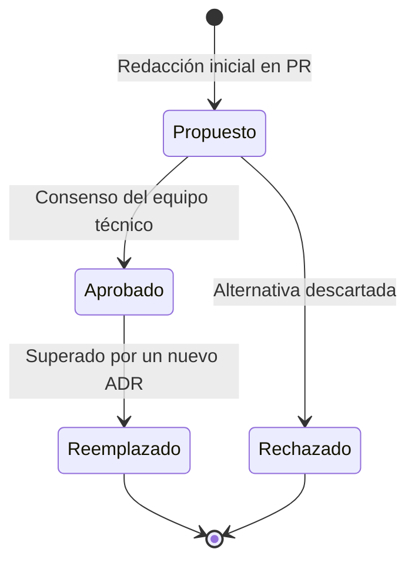

# 🏛️ Registro de Decisiones de Arquitectura (ADR) — Koda 🦊

> Este directorio documenta formalmente las **Decisiones de Arquitectura de Software (Architecture Decision Records - ADR)** adoptadas en Koda, en cumplimiento estricto con el requisito no funcional **RNF-019** (*Documentación y decisiones trazables*).

---

## 🎯 ¿Qué es un ADR?

Un **ADR** es un documento breve que captura una decisión técnica relevante, el contexto bajo el cual se tomó, las alternativas analizadas y las consecuencias resultantes. Evita la deriva tecnológica y previene reconsiderar decisiones previamente acordadas sin nueva evidencia.

---

## 🔄 Ciclo de Vida de una Decisión



Los estados válidos son:
- **Propuesto:** En discusión en un Pull Request.
- **Aprobado:** Aceptado y vinculante para el desarrollo del proyecto.
- **Reemplazado:** Sustituido por un ADR posterior que lo anula formalmente.
- **Rechazado:** Se evaluó y se decidió no adoptar.

---

## 📋 Índice de Decisiones de Arquitectura

| ID | Título | Estado | Fecha | Contexto / Impacto Principal |
|:---:|---|:---:|:---:|---|
| [**ADR-001**](ADR-001-monorepo-pnpm-workspaces.md) | Adopción de Monorepo con PNPM Workspaces | ✅ Aprobado | 2026-09-02 | Unificación de `apps/web` (Next.js 15), `apps/api` (NestJS) y `@koda/types`. |
| [**ADR-002**](ADR-002-persistencia-supabase-postgresql.md) | Base de Datos Relacional con Supabase (PostgreSQL 15+) | ✅ Aprobado | 2026-09-02 | Modelo relacional, triggers PL/pgSQL para progreso, JSONB y doble capa. |
| [**ADR-003**](ADR-003-certificados-backend-google-drive-storage.md) | Pipeline de Certificación en Backend y Storage en Google Drive API v3 | ✅ Aprobado | 2026-09-02 | Generación atómica en NestJS, Service Account, QR y caché por SHA-256. |
| [**ADR-004**](ADR-004-motor-grafico-pixijs-mascota-koda.md) | Renderizado WebGL de Mascota Koda y Efectos con PixiJS v7 | ✅ Aprobado | 2026-09-02 | Aceleración por hardware, animaciones emocionales en tiempo real y confeti. |
| [**ADR-005**](ADR-005-lua-curriculo-piloto-validacion-pedagogica.md) | Priorización de Lua como Lenguaje Piloto del MVP | ✅ Aprobado | 2026-09-02 | Validación pedagógica atómica con 190 lecciones (M01 y M02) antes de Python. |
| [**ADR-006**](ADR-006-motor-ejecucion-hibrido-icoderunner.md) | Motor de Ejecución de Código Híbrido (`ICodeRunner`) | ✅ Aprobado | 2026-09-02 | Wasm en cliente (wasmoon / Pyodide) y sandbox Docker en backend (Piston). |

---

## 📝 Plantilla para Nuevos ADRs

Para proponer un nuevo ADR, copia el siguiente formato en un nuevo archivo `ADR-XXX-titulo-corto.md`:

```markdown
# ADR-XXX: [Título de la decisión]

> **Estado:** [Propuesto | Aprobado | Reemplazado | Rechazado]  
> **Fecha:** YYYY-MM-DD  
> **Autores:** [Nombre o equipo]  
> **Reemplaza a:** [ADR anterior o Ninguno]  

---

## 1. Contexto y Problema
Descripción de las fuerzas, restricciones técnicas o requerimientos de negocio que motivan la decisión.

## 2. Alternativas Evaluadas
- **Alternativa A:** Ventajas y desventajas.
- **Alternativa B:** Ventajas y desventajas.

## 3. Decisión Adoptada
Elección acordada y su justificación técnica directa.

## 4. Consecuencias
- **Positivas:** Beneficios obtenidos.
- **Negativas / Compromisos (Trade-offs):** Costos o restricciones aceptadas.
```
